# Python深度学习股价预测与量化交易策略：1：课程概述 📈

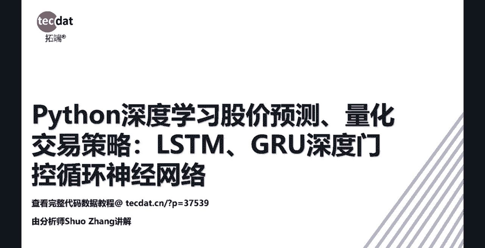

在本课程中，我们将学习如何使用深度学习方法，特别是LSTM和GRU循环神经网络，来预测股价并构建量化交易策略。课程将涵盖从基础神经网络概念到实际代码实现的全过程，旨在让初学者能够理解并应用这些技术。

---

## Python深度学习股价预测与量化交易策略：2：神经网络基础 🧠

上一节我们概述了课程内容，本节中我们来看看神经网络的基础知识。神经网络是深度学习的核心，它模拟人脑神经元的工作方式来处理信息。

神经网络通常包括三个部分：输入层、隐藏层和输出层。各层之间通过带有权重的连接进行信息传递。深度神经网络相比简单的人工神经网络，其层数更多，这被称为神经网络的正向传播过程。

以下是神经网络正向传播的基本步骤：
1.  **输入**：数据从输入层进入网络。
2.  **加权求和与激活**：输入数据与权重矩阵 `W` 相乘并加上偏置，然后通过一个激活函数（如Sigmoid）进行处理，形成隐藏层的输出。
3.  **输出**：隐藏层的输出经过进一步计算，最终在输出层产生预测结果。

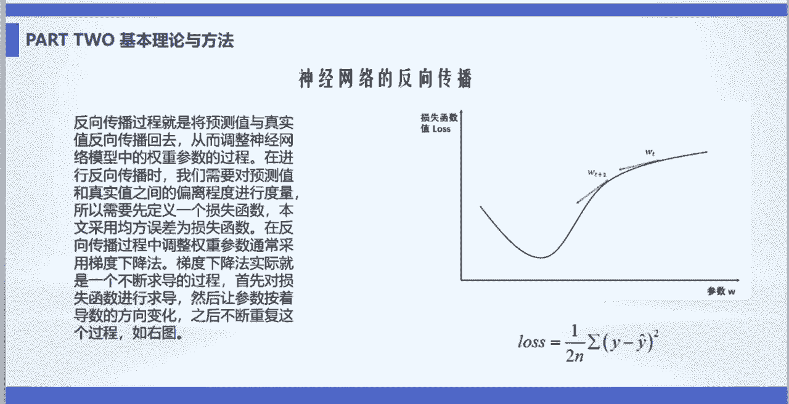

为了评估预测的好坏，我们需要定义一个损失函数。训练的目标是最小化这个损失函数，即减小预测值与真实值之间的误差。常用的优化方法是梯度下降法，它通过计算损失函数对各个参数的导数（梯度），并让参数沿着梯度下降最快的方向更新，从而逐步降低误差。

损失函数的一个常见形式是均方误差（MSE），其公式为：
`MSE = (1/n) * Σ(真实值 - 预测值)^2`

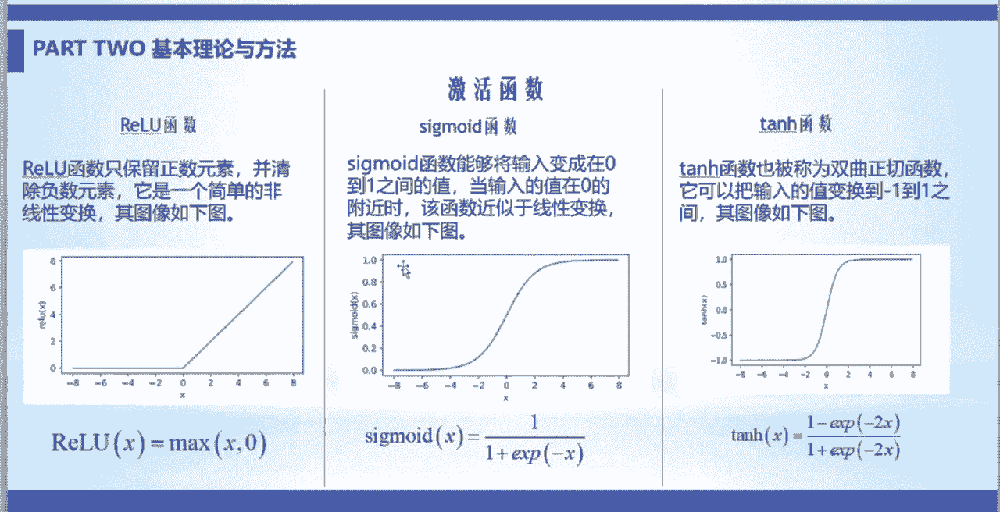

---

## Python深度学习股价预测与量化交易策略：3：激活函数与正则化 ⚙️

在了解了神经网络的基本流程后，我们需要认识两个关键概念：激活函数和正则化。它们对于网络的表达能力和防止过拟合至关重要。

激活函数为神经网络引入了非线性，使其能够学习复杂模式。常用的激活函数包括ReLU、Sigmoid和Tanh。
*   **Sigmoid函数**：将输入值压缩到0到1之间，常用于输出概率。
*   **ReLU函数**：计算简单，能有效缓解梯度消失问题，是目前最常用的激活函数之一。
*   **Tanh函数**：将输入值压缩到-1到1之间，输出以零为中心。

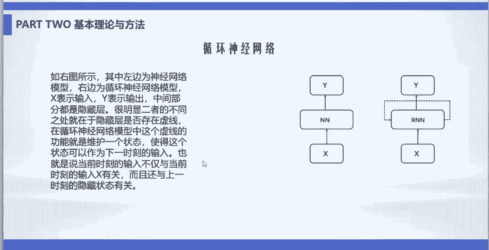

当神经网络隐藏层过多或过于复杂时，容易对训练数据产生过拟合，即在训练集上表现很好，但在新数据上表现不佳。为了解决这个问题，可以使用丢弃法（Dropout）进行正则化。

丢弃法在训练过程中随机“关闭”（即将其输出设为零）一部分隐藏层的神经元。这可以防止网络过于依赖某些特定的神经元，从而增强模型的泛化能力，有效防止过拟合。

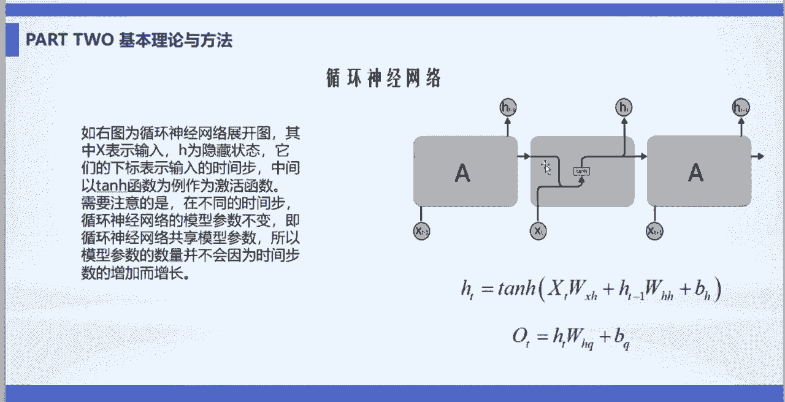

---

## Python深度学习股价预测与量化交易策略：4：循环神经网络（RNN）与LSTM 🔄

前面介绍的人工神经网络主要处理独立的数据点。然而，股价等数据是典型的时间序列，前后数据点之间存在依赖关系。本节我们将介绍专门处理序列数据的循环神经网络及其改进模型LSTM。

循环神经网络（RNN）在人工神经网络的基础上增加了一条“循环”的连接线。这使得RNN在`t`时刻的输入，不仅包括当前的外部输入`X_t`，还包括上一个时刻`t-1`的隐藏状态`H_{t-1}`。这样，网络就具备了记忆之前信息的能力。

RNN的内部结构可以用以下公式描述：
`H_t = tanh(X_t * W_xh + H_{t-1} * W_hh + b_h)`
其中，`H_t`是当前时刻的隐藏状态，`W`是权重矩阵，`b`是偏置项。

深度循环神经网络则是在此基础上堆叠多个隐藏层，以增强模型的表达能力。

然而，标准的RNN存在一个主要缺点：它难以处理长期依赖问题。当序列很长时，信息在多层传递过程中，梯度可能会指数级地消失或爆炸（即梯度消失/爆炸问题），导致网络无法学习到远距离的依赖关系。

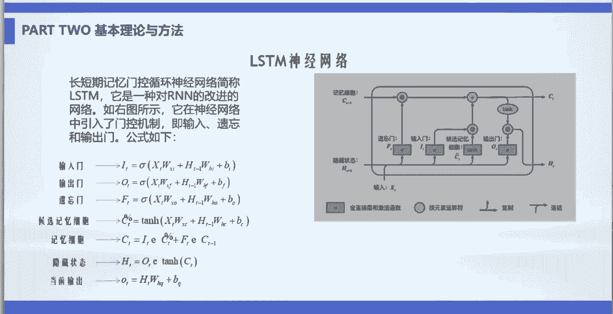

为了解决RNN的长期依赖问题，长短期记忆网络（LSTM）被提出。LSTM引入了“门控”机制，通过三个门（输入门、遗忘门、输出门）和一个记忆细胞来精细控制信息的流动。
*   **遗忘门**：决定从记忆细胞中丢弃哪些旧信息。
*   **输入门**：决定将哪些新信息存入记忆细胞。
*   **输出门**：基于当前输入和记忆细胞，决定输出什么信息。

这种结构使LSTM能够有选择地保留长期信息，非常适合像股价预测这样的时间序列任务。

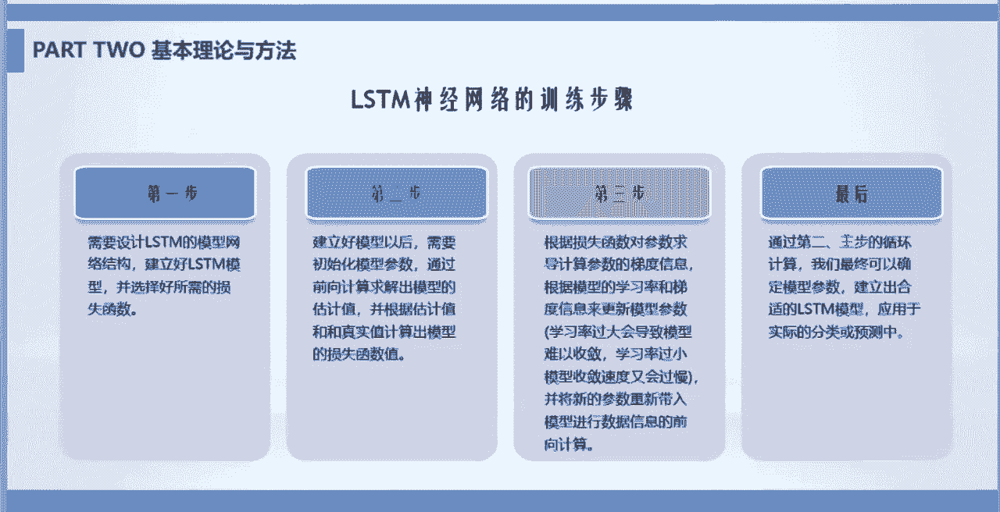

---

## Python深度学习股价预测与量化交易策略：5：实战流程与数据准备 💻

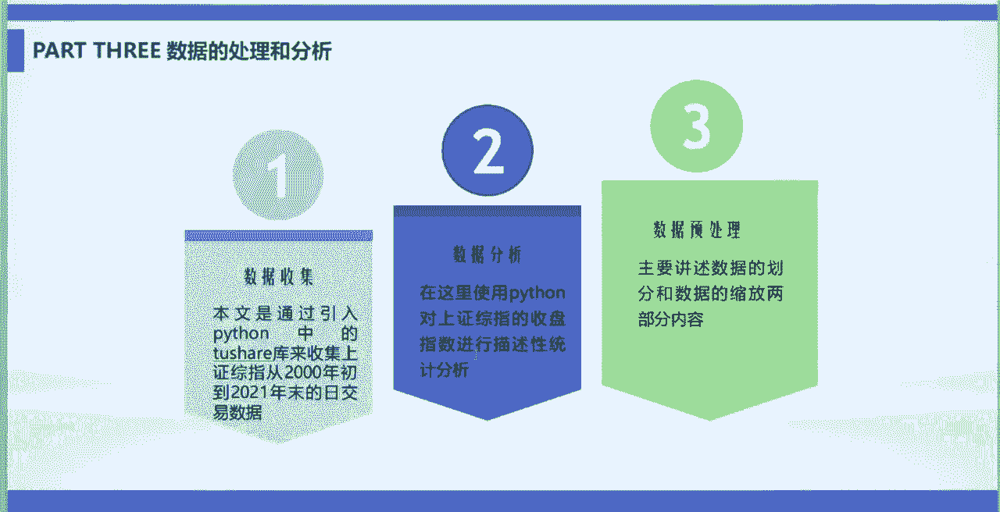

在理解了LSTM的原理后，本节我们将进入实战环节，看看如何用LSTM模型进行股价预测。整个流程主要包括模型构建、训练和评估几个步骤。

使用LSTM网络进行训练通常遵循以下步骤：
1.  **设计网络结构**：确定LSTM的层数、每层的神经元数量等。
2.  **定义损失函数与优化器**：例如，使用均方误差（MSE）作为损失函数，使用Adam优化器来更新参数。
3.  **初始化参数并训练**：初始化模型参数，通过前向传播计算预测值和损失，然后通过反向传播计算梯度并更新参数。
4.  **迭代循环**：重复步骤3，直到模型性能满足要求或达到预设的训练轮数。

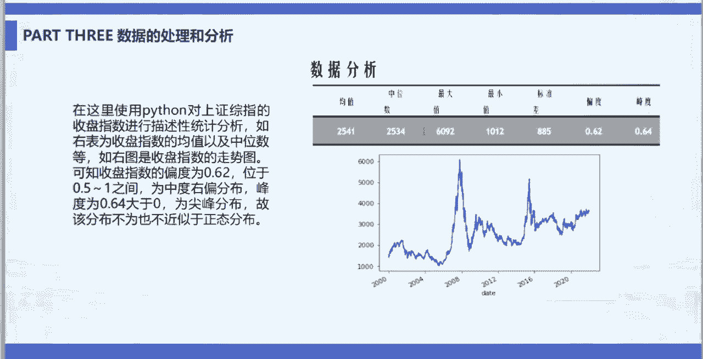

在模型构建之前，数据准备是至关重要的一步。在本案例中，我们使用Python的`yfinance`库爬取了某股票近20年的日级别交易数据。

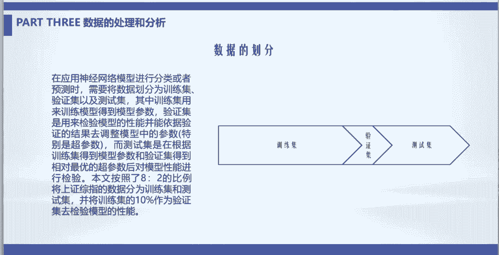

以下是数据准备的核心步骤：
1.  **数据概览与统计分析**：查看数据的前几行和后几行，计算开盘价、最高价、最低价、收盘价等关键指标的平均值、中位数、最大值和最小值，并绘制价格趋势图以观察整体走势。
2.  **数据划分**：将数据分为训练集、验证集和测试集。训练集用于训练模型参数，验证集用于在训练过程中调整超参数和监控模型性能，测试集用于最终评估模型的泛化能力。
3.  **数据标准化**：由于不同特征（如价格和交易量）的量纲和数值范围差异很大，直接输入模型会影响训练效果。我们通常对数据进行归一化处理（如缩放到0-1之间），以消除量纲影响，加速模型收敛。

---

## Python深度学习股价预测与量化交易策略：6：模型训练、优化与策略构建 🚀

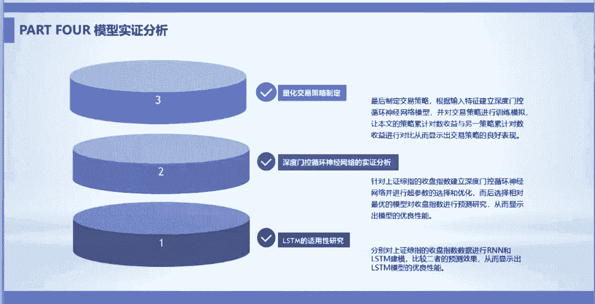

准备好数据后，我们就可以开始训练和优化模型了。本节我们将比较不同模型的性能，并学习如何优化超参数，最终构建一个简单的量化交易策略。

首先，我们分别用普通的人工神经网络（ANN）和LSTM神经网络进行训练。通过比较两者的预测误差（如均方根误差RMSE），可以发现LSTM模型在股价预测任务上通常表现更优。

然而，LSTM模型有许多超参数需要调整以达到最佳性能。以下是需要调整的主要超参数：
*   输入窗口大小
*   训练批次大小
*   LSTM隐藏层的神经元个数
*   丢弃率（Dropout Rate）
*   激活函数类型
*   优化器选择
*   训练轮数
*   LSTM的堆叠层数

通过系统性的超参数优化（例如使用网格搜索或随机搜索），我们可以找到一组相对最优的参数组合。在优化过程中，可以观察到模型在验证集上的误差逐渐减小并趋于稳定。

找到最优参数后，我们用完整的训练集重新训练模型，并在测试集上进行预测。将预测股价与真实股价绘制在同一张图上进行对比，可以直观地评估模型的预测效果。

最后，基于模型的预测结果构建一个简单的量化交易策略：
1.  定义一个新变量`Price_Rise`，表示预测下一交易日股价是否上涨。
2.  如果模型预测明日收盘价高于今日收盘价，则`Price_Rise`赋值为1（看涨），否则为0（看跌）。
3.  **策略逻辑**：当`Price_Rise`为1时，执行买入或持有；当`Price_Rise`为0时，执行卖出。
4.  为了提升预测效果，在模型输入中不仅使用了基础价格（开盘、最高、最低、收盘），还加入了技术指标作为特征，例如3日均线、10日均线、相对强弱指数（RSI）等。

回测结果显示，相较于“今日买入、明日卖出”的简单基准策略，基于LSTM预测的交易策略在中长期能获得更优的收益曲线。

---

## Python深度学习股价预测与量化交易策略：7：课程总结 📝

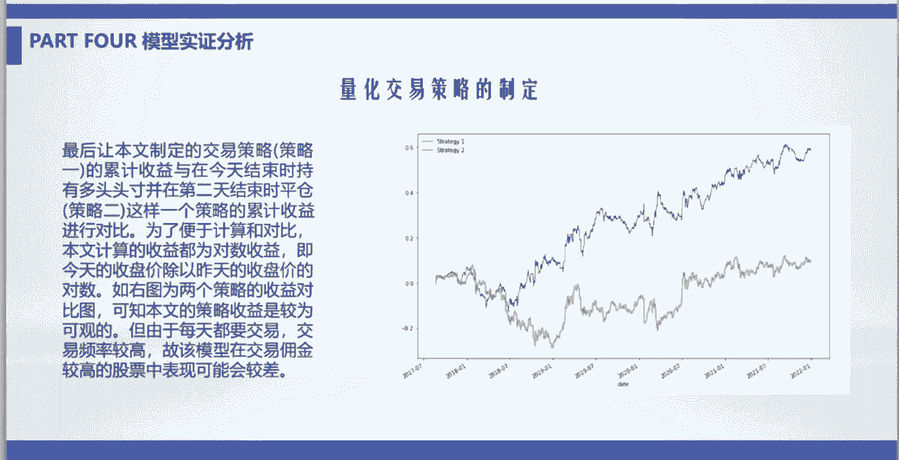

本节课中我们一起学习了使用深度学习进行股价预测和量化交易策略构建的全过程。

我们从最基础的神经网络概念讲起，了解了其结构、激活函数和防止过拟合的方法。接着，我们深入探讨了适用于时间序列数据的循环神经网络（RNN），并重点学习了能够解决长期依赖问题的LSTM模型的门控机制。

在实战部分，我们掌握了数据爬取、清洗、标准化和划分的完整流程。然后，我们一步步完成了LSTM模型的构建、训练、超参数优化和评估。最后，我们利用模型的预测结果，设计并回测了一个简单的量化交易策略，看到了其相对于基准策略的潜在优势。

希望本教程能帮助你入门深度学习在金融时间序列预测中的应用。记住，模型预测仅供参考，实际金融市场极其复杂，投资需谨慎。