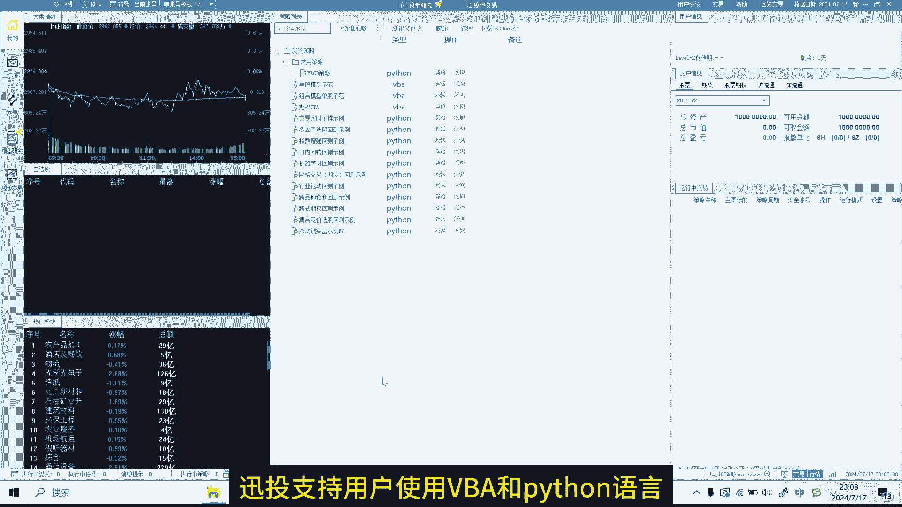
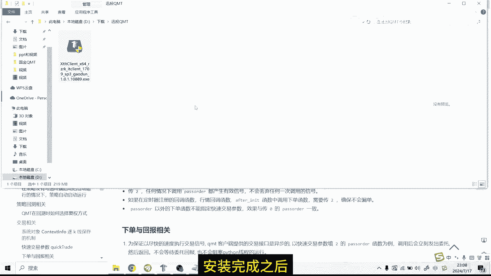
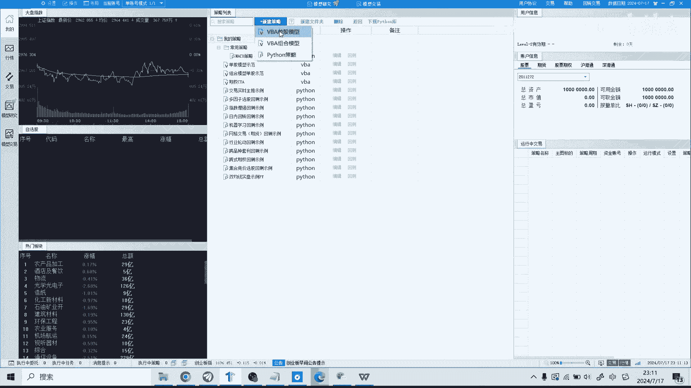
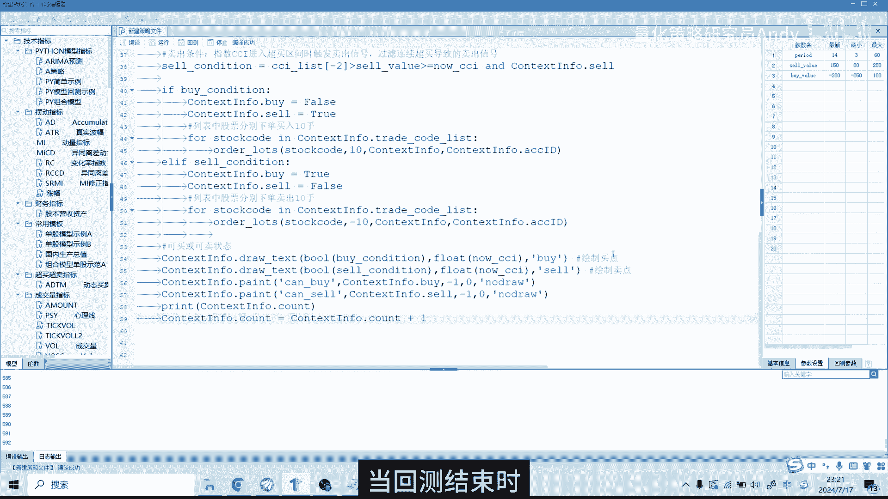
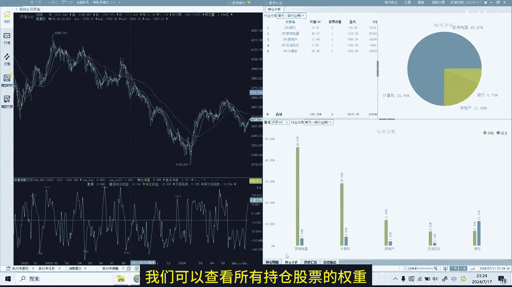

# 量化交易入门：P1：迅投QMT软件基础使用教程 🚀

在本节课中，我们将学习如何使用迅投QMT这款量化交易软件，从环境准备、数据补充到策略创建与回测，完成一个完整的入门流程。

---

## 软件介绍与环境准备

迅投QMT支持用户使用VBA和Python语言编写量化交易策略。软件提供了丰富的API接口和使用教程，帮助用户顺利完成策略开发。

在安装QMT软件前，需要先获取安装包和一个测试账号。整个安装过程与普通软件安装类似，此处不再演示。

安装完成后，登录软件。首先需要下载Python的第三方库。点击软件主界面上方的“下载Python库”按钮，然后点击“Python库下载”。下载过程需要一些时间。

目前，迅投QMT软件已接入多家券商，支持量化实盘交易。但许多券商的开通门槛较高。这里为大家提供了专属渠道，可以较低门槛开通实盘权限，并且手续费也较低。有需要可以联系获取。

Python库下载完成后，需要重启软件以使配置生效。

---

## 补充历史数据

由于QMT的回测是在本地运行的，因此需要先将历史数据下载到本地。

首先，点击软件左上角的“操作”菜单，然后选择“数据管理”，再点击“补充数据”。在弹出窗口的左侧，可以选择数据类型和对应的交易所，包括K线数据、财务数据等。这里我们选择“K线数据”。

在窗口右侧，可以选择数据范围，例如“最近一周”、“最近一月”或“全部”。这里选择“全部”。在下面的“周期”选项中，选择“日线”数据。最后，点击“开始”按钮。

如果是第一次补充数据，耗时可能较长，请耐心等待。

数据补充完成后，即可开始创建策略。

---

## 创建与配置策略

点击软件上方的“新建策略”按钮。迅投QMT支持VBA和Python两种语言，这里我们选择创建“Python策略”。

系统会提供一个默认的策略代码模板。代码上方主要是策略注释和导入第三方库的语句。代码主体主要分为两个部分：
*   **`init`函数**：这是初始化函数，在整个程序中只运行一次。可以在此函数内设定要操作的股票、定义全局变量等。
*   **`handle_bar`函数**：这是核心函数，每根K线会运行一次。例如，如果选择日线级别回测，那么在选定的回测时间段内，每个交易日该函数都会被运行一次。

本期教程主要演示QMT软件的使用流程，代码部分不做深入讲解。对Python量化编程感兴趣，可以加入相关交流群共同学习。

代码编写完成后，需要在界面右侧进行策略参数配置。以下是需要配置的主要项目：

*   **回测时间**：设定回测的起始日期和结束日期。例如，从2022年1月1日回测至2024年7月16日。
*   **基准**：用于将策略业绩与某个指数进行比较，通常选择“沪深300”作为默认基准。
*   **初始资金**：分配给策略用于模拟交易的虚拟资金总额。
*   **保证金比例**：此参数主要用于期货交易，股票回测可忽略。
*   **滑点与手续费**：为了演示方便，此处暂不设置。
*   **最大成交比例**：用于控制回测中的成交量，使其不超过市场当天成交量的一定比例。例如设置为10%，则策略每日成交量不超过市场当日成交量的10%。

接下来是“基本信息”部分，需要设置：
*   **策略名称**与**快捷码**。
*   **策略分类**：可将策略归类到不同类别中。
*   **运行位置**：策略通常运行在附图上。
*   **默认周期**：可选择日线、月线、分钟线等，这里选择“日线”。
*   **默认品种**：主图显示的股票代码。
*   **复权方式**：可选择前复权、后复权或等比复权，这里选择“前复权”。

此外，“参数设置”区域可以自定义一些全局变量，本次我们先按照系统默认设置。

完成以上设置后，策略即可运行。

---

## 运行回测与结果分析

首先点击“编译”按钮，对策略进行保存和更新。然后点击“回测”按钮开始回测。

当回测结束时，将代码界面最小化，即可看到策略回测的结果界面。界面左侧是K线图，右侧展示了策略的绩效数据。

K线图的上半部分为主图，下半部分为副图。在附图上，可以看到策略的净值曲线以及开平仓点位、胜率等信息。

使用键盘的**上下方向键**可以对K线图进行缩放，使用**左右方向键**可以移动K线图。

右侧的图表与左侧的K线图是联动的。当移动K线时，右侧的数据会相应变化。例如，随机选择某一天，右侧图表会展示截止到当天的年化收益率、夏普比率等策略评价指标，以及买入、卖出和持仓的详细信息。

在“持仓分析”页面，可以查看所有持仓股票的权重分布。

在“历史汇总”页面，上半部分显示个股的盈亏汇总，下半部分则展示按板块分类的盈亏汇总。

在“日志输出”方面，上半部分记录了回测期间所有股票的买卖记录，下半部分则是策略运行的详细日志。

以上就是使用迅投QMT进行策略回测的全过程。

---

本节课中，我们一起学习了迅投QMT量化软件的基础使用方法，包括环境配置、数据下载、策略创建、参数设置以及回测结果分析，完成了从零到一的入门体验。