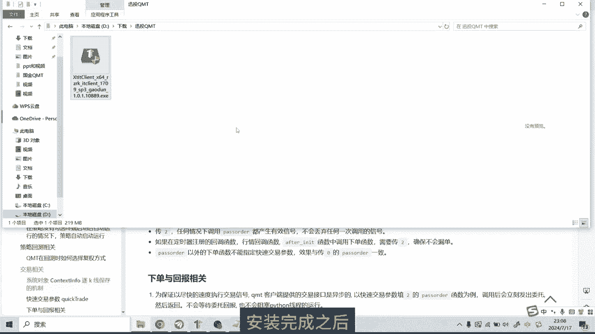
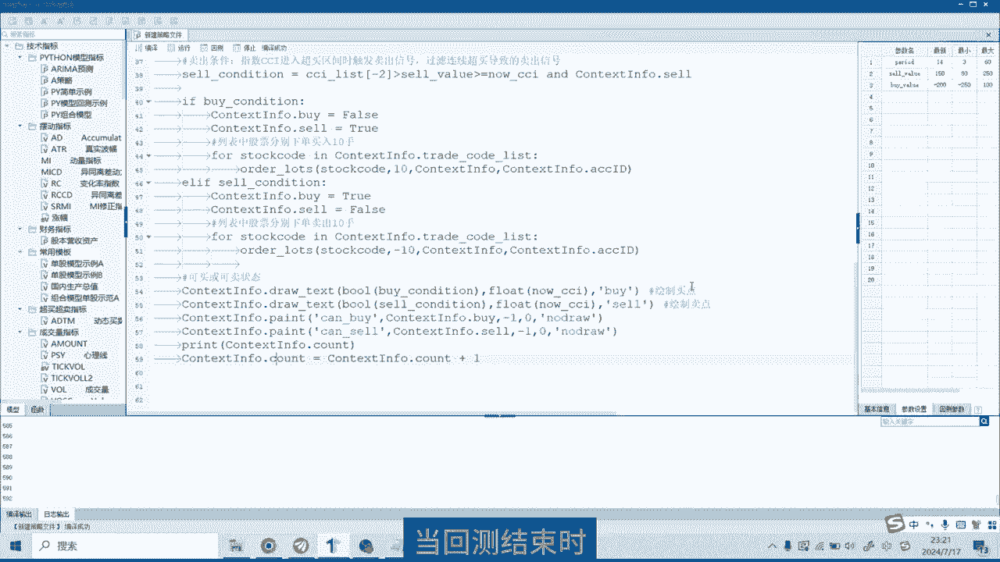

# 迅投QMT使用教程：1：入门与策略回测

在本节课中，我们将学习如何使用迅投QMT量化交易软件，完成从软件安装、数据准备到编写并运行一个简单Python策略回测的全过程。本教程旨在帮助初学者快速上手。


迅投QMT支持用户使用VBA和Python语言编写交易策略。该软件提供了丰富的API接口和使用教程，确保用户可以顺利完成策略的开发与测试。

## 软件安装与准备

上一节我们介绍了QMT的基本情况，本节中我们来看看如何安装和进行基础设置。



安装QMT前，需要先获取安装包和一个测试账号。整个安装过程与普通软件安装相同，此处不再演示。

安装完成后，登录软件。首先需要下载Python第三方库。

以下是操作步骤：
1.  点击软件主界面上方的“下载Python库”。
2.  在弹出的窗口中点击“Python库下载”。
3.  等待下载完成，此过程可能需要一些时间。

目前迅投QMT软件已接入多家券商，支持量化实盘交易。但许多券商的开通门槛较高。我们为大家提供了专属渠道，可以较低门槛开通实盘权限，且手续费较低。有需要者可联系获取。

Python库下载完成后，需要重启软件以使配置生效。

## 补充历史数据

由于QMT的回测是在本地运行的，因此需要先将历史数据下载到本地。

以下是补充数据的步骤：
1.  点击软件左上角的“操作”菜单。
2.  选择“数据管理”，然后点击“补充数据”。
3.  在左侧窗口选择数据类型，例如“K线数据”。
4.  在右侧窗口选择数据范围，例如“全部”。
5.  在下方“周期”选项中选择数据频率，例如“日线”。
6.  点击“开始”按钮进行下载。首次补充数据耗时可能较长，请耐心等待。


数据补充完成后，即可开始创建策略。

## 创建与配置Python策略

上一节我们准备好了数据，本节中我们来学习如何创建一个新的策略并进行配置。

点击软件上方的“新建策略”按钮。QMT支持VBA和Python两种语言，此处我们选择创建“Python策略”。

系统会生成一个默认的策略代码模板。代码上方是策略注释和第三方库导入部分。代码主体主要包含两个函数：

*   **`init()`函数**：这是初始化函数，在整个回测程序中只运行一次。我们可以在其中设定要操作的股票、定义全局变量等。
    ```python
    def init(ContextInfo):
        # 初始化代码写在这里
        pass
    ```
*   **`handlebar()`函数**：这是行情处理函数，每根K线会运行一次。例如，若选择日线级别回测，那么在回测时间段内的每一个交易日，此函数都会被调用一次。
    ```python
    def handlebar(ContextInfo):
        # 主要的策略逻辑写在这里
        pass
    ```

本期教程主要演示QMT软件的使用流程，代码部分暂不深入讲解。对Python量化编程感兴趣的朋友可以加入相关社群共同学习。

代码编写完成后，需要在界面右侧进行策略参数配置。

以下是需要配置的主要参数：
*   **回测时间**：设定回测的起始日期和结束日期，例如从 `2022-01-01` 到 `2024-07-16`。
*   **基准**：用于比较策略业绩的指数，通常选择 `沪深300`。
*   **初始资金**：策略分配的虚拟资金总额，用于模拟交易，例如 `1000000`（100万）。
*   **滑点与手续费**：为了演示方便，此处可暂不设置。
*   **最大成交比例**：控制回测中的成交量不超过市场当日成交量的一定比例，例如设置为 `0.1`（即10%）。

此外，在“基本信息”部分还需设置：
*   **策略名称**与**快捷键**。
*   **策略分类**：将策略归类。
*   **运行位置**：通常选择“附图”。
*   **默认周期**：例如选择“日线”。
*   **默认品种**：主图显示的股票代码。
*   **复权方式**：例如选择“前复权”。

“参数设置”选项卡中可以自定义一些全局变量，此处我们暂按系统默认设置。

完成以上所有设置后，策略即可运行。

## 运行回测与结果分析

配置好策略后，本节我们来看看如何运行回测并解读结果。



首先点击“编译”按钮，对策略进行保存和更新。然后点击“回测”按钮开始运行。

当回测结束时，将代码界面最小化，即可看到策略回测的结果界面。左侧是K线图，右侧展示了策略的绩效数据。

*   **K线图**：上半部分为主图，显示价格走势；下半部分为副图，展示策略净值曲线以及开平仓信号、胜率等信息。
*   **交互操作**：使用键盘**上下键**可缩放K线图，使用**左右键**可移动K线图。

右侧的绩效图表与左侧K线图联动。当移动K线图选择特定日期时，右侧数据会更新为截止到该日的策略表现。

以下是结果分析的主要页面：
*   **绩效概览**：展示年化收益率、夏普比率等核心评价指标，以及具体的买入、卖出和持仓记录。
*   **持仓分析**：查看所有持仓股票的权重分布。
*   **历史汇总**：页面**上半部分**显示个股的盈亏汇总；**下半部分**展示按板块分类的盈亏汇总。
*   **日志输出**：页面**上半部分**记录回测期间所有股票的买卖流水；**下半部分**输出策略运行的详细日志。

以上就是使用迅投QMT进行策略回测的完整流程。

本节课中，我们一起学习了迅投QMT软件的安装、历史数据补充、Python策略的创建与参数配置，以及最终运行回测并分析结果的全过程。希望本教程能帮助你迈出量化交易实践的第一步。