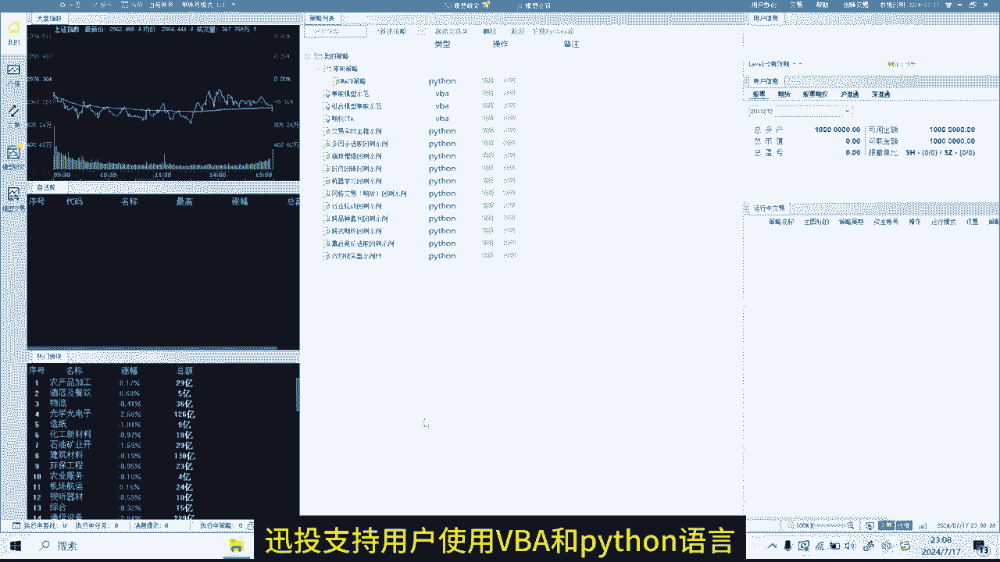
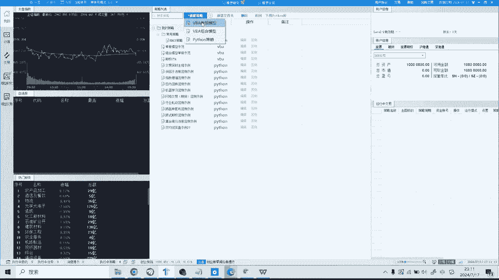
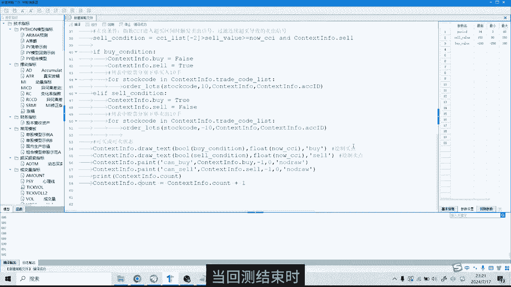

# 量化交易入门：1：迅投QMT软件基础使用教程 🚀

在本节课中，我们将学习如何使用迅投QMT这款量化交易软件。我们将从软件安装、环境配置开始，逐步介绍如何补充历史数据、创建策略、进行回测并分析结果。本教程旨在帮助初学者快速上手，掌握使用QMT进行量化策略回测的基本流程。

## 软件安装与环境准备

首先，我们需要下载迅投QMT的安装包和一个测试账号。安装过程与普通软件相同，此处不再演示。

安装完成后，登录软件。第一步是下载Python第三方库。点击软件主界面上方的“下载Python库”按钮，然后点击“Python库下载”。下载过程需要一些时间。

目前，迅投QMT软件已接入多家券商，支持量化实盘交易。但许多券商的开通门槛较高，通常需要100万或200万的资产。我们为大家申请了专属渠道，可以较低门槛开通量化实盘权限，并且手续费也较低。有需要可以联系获取。

Python库下载完成后，需要重启软件以使配置生效。

## 补充历史数据

上一节我们完成了环境准备，本节中我们来看看如何为回测准备数据。由于QMT的回测是在本地运行的，因此需要先将历史数据下载到本地。

以下是补充历史数据的步骤：
1.  点击软件左上角的“操作”菜单。
2.  选择“数据管理”，然后点击“补充数据”。
3.  在左侧面板选择数据类型，例如K线数据、财务数据等。这里我们选择“K线数据”。
4.  在右侧面板选择数据范围，例如“最近一周”、“最近1月”或“全部”。这里我们选择“全部”。
5.  在“周期”选项中，选择数据频率，例如“日线”。
6.  点击“开始”按钮。首次补充数据可能需要较长时间。

数据补充完成后，即可进行策略创建与回测。

## 创建与配置策略

数据准备就绪后，接下来我们创建一个新的量化策略。

点击软件上方的“新建策略”按钮。迅投QMT支持VBA和Python两种编程语言，这里我们选择“Python策略”。

系统会提供一个默认的策略代码模板。代码主要分为两个部分：
*   **`init`函数**：这是初始化函数，在整个程序中只运行一次。可以在此函数内设定要操作的股票、定义全局变量等。
*   **`handlebar`函数**：这是核心函数，每根K线会运行一次。例如，如果选择日线级别回测，那么在回测时间段内的每一个交易日，此函数都会被调用一次。

本期教程主要演示QMT软件的使用，代码部分不做深入讲解。对Python量化编程感兴趣，可以加入相关交流群学习。

代码编写完成后，需要在界面右侧配置策略参数。以下是需要配置的主要项目：

*   **回测区间**：设定回测的起始日期和结束日期。例如，从 `2022-01-01` 到 `2024-07-16`。
*   **基准**：用于比较策略业绩的指数，通常选择 `沪深300`。
*   **初始资金**：策略分配的虚拟资金总额，用于模拟交易。
*   **滑点与手续费**：为了演示方便，此处可以暂不设置。
*   **最大成交比例**：控制回测中的成交量不超过市场成交量的一定比例，例如设置为 `10%` 表示策略每日成交量不超过市场当日成交量的10%。

此外，还需要在“基本信息”部分设置策略名称、快捷码、分类等。运行位置通常选择“附图”，默认周期选择“日线”。默认品种是指主图显示的股票代码。复权方式可选择前复权、后复权等，这里选择“前复权”。

“参数设置”部分可以自定义一些全局变量，此处我们先使用系统默认设置。

完成所有设置后，策略即可运行。

## 运行回测与分析结果

策略配置完成后，我们就可以运行回测并查看结果了。

首先点击“编译”按钮，对策略进行保存和更新。然后点击“回测”按钮开始运行。

当回测结束时，将代码界面最小化，即可看到策略回测的结果界面。界面左侧是K线图，右侧展示了策略的绩效数据。

*   **K线图**：上半部分为主图，显示价格走势；下半部分为副图，可以显示策略净值曲线、开平仓信号、胜率等信息。
*   **绩效分析**：右侧图表与左侧K线图联动。当用键盘左右键移动K线时，右侧数据会相应变化，展示截止到所选日期的年化收益率、夏普比率等评价指标，以及具体的买卖和持仓详情。
*   **持仓分析**：在“持仓分析”页面，可以查看所有持仓股票的权重分布。
*   **历史汇总**：此页面上半部分显示个股的盈亏汇总，下半部分展示按板块分类的盈亏汇总。
*   **日志输出**：上半部分记录了回测期间所有股票的买卖记录，下半部分则是策略运行的详细日志。

通过以上步骤和界面，可以全面评估一个量化策略的历史表现。

## 总结

本节课中，我们一起学习了使用迅投QMT软件进行量化策略回测的全过程。我们从软件安装、Python环境配置开始，学习了如何补充本地历史数据，接着创建了一个Python策略并配置了必要的回测参数，最后运行回测并分析了包括绩效图表、持仓、盈亏汇总在内的各项结果。掌握这些基础操作，是迈向量化交易实践的第一步。