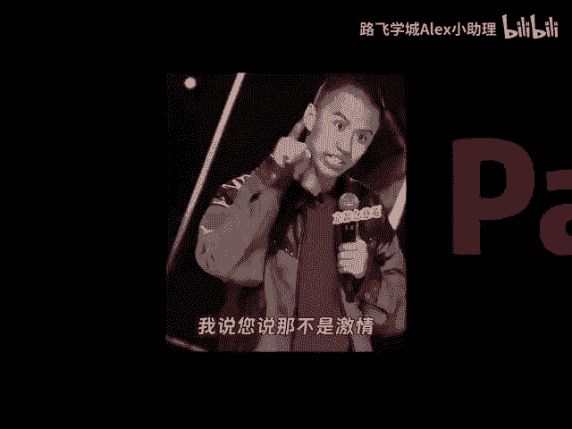
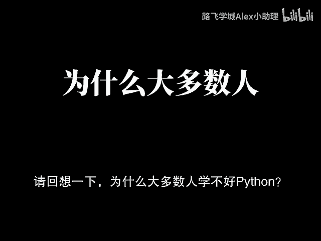
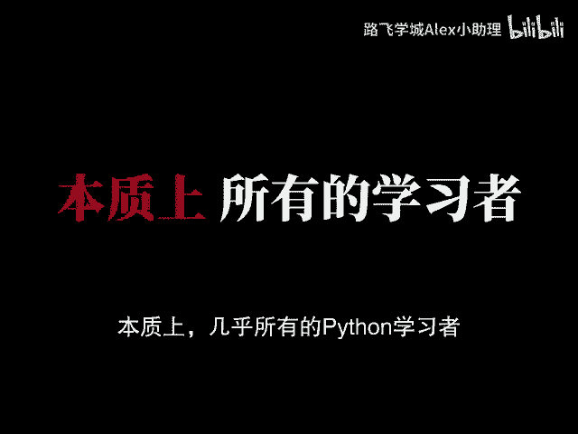
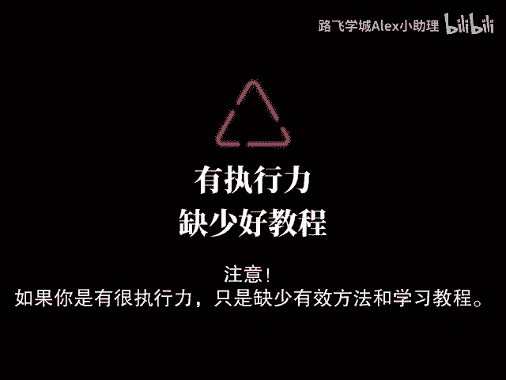
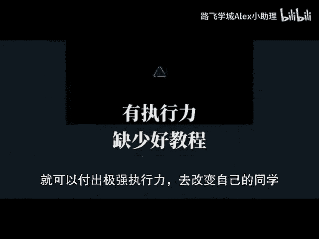

# Python金融分析与量化交易：P1：课程先导与学习误区剖析 🎯

在本节课中，我们将一起探讨学习Python编程，特别是金融分析与量化交易方向时，普遍存在的误区与挑战。我们将分析为何许多人学习效果不佳，并为你指明一条更高效的学习路径。

---

## 学习现状与普遍误区

Python作为一种广泛使用的编程语言，其应用范围非常广泛。从简单的脚本编写到复杂的数据分析、机器学习、Web开发、自动化运维、游戏开发等各个领域都有涉及。从表面上看，Python要学习的内容确实非常多，然而这并不意味着你需要一次性学习完所有的内容。

但是几乎所有人都有个通病：每天起早贪黑地学习，今天学点这个，明天学点那个，一个月以后发现好像什么都没学会，还怨天尤人，说自己没有天赋，努力了却没有得到应有的回报。这实际上不过是无效努力和自我感动。

上一节我们提到了普遍的学习困境，接下来我们来具体总结一下导致这些问题的核心原因。

## 学不好Python的核心原因

总结概括就是两点：
1.  **极为不科学的学习路径**
2.  **极为低下的学习方法**

就像那些效率低下的课堂，花费大量时间听冗长的讲解，或者被网络上“10分钟学会Python”之类的碎片化信息所误导，怎么可能真正学会？

如果你看到了这里，说明你很有耐心，是真心想要学好Python的。本质上，几乎所有的Python学习者在整个学习阶段踩的坑都具有极强的共性，但是这些问题往往没有人帮你系统性地解决。

## 本课程的目标与诚意

这套课程是完整的Python全系列教程，从零基础开始，针对零基础小白和基础薄弱的同学设计，全程干货细讲。

我可以很明确、很坦诚、很直接地说：这个视频包含推广目的。但即便如此，这个视频本身就能帮助很多人预习和认清方向。**如果你很有执行力，只是缺少有效的方法和学习路径**，在获得明确的学习方法和规划之后，就能付出极强执行力去改变自己，那么这套课程可以为你提供巨大帮助。

但是，如果你只想看励志视频感动自己，妄图看一会视频或一套课程就能逆天改命，执行上却三天打鱼两天晒网，那么任何课程都帮不了你。

## 给坚持者的学习助力

网络上充斥着零散的编程教程，缺乏完整体系。看得越多，可能越感到迷茫和痛苦，甚至想要放弃。时间消耗了，却没有获得应有的收获。

编程小白如果不打好基础，盲目挑战高难度项目，编程生涯将会走得无比艰难。为了让零基础的小伙伴学起来没有负担，相关的学习资源已经准备好。

以下是为你准备的学习支持材料：
*   系统的学习思维导图
*   视频中用到的软件安装包与激活码
*   各种项目源码
*   配套练习手册与课件

---

本节课中，我们一起分析了Python学习中的常见误区，强调了科学学习路径和方法的重要性，并介绍了本系列课程能为你提供的支持。**打好基础、系统学习、坚持实践**是掌握Python，进而步入金融分析与量化交易领域的关键。

接下来，我们将从P2开始，正式开启这套系统课程的学习。

梦想在每个清晨敲打我心房，现在就启航，勇气是信仰。