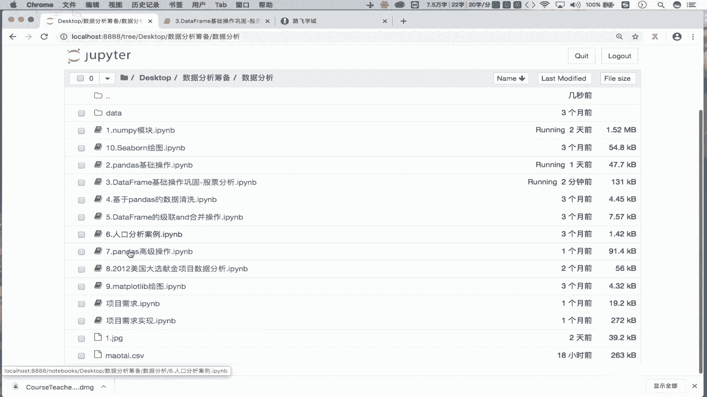
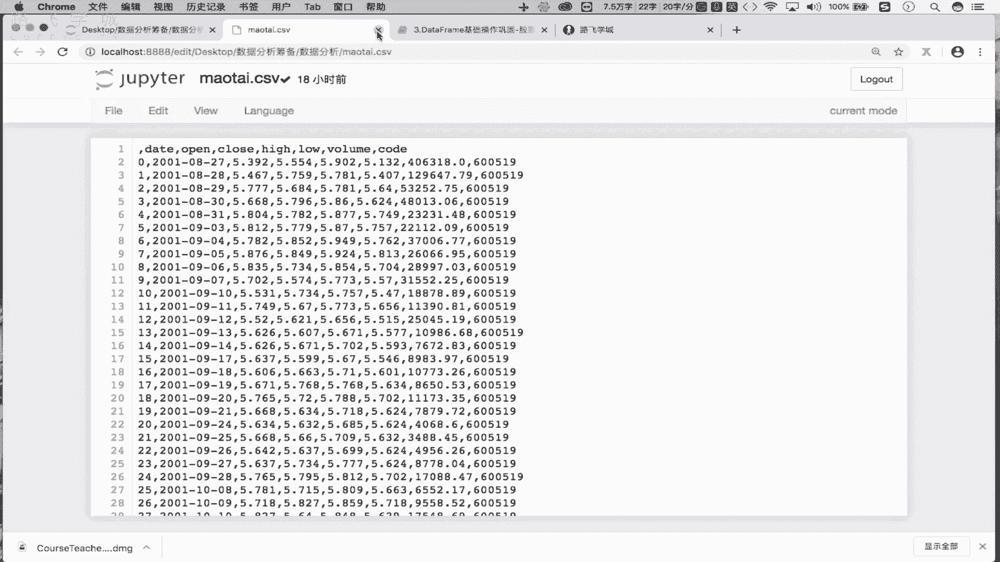

# Python金融量化：P14：双均线策略-均线的计算分析 📈

在本节课中，我们将学习金融量化中一个基础且重要的策略——双均线策略。我们将从获取股票数据开始，逐步讲解均线的概念、计算方法，并最终计算出5日和30日移动平均线。

## 数据获取与处理

上一节我们介绍了量化分析的基本流程，本节中我们来看看如何获取并准备数据。首先，我们需要获取某只股票的历史行情数据。

我们已经使用 `tushare` 包获取了贵州茅台股票的历史数据，并将其持久化存储到了本地的 `茅台.csv` 文件中。因此，第一步是读取这个文件。

```python
import pandas as pd

# 读取本地CSV文件
df = pd.read_csv(‘茅台.csv’)
```

读取后，`DataFrame` 中包含一个无用的列，需要将其删除。

```python
# 删除名为 ‘Unnamed: 0’ 的无用列
df = df.drop(labels=‘Unnamed: 0’, axis=1)
```

接下来，我们需要将 `date` 列转换为时间序列格式，并将其设置为数据的行索引，以便进行时间序列分析。





```python
# 将 ‘date’ 列转换为时间序列
df[‘date’] = pd.to_datetime(df[‘date’])

# 将 ‘date’ 列设置为行索引
df.set_index(‘date’, inplace=True)
```

执行上述步骤后，数据的行索引已变为时间戳，便于后续基于时间的计算和分析。现在，我们的数据已经准备就绪。

## 均线概念与计算

数据准备完成后，我们进入核心环节：计算移动平均线。首先，我们来明确什么是均线。

对于每一个交易日，都可以计算出前N天收盘价的移动平均值。将这些移动平均值连接起来形成的线，就称为N日移动平均线，简称均线。常用的均线有5日、10日、30日、60日等。


以下是均线（MA）的计算公式：
**MA = (C1 + C2 + C3 + … + CN) / N**
其中，C1, C2, …, CN 分别代表第1天、第2天到第N天的收盘价。

为了更直观地理解，我们通过一个例子来说明5日均线的计算过程。

假设有连续8天的收盘价：[5, 6, 7, 4, 3, 2, 6, 7]。
*   第一个5日均值：计算前5天 [5, 6, 7, 4, 3] 的平均值，记为 X1。
*   第二个5日均值：计算第2天到第6天 [6, 7, 4, 3, 2] 的平均值，记为 X2。
*   第三个5日均值：计算第3天到第7天 [7, 4, 3, 2, 6] 的平均值，记为 X3。
*   第四个5日均值：计算第4天到第8天 [4, 3, 2, 6, 7] 的平均值，记为 X4。

将 X1, X2, X3, X4 这四个点在坐标系中连接起来，就得到了5日均线。30日、60日等均线的计算原理与此相同。

## 计算5日与30日均线

理解了均线的概念和公式后，我们使用Pandas来计算贵州茅台股票的5日均线和30日均线。计算均线主要使用 `rolling` 函数。


以下是计算步骤：

首先，我们基于收盘价（‘close’ 列）进行计算。

```python
# 计算5日均值序列
ma5 = df[‘close’].rolling(5).mean()

# 计算30日均值序列
ma30 = df[‘close’].rolling(30).mean()
```

代码说明：
*   `df[‘close’].rolling(5)` 会创建一个滑动窗口对象，窗口大小为5天。
*   `.mean()` 对这个窗口内的数据计算平均值。
*   对于 `ma5`，前4个值会是 `NaN`（非数字），因为至少需要5个数据点才能计算第一个5日均值。同理，`ma30` 的前29个值为 `NaN`。

`ma5` 和 `ma30` 这两个序列中存储的值，就是构成5日均线和30日均线的各个“点”。

## 可视化均线

计算出均线数据后，我们可以将其可视化，以便更直观地观察走势。这里我们使用 `matplotlib` 库进行简单的绘图。

```python
import matplotlib.pyplot as plt
%matplotlib inline  # 在Jupyter Notebook中显示图表

# 绘制5日均线
plt.plot(ma5[50:80], label=‘MA5’)
# 绘制30日均线
plt.plot(ma30[50:80], label=‘MA30’)

plt.legend()  # 显示图例
plt.show()
```

为了更清晰地展示两条均线的交叉情况，示例中只绘制了第50到第80个交易日的数据。图中两条线分别代表5日均线和30日均线，它们的交叉点是双均线交易策略产生买卖信号的关键依据。

## 总结


本节课中我们一起学习了双均线策略的基础部分——均线的计算与分析。我们首先回顾了如何获取和处理股票时间序列数据，然后详细介绍了移动平均线的定义和计算公式。接着，我们使用Pandas的 `rolling` 函数实际计算了贵州茅台股票的5日和30日移动平均线，并最终通过图表将这两条均线可视化出来。理解并能够计算均线，是构建和回测双均线交易策略至关重要的第一步。