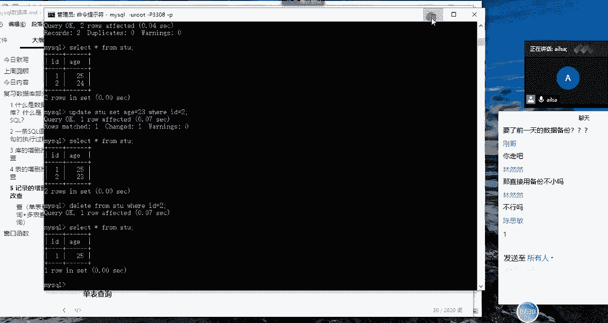
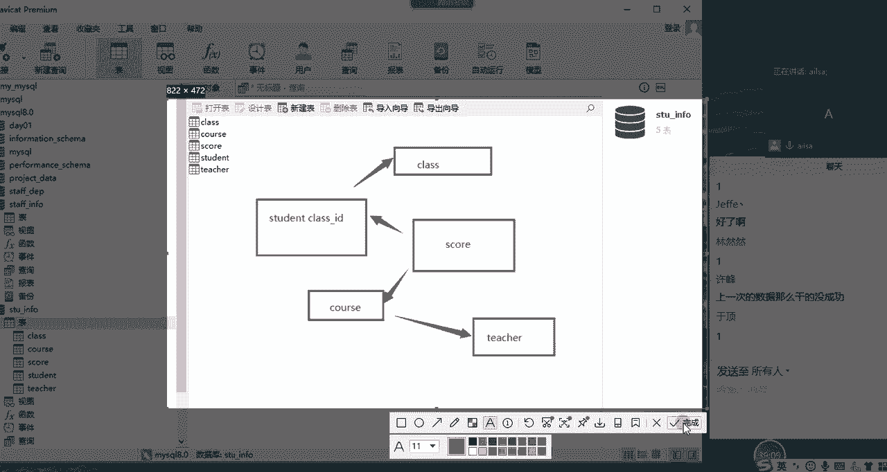

# Python金融量化+业务数据分析：P73：05 MySQL窗口函数引入


在本节课中，我们将要学习MySQL中记录的增删改查操作，并重点探讨单表查询、多表查询的复杂性，最终引入窗口函数这一强大工具，以解决传统聚合查询中的一些局限性。

## 记录的增删改查

上一节我们介绍了数据库和表的基本操作，本节中我们来看看如何对表中的记录进行增删改查。



### 记录的增删改

以下是记录的增删改操作：


*   **插入记录**：使用 `INSERT INTO` 语句。
    *   为所有字段插入值：`INSERT INTO 表名 VALUES (值1, 值2, ...)`
    *   为指定字段插入值：`INSERT INTO 表名 (字段1, 字段2, ...) VALUES (值1, 值2, ...)`
*   **更新记录**：使用 `UPDATE` 语句。
    *   基本语法：`UPDATE 表名 SET 字段名 = 新值 WHERE 条件`
    *   **重要提示**：执行更新操作前务必先写好 `WHERE` 条件，否则会更新整张表的数据。误操作后数据难以恢复，需及时联系数据库管理员处理。
*   **删除记录**：使用 `DELETE` 语句。
    *   基本语法：`DELETE FROM 表名 WHERE 条件`
    *   **重要提示**：同样，务必使用 `WHERE` 条件指定要删除的记录，否则将清空整个表。


### 记录的查询

查操作相对复杂，我们将分为单表查询和多表查询来讲解。

#### SQL查询语句结构与执行顺序

一个完整的查询语句结构如下：
```sql
SELECT [DISTINCT] 字段名
FROM 表名
WHERE 条件
GROUP BY 分组字段
HAVING 分组后条件
ORDER BY 排序字段
LIMIT 数量限制
```
其执行优先级（顺序）为：
1.  `FROM`：确定查询哪张表。
2.  `WHERE`：对表中的原始记录进行条件过滤。
3.  `GROUP BY`：对过滤后的数据进行分组。
4.  `HAVING`：对分组后的结果进行条件筛选。
5.  `SELECT`：选择要显示的字段，并进行去重（`DISTINCT`）。
6.  `ORDER BY`：对最终结果进行排序。
7.  `LIMIT`：限制返回的记录条数。

基于这个顺序，可以理解一个常见的面试题：**为什么 `HAVING` 后面可以跟聚合函数，而 `WHERE` 却不可以？**

原因有二：
1.  执行顺序问题：`WHERE` 在 `GROUP BY` 之前执行，此时数据还未分组，不存在聚合后的结果，因此无法使用聚合函数。`HAVING` 在 `GROUP BY` 之后执行，是针对分组后的结果进行筛选，因此可以使用聚合函数。
2.  操作对象不同：`WHERE` 是对原始数据表中单条记录的条件过滤。`HAVING` 是对分组后（数据透视后）的汇总结果进行条件过滤。

#### 单表查询示例

了解了基础概念后，我们通过几个例子来实践单表查询。

**示例1：模糊查询**
查找姓名以“张”开头且为三个字的员工信息。这需要使用 `LIKE` 运算符和通配符 `_`（代表一个字符）。
```sql
SELECT * FROM emp WHERE name LIKE '张__';
```
查找姓名中包含“张”的员工信息。使用通配符 `%`（代表零个或多个字符）。
```sql
SELECT * FROM emp WHERE name LIKE '%张%';
```

**示例2：分组聚合与筛选**
计算每个部门的人数，并找出人数大于6的部门。
```sql
SELECT post, COUNT(name) AS 人数
FROM emp
GROUP BY post
HAVING COUNT(name) > 6;
```
计算每个部门的平均工资，并按平均工资从高到低排序。
```sql
SELECT post, AVG(salary) AS 平均工资
FROM emp
GROUP BY post
ORDER BY 平均工资 DESC;
```
**注意**：使用 `GROUP BY` 分组时，`SELECT` 后面通常只能跟随分组字段和聚合函数。如果查询非分组字段，其值将是该分组中第一条记录的值，这通常没有明确的业务意义。

#### 多表查询的复杂性

在处理复杂业务时，经常需要关联多张表进行查询。例如，一个简单的学生-课程-成绩系统中，涉及学生表、班级表、课程表、成绩表和教师表等多表关联。


传统方法解决诸如“查询总成绩最好的前两名学生”这类问题会非常繁琐。通常需要先找出最高分，再排除最高分找次高分，最后用 `UNION` 合并结果，或者使用复杂的子查询。这种方法不仅代码冗长，而且缺乏灵活性，难以适应数据动态变化。



## 窗口函数的引入

上一节我们看到了传统方法处理排名问题的复杂性，本节中我们来看看如何使用窗口函数优雅地解决它。

窗口函数是 MySQL 8.0 及以上版本引入的强大功能。它允许在查询结果的每一行上执行计算，同时**不改变原始结果集的行数**。这与 `GROUP BY` 聚合函数会合并行形成显著对比。

### 窗口函数解决排名问题

我们使用窗口函数中的 `DENSE_RANK()` 函数来解决“查询成绩最好的前两名学生”的问题。

`DENSE_RANK()` 函数的作用是为每一行分配一个排名，相同值获得相同排名，且排名连续不间断。

基本语法如下：
```sql
SELECT *,
       DENSE_RANK() OVER (ORDER BY 成绩字段 DESC) AS 排名
FROM 表名;
```

将其应用到我们的问题中：
```sql
SELECT *,
       DENSE_RANK() OVER (ORDER BY number DESC) AS 排名
FROM stu;
```
执行上述语句，会在结果集的每一行后面添加一列“排名”，根据成绩降序排列。


接下来，只需筛选出排名小于等于2的记录即可：
```sql
SELECT *
FROM (
    SELECT *,
           DENSE_RANK() OVER (ORDER BY number DESC) AS 排名
    FROM stu
) AS ranked_table
WHERE 排名 <= 2;
```

### 窗口函数的优势

通过对比，窗口函数的优势显而易见：
1.  **保持原数据结构**：不像 `GROUP BY` 那样折叠行，而是在每行后添加计算结果，便于同时查看明细和汇总信息。
2.  **语法简洁，逻辑清晰**：解决排名、累加、移动平均等问题时代码更简洁，易于理解和维护。
3.  **灵活性强**：通过 `PARTITION BY` 子句可以轻松实现“每个分组内的排名”，例如“每门功课的前两名”，这是传统方法极其难以实现的。


本节课中我们一起学习了MySQL基本的增删改查操作，深入分析了SQL查询的执行顺序，并通过实例体会了传统多表查询和聚合函数在处理复杂问题（如排名）时的局限性。最后，我们引入了强大的窗口函数，演示了它如何以简洁、高效且灵活的方式解决排名类问题，为后续深入学习数据分析中的高级SQL技巧打下了基础。