# 量化交易入门：P21：2-量化交易所需技能分析 📊

在本节课中，我们将要学习进行量化交易所需要掌握的核心技能。我们将分析从数据处理到策略实现的完整知识体系，并明确本课程的重点方向。

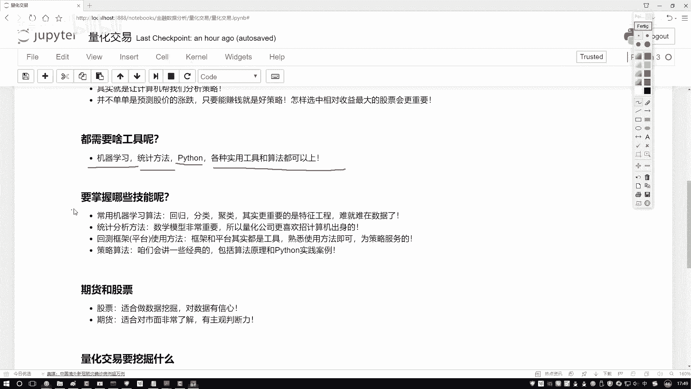

## 核心技能概览

进行量化交易需要掌握一系列跨领域的技能。以下是关键技能点的分析。

### 机器学习算法与特征工程

上一节我们介绍了量化交易的基本概念，本节中我们来看看其技术核心。机器学习算法是基础，例如回归、分类、聚类等常规算法。

更重要的是**特征工程**。在数据挖掘中，数据决定了模型性能的上限，而算法只是用来逼近这个上限的工具。特征工程的核心在于如何处理数据，以及如何从海量数据中提取最有价值的信息。

在量化交易中，金融数据极为庞大。以股票分析为例，数据远不止收盘价和开盘价。股票对应着公司，因此会涉及公司的财务数据、各种指标数据等。我们需要处理来自市场、各公司、财务报表、股市走势等多个层面的复杂数据。如何设计算法并将这些算法有效地融入数据，就是特征工程要解决的问题。选择最有价值的数据是机器学习中最具挑战性的环节之一。

### 统计学与数学基础

以下是量化交易所依赖的理论基础。

*   **统计学方法**：许多量化交易相关岗位都要求数学、统计学、计算机或金融专业背景。
*   **数学应用**：无论是算法还是交易策略，本质上都是将数学公式应用于数据的过程。数学是量化交易的本质，需要掌握较多的数学知识点。

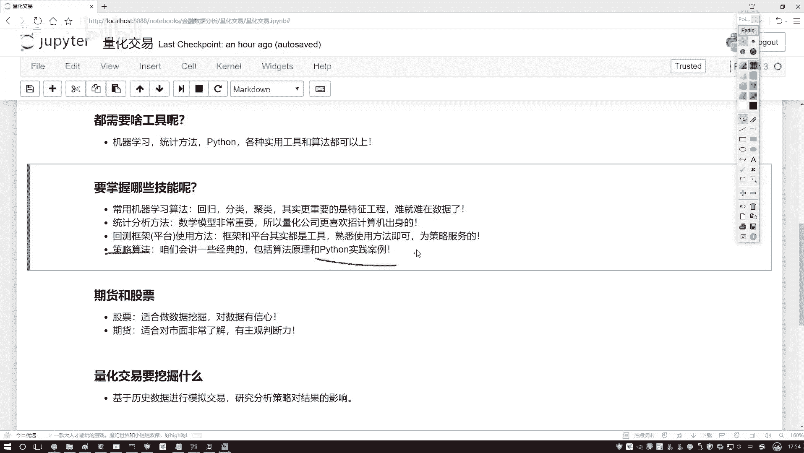

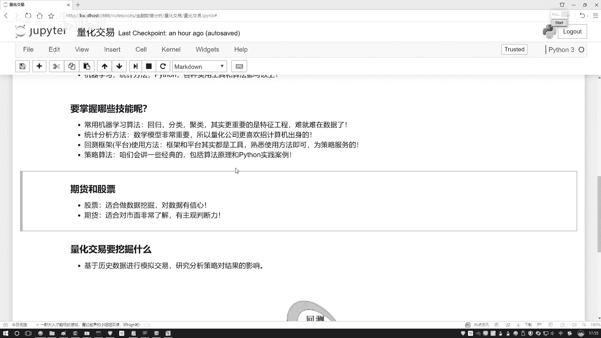

### 平台、框架与策略算法

工具和策略是实现想法的具体手段。

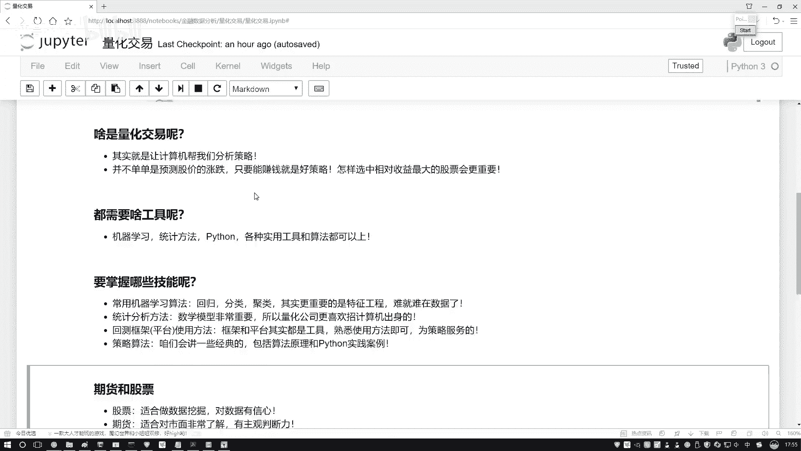

*   **平台与框架使用**：本课程将选择一款便于使用的量化平台进行教学。该平台API简单，可视化清晰，允许用户编写Python代码进行策略回测。回测结果可以展示策略在特定历史时期（如10年到20年）内每日的执行情况、收益及最终表现。平台和框架是工具，熟悉会用即可，无需死记硬背。
*   **策略算法**：算法种类繁多。本课程将重点讲解最常用、最经典的策略算法原理，并演示如何在Python中实现。课程重点在于通过Python进行案例实践与落地，而非单纯讲授股票或期货交易理论。

### 课程重点：股票 vs. 期货

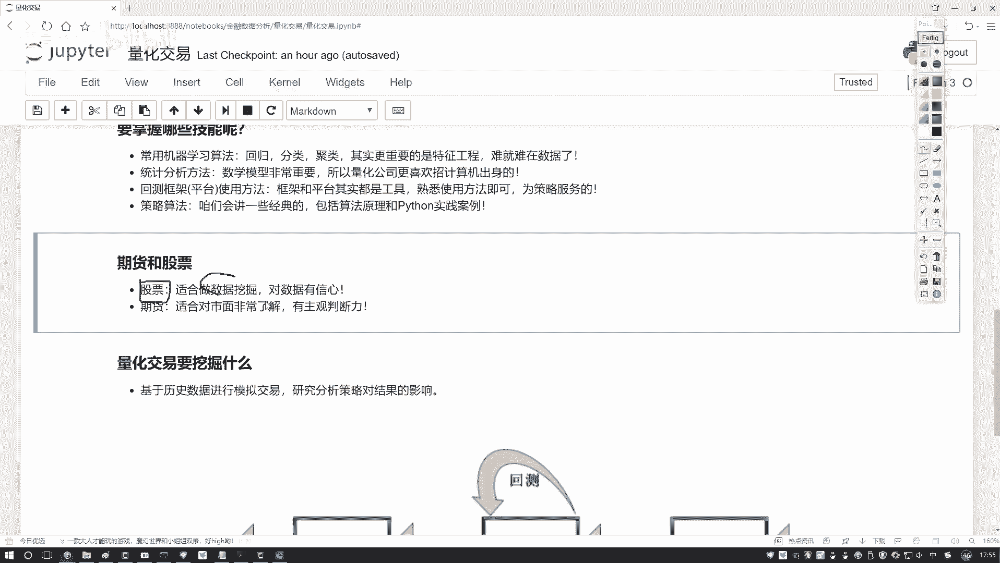

关于交易品种的选择，本课程将有所侧重。

量化交易可应用于期货和股票。本课程的重点将与股票更相关，因为股票数据包含各种指标，更适合进行数据挖掘。期货交易则更依赖于对市场的深入了解和主观判断，其市场关联性更强，主观因素占比更重。因此，课程中关于期货仅会举几个小例子，重点在于讲解股票相关的数据挖掘与Python实战案例。

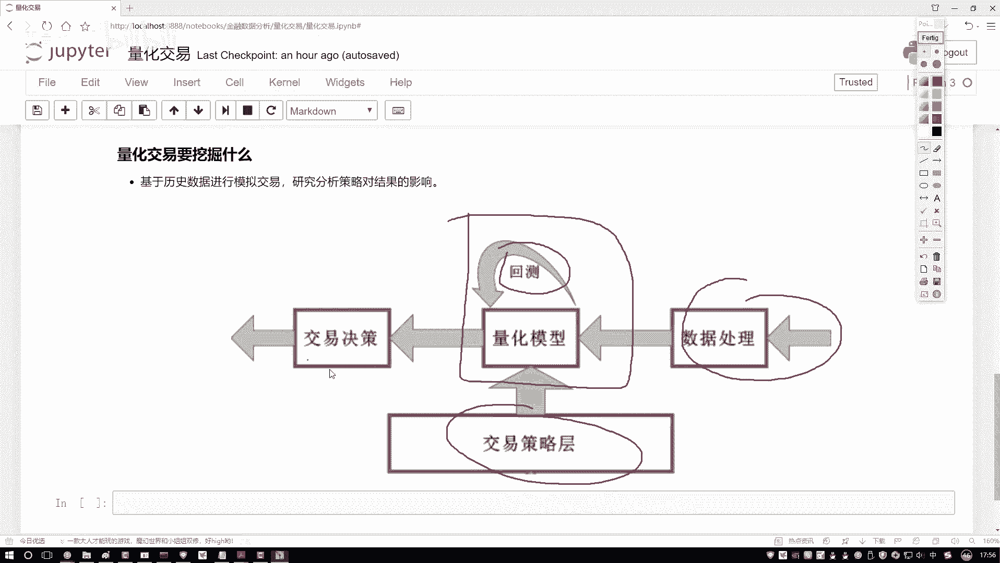

## 量化交易的本质：数据挖掘

既然提到了数据挖掘，我们不得不探讨其与量化交易的关系。

数据挖掘的工作流程是：获取数据 -> 处理数据 -> 设计交易策略。将数据与策略融合后，关键步骤是**回测**。回测指利用历史数据测试特定策略的表现。测试完成后，其结果将对未来的实际决策提供指导和依据。

量化交易本质上就是将数据挖掘算法应用于金融数据。其目的并非单纯预测股票涨跌（这非常困难），而是追求**收益最大化**。例如，如何在一定本金下，从300只股票的池子中选择单位风险收益最高的股票组合，这同样是数据挖掘问题。因此，量化交易是一个综合学科，其最终目标是实现收益最大化。

对于量化交易本身，只需了解其基本概念、数据挖掘的含义、所用工具以及课程后续内容即可，无需深究其发展历史。

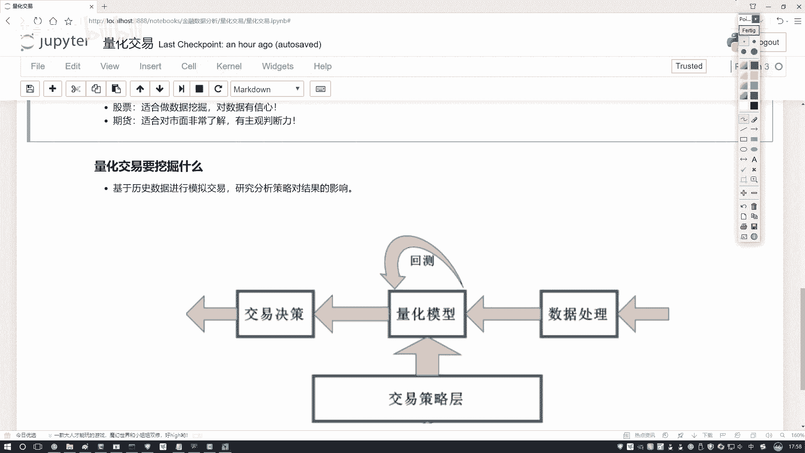

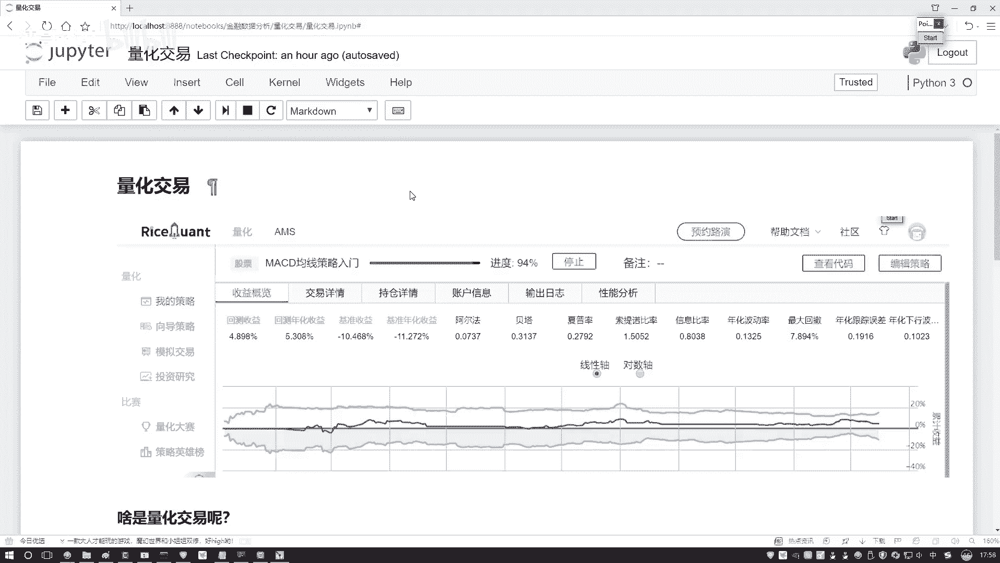

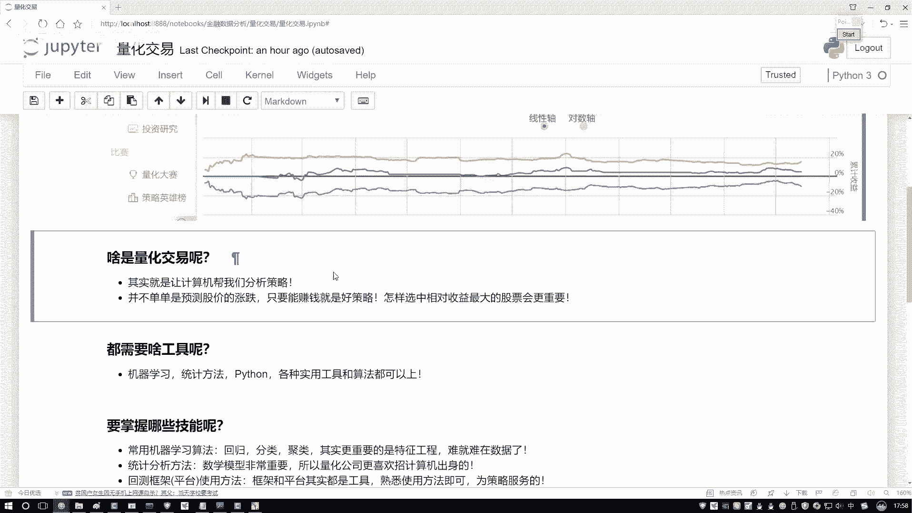

## 总结

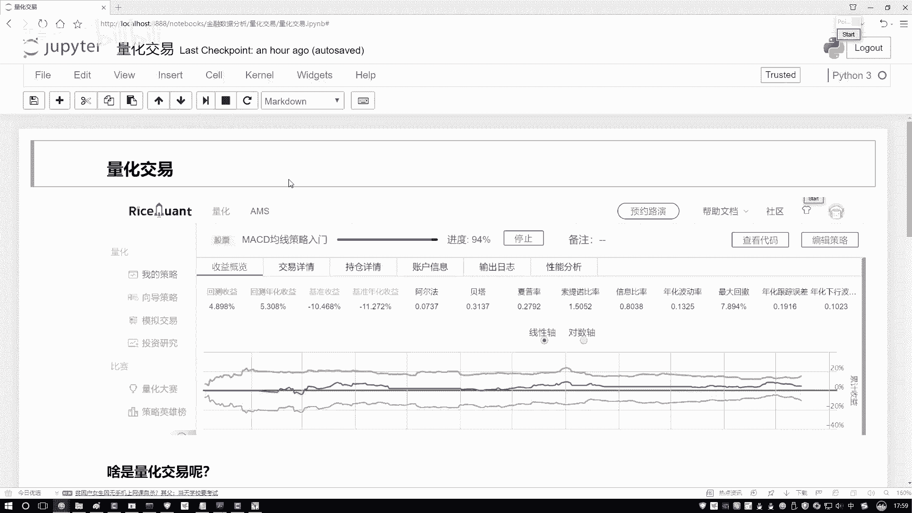

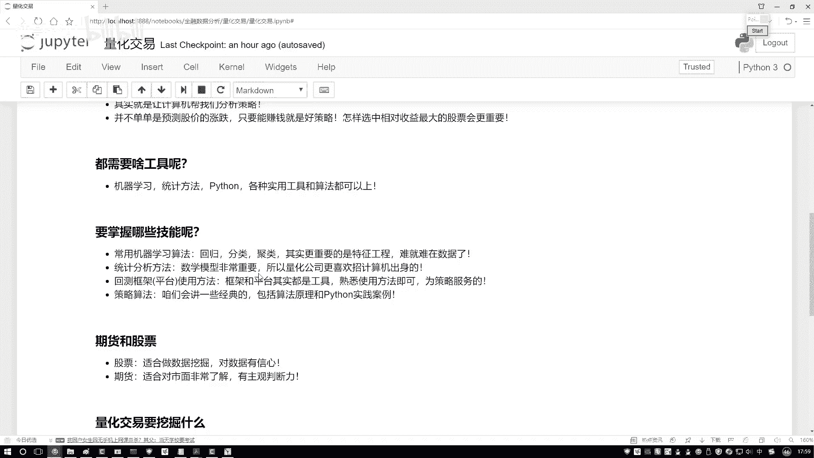

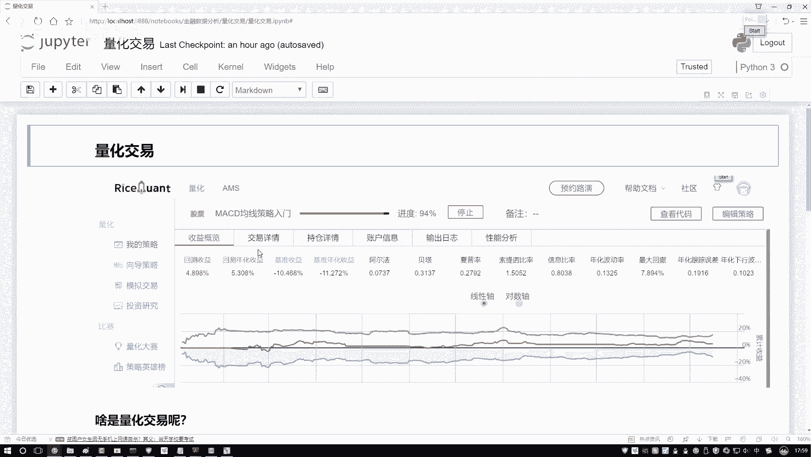

本节课中我们一起学习了量化交易所需的核心技能体系。我们明确了**特征工程**在数据处理中的关键地位，认识到**数学与统计学**是策略的基石，了解了**平台工具**和**经典策略算法**的实践方式，并确定了本课程将以**股票数据挖掘**作为重点实战方向。记住，量化交易的本质是追求**收益最大化**的数据挖掘应用。