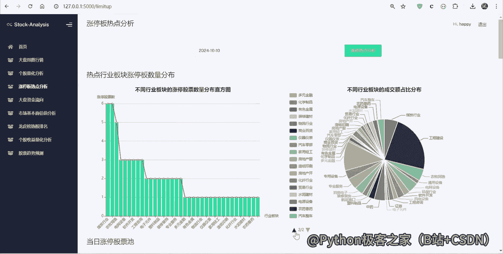
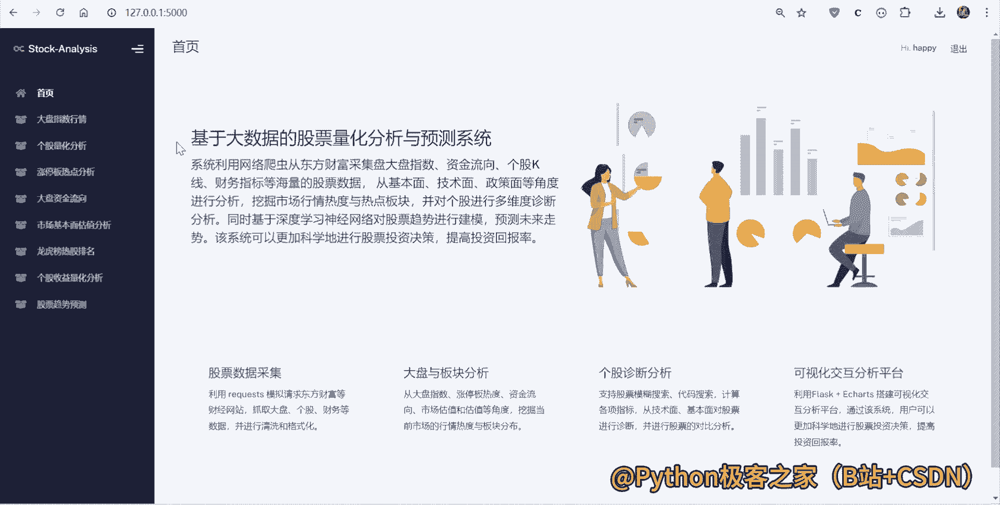

# 股票量化分析：P1：环境搭建与数据获取

在本节课中，我们将学习如何搭建一个用于股票量化分析的基础Python环境，并获取股票历史数据。这是构建任何量化分析系统的第一步。

## 概述

量化分析的核心在于使用数学模型和计算机程序来分析市场数据，以辅助投资决策。本节课程将引导你完成初始环境的配置，确保后续的分析工作能够顺利进行。

上一节我们介绍了课程的整体目标，本节中我们来看看如何搭建一个可用的开发环境。

## 环境搭建

一个稳定且功能齐全的开发环境是进行数据分析的前提。以下是搭建环境的几个关键步骤。

### 1. 安装Python

Python是进行数据分析和量化交易的主流编程语言。请从Python官网下载并安装最新稳定版本。


### 2. 安装集成开发环境

推荐使用PyCharm或Visual Studio Code作为代码编辑器，它们能提供代码高亮、自动补全和调试等功能，提升开发效率。

### 3. 安装必要的库

我们将使用几个核心的Python库来处理数据和进行数学计算。请在命令行中使用pip命令进行安装。

以下是需要安装的核心库列表：

*   **pandas**：用于数据处理和分析。
*   **numpy**：提供高效的数学计算功能。
*   **matplotlib**：用于绘制数据图表。
*   **yfinance**：一个从雅虎财经获取金融数据的库。

安装命令如下：
```bash
pip install pandas numpy matplotlib yfinance
```

## 数据获取

环境搭建完成后，下一步是获取股票的历史数据。我们将使用`yfinance`库来下载数据。



上一节我们准备好了分析工具，本节中我们来看看如何获取实际的股票数据。

### 1. 导入库

在Python脚本的开头，首先导入我们将要使用的库。
```python
import yfinance as yf
import pandas as pd
import matplotlib.pyplot as plt
```

### 2. 下载股票数据

使用`yfinance`的`download`函数可以轻松获取指定股票代码在特定时间段内的历史行情数据。

以下是`download`函数的关键参数说明：

*   **tickers**：股票代码，例如`‘AAPL’`代表苹果公司。
*   **start**：数据开始日期，格式为`‘YYYY-MM-DD’`。
*   **end**：数据结束日期，格式同上。
*   **period**：数据周期，如`‘1d’`、`‘1mo’`、`‘1y’`等，可作为`start`/`end`的替代。
*   **interval**：数据间隔，如`‘1d’`（日线）、`‘1h’`（小时线）。

获取苹果公司过去一年的日线数据示例代码如下：
```python
# 下载苹果公司过去一年的日线数据
data = yf.download(‘AAPL’, period=‘1y’, interval=‘1d’)
print(data.head()) # 查看前几行数据
```

### 3. 理解数据结构



下载的数据是一个`pandas DataFrame`，它包含了开盘价、最高价、最低价、收盘价、调整后收盘价和成交量等信息。

查看数据列名和基本统计信息：
```python
print(data.columns)
print(data.describe())
```

## 数据可视化

初步查看数据最直观的方式是将其绘制成图表。我们可以使用`matplotlib`来绘制股票价格走势图。

上一节我们获取了数据，本节中我们通过可视化来初步观察其趋势。

绘制苹果公司收盘价走势图的代码如下：
```python
plt.figure(figsize=(12, 6))
plt.plot(data.index, data[‘Close’], label=‘AAPL Close Price’)
plt.title(‘AAPL Stock Price (Past Year)’)
plt.xlabel(‘Date’)
plt.ylabel(‘Price (USD)’)
plt.legend()
plt.grid(True)
plt.show()
```

## 总结

本节课中我们一起学习了量化分析的第一步：环境搭建与数据获取。我们安装了必要的Python库，使用`yfinance`获取了股票历史数据，并进行了简单的可视化。这为后续深入的数据分析和策略构建打下了坚实的基础。在下一节课中，我们将开始学习如何计算和分析股票的基础技术指标。