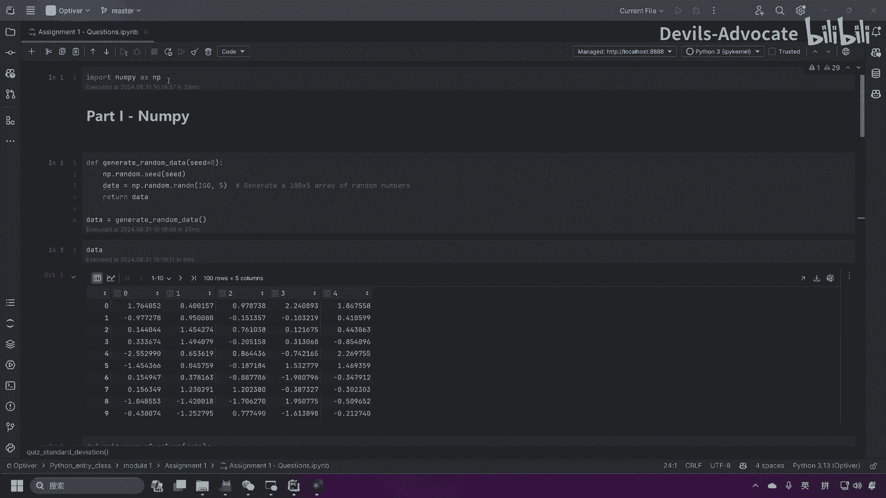
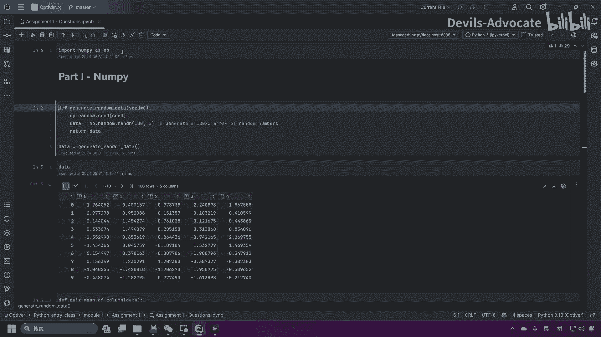
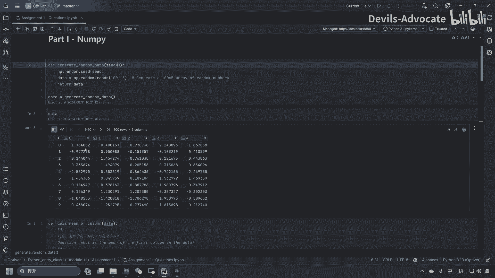
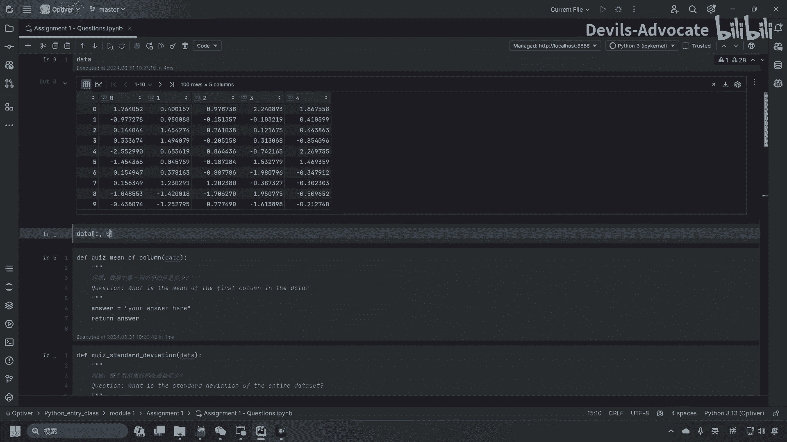
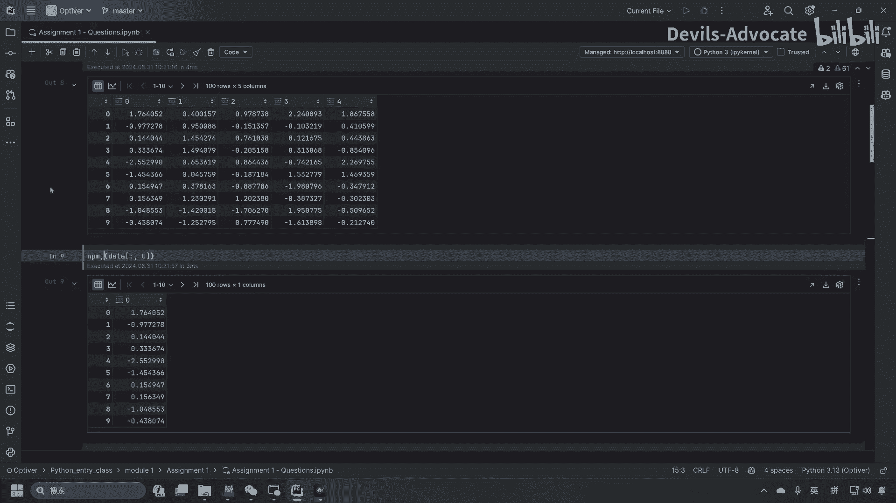
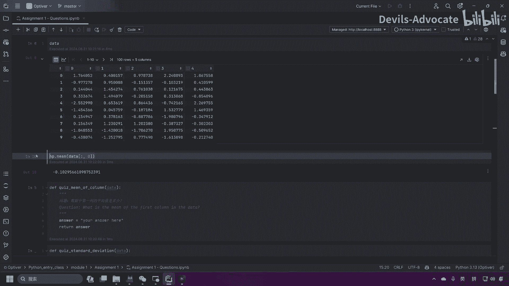
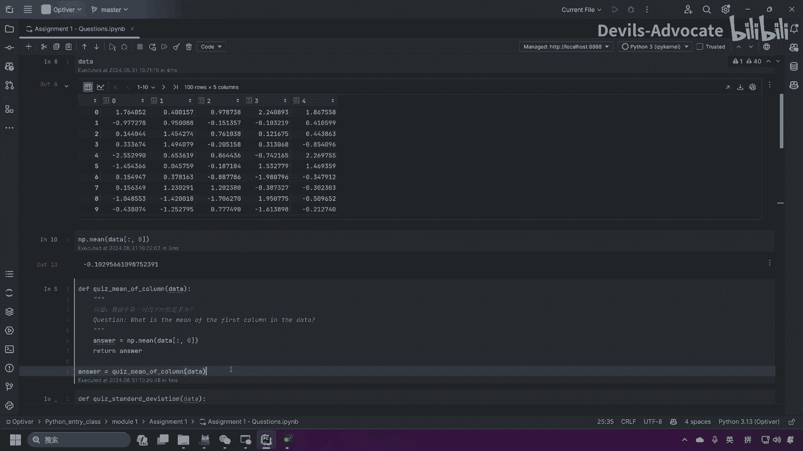
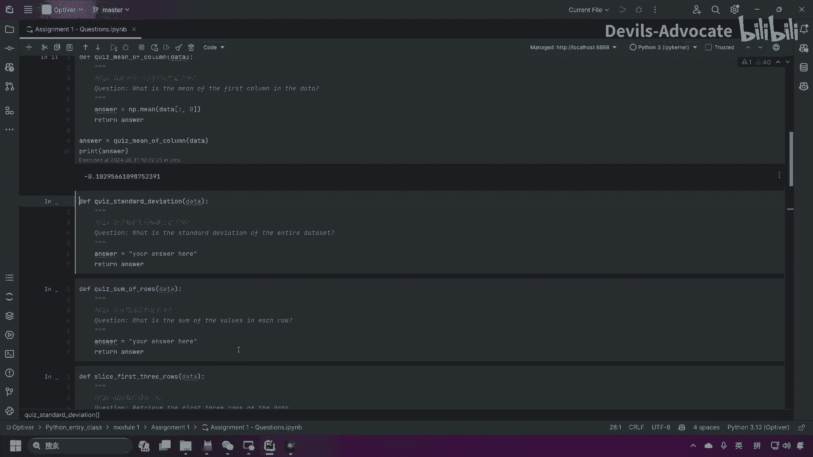
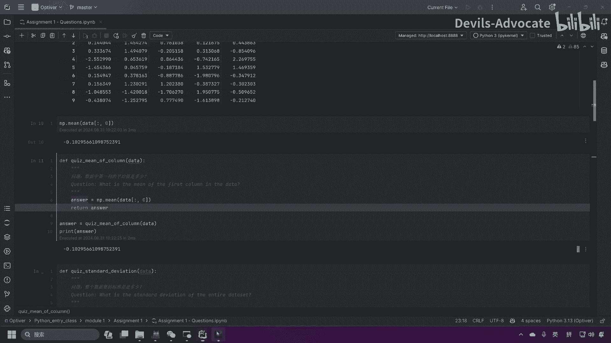

# 量化交易Python入门之数据分析：1：作业说明与数据基础操作 🧮

在本节课中，我们将学习如何完成数据分析作业的第一部分。核心任务是计算给定数据集中第一列的平均值。我们将使用NumPy库来生成和处理数据，并学习如何提取特定列以及计算其平均值。

---



## 数据生成与导入



首先，我们需要导入NumPy库并生成作业所需的数据集。以下代码设置了随机种子以确保结果可复现，并创建了一个包含100行、5列的随机数据矩阵。

```python
import numpy as np

# 设置随机种子以确保结果一致性
np.random.seed(0)
# 生成一个100行5列的随机数据矩阵，数值范围在0到50之间
data = np.random.uniform(0, 50, (100, 5))
```

通过设置 `np.random.seed(0)`，我们保证了每次运行代码生成的数据都完全相同，这便于作业答案的核对。

---


## 计算第一列的平均值



上一节我们介绍了如何生成数据，本节中我们来看看如何提取数据的第一列并计算其平均值。在Python和NumPy中，索引从0开始，因此“第一列”对应索引0。

提取整个数据矩阵中第0列所有数据的代码如下：



```python
# 提取第一列（索引为0的列）的所有数据
first_column = data[:, 0]
```



提取列数据后，我们需要计算其平均值。NumPy提供了便捷的 `mean()` 函数来完成此操作。

以下是计算平均值的具体方法：



```python
# 使用NumPy的mean函数计算第一列的平均值
mean_value = np.mean(first_column)
```

计算完成后，我们可以打印出结果进行验证。



```python
# 打印生成的数据和计算出的平均值
print("生成的数据矩阵：")
print(data)
print("\n第一列的平均值是：", mean_value)
```



运行上述完整代码，你将得到第一列的平均值约为 **-0.1029**。你可以将此结果与作业提供的答案进行比对。

---

## 总结



本节课中我们一起学习了数据分析作业的基础操作。我们首先使用NumPy生成了一个固定的随机数据集，然后学习了如何通过索引提取特定的数据列，最后使用 `np.mean()` 函数计算了该列的平均值。掌握这些基础操作是进行更复杂金融数据分析的第一步。