# 量化交易：Python入门之数据分析【1／4】：课程的学习路径 🗺️

在本节课中，我们将要学习本系列课程的整体结构与学习路径。课程旨在通过实践驱动的方式，帮助初学者高效掌握Python数据分析的核心技能，为后续的量化金融学习打下坚实基础。

## 课程概述

许多学习者在听完大量课程后，仍然难以实际应用Python。核心问题在于缺乏练习。本课程的亮点在于每个模块后都配有作业。如果你能在没有参考答案的情况下独立完成这些作业，你的Python基础将非常牢固。

本课程注重实践，并且剔除了冗余内容。虽然分为四个模块，但相比其他动辄上百小时的课程更为精简高效。

## 模块一：Python基础与环境搭建 🛠️

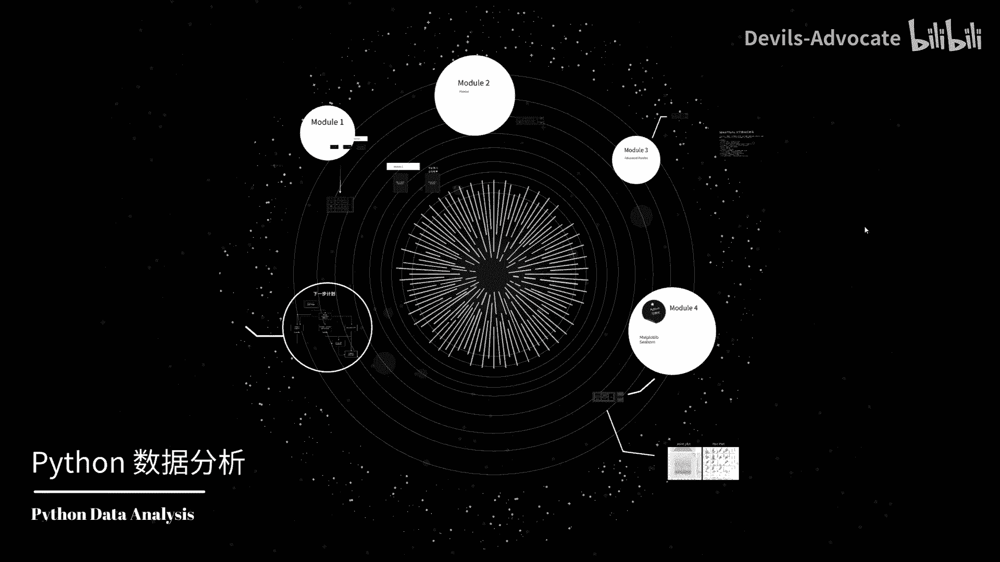

上一节我们介绍了课程的整体理念，本节中我们来看看第一个模块的具体内容。

在第一个模块中，我将首先带领大家完成Python开发工具的安装和配置。


接着，我会介绍Python的基础内容，包括：
*   **数据类型**：例如整数、浮点数、字符串、列表、字典。
*   **变量**：用于存储数据的标识符。
*   **条件语句**：使用 `if`, `elif`, `else` 进行逻辑判断。
*   **循环**：使用 `for` 和 `while` 进行重复操作。

每一部分都会配有作业和详细解答，以确保大家能深入理解和掌握这些基础知识。

## 模块二：Pandas数据分析基础 📊

掌握了Python基础后，我们将进入数据分析的核心工具学习。

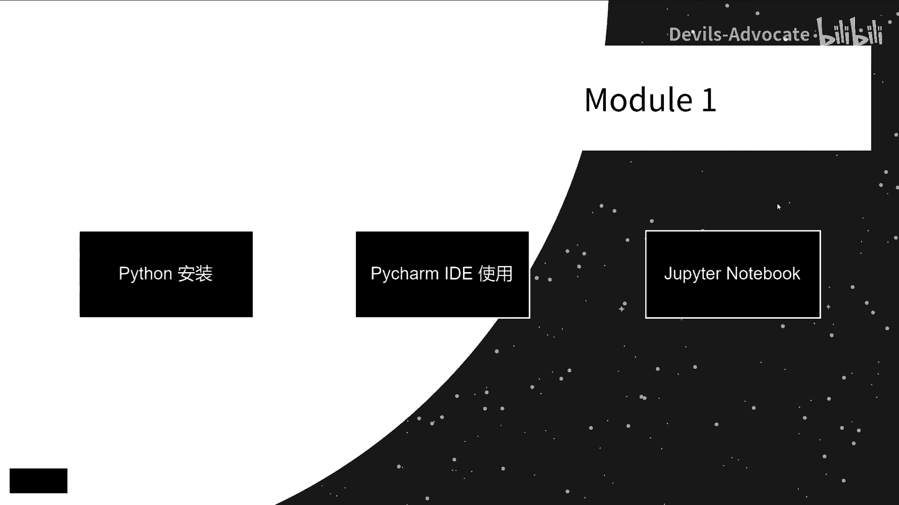

第二个模块聚焦于 **Pandas**，这是一款强大的数据操作及分析库。内容包括：
*   如何导入数据（如从CSV文件）。
*   数据清洗（处理缺失值、重复值等）。
*   基本的数据查询和操作（如选择、过滤、排序）。

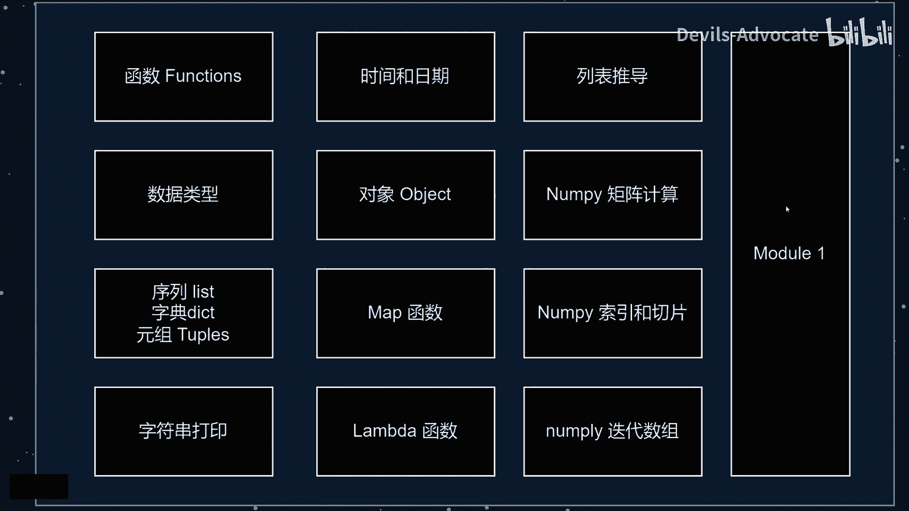

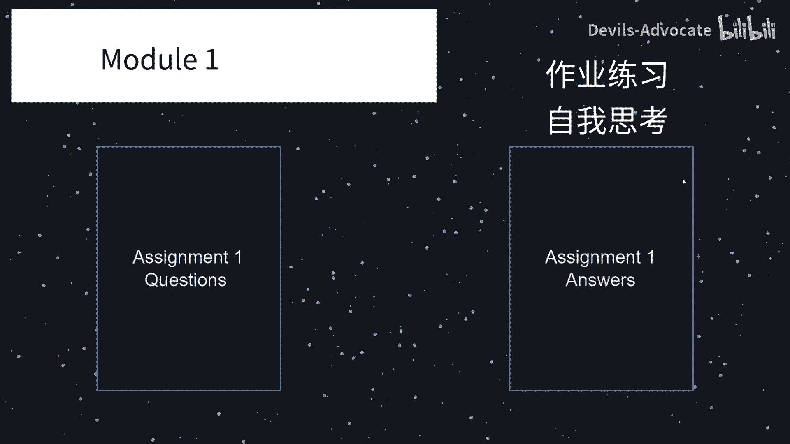

这个模块将帮助大家熟悉Pandas的基本用法，为处理金融数据做好准备。

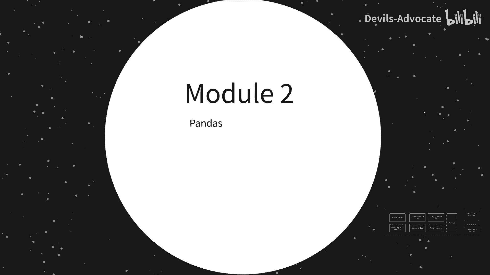

## 模块三：Pandas高级应用与实战 🚀

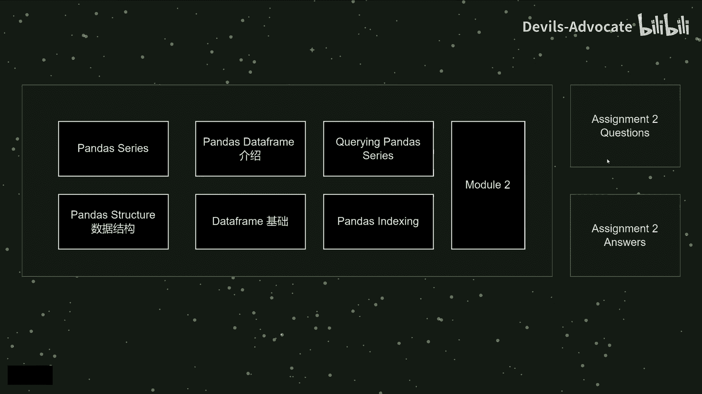

在熟悉了Pandas基础操作之后，本节我们将探索更强大的功能。

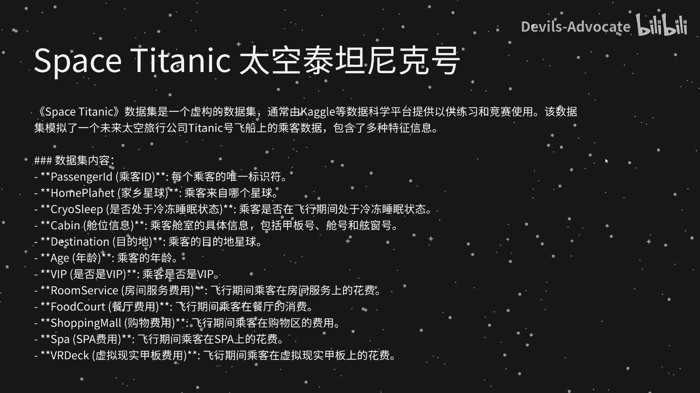

模块三将讨论Pandas的高级函数，例如：
*   **`apply()` 与 `lambda` 函数**：用于对数据应用自定义操作。
    ```python
    df[‘new_column‘] = df[‘old_column‘].apply(lambda x: x*2)
    ```
*   **`groupby()` 方法**：用于数据分组与聚合。
*   **数据透视表**：用于多维数据摘要。

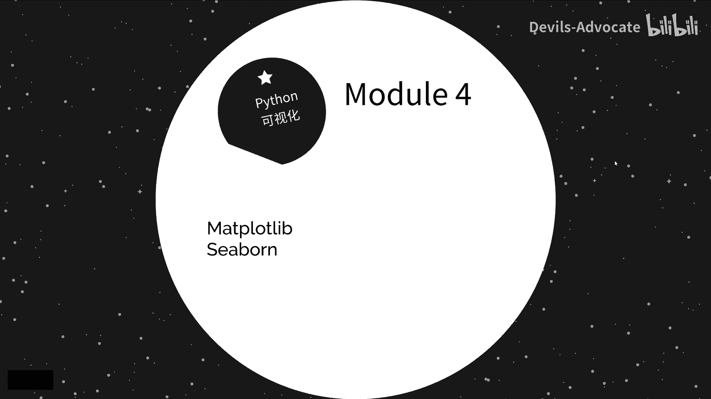

这一模块的作业具有一定挑战性。我们将使用真实竞赛场景下的数据集（如“太空泰坦尼克号”数据），模拟数据分析比赛，从而提升大家的实际操作技能。

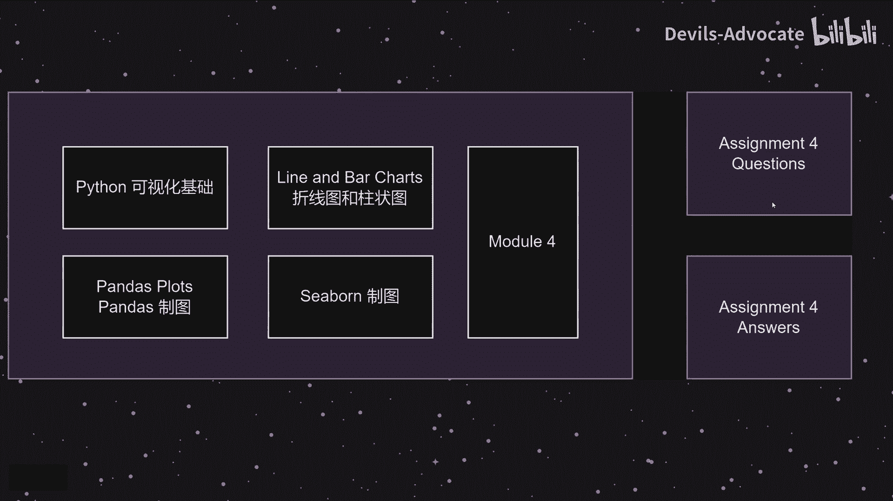


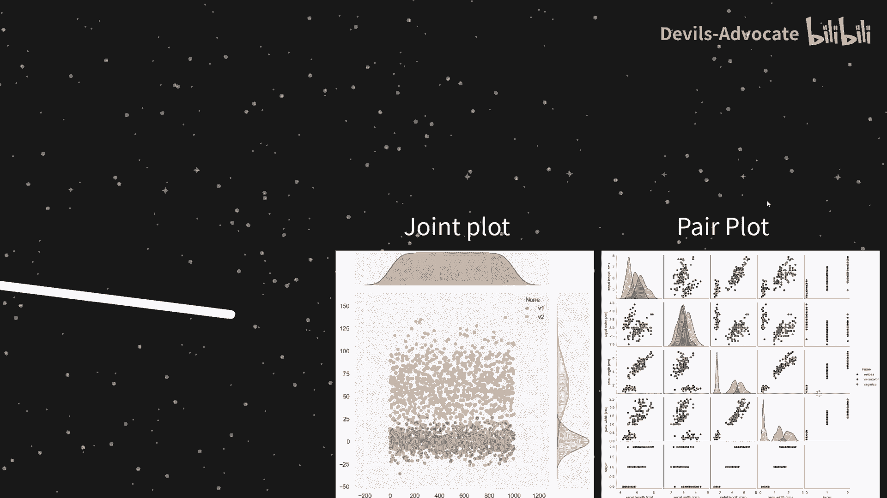

## 模块四：数据可视化 📈

数据分析的成果最终需要通过直观的图表来呈现。

最后一个模块，我们将学习Python的数据可视化。我们将使用 **Matplotlib** 和 **Seaborn** 库进行数据可视化分析。完成该部分的学习后，我们将能绘制出较高级和复杂的图像。


## 后续学习路径展望 🎯

完成本数据分析课程后，你的Python能力已经可以应对基础任务。下一步自然是寻找通往不同专业领域的路径。

以下是为你规划的不同“副本攻略”：
*   **时间序列分析**：这是量化分析的基础，因为金融数据大多基于时间序列。
*   **截面分析**：这在因子投资中需要更深入的学习。
*   **回测**：在量化研究中至关重要，用于验证策略的有效性。
*   **因子投资**：在金融机构中非常重要，涉及因子模型、分层回测、因子挖掘、IC/IR计算等。
*   **机器学习与深度学习**：在量化中应用广泛，我将手把手教大家如何应用。
*   **数据库管理**：对于实盘和回测，搭建自己的数据库至关重要。
*   **实盘交易对接**：教你如何将策略连接到交易所，实现从研究到交易的完整闭环。

如果有兴趣深入以上任何领域，可以进一步交流。

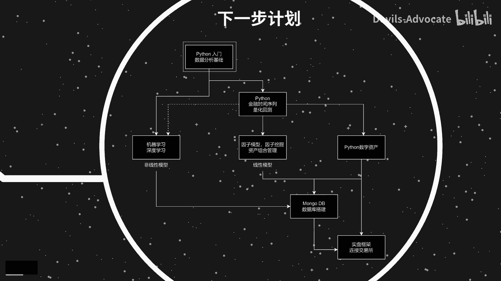


## 总结


本节课中，我们一起学习了本系列课程的四模块结构：**Python基础、Pandas数据分析、Pandas高级实战、数据可视化**。课程强调通过**实践与作业**来巩固知识，并为大家展望了在量化金融领域继续深造的多个核心方向。希望你能通过本课程，建立起扎实的Python数据分析能力。