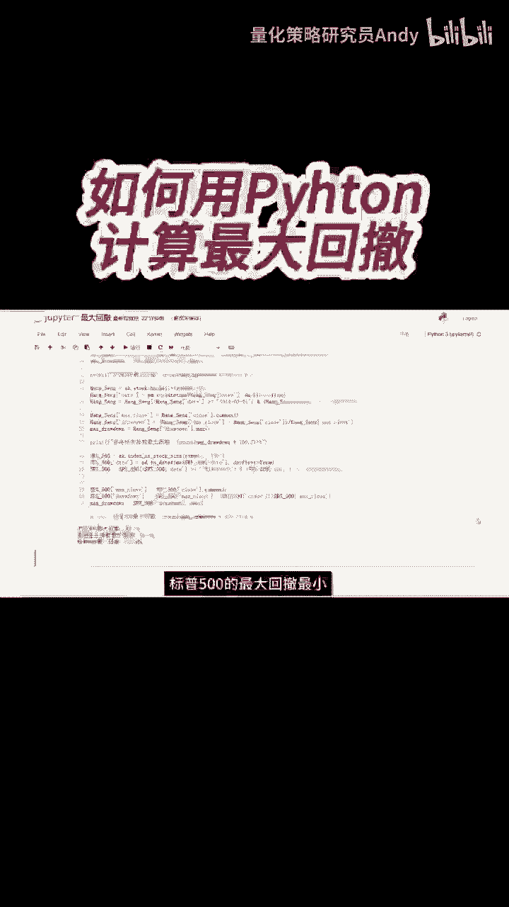
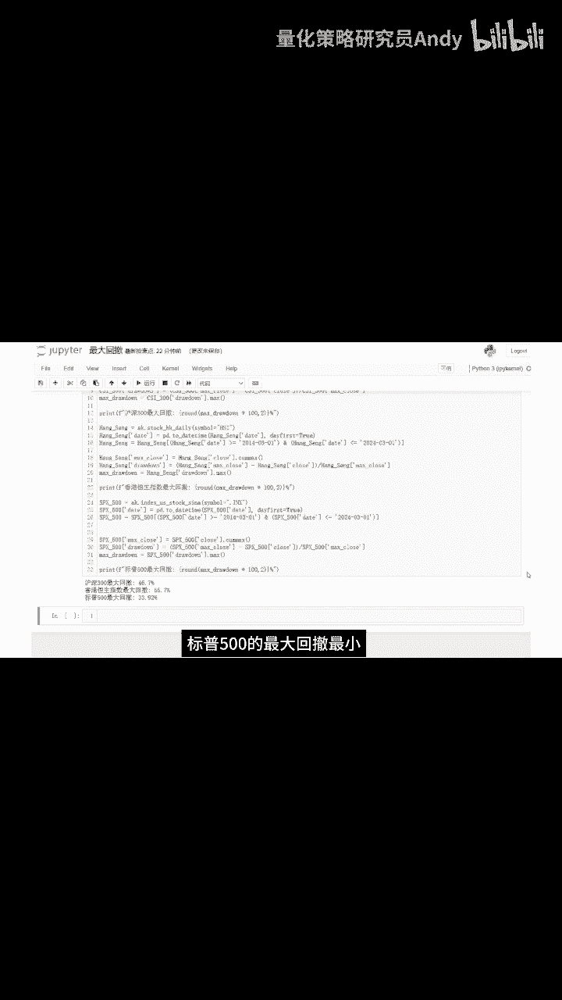

# 量化交易基础：P1：如何利用Python计算最大回撤 📉

在本节课中，我们将要学习一个在量化交易和投资分析中至关重要的风险指标——**最大回撤**。我们将通过Python代码，一步步演示如何从历史价格数据中计算出这个指标，帮助你理解资产在特定时期内可能面临的最大亏损幅度。

## 数据准备与核心概念



首先，我们需要获取并准备历史价格数据。这部分代码与之前课程中获取数据的方式一致。我们假设已经有一个包含日期和收盘价的数据框 `df`。

接下来，我们引入计算最大回撤的核心概念。**最大回撤** 衡量的是资产价格从历史最高点跌落到最低点的最大跌幅。其核心计算步骤如下：
1.  计算每个时间点对应的**历史最高收盘价**。
2.  计算每个时间点的**回撤率**，即（历史最高价 - 当前价）/ 历史最高价。
3.  在所有时间点的回撤率中，找出**最大值**，即为最大回撤。

## 分步代码实现

上一节我们介绍了最大回撤的概念，本节中我们来看看具体的Python实现代码。以下是计算过程中的三个关键步骤：

```python
# 步骤一：计算每个时间点对应的历史最高收盘价
df[‘cum_max’] = df[‘Close’].cummax()

# 步骤二：计算每个时间点的回撤率
df[‘drawdown’] = (df[‘cum_max’] - df[‘Close’]) / df[‘cum_max’]

# 步骤三：计算整个时间段内的最大回撤
max_drawdown = df[‘drawdown’].max()
```

### 代码步骤详解

现在，让我们详细解释每一行代码的作用。

*   **`df[‘cum_max’] = df[‘Close’].cummax()`**
    这行代码使用Pandas的 `.cummax()` 函数。它的作用是，对于数据中的每一天，计算从起始日到该天为止所有收盘价中的最大值。例如，对于2015年3月2日，`cum_max` 的值就是2014年3月1日到2015年3月2日期间所有收盘价的最大值。

*   **`df[‘drawdown’] = (df[‘cum_max’] - df[‘Close’]) / df[‘cum_max’]`**
    这行代码计算每日的回撤率。公式是：用当日对应的历史最高价减去当日的收盘价，再除以该历史最高价。结果 `drawdown` 列表示的是，相对于到当日为止的历史高点，当前价格下跌的百分比。

*   **`max_drawdown = df[‘drawdown’].max()`**
    最后，我们在计算出的所有每日回撤率中，找出其中的最大值。这个值就是该资产在整个观测期内的**最大回撤**。它代表了投资者如果不幸在最高点买入，并在最低点卖出，所可能承受的最大损失比例。



## 运行结果与总结

运行上述代码后，我们便可以得到计算结果。例如，对于标普500指数的历史数据，我们能够计算出其特定时间段内的最大回撤值。

本节课中我们一起学习了如何用Python计算最大回撤。我们首先理解了最大回撤作为风险度量指标的含义，然后通过三个清晰的步骤实现了它：计算历史最高价序列、计算每日回撤率、最后找出回撤率的最大值。掌握这个计算过程，是进行量化策略回测和风险评估的基础。