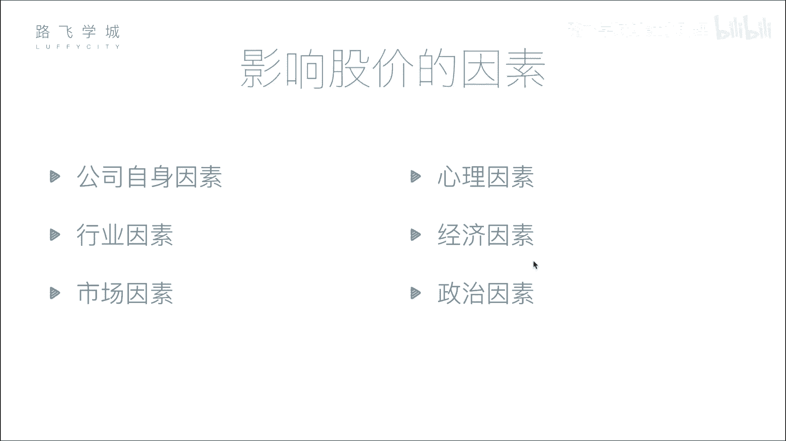

# Python金融量化分析：P6：04 影响股价因素与股票买卖知识 📈

在本节课中，我们将学习影响股票价格的主要因素，并了解股票买卖的基本流程与规则。这些知识是进行金融量化分析的基础。

## 影响股价的六大因素

上一节我们介绍了股票的基本概念，本节中我们来看看哪些因素会影响股票价格的波动。以下是影响股价的六个主要因素。

1.  **公司自身因素**：这是影响股价最根本的因素。公司的经营状况、盈利能力、发展前景以及重大事件（如丑闻）都会直接影响其市值和股价。公式可以表示为：`股价 ≈ 公司市值 / 总股本`。公司经营越好，预期市值增长，股价就倾向于上涨。

2.  **市场因素**：这是影响股价最直接的因素。股价的短期波动由市场的供求关系决定。买的人多、卖的人少（供不应求），股价上涨；卖的人多、买的人少（供过于求），股价下跌。

3.  **行业因素**：整个行业的发展趋势会影响行业内所有公司的股价。例如，一个蓬勃发展的行业（如人工智能）会带动相关公司股价上涨；而一个衰退的行业则可能导致股价普遍下跌。

4.  **心理因素**：投资者的情绪和非理性行为会影响股价，例如从众心理。当市场出现恐慌性抛售时，即使公司基本面没有恶化，股价也可能大幅下跌。

5.  **经济因素**：国家层面的宏观经济政策和指标会影响股价。例如，中央银行加息可能导致市场资金流向银行存款，减少股市资金，从而对股价产生下行压力。

6.  **政治因素**：国际关系、地区局势、政府政策等政治事件会显著影响市场信心和股价。例如，地缘政治紧张可能引发市场恐慌，导致股价下跌；而相关领域的股票（如军工股）可能因事件驱动上涨。

## 股票买卖的基本流程与规则

了解了影响股价的因素后，我们来看看个人投资者如何进行股票买卖，以及市场有哪些基本规则。

以下是股票买卖的关键步骤与概念。

*   **开户与委托**：个人不能直接进入交易所买卖股票，必须通过证券公司（券商）开户。买卖指令需要通过券商的系统提交到交易所，这个过程称为“委托”。

*   **股票交易日**：股票交易并非随时可以进行。交易日通常为每周一至周五（非法定节假日）。交易所有固定的休市时间。

*   **交易时间与竞价机制**：每个交易日的交易时间也有严格规定，并分为不同阶段：
    *   **开盘集合竞价（9:15-9:25）**：在此时间段内提交的所有买卖委托不会立即成交，交易所会在9:25一次性集中撮合，以产生当日的**开盘价**。其核心原则是最大化成交量。
    *   **连续竞价（9:30-11:30, 13:00-14:57）**：此阶段交易系统对接收到的委托进行**连续、高频的撮合**（例如每几秒一次），促成实时交易。
    *   **收盘集合竞价（仅深圳交易所，14:57-15:00）**：深圳交易所在最后3分钟再次采用集合竞价方式，以产生**收盘价**。上海交易所的收盘价为当日最后一笔交易的成交价。

*   **T+1制度与涨跌停限制**：这是A股市场的两项重要规则。
    *   **T+1交易制度**：指当日（T日）买入的股票，必须到下一个交易日（T+1日）才能卖出。
    *   **涨跌停板制度**：为防止股价过度波动，A股设置了涨跌幅限制。普通股票每日价格相对于前一日收盘价的涨跌幅度不得超过10%（ST股为5%）。价格达到涨跌停板时，交易可能受限。

本节课中我们一起学习了影响股票价格的六大因素（公司自身、市场、行业、心理、经济、政治），并掌握了股票买卖的基本流程、交易时间规则以及A股市场的T+1制度和涨跌停限制。理解这些基础概念是后续进行量化分析和策略开发的前提。