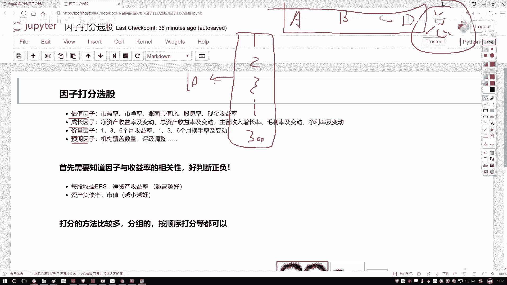
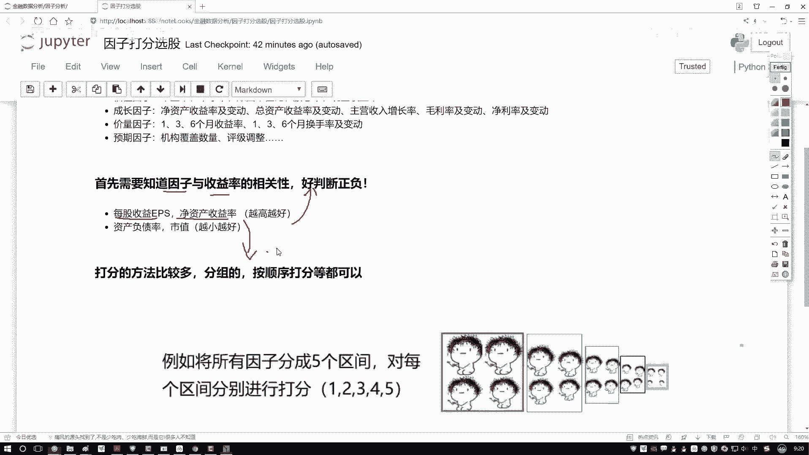

# Python金融分析+量化交易：P48：打分法选股策略概述 📊

在本节课中，我们将要学习一种在量化选股中常用的策略——因子打分选股法。我们将从策略的基本概念入手，解释其核心思想，并了解实施该策略所需的前置知识。

## 策略核心思想

上一节我们介绍了如何通过单一因子（如市盈率）来评估股票。本节中我们来看看如何综合多个因子进行更全面的评估。

因子打分选股的核心思想是：**综合多个因子对股票进行评分，根据总分排名来筛选股票**。这类似于学生的总成绩由各科成绩加总而成，我们通过计算每只股票在所有选定因子上的综合得分，并据此进行排名，从而选出“整体表现最佳”的股票。

假设我们有300只股票（股票1， 股票2， …， 股票300）和四个选股因子（A， B， C， D）。我们的目标不是单独看某个因子，而是为每只股票计算一个**总分**。

**公式表示如下：**
`股票总分 = f(因子A得分， 因子B得分， 因子C得分， 因子D得分)`

其中，`f`通常为加权求和函数。计算出所有股票的总分后，我们进行排序，选取排名靠前的股票（如前10名）作为投资组合。在每次调仓周期（如每月），我们都重复这一过程，更新股票组合。

## 实施策略的前提条件

在开始为因子打分之前，我们必须明确一个关键的先验知识：**每个因子与预期收益率的相关性是正还是负**。

这是因为，打分需要依据因子数值的大小，但并非所有因子都是数值越大越好。例如：
*   **正向因子**：因子值越大，预期收益可能越高（如每股收益、净资产收益率）。对于这类因子，我们给数值更大的股票打更高的分。
*   **负向因子**：因子值越小，预期收益可能越高（如市盈率、市净率）。对于这类因子，我们给数值更小的股票打更高的分。

以下是确定因子性质的两种主要途径：
1.  **查阅研究报告**：各大券商和金融机构会发布大量研究报告，其中包含了关于各类因子有效性的经验结论。
2.  **自行计算验证**：我们之前在因子分析章节中学习的方法，可以通过计算因子与收益率的**IC值**或进行相关性分析，来实证检验因子的方向。

在后续的实际平台策略编写中，我们所选取的因子都是事先明确了其方向的（即已知是“越大越好”还是“越小越好”）。这是构建打分模型必不可少的一步。

## 总结

本节课中我们一起学习了因子打分选股策略的概要。我们了解到，该策略通过**综合多个因子对股票进行评分并排序**，来替代单一的因子选股，使选股逻辑更加全面。同时，我们强调了实施该策略的关键前提：**必须预先知道每个因子与收益率的相关方向**，这是进行合理打分的基础。在接下来的课程中，我们将进入实战平台，演示如何具体计算这个“总分”。