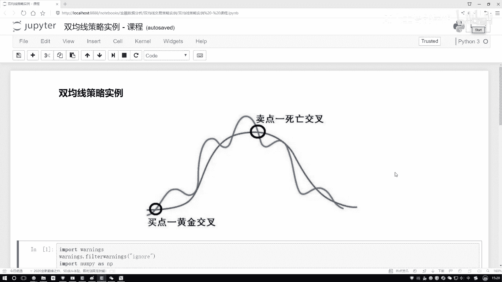
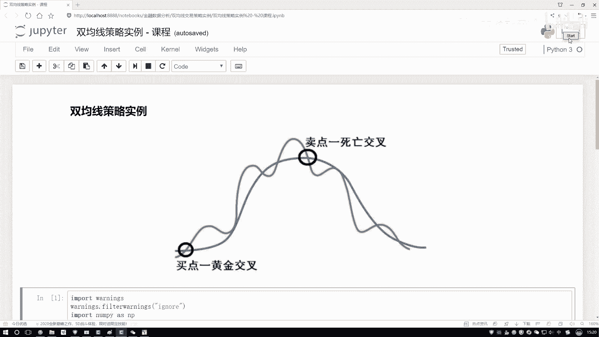
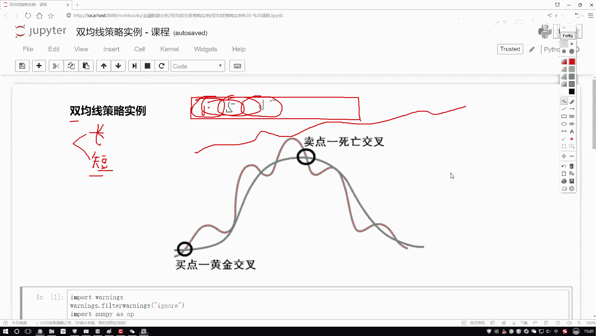
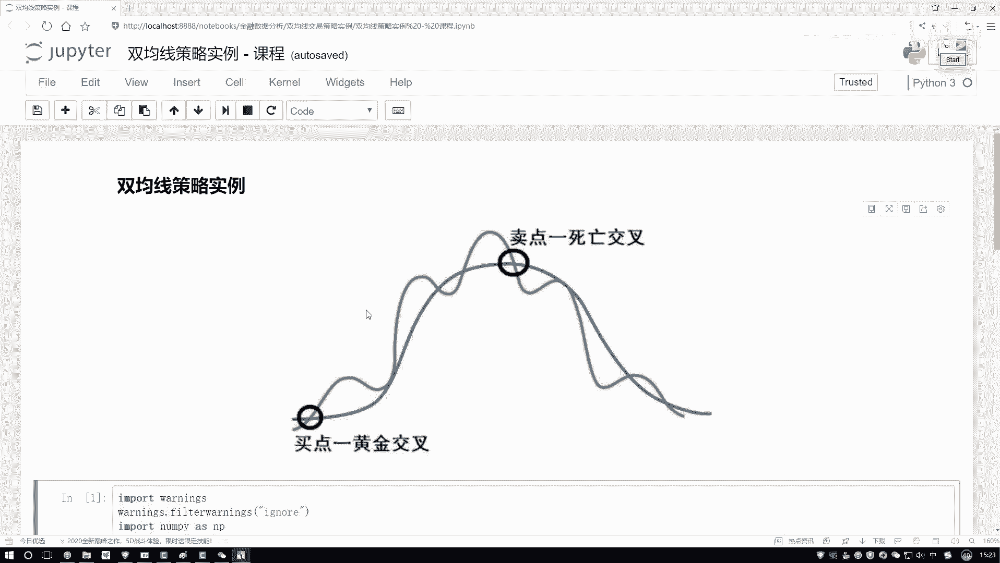
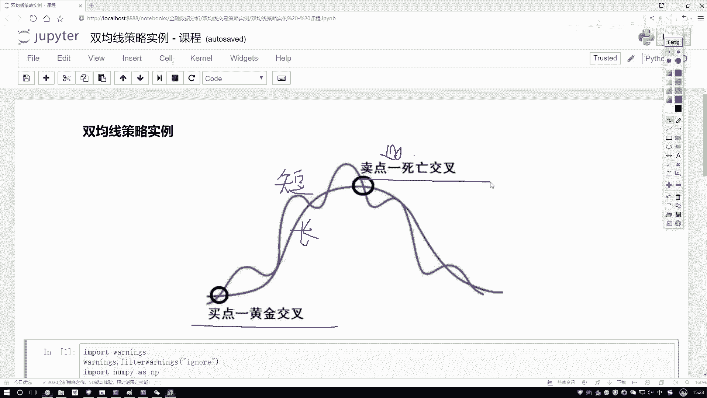
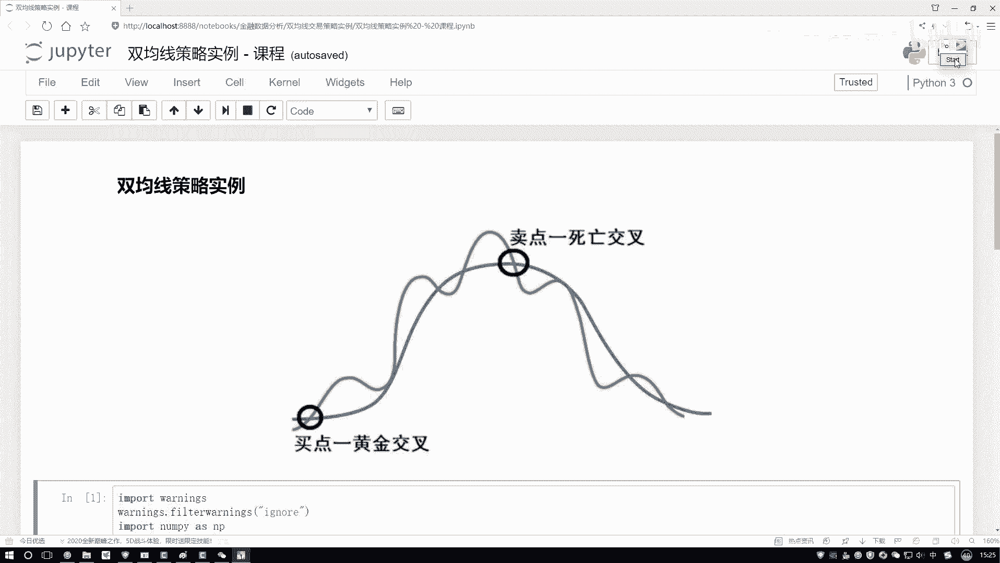
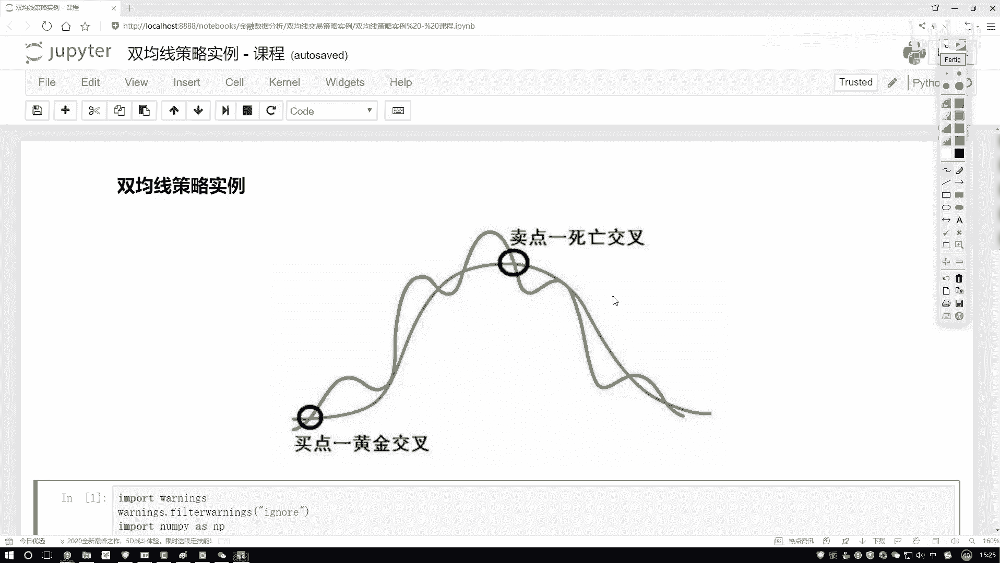
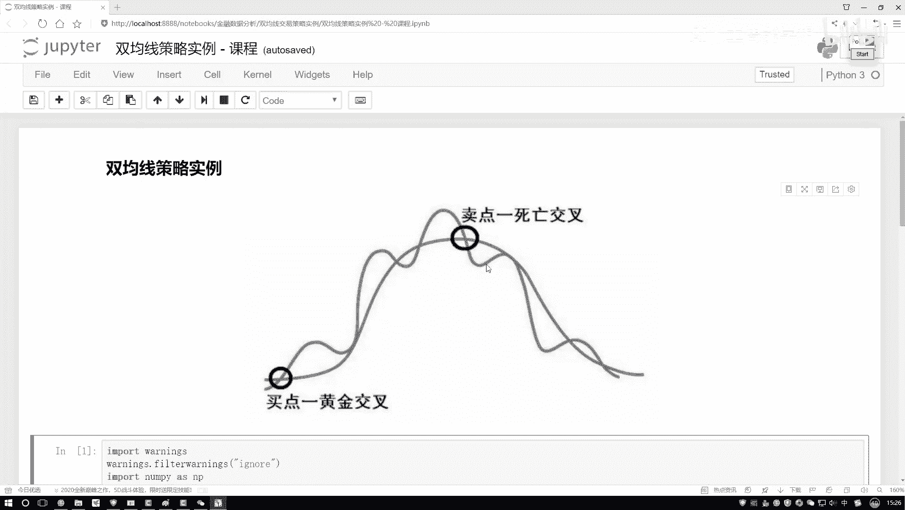

# Python金融量化：P9：双均线交易策略实战-1-金叉与死叉介绍 📈

在本节课中，我们将要学习量化交易中的一个基础且重要的策略——双均线策略。我们将重点理解什么是均线，以及如何通过短期均线与长期均线的交叉点（金叉与死叉）来判断股票的买入和卖出时机。

## 什么是双均线？📊

上一节我们介绍了股票交易数据的基本概念，本节中我们来看看如何从这些数据中提取趋势信息。直接观察每日股价的波动，很难把握整体的趋势变化。为了解决这个问题，我们引入“移动平均线”的概念。

移动平均线通过计算一段时间内股价的平均值，来平滑短期波动，从而更清晰地展示价格趋势。双均线策略，顾名思义，会使用两条不同周期的移动平均线。

*   **短期均线**：计算周期较短，例如5天或10天。它反应了股价近期的变化趋势，对价格波动更敏感。
    *   **公式**：`短期均线值 = 过去N个交易日收盘价之和 / N` （例如 N=5）
*   **长期均线**：计算周期较长，例如20天或60天。它反应了股价中长期的趋势，稳定性更强。
    *   **公式**：`长期均线值 = 过去M个交易日收盘价之和 / M` （例如 M=20）

通过计算并绘制这两条均线，我们就能得到两条描述股票不同周期趋势的曲线。

## 金叉与死叉：交易信号 🚦

在得到短期和长期两条均线后，它们之间的相对位置和交叉关系就成为了我们判断买卖时机的关键。以下是两种核心的交易信号：

**1. 黄金交叉（金叉）- 买入信号**

当短期均线从下方向上穿越长期均线时，形成黄金交叉。这通常意味着近期股价上涨势头强劲，开始超越中长期的平均成本，预示着未来可能有一波上涨行情。因此，金叉被视为一个**买入信号**。

**2. 死亡交叉（死叉）- 卖出信号**

当短期均线从上方向下穿越长期均线时，形成死亡交叉。这通常意味着近期股价下跌压力增大，跌破了中长期的平均支撑位，预示着未来可能进入下跌趋势。因此，死叉被视为一个**卖出信号**。

## 双均线策略的核心逻辑 💡

现在既然我们已经知道了金叉（买点）和死叉（卖点），对于一个股票数据序列，我们就可以设计一个简单的自动化交易策略。

策略逻辑非常简单：
1.  **当出现黄金交叉时**，执行买入操作。
2.  **当出现死亡交叉时**，执行卖出操作。

理论上，如果我们能准确识别每一次交叉信号，并严格执行“低买高卖”的规则，就能在市场中持续获得收益。这个基于均线交叉进行决策的思路，就是双均线交易策略的核心。

## 总结 🎯

本节课中我们一起学习了双均线交易策略的基础知识。我们首先了解了移动平均线如何帮助我们看到股价趋势，然后重点掌握了短期均线与长期均线交叉所形成的关键信号：**黄金交叉（买入信号）** 和 **死亡交叉（卖出信号）**。最后，我们明确了该策略的核心操作逻辑：在金叉时买入，在死叉时卖出。在接下来的实战环节，我们将使用Python来具体实现这一策略，并对历史数据进行回测。