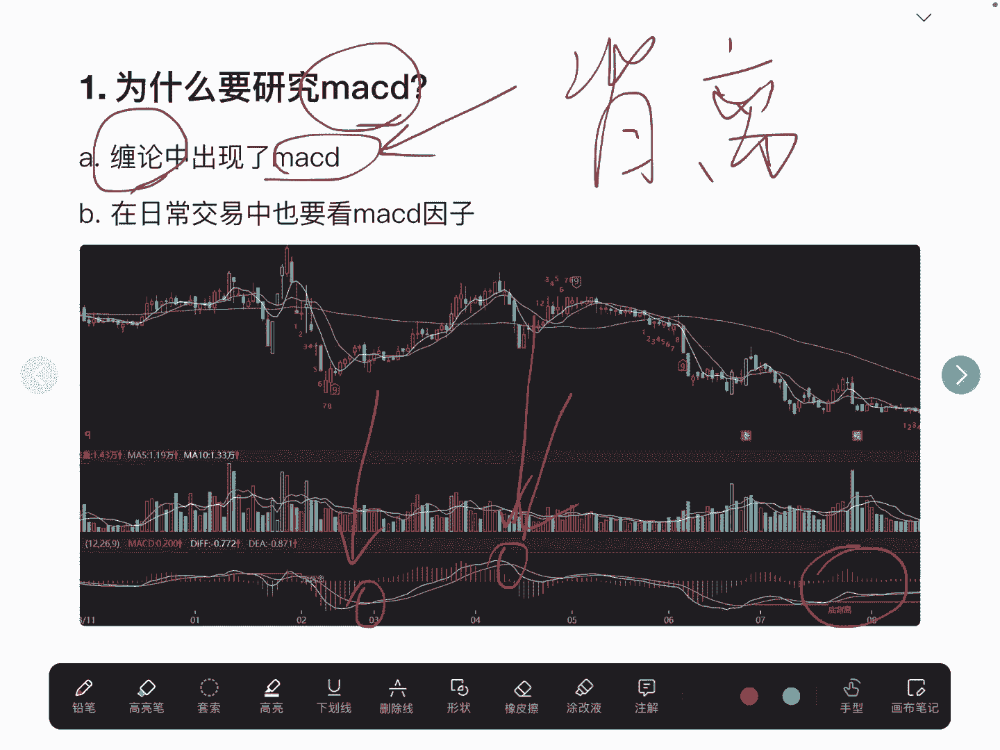
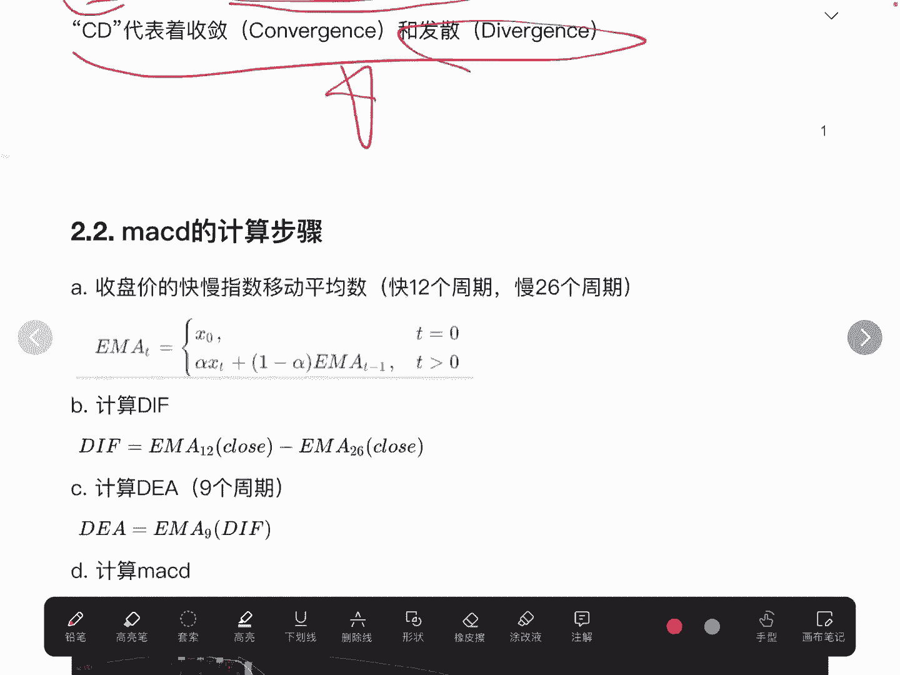
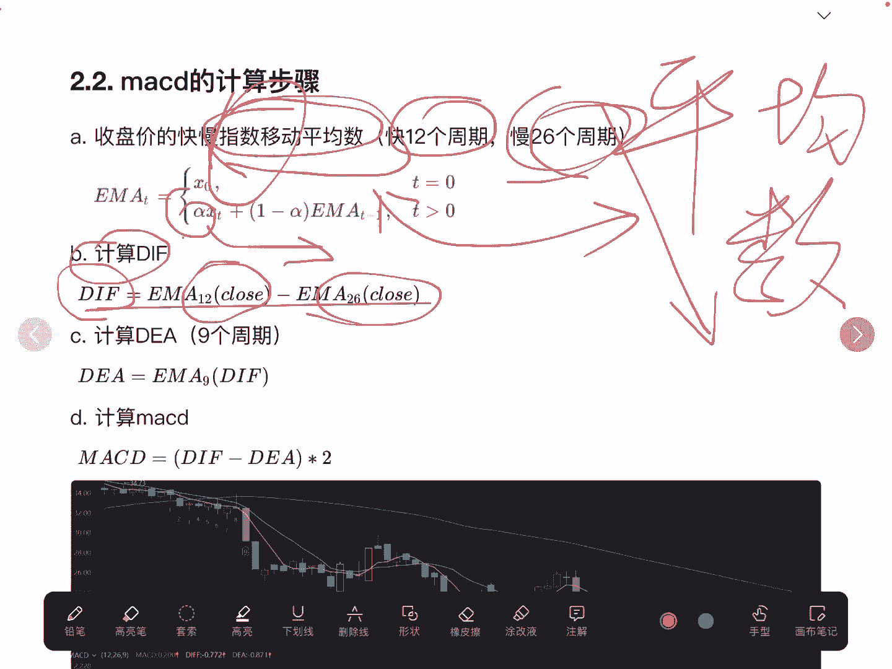
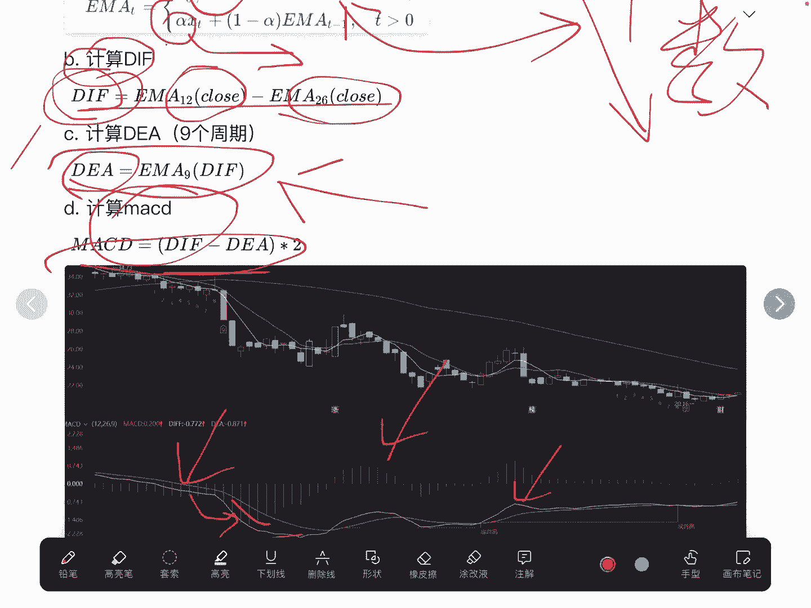
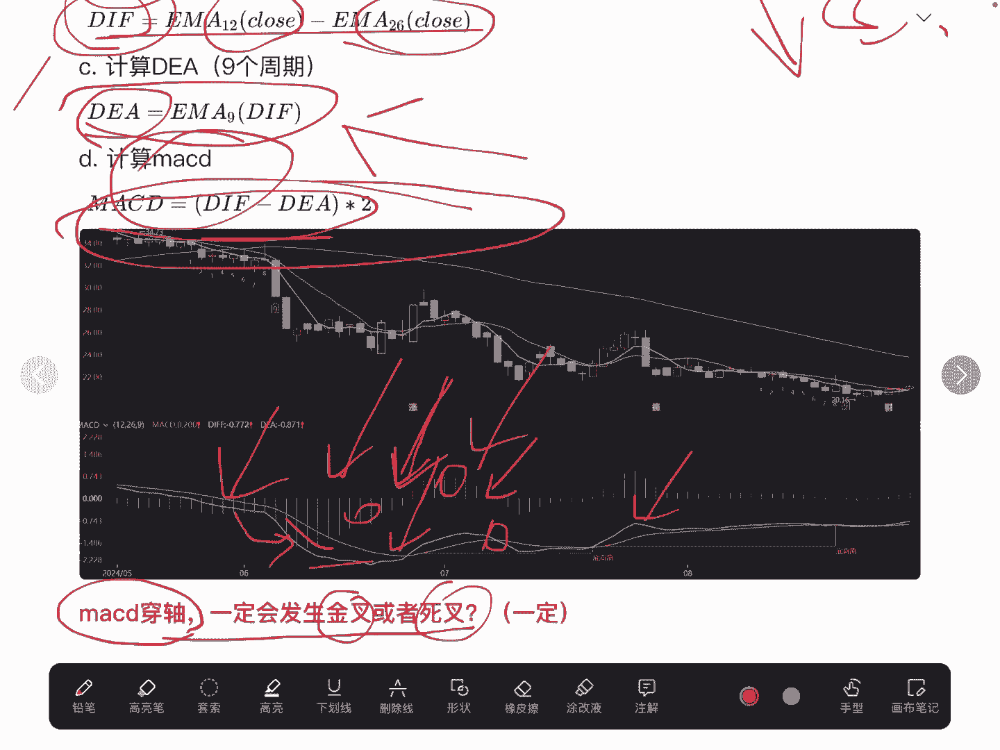
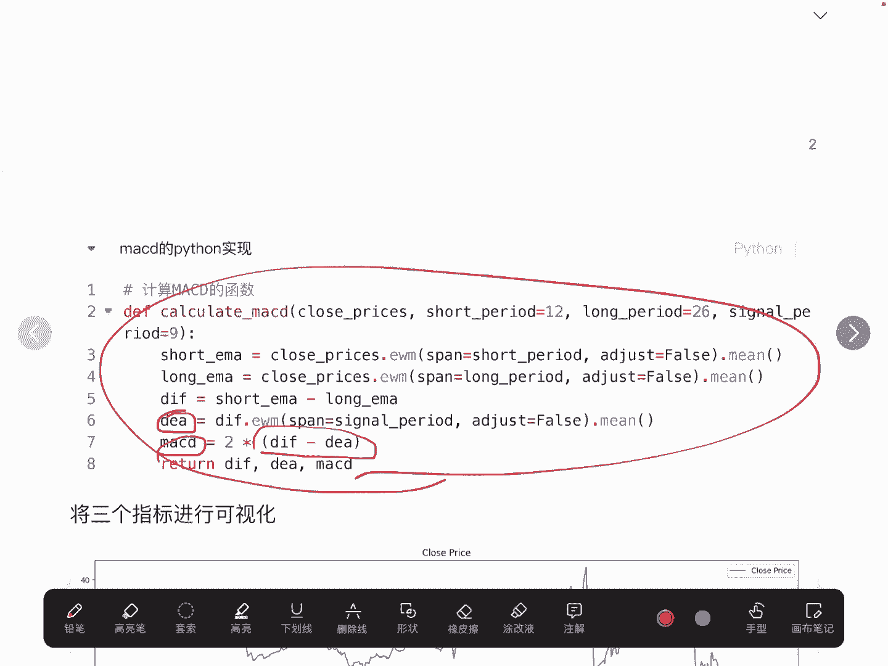
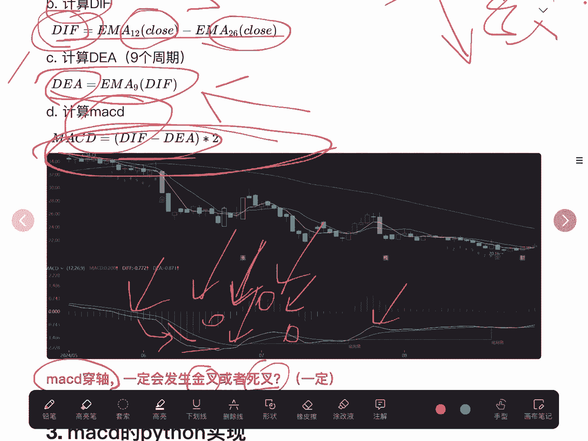
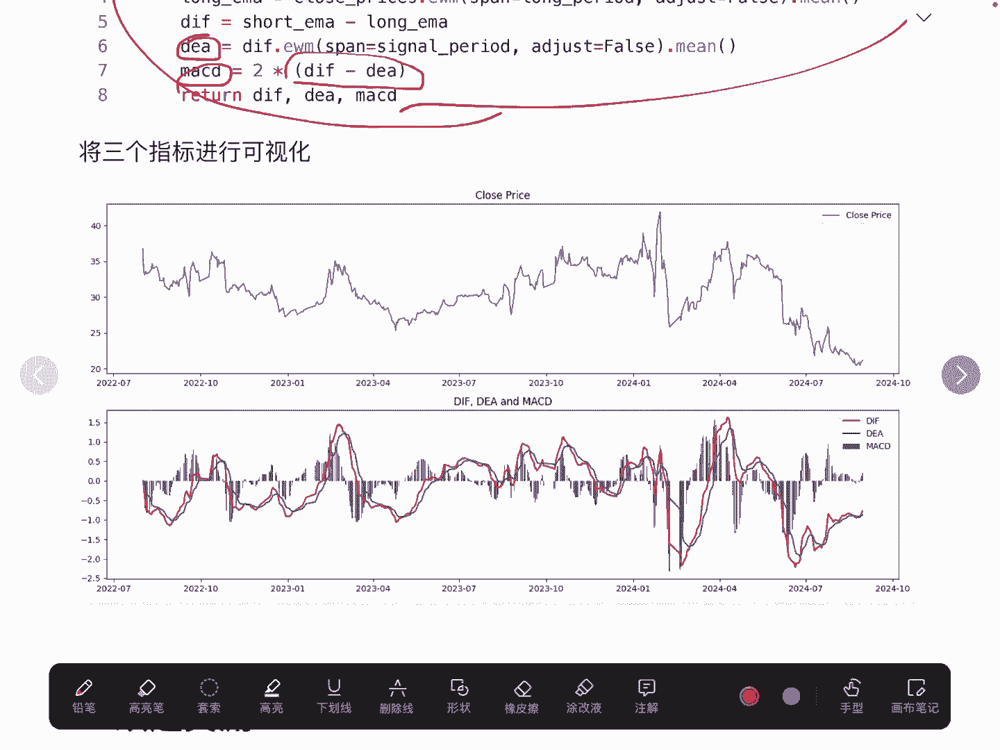
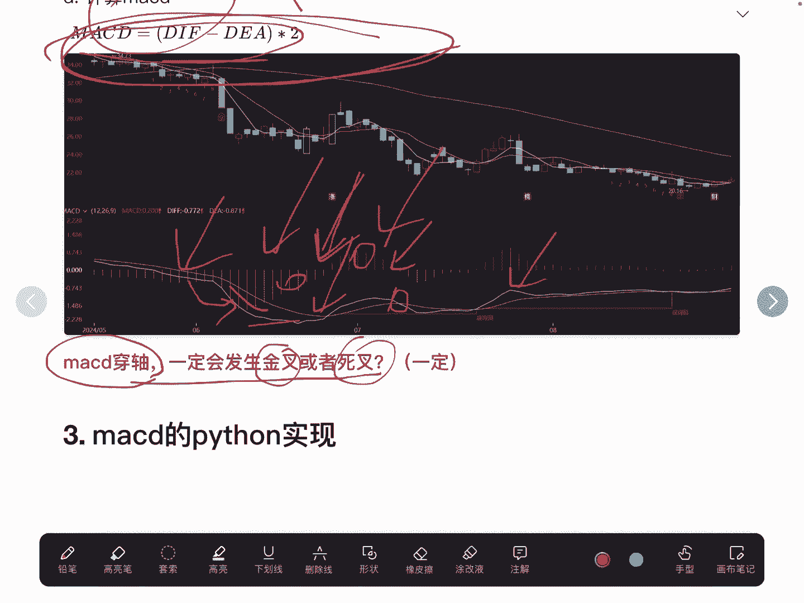

# 量化交易系列：10：深度解读MACD指标与Python复现 📈

在本节课中，我们将要学习MACD技术指标的核心概念、计算逻辑，并使用Python进行复现。MACD是量化交易中常用的趋势跟踪指标，理解其底层原理有助于我们更有效地运用它。


## 概述

MACD指标与移动平均线类似，用于刻画股票的趋势属性。许多交易者会使用MACD的金叉、死叉等简单规则进行交易。然而，为了更深入地理解和应用该指标，我们需要探究其计算方法和底层逻辑。本节我们将解析MACD的定义、计算步骤，并最终用Python代码实现它。

## MACD的定义与计算步骤

上一节我们介绍了学习MACD的目的，本节中我们来看看MACD的具体定义和计算过程。



MACD，全称为Moving Average Convergence Divergence，即指数平滑移动平均线。其计算主要围绕三个核心数值展开：DIF、DEA和MACD柱。



以下是MACD计算的四个核心步骤：

1.  **计算指数移动平均数**：首先需要理解指数移动平均。它与简单移动平均的主要区别在于，指数移动平均会赋予近期价格更高的权重，使得指标对最新价格变化更敏感。公式上，短周期常用12日，长周期常用26日。
    *   **短周期EMA**：`EMA(12)`
    *   **长周期EMA**：`EMA(26)`

2.  **计算DIF值**：DIF是快慢两条指数移动平均线的差值，反映了短期趋势与长期趋势的背离情况。
    *   **公式**：`DIF = EMA(12) - EMA(26)`

3.  **计算DEA值**：DEA是DIF值的移动平均线，通常取9日周期。它对DIF进行平滑处理，形成一条信号线，其波动比DIF线更为平缓。
    *   **公式**：`DEA = EMA(DIF, 9)`

4.  **计算MACD柱**：MACD柱是DIF与DEA差值的放大，通常乘以2，用以直观显示两者之间的乖离程度。
    *   **公式**：`MACD = (DIF - DEA) * 2`

MACD柱在零轴上方为正值，通常用红色表示，代表多头动能；在零轴下方为负值，通常用绿色表示，代表空头动能。



## 一个重要的等价关系

理解了MACD的计算公式后，我们可以思考一个常见问题：MACD柱由负转正（穿轴）与DIF线上穿DEA线（金叉）是否等价？

答案是肯定的，两者是必然的等价关系。根据公式 `MACD = (DIF - DEA) * 2` 可知：
*   当 `MACD > 0` 时，意味着 `DIF - DEA > 0`，即 `DIF > DEA`，这正是金叉状态。
*   当 `MACD < 0` 时，意味着 `DIF - DEA < 0`，即 `DIF < DEA`，这正是死叉状态。

因此，MACD柱穿轴与DIF、DEA的金叉死叉在数学上是同一现象的不同表现形式。



## 使用Python复现MACD指标

理论分析之后，我们进入实战环节，使用Python来复现MACD指标的计算。



以下是使用`pandas`库计算MACD的核心代码步骤：

```python
import pandas as pd

# 假设 df[‘close’] 是股票的收盘价序列
# 1. 计算短周期和长周期的指数移动平均线
ema_short = df[‘close’].ewm(span=12, adjust=False).mean()
ema_long = df[‘close’].ewm(span=26, adjust=False).mean()



# 2. 计算DIF值
df[‘DIF’] = ema_short - ema_long



# 3. 计算DEA值 (对DIF进行9日指数移动平均)
df[‘DEA’] = df[‘DIF’].ewm(span=9, adjust=False).mean()



# 4. 计算MACD柱
df[‘MACD’] = (df[‘DIF’] - df[‘DEA’]) * 2
```

计算完成后，我们可以将结果可视化，与交易软件中的MACD指标进行对比验证。例如，观察特定时间段（如5月至6月）的穿轴或金叉现象，在自编代码生成的图表和软件图表中应呈现一致。



## 总结


本节课中我们一起学习了MACD技术指标。我们从其定义出发，逐步拆解了DIF、DEA和MACD柱的计算公式，并理解了三者之间的数学关系。我们特别论证了“MACD柱穿轴”与“DIF/DEA金叉死叉”的等价性。最后，我们使用Python的`pandas`库完整复现了MACD指标的计算过程。掌握这些底层逻辑，能帮助我们在量化策略中更灵活、更自信地运用MACD指标。