# 量化交易：06：使用qstock获取股票交易数据

在本节课中，我们将学习如何使用Python库`qstock`来获取股票的历史交易数据和实时交易数据。数据是量化交易和机器学习策略的基石，无论是构建训练集还是验证策略，都离不开准确、及时的数据。我们将从安装开始，逐步讲解如何获取单只股票、股票列表以及整个市场的数据。

## 安装与导入

首先，我们需要安装并导入`qstock`库。安装过程非常简单。

```python
pip install qstock
```

安装完成后，在Python脚本中导入该库。

```python
import qstock as qs
```

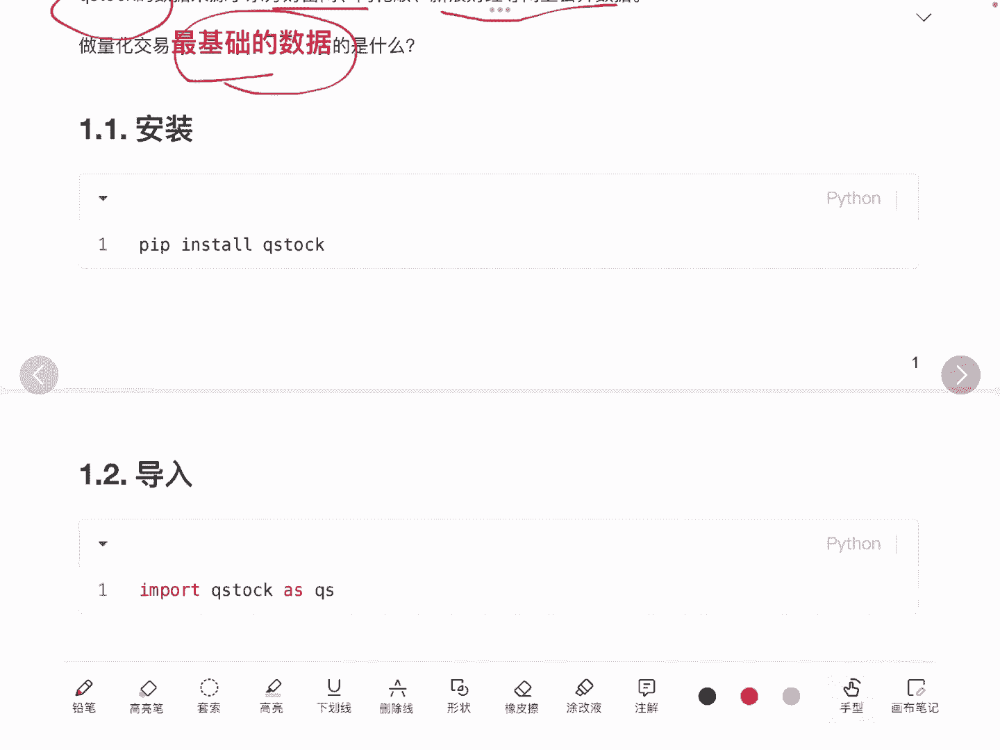

## 获取历史交易数据 📜

上一节我们介绍了`qstock`的基本安装与导入，本节中我们来看看如何获取股票的历史交易数据。这对于构建策略的回测数据集至关重要。

获取历史数据主要使用`get_data`函数。我们需要指定股票代码（或名称）、数据的开始日期和结束日期。

以下是`get_data`函数的基本用法示例：

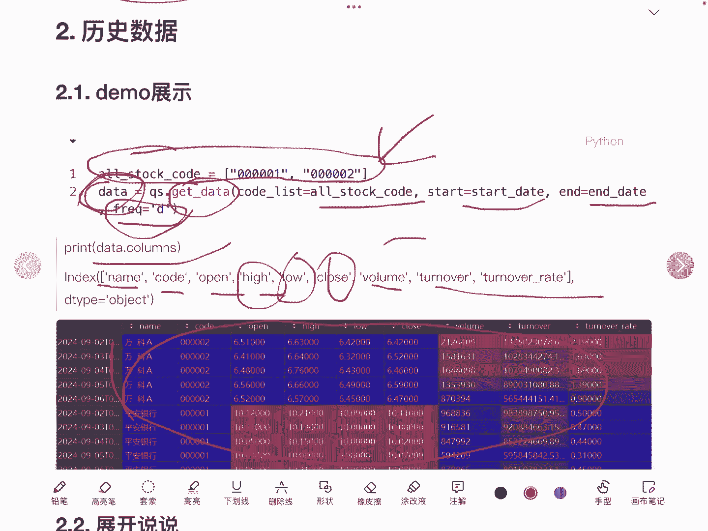

```python
# 定义股票代码列表和日期范围
stock_codes = ['000001', '000858']
start_date = '2023-01-01'
end_date = '2023-12-31'

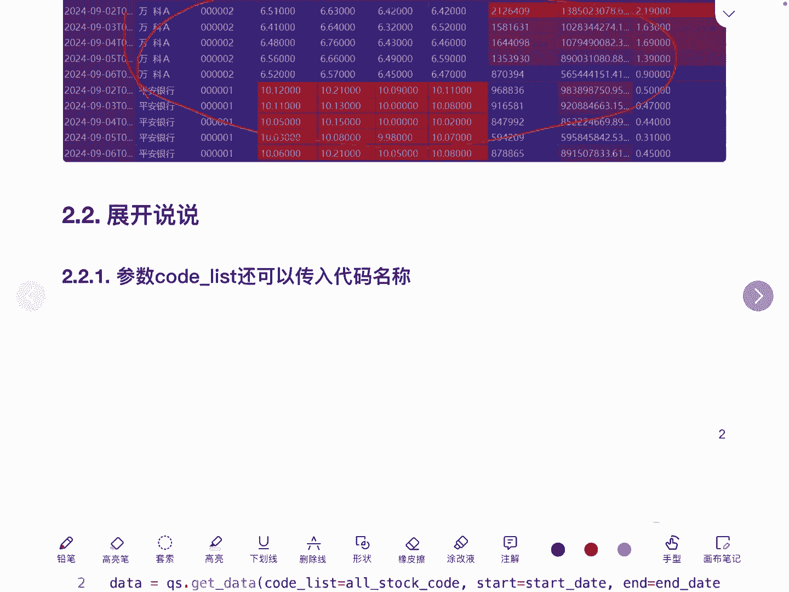

# 获取历史数据
df_history = qs.get_data(stock_codes, start=start_date, end=end_date)
print(df_history.head())
```

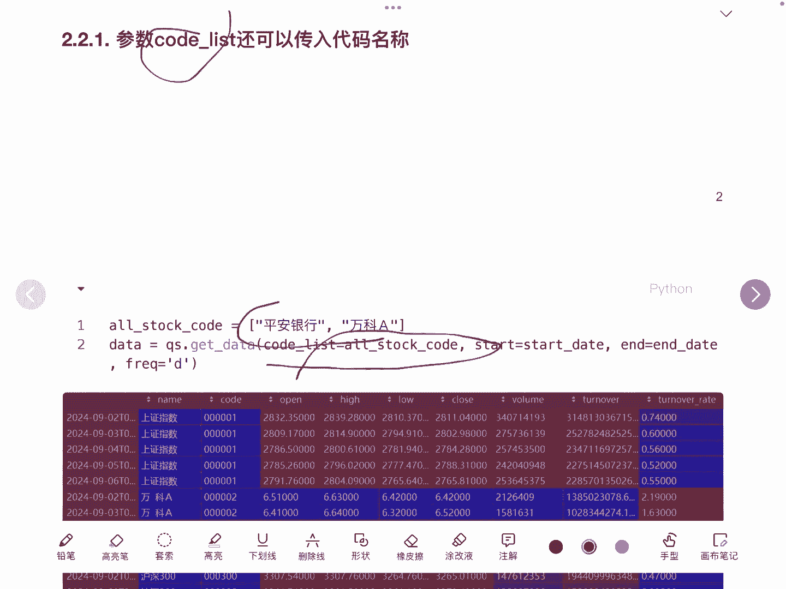

执行上述代码后，将得到一个`DataFrame`，包含以下列：股票名称、股票代码、开盘价、收盘价、最高价、最低价、成交量、换手率等。这些数据构成了我们分析的基础。

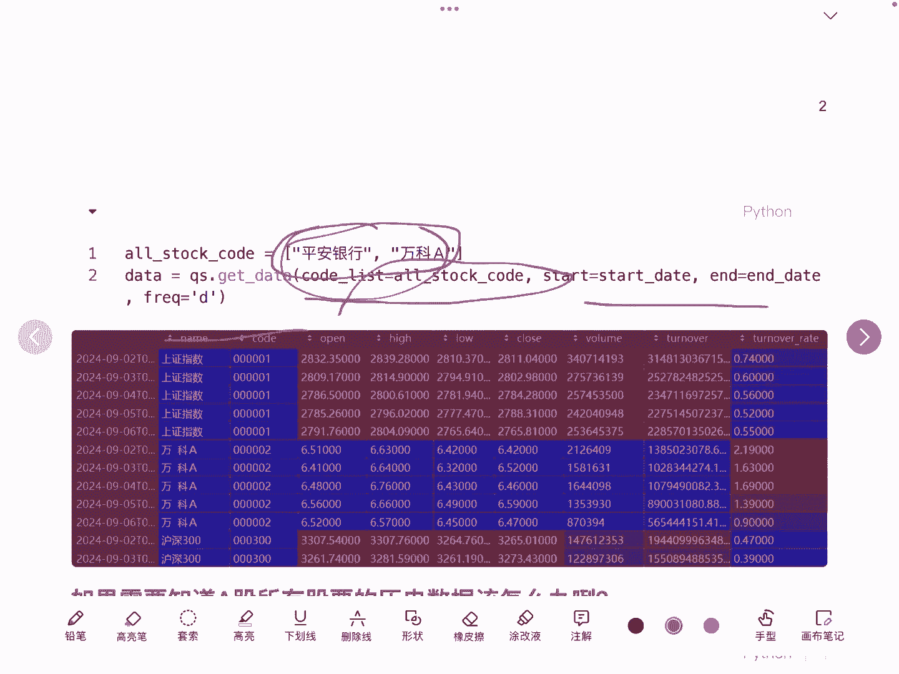

关于`get_data`函数，有几点需要说明：

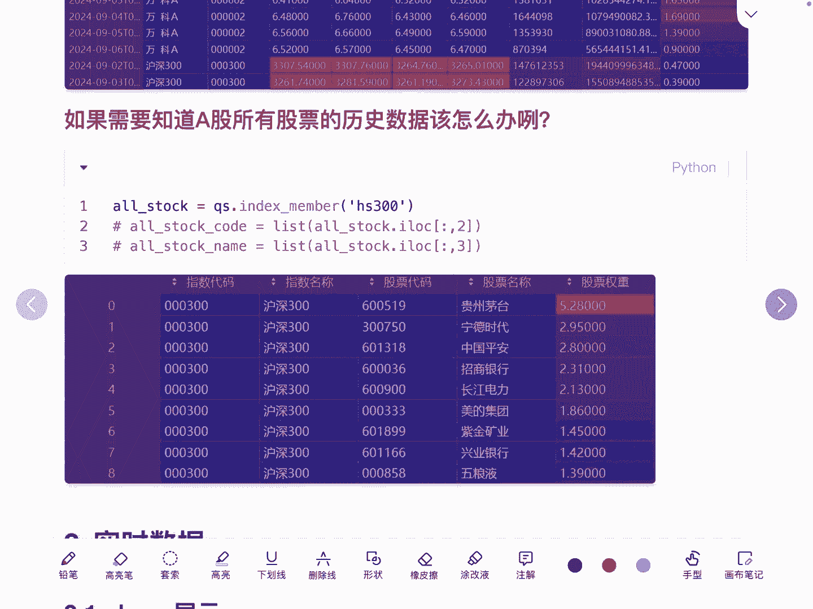

1.  **参数`code_list`**：该参数不仅可以传入股票代码列表，也可以传入股票名称列表，函数能够自动识别。
2.  **获取多只股票数据**：当传入一个股票代码列表时，函数会一次性获取所有这些股票的历史数据，并整合到一个`DataFrame`中。

## 获取股票列表候选集 📋

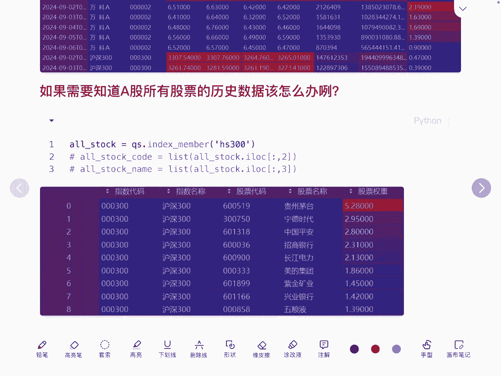

在量化交易中，选股是一个关键环节。我们常常需要基于全市场（如A股所有股票）的数据进行筛选。因此，获取一个完整的股票代码列表是第一步。

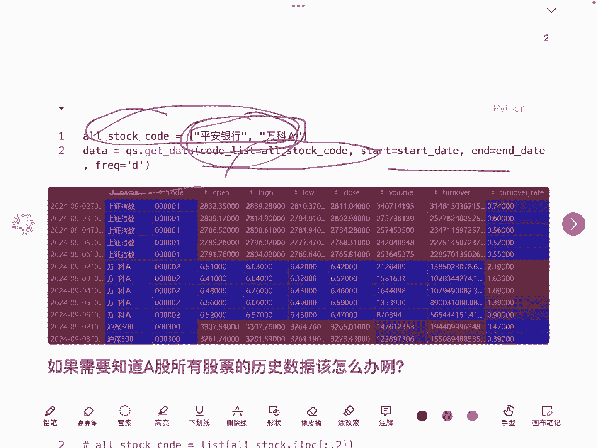

`qstock`提供了一个`index_member`函数，可以获取特定指数（如沪深300）的成分股列表。

以下是获取沪深300成分股代码的示例：

```python
# 获取沪深300指数成分股
hs300_members = qs.index_member('沪深300')
# 提取股票代码（通常位于第二列）
stock_code_list = hs300_members.iloc[:, 1].tolist()
print(f"沪深300成分股数量：{len(stock_code_list)}")
```

通过这种方式，我们获得了沪深300指数包含的300只股票的代码。然后，可以将这个`stock_code_list`传入上一节介绍的`get_data`函数，批量获取这些股票的历史数据。

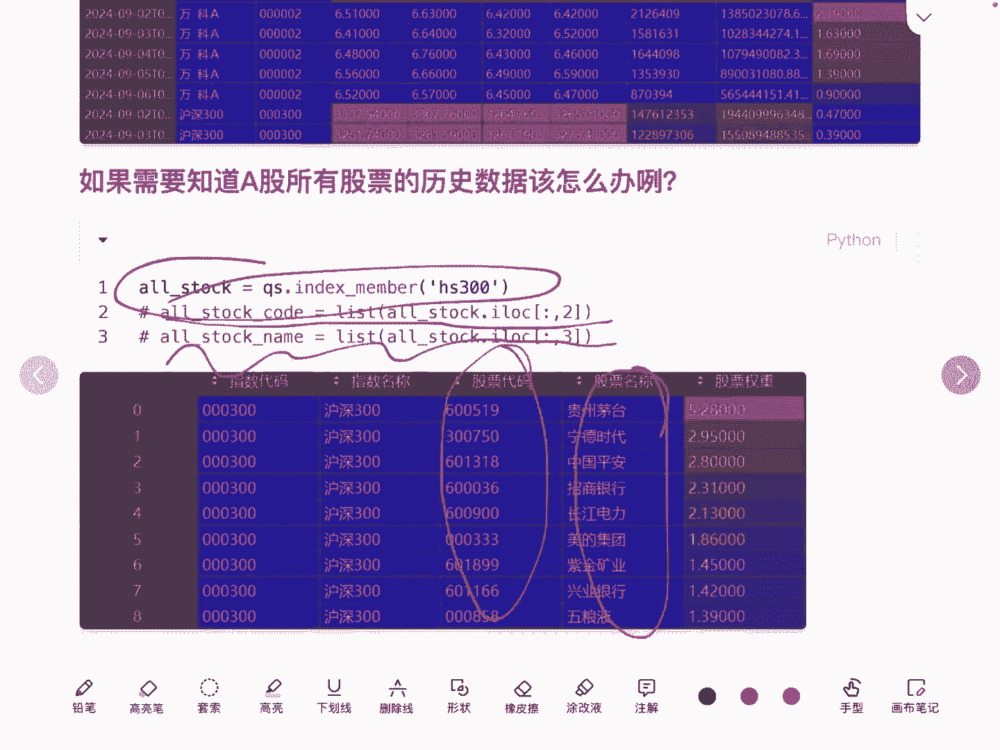

那么，如何获取A股所有股票的代码列表呢？我们将在下一节讲解实时数据时揭晓答案。

## 获取实时交易数据 ⚡

上一节我们探讨了如何获取历史数据，本节中我们来看看如何获取股票的实时交易数据。这对于策略的实时监控和盘中决策非常重要。

获取实时数据主要使用`realtime_data`函数。我们可以通过指定市场或具体的股票代码来获取数据。

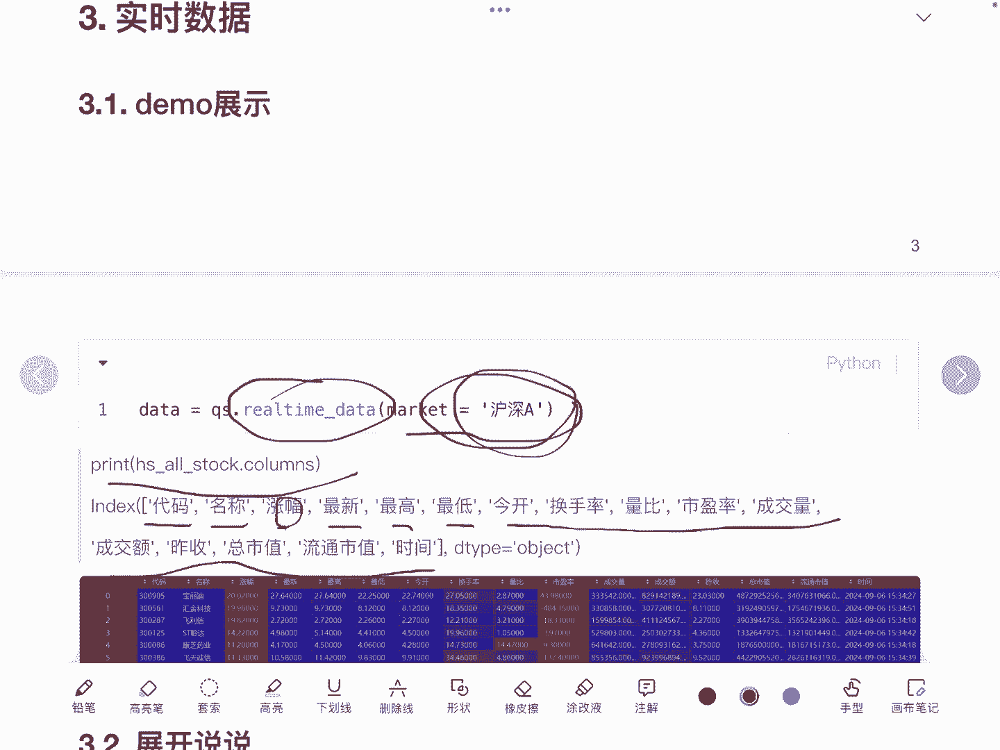

以下是获取整个沪深A股市场实时数据的示例：

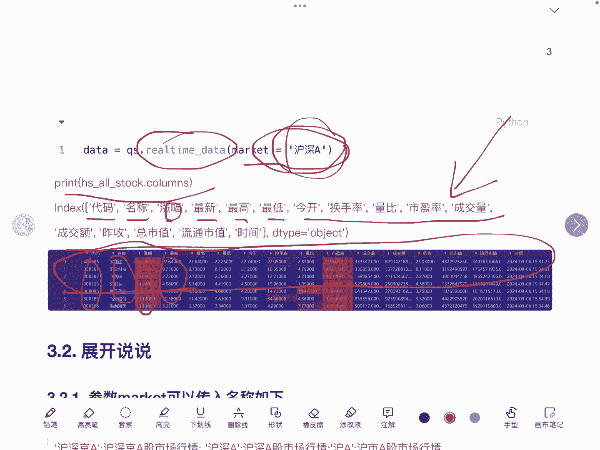

```python
# 获取沪深A股市场所有股票的实时数据
df_realtime = qs.realtime_data('沪深A')
print(df_realtime.head())
```

该函数返回的`DataFrame`包含丰富的实时信息，例如：股票代码、名称、最新价、涨跌幅、开盘价、最高价、最低价、换手率、量比、市盈率、成交量、成交额、总市值、流通市值以及数据更新时间。这些数据与我们在同花顺等交易软件上看到的实时行情基本一致。

关于`realtime_data`函数，有以下重要说明：

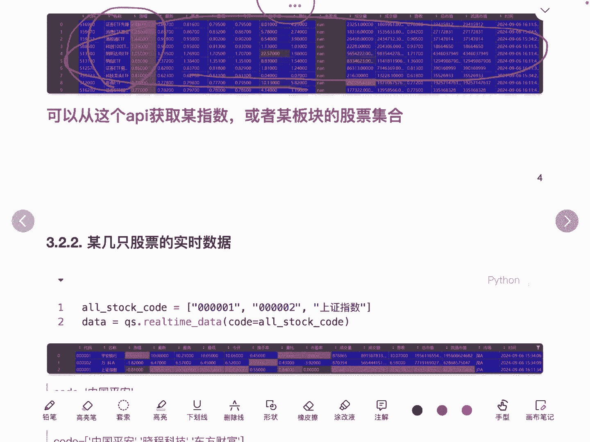

1.  **参数`market`**：该参数用于指定市场，除了`‘沪深A’`，还支持`‘沪A’`、`‘深A’`、`‘港股’`、`‘美股’`、`‘科创板’`、`‘ETF’`、`‘上证指数’`等多种选项，用于获取对应市场的股票集合。
2.  **参数`code`**：该参数用于指定具体的股票代码或指数代码。当传入代码列表时，函数返回这些特定标的的实时数据。

```python
# 获取指定股票的实时数据
specific_stocks = qs.realtime_data(code=['000001', '000002', '000001'])
print(specific_stocks)
```

现在，我们可以回答上一节留下的问题：**如何获取A股所有股票的代码列表？**
答案就是使用`qs.realtime_data(‘沪深A’)`。这个调用返回的`DataFrame`中的`‘代码’`列，就是当前沪深A股所有上市公司的股票代码列表。获取到这个列表后，再结合`get_data`函数，就能批量爬取全市场股票的历史数据了。

## 更多功能 🔍

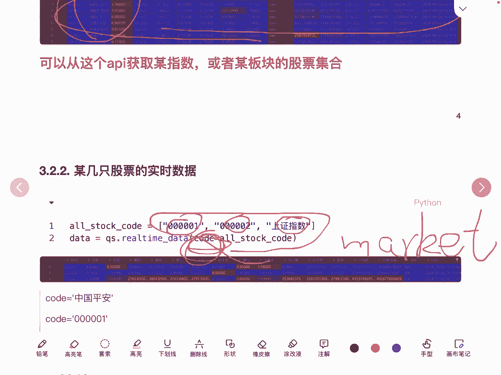

`qstock`库的功能远不止于此，它还可以获取财务指标、个股所属行业与概念板块、宏观经济指标等丰富数据。

有兴趣深入研究的同学，可以访问其GitHub主页查看详细文档和更多用例。

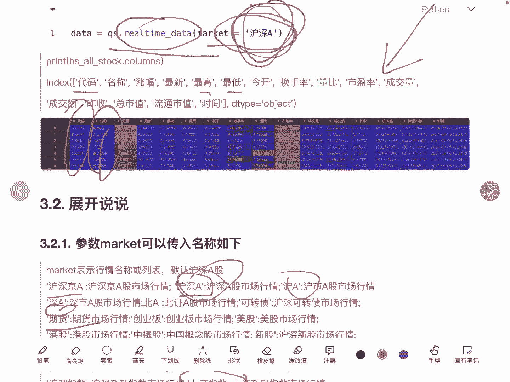

## 总结

本节课中，我们一起学习了使用`qstock`库进行股票交易数据获取的核心技能：

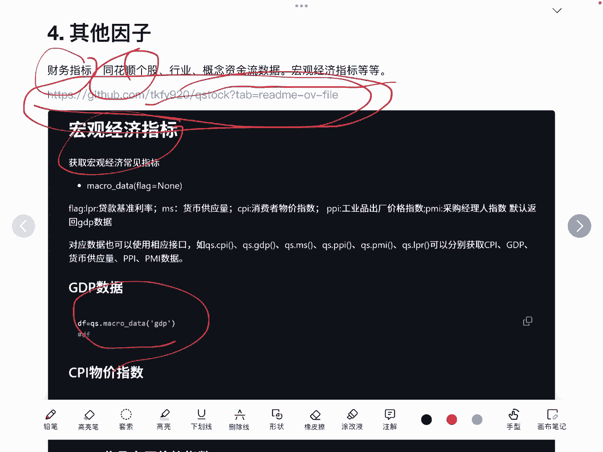

1.  我们使用 **`get_data`** 函数获取了指定股票在特定时间范围内的**历史交易数据**，这是进行回测和策略研究的基础。
2.  我们使用 **`index_member`** 函数获取了特定指数（如沪深300）的**成分股列表**，为批量处理股票数据提供了候选集。
3.  我们使用 **`realtime_data`** 函数获取了**实时交易数据**，并掌握了通过指定市场或股票代码来灵活获取数据的方法。更重要的是，我们了解到可以利用该函数获取全市场股票的代码列表。

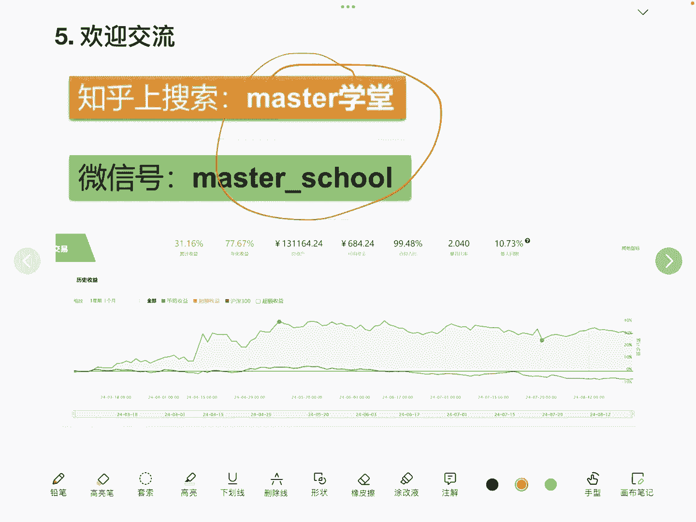

掌握这些数据获取方法，是开启量化交易实战的第一步。接下来，你就可以利用这些数据去构建和验证自己的交易策略了。