# 量化交易：16：凸显性STR因子Python复现教程 📈

在本节课中，我们将学习如何使用Python复现基于收益率的注意力机制——凸显性（STR）因子。我们将从读取数据开始，逐步计算凸显性系数、凸显性权重，最终得到STR因子。

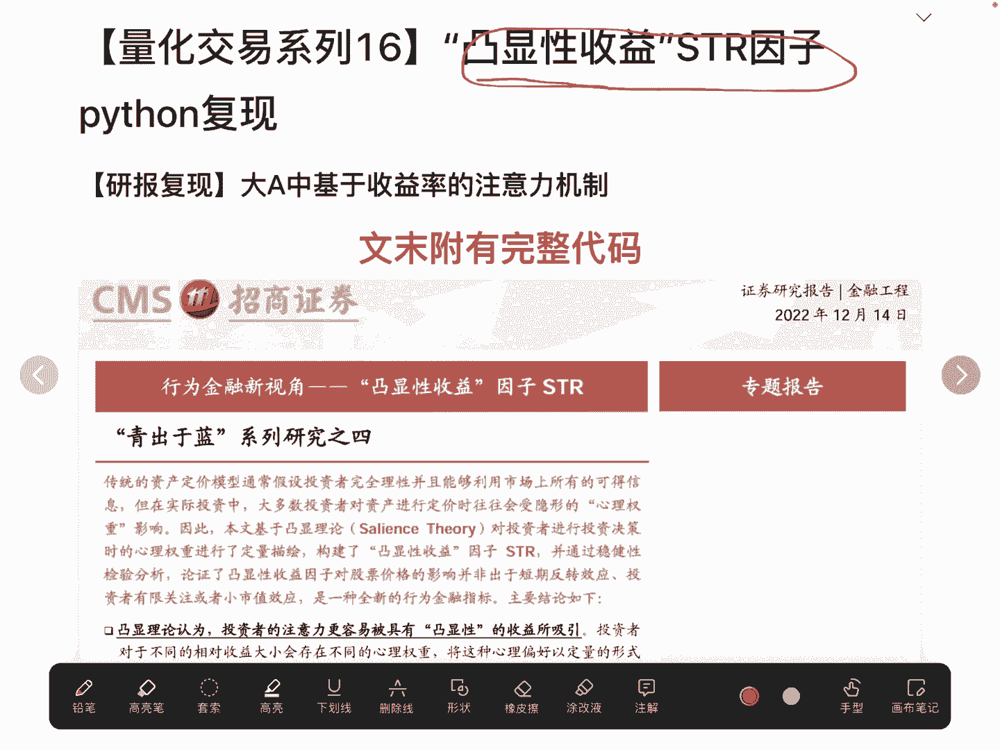

---

## 数据读取与处理

上一节我们介绍了STR因子的计算原理，本节中我们来看看如何准备数据。

首先，我们需要读取原始数据。这里使用微软开放的q lab量化平台进行数据读取。前提是已经将所需数据爬取并存储在本地文件目录中。

初始化完成后，获取数据集中所有股票的代码列表。代码示例如下：
```python
all_code = get_all_stock_codes()  # 假设此函数返回股票代码列表
```

接着，使用特定API读取收盘价数据，并计算每日收益率。收益率计算公式为：
**收益率 = (当日收盘价 / 前一日收盘价) - 1**

计算得到的收益率数据是一个多重索引的DataFrame，索引为时间和股票代码。为了后续计算方便，我们需要将其展开，使时间成为索引，各股票代码成为列名。这可以通过`unstack()`方法实现。

```python
returns_df = original_returns_data.unstack(level=1)
```
展开后，我们得到一个以时间为索引、股票代码为列名的收益率DataFrame。

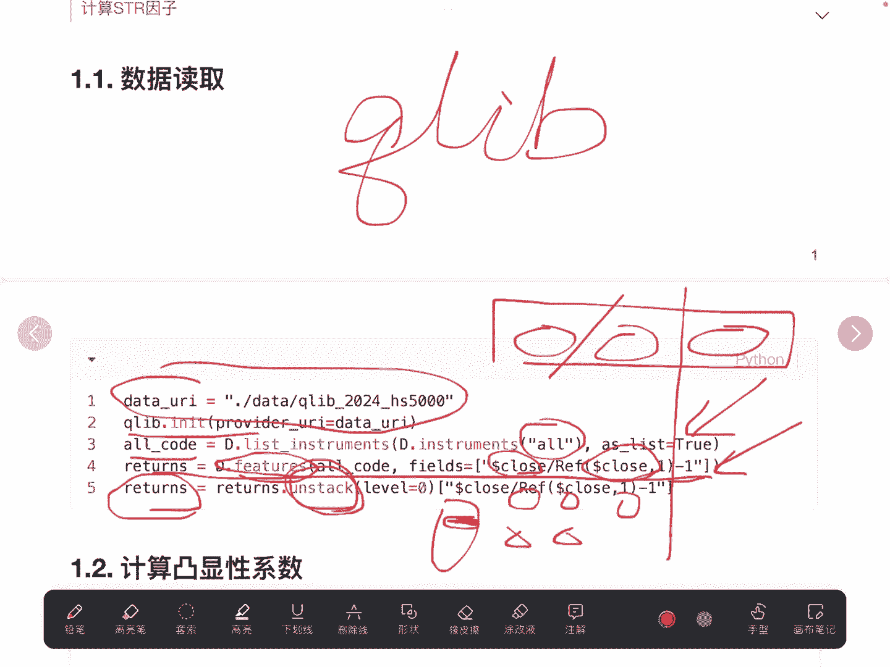

---

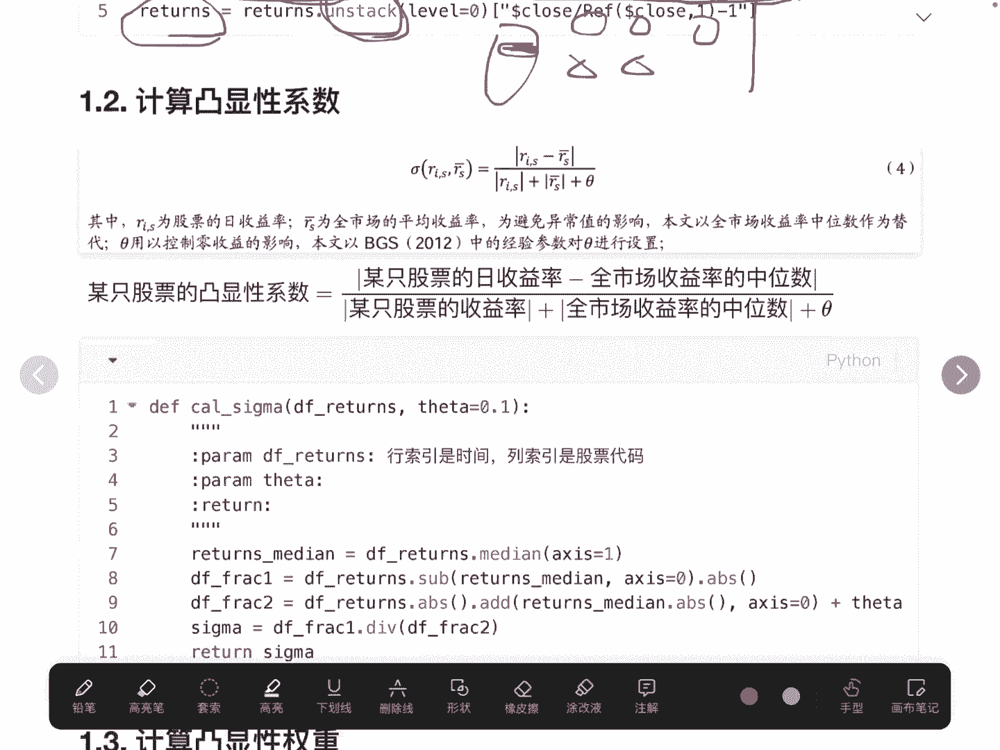

## 计算凸显性系数

在准备好收益率数据后，本节我们来计算凸显性系数。

根据定义，凸显性系数（σ）的计算公式为：
**σ = |r_i - median(r_m)| / (|r_i| + |median(r_m)| + θ)**
其中，`r_i`是单只股票的收益率，`median(r_m)`是当日所有股票收益率的中位数，`θ`是一个经验常数，通常取0.1。

以下是计算步骤：
1.  计算每日所有股票收益率的中位数。
2.  用每只股票的收益率减去当日的中位数，并取绝对值，得到分子。
3.  计算分母：每只股票收益率的绝对值 + 中位数的绝对值 + θ。
4.  将分子除以分母，得到凸显性系数σ。

```python
median_returns = returns_df.median(axis=1)
numerator = (returns_df.sub(median_returns, axis=0)).abs()
denominator = returns_df.abs().add(median_returns.abs(), axis=0).add(theta)
salience_sigma = numerator / denominator
```

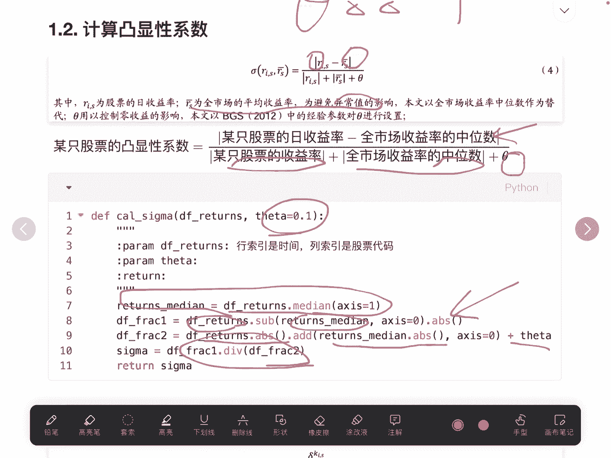

---

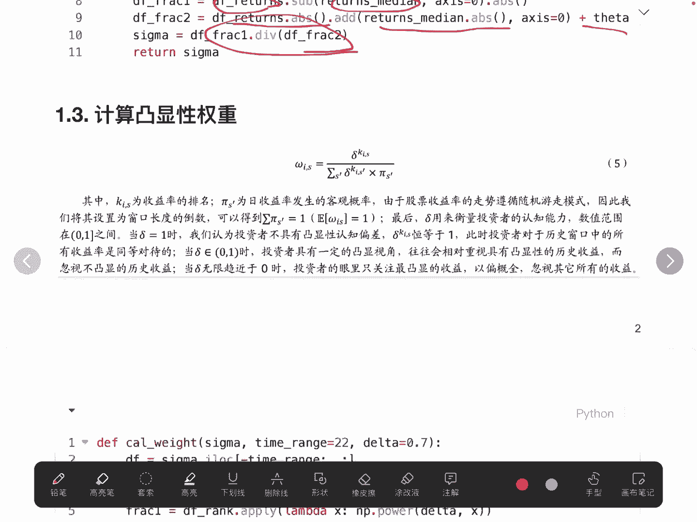

## 计算凸显性权重

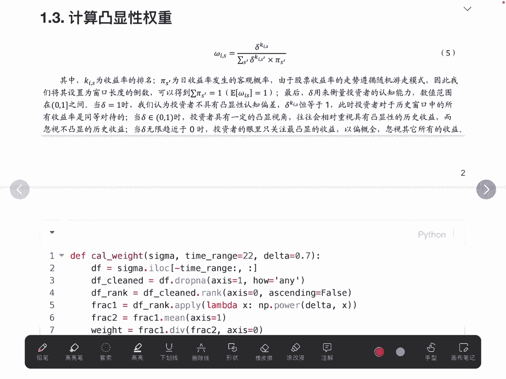

得到凸显性系数后，本节我们基于它来计算凸显性权重。

凸显性权重（w）的计算分为两步。首先，我们需要一个排序值K。K是股票在最近N个交易日（例如22天）内，其凸显性系数σ的排名。排名越高（即σ越大），K值越大。

权重的计算公式为：
**w = (δ^K) / mean(δ^K)**
其中，δ是一个底数（例如0.9），`mean(δ^K)`是当日所有股票`δ^K`值的平均值。

以下是实现步骤：
1.  对每只股票，取其最近22天的σ值序列。
2.  对该序列进行降序排名（排名1为最高值）。
3.  计算分子 `δ^排名`。
4.  计算当日所有股票分子的平均值作为分母。
5.  分子除以分母，得到最终权重。

```python
def calculate_salience_weight(sigma_series, delta=0.9, window=22):
    # 取最近window天的数据
    recent_sigma = sigma_series.iloc[-window:]
    # 降序排名，最高值为1
    rank_series = recent_sigma.rank(ascending=False, method='first')
    # 计算分子
    numerator = delta ** rank_series
    # 计算分母（当日所有股票分子的均值）
    denominator = numerator.mean()
    # 计算权重
    weight = numerator / denominator
    return weight
```
**注意**：排名时需设置参数`ascending=False`，以确保高σ值获得高排名（即小的排名数字，但对应大的K值）。同时，`method='first'`可以处理相同值的情况。

---

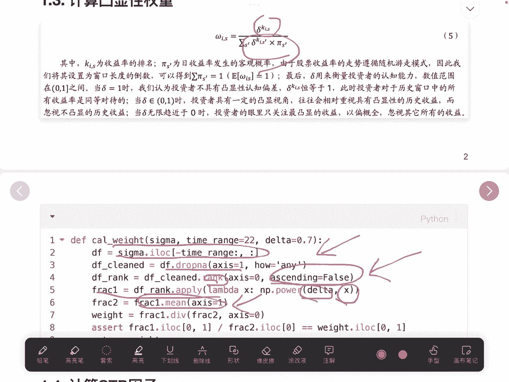

## 计算STR因子

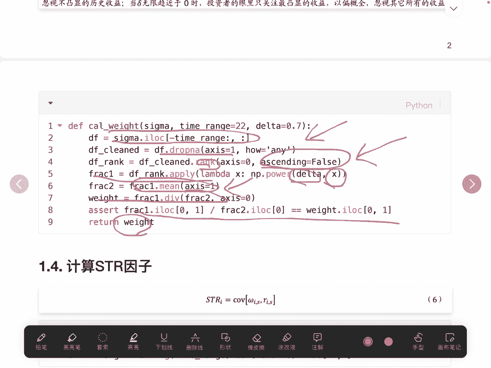

计算出凸显性权重后，最后一步是计算STR因子本身。

STR因子定义为：股票收益率与其凸显性权重在过去一段时间（如22天）内的协方差。公式表示为：
**STR = Cov(r_i, w_i)**

在Pandas中，我们可以使用滚动窗口计算协方差。然而，这里需要注意计算方式。直接对整个权重DataFrame和收益率DataFrame使用`.cov()`方法可能无法得到按股票、按时间滚动计算的结果。

一种可行的方法是，对每只股票分别计算其收益率序列和权重序列在滚动窗口内的协方差。代码示例如下：

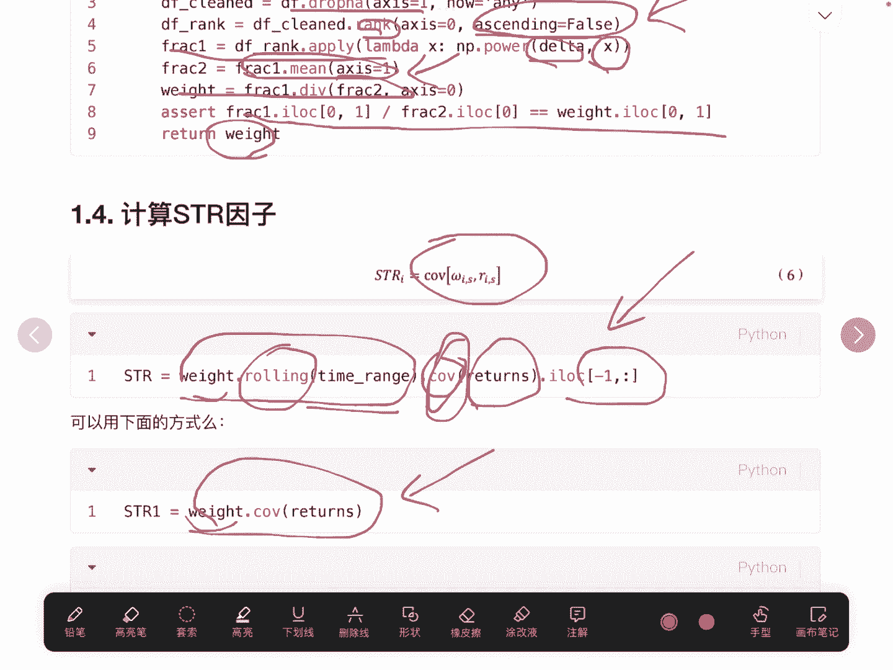

```python
str_factor = pd.DataFrame(index=returns_df.index, columns=returns_df.columns)
window = 22

for stock in returns_df.columns:
    # 获取该股票的收益率序列和权重序列
    stock_returns = returns_df[stock]
    stock_weights = weights_df[stock]  # 假设weights_df是之前计算好的权重DataFrame
    # 计算滚动协方差
    str_factor[stock] = stock_returns.rolling(window=window).cov(stock_weights)
```
另一种尝试——直接使用`DataFrame.cov()`方法或仅取各序列第一列进行计算——可能无法正确实现按时间滚动的个股协方差计算，需要特别注意。

---

## 总结

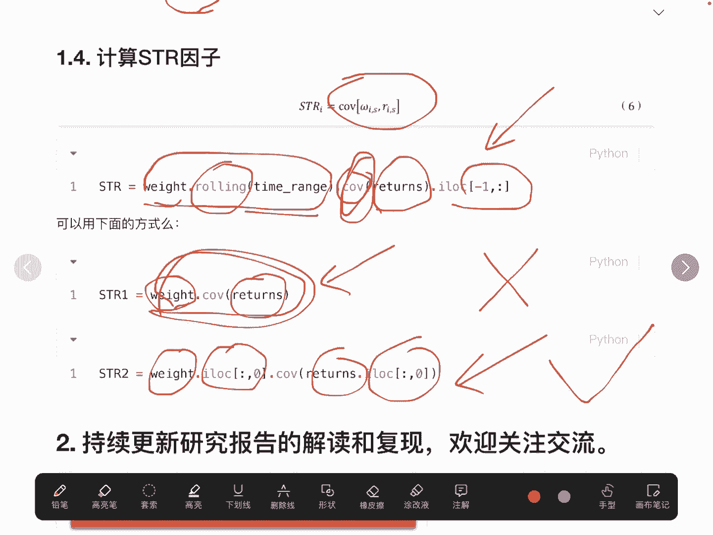

本节课中，我们一起学习了STR因子的完整Python复现流程。

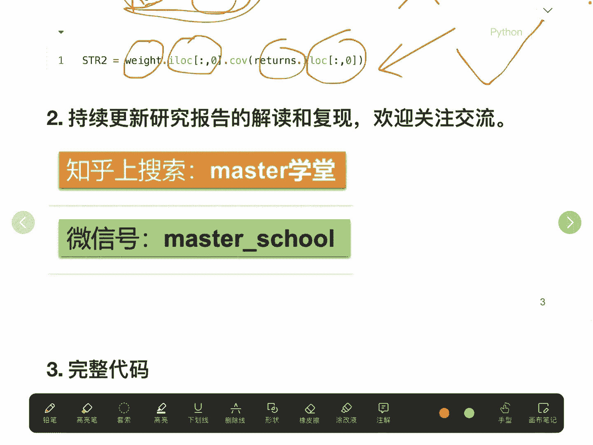

1.  **数据准备**：读取数据并计算得到格式规整的日收益率DataFrame。
2.  **计算凸显性系数（σ）**：基于个股收益率与市场收益率中位数的偏离程度进行计算。
3.  **计算凸显性权重（w）**：根据σ的排名，通过指数运算和标准化得到注意力权重。
4.  **计算STR因子**：最终通过计算收益率序列与权重序列的滚动协方差得到STR因子值。

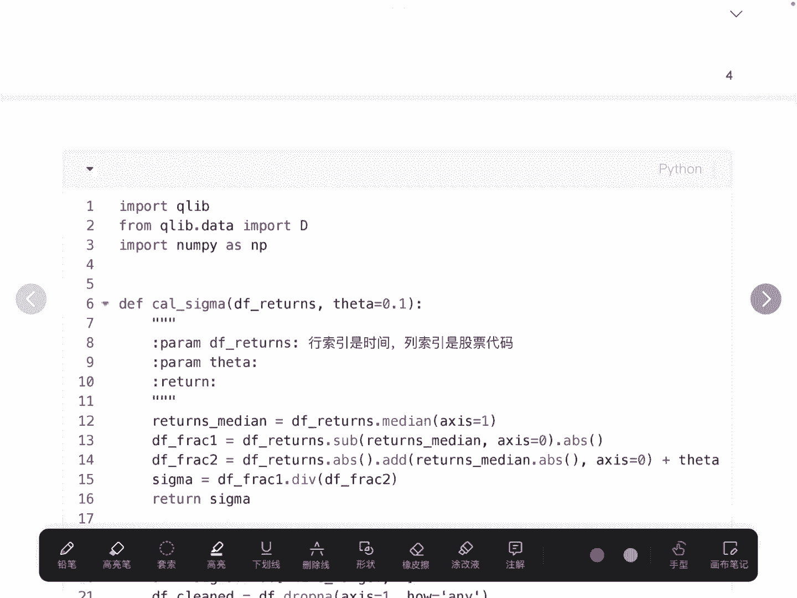

这个过程将市场注意力机制量化成了一个可用于选股的因子。希望本教程能帮助你理解并实现这一策略。文末附有完整的代码框架供参考和实践。