# 量化交易研报复现：第1章：分层实验实现方法 📊

在本节课中，我们将学习如何为量化因子进行分层实验。分层实验是评估因子有效性的关键步骤，它通过将股票按因子值分组，观察不同组别的收益差异，来判断因子与未来收益是否存在线性或单调关系。

上一节我们介绍了惊恐因子的基本概念与计算方法，本节中我们来看看如何基于计算出的因子进行分层实验，以验证其预测能力。

## 因子回顾与实验目标

首先，我们简单回顾一下将要使用的三个因子：
1.  **惊恐收益因子**：基于“惊恐度”与股票收益率序列计算其均值。
    *   **惊恐度计算公式**：`惊恐度 = (股票日收益率 - 市场平均收益率) / (|股票日收益率| + 市场收益率水平)`
    *   **惊恐收益因子**：`惊恐收益因子 = mean(惊恐度 * 股票收益率)`
2.  **惊恐波动因子**：计算`惊恐度 * 股票收益率`序列的标准差。
    *   **公式**：`惊恐波动因子 = std(惊恐度 * 股票收益率)`
3.  **原始惊恐因子**：上述两个因子的等权求和。
    *   **公式**：`原始惊恐因子 = 0.5 * 惊恐收益因子 + 0.5 * 惊恐波动因子`

今天，我们将使用这三个因子，分别进行分层实验，观察它们在不同分组的股票上的表现差异。

## 实验步骤详解

以下是实现分层实验的核心步骤，我们将逐步拆解。

### 第一步：数据准备与收益率计算

实验的第一步是准备基础数据。我们假设股票日线数据已按之前教程的方法完成本地存储。

```python
# 初始化Qlib环境
import qlib
qlib.init(...)

# 获取所有股票池
instruments = D.instruments(market='all')

# 获取收盘价数据，并计算日收益率
# 收益率 = (今日收盘价 / 昨日收盘价) - 1
close_df = D.features(instruments, ['$close'], start_time='...', end_time='...')
returns_df = close_df['$close'].unstack().pct_change().shift(-1)  # 使用未来一期收益率作为标签
```
此步骤得到的数据框，行索引为日期，列索引为股票代码，值为该股票在对应日期的未来一期收益率。

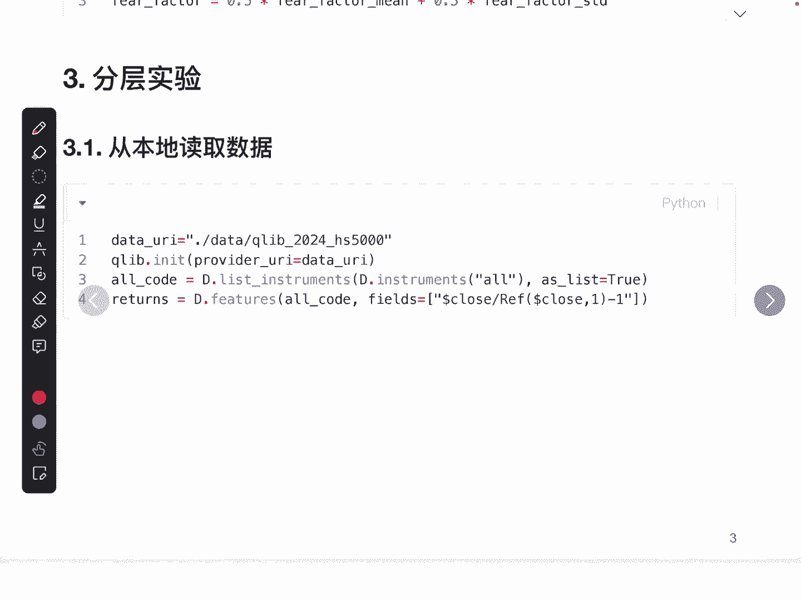

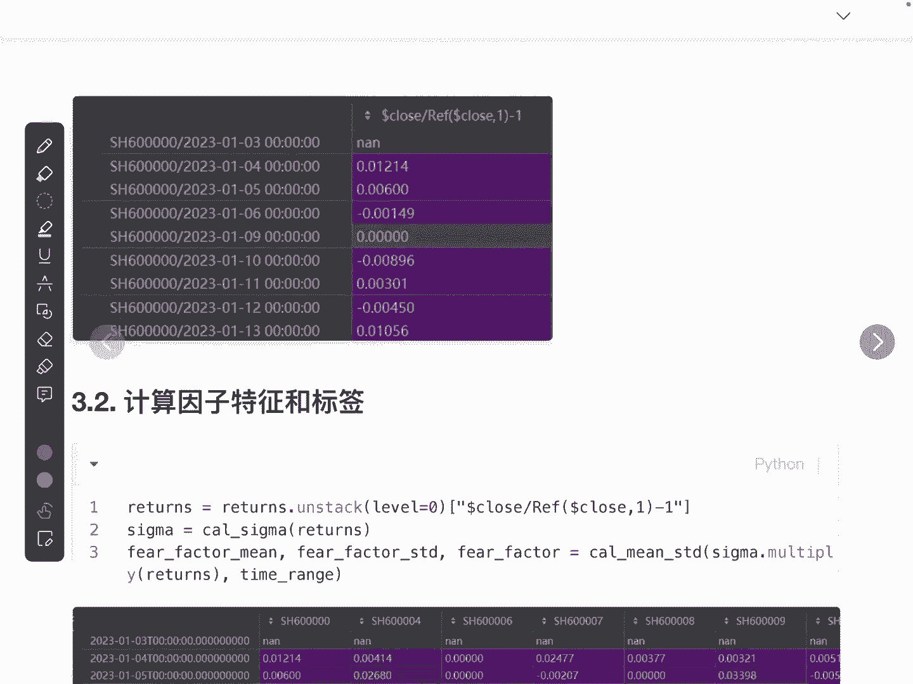

### 第二步：计算因子特征与标签

接下来，我们需要计算每个股票在每个交易日的因子值（特征）以及对应的未来收益率（标签）。

1.  **展开收益率数据**：将多层索引的数据转换为以日期为索引、股票为列的形式，便于后续向量化计算。
2.  **计算市场收益率水平**：通常使用所有股票收益率的中位数。
    ```python
    market_return = returns_df.median(axis=1)  # 每日的市场收益率水平（中位数）
    ```
3.  **计算惊恐度**：根据公式，对每个股票每日进行计算。
    ```python
    # 假设 stock_return 是单只股票的收益率序列
    fear_degree = (stock_return - market_return) / (abs(stock_return) + market_return.abs())
    ```
4.  **计算三个因子**：基于惊恐度序列，计算惊恐收益因子、惊恐波动因子及原始惊恐因子。
5.  **构建标签**：使用已经计算好的未来一期收益率 `returns_df` 作为标签。

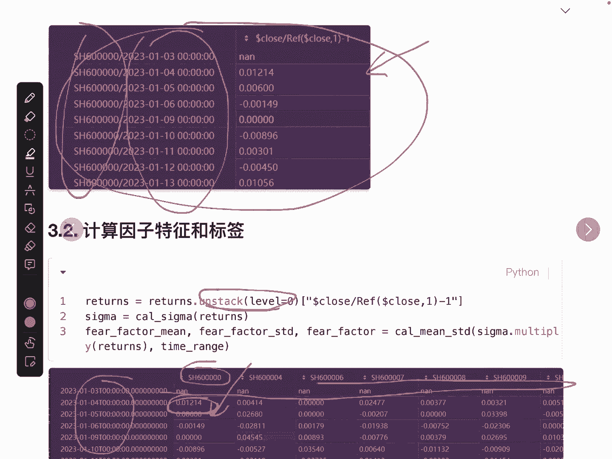

完成此步骤后，我们将得到一个包含`日期 x 股票`的因子特征矩阵和对应的标签矩阵。

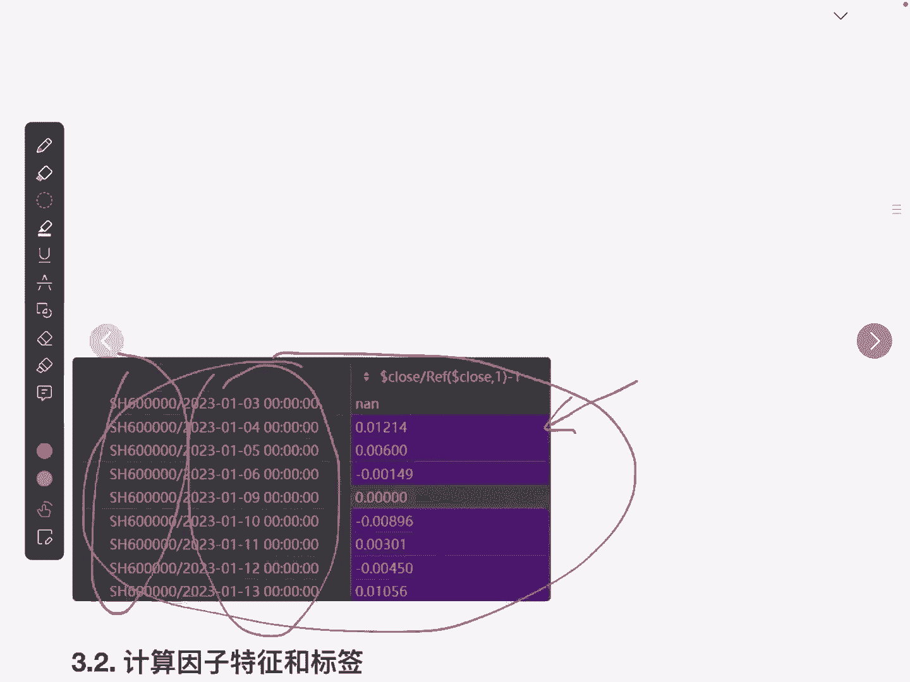

### 第三步：按因子值进行分桶

这是分层实验的核心。对于每一个交易日，我们将所有股票根据**当日**的某个因子值（如惊恐收益因子）从小到大排序，并平均分成N个组（例如5组，即5层）。

以下是实现分桶的关键步骤：
*   **输入**：某个因子在**所有股票所有日期**上的值（一个DataFrame）。
*   **处理**：对**每一天**的数据独立操作，根据当天的因子值排序并分组。
*   **输出**：一个与输入形状相同的DataFrame，但其值不是因子值，而是股票在该日期所属的**组别编号**（如1，2，3，4，5）。

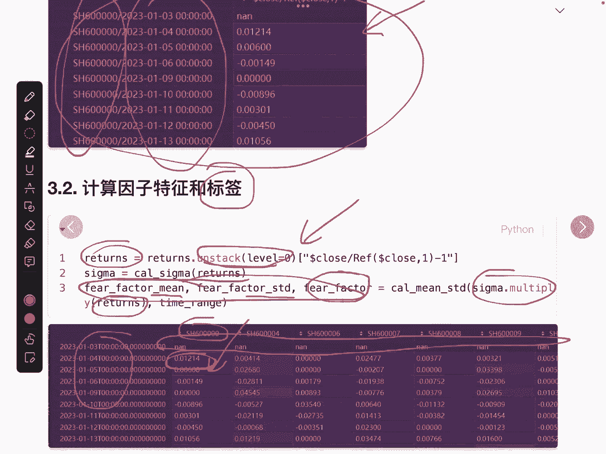

```python
import alphalens as al

# 假设 factor_data 是惊恐收益因子矩阵（日期为索引，股票为列）
# labels 是对应的收益率标签矩阵
factor_data = ... # 形状为 (日期数, 股票数)
labels = ...      # 形状与 factor_data 相同

# 使用Alphalens库的get_clean_factor_and_forward_returns函数进行分桶和标签对齐
factor_data_clean, forward_returns = al.utils.get_clean_factor_and_forward_returns(
    factor=factor_data.stack(),  # 需要转换为多层索引序列
    prices=... , # 用于计算收益率的价格数据，这里我们直接使用标签
    periods=(1,), # 观测未来1期的收益
    quantiles=5,  # 分为5层
    bins=None,
    groupby=None,
    by_group=False
)
```
该函数会返回清理后的因子数据和分桶信息。

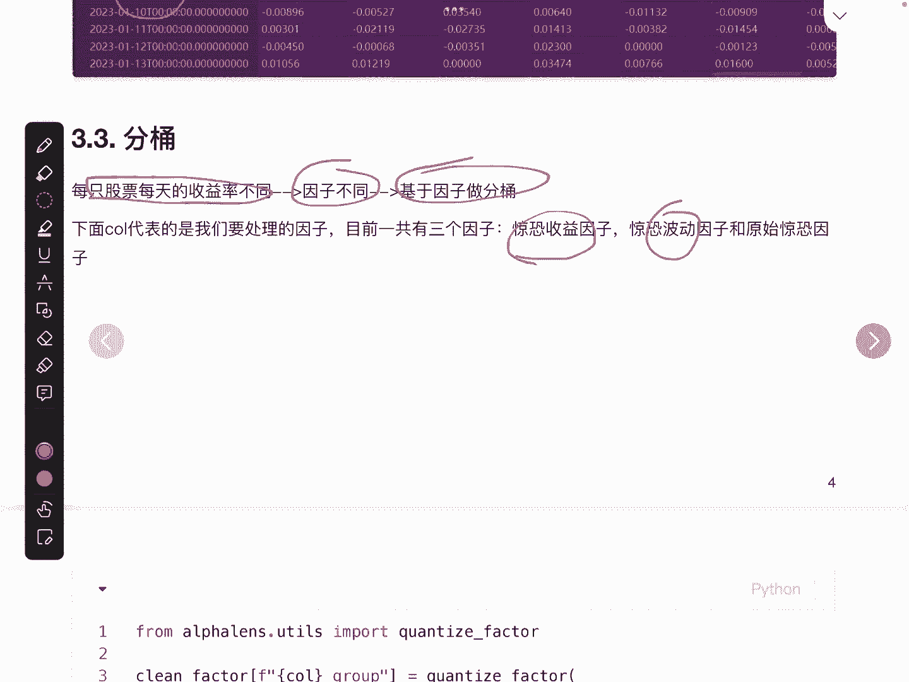

### 第四步：计算各分桶的收益

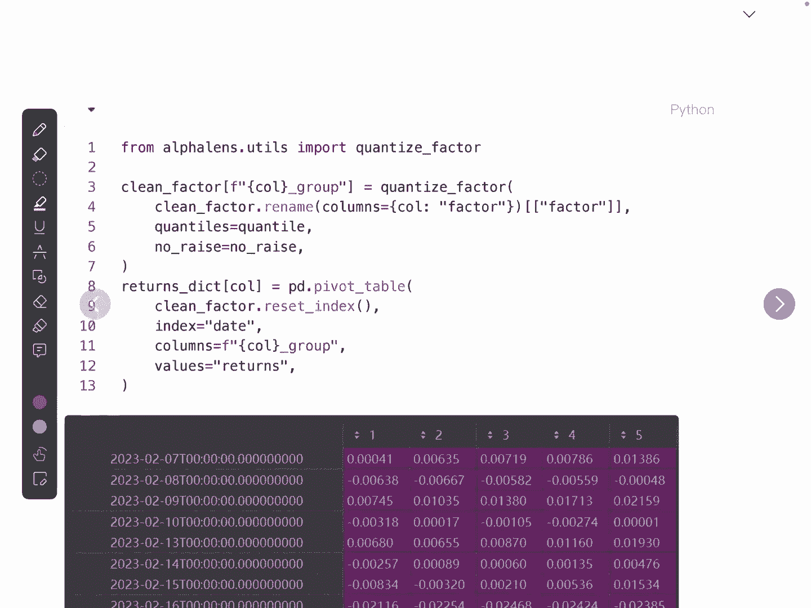

得到分桶标签后，我们需要计算每个交易日、每一个桶内所有股票的平均收益率。

计算逻辑如下：
1.  对于交易日T，找出被标记为“第1组”的所有股票。
2.  计算这些股票在交易日T的**标签收益率**（即未来一期收益）的均值。这个均值就是“第1组”在交易日T的组收益。
3.  对所有交易日和所有组别重复此过程。

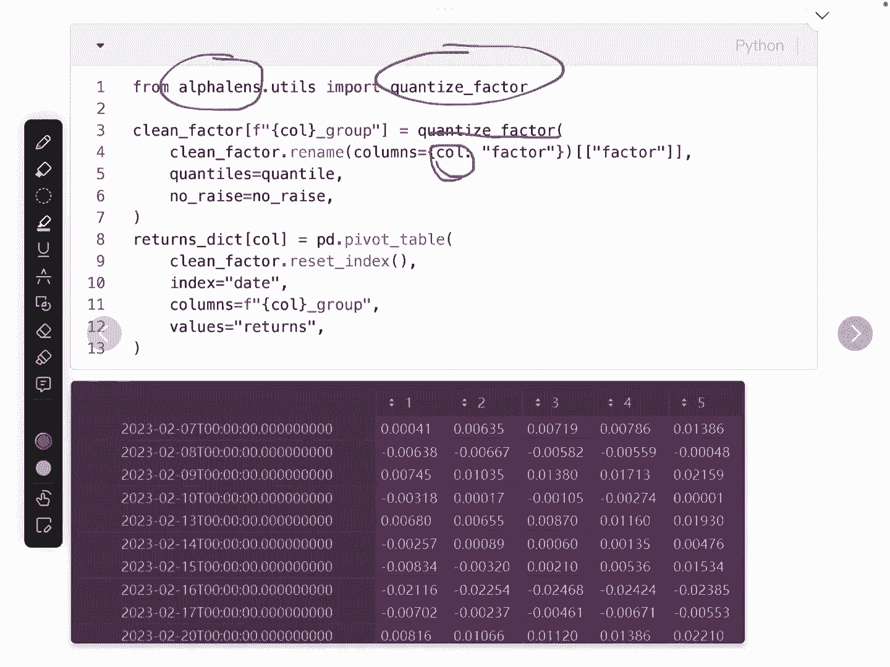

```python
# 从Alphalens返回的数据中，我们可以直接得到按分桶分组后的收益分析表
mean_return_by_q, std_err_by_q = al.performance.mean_return_by_quantile(
    factor_data_clean, 
    by_date=True # 按日期计算各分桶的平均收益
)
```
`mean_return_by_q` 就是一个DataFrame，索引为日期，列为分桶编号（1到5），值为该日期该分桶的平均收益率。

### 第五步：计算并绘制净值曲线

为了直观对比，我们需要将每个分桶的每日收益转化为累积净值曲线。

```python
import matplotlib.pyplot as plt
import pandas as pd

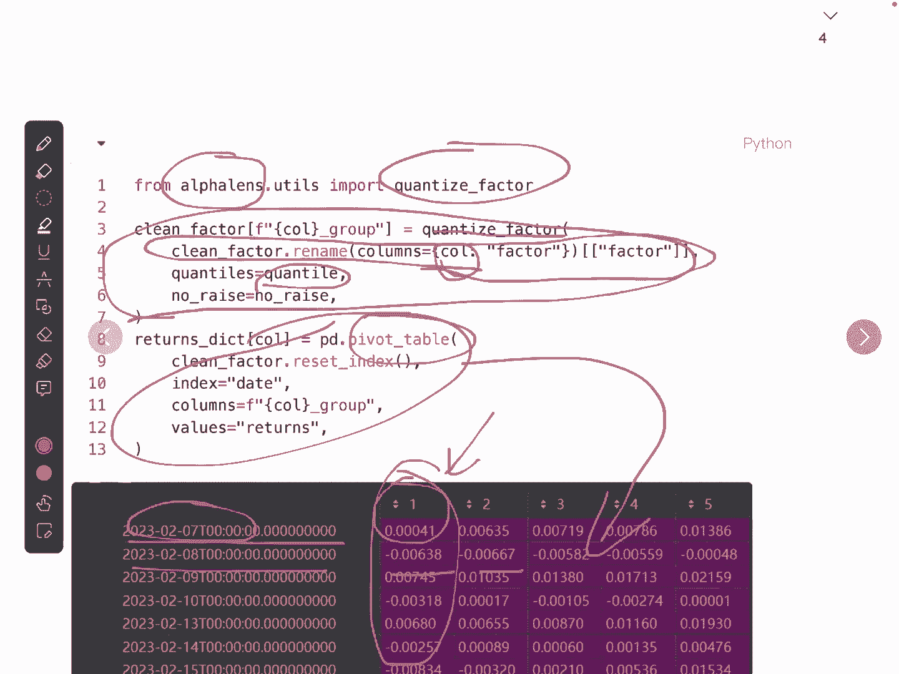

# 计算累积净值：(1 + 日收益率) 的累积乘积
cumulative_returns = (1 + mean_return_by_q).cumprod()

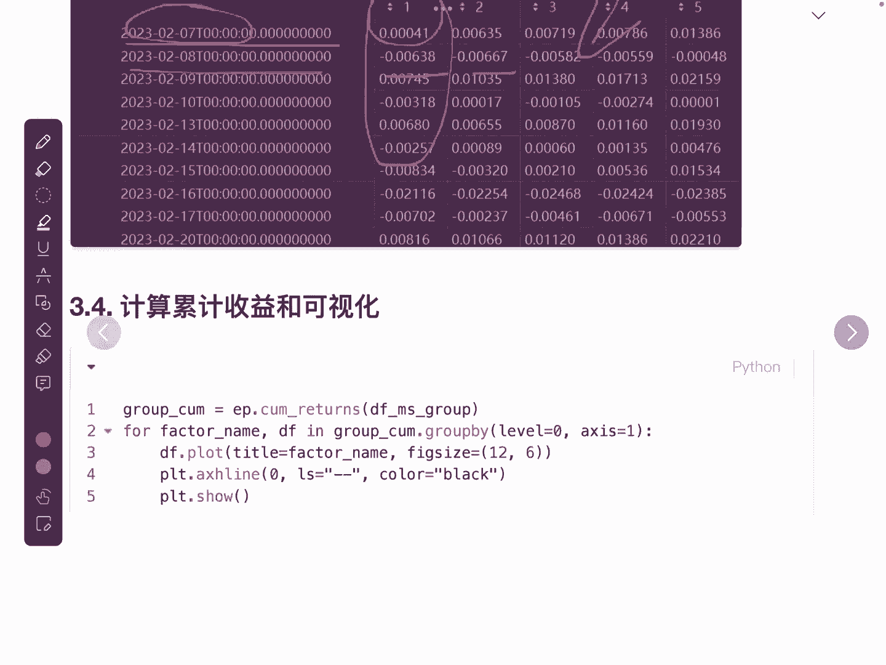

# 绘制净值曲线
plt.figure(figsize=(12, 6))
for column in cumulative_returns.columns:
    plt.plot(cumulative_returns.index, cumulative_returns[column], label=f'分桶 {column}')
plt.axhline(y=1, color='black', linestyle='--', linewidth=0.5) # 绘制基准线 y=1
plt.title('惊恐收益因子分层净值曲线 (5层)')
plt.xlabel('日期')
plt.ylabel('累积净值')
plt.legend()
plt.grid(True)
plt.show()
```
一个有效的因子，其分层净值曲线应呈现出清晰的顺序性（如第1组收益最高，第5组收益最低）和区分度。

## 结果分析与总结

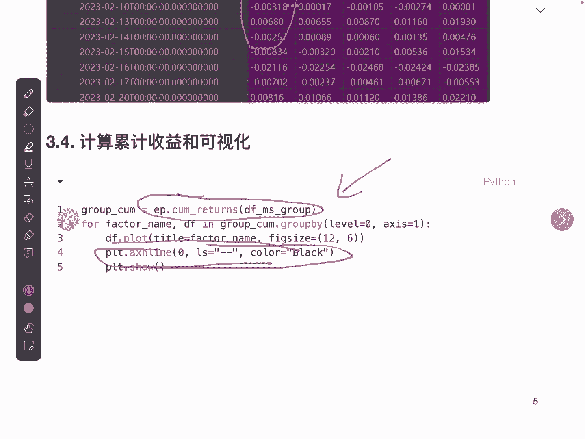

本节课中我们一起学习了量化因子研究中分层实验的完整实现流程。

1.  **我们从数据准备开始**，计算了股票的收益率。
2.  **接着，我们复现了惊恐因子**，包括惊恐收益、惊恐波动及原始惊恐因子。
3.  **然后，我们进入了核心环节——分层**。使用工具库对每个交易日的股票按因子值排序并分组。
4.  **之后，我们计算了每个分桶的日平均收益**，并将其转化为累积净值曲线。
5.  **最后，通过可视化图表**，我们可以直观地判断因子在不同分组上的表现差异。

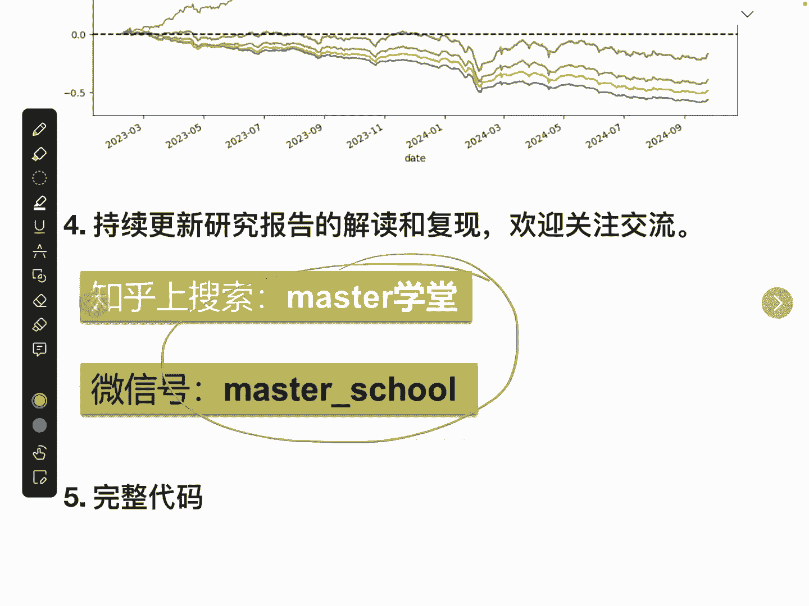

成功的分层实验应显示，因子值最优的组（如惊恐度最高的组）与因子值最差的组，其长期累积收益存在显著差异，且各组净值曲线单调排列。这为因子的有效性提供了初步证据。在接下来的课程中，我们将探讨如何优化原始惊恐因子中的权重参数，并使用更严谨的模型进行测试。