# 量化交易系列：2：VMACD指标研报复现

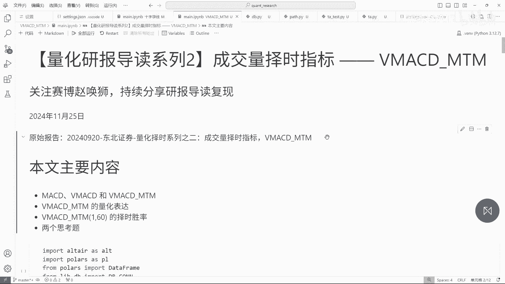

在本节课中，我们将学习如何理解并复现东北证券研报中提出的VMACD指标。我们将从回顾经典的MACD指标开始，逐步推导出VMACD的定义和计算方法，并使用Python进行量化回测，以验证该指标在过去三年内的有效性。最后，我们将对回测结果进行分析，并探讨其中可能存在的问题。

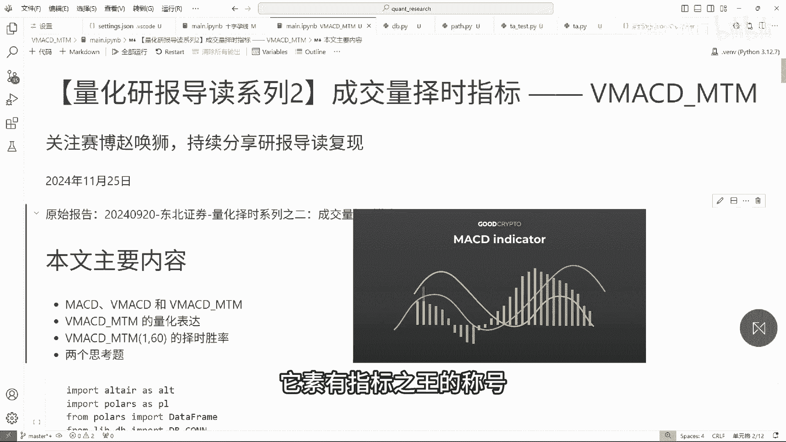

## 回顾MACD指标

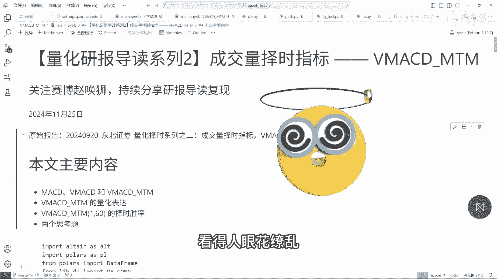

MACD指标素有“指标之王”的称号，是许多交易者入门时接触的第一个技术指标。它由杰拉尔德·阿佩尔于上世纪70年代提出，至今已有约45年历史。

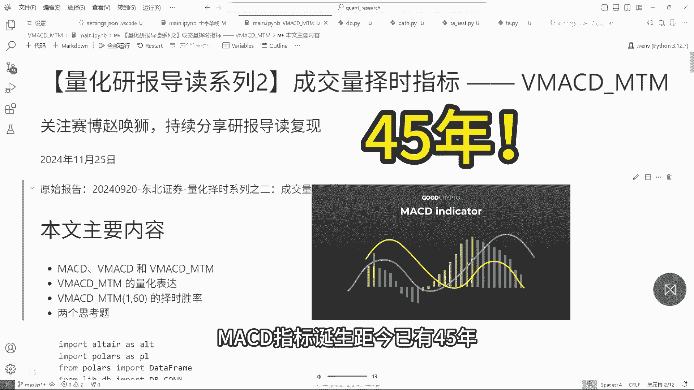

MACD的计算基于指数移动平均线（EMA）。其核心公式如下：

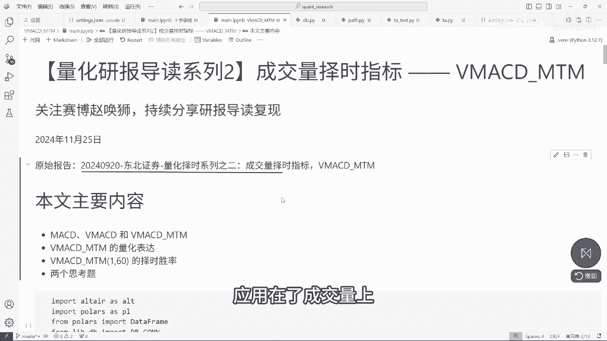

*   **DIF（差离值）** = EMA(收盘价, 12) - EMA(收盘价, 26)
*   **DEA（信号线）** = EMA(DIF, 9)
*   **MACD柱** = (DIF - DEA) * 2

从公式可以看出，MACD本质上是一种由双均线（快线与慢线）衍生出的动量指标，用于判断价格趋势的强度和方向。


## 认识VMACD指标

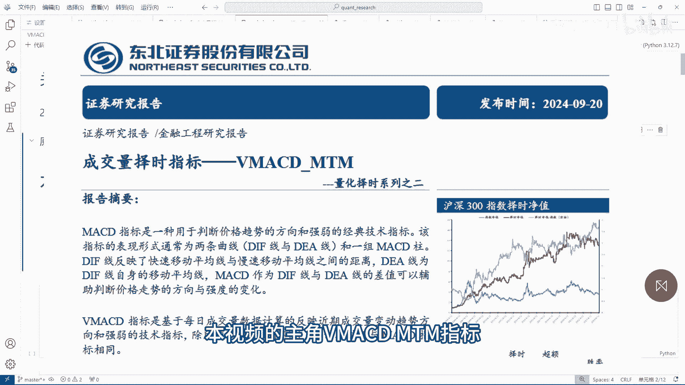

上一节我们介绍了MACD指标，本节中我们来看看它的一个创新应用——VMACD。

VMACD指标由东北证券在一篇研报中提出。其核心思想非常简单：**将MACD计算公式中的“收盘价”全部替换为“成交量（Volume）”**。

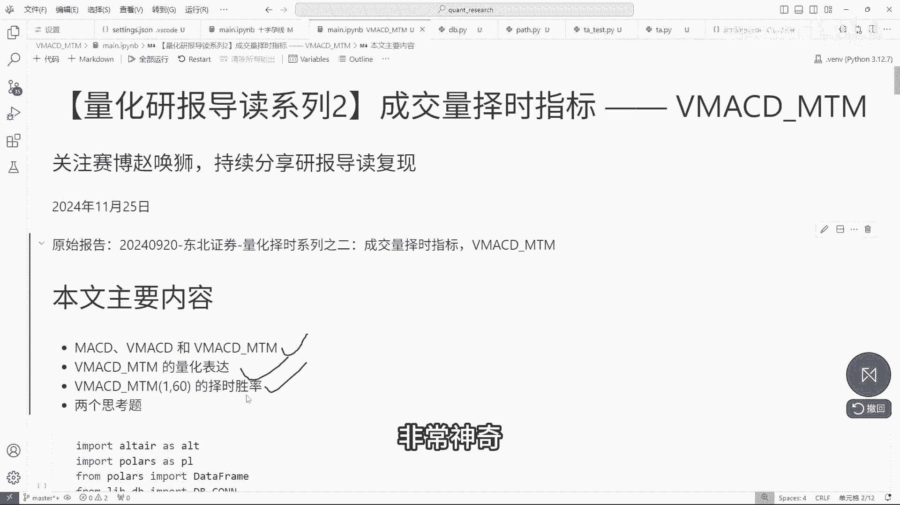

因此，VMACD的计算公式为：

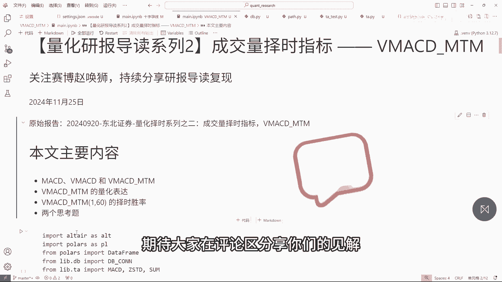

*   **V_DIF** = EMA(成交量, 12) - EMA(成交量, 26)
*   **V_DEA** = EMA(V_DIF, 9)
*   **VMACD** = (V_DIF - V_DEA) * 2

VMACD指标反映了近期成交量变化趋势的方向和强弱。指标值为正且越大，说明近期成交量释放的强度较大，即处于“放量”趋势中。研报试图通过捕捉成交量中的这种“放量/缩量”信息，来挖掘其中可能蕴含的价格变动择时信号。

## 构建VMACD动量因子

理解了VMACD的基本计算后，我们需要将其转化为一个可操作的择时因子。

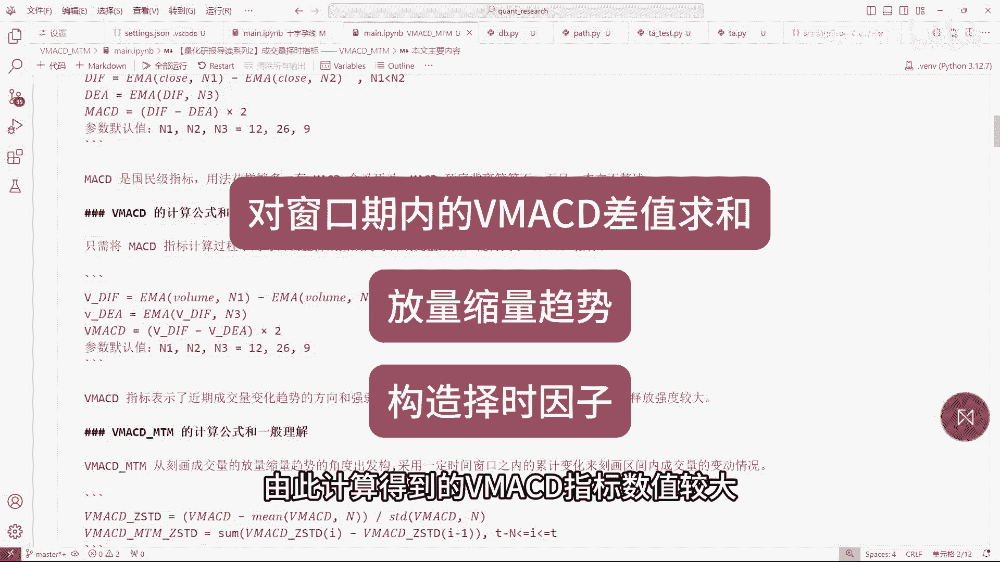

考虑到直接使用VMACD值（尤其是大盘指数的成交量数据通常非常庞大）不便于比较和设定阈值，研报首先对VMACD值进行了标准化处理。标准化是统计学中的常用操作，它能在保留数据分布特征的前提下，将数据缩放到一个标准范围（如0附近），便于后续处理。

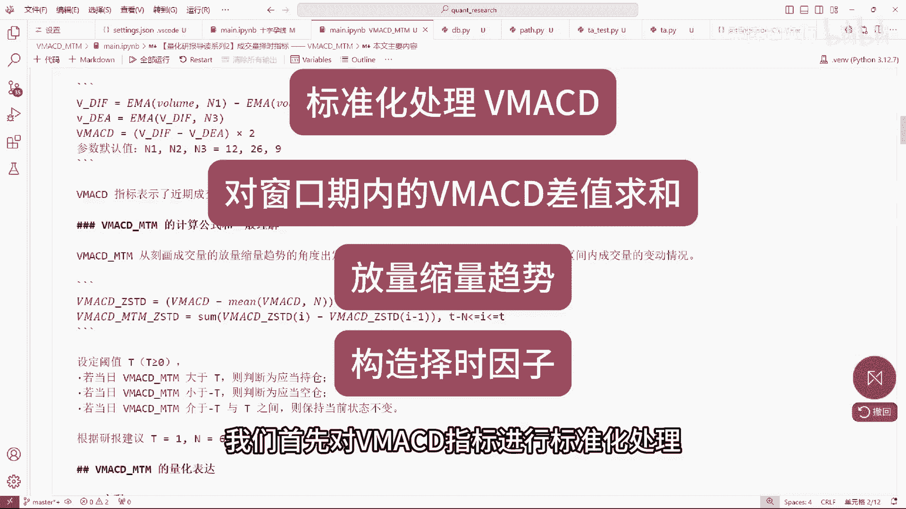

标准化后，研报通过计算一定时间窗口（N日）内，标准化VMACD值的累计变化，来刻画成交量的持续放量或缩量趋势，从而构造出名为 **VMACD_MTM（VMACD动量）** 的因子。具体步骤如下：

以下是VMACD_MTM因子的计算过程描述：
1.  计算每日的VMACD值。
2.  对VMACD序列进行标准化处理。
3.  计算相邻两个交易日标准化VMACD值的差值。
4.  在设定的时间窗口N内，对这些差值进行逐项求和，得到当日的VMACD_MTM值。

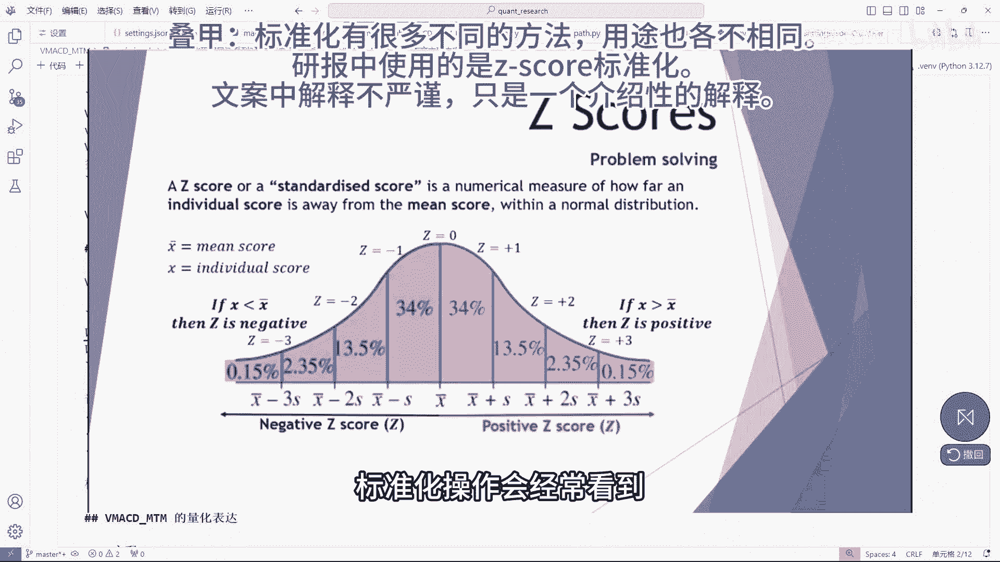

根据研报的测算和建议，我们选择阈值 **T = 1**，窗口期 **N = 60**。交易规则如下：
*   当 `VMACD_MTM > T` 时，产生买入信号，判断为应当持仓。
*   当 `VMACD_MTM < -T` 时，产生卖出信号，判断为应当空仓。

## 使用Python进行回测

现在，我们依据上述量化逻辑来编写Python代码进行回测。核心代码如下：

```python
# 假设 df 是包含‘volume’（成交量）和‘close’（收盘价）的DataFrame
# 计算VMACD
short_ema = df[‘volume’].ewm(span=12, adjust=False).mean()
long_ema = df[‘volume’].ewm(span=26, adjust=False).mean()
v_dif = short_ema - long_ema
v_dea = v_dif.ewm(span=9, adjust=False).mean()
vmacd = (v_dif - v_dea) * 2

# 标准化VMACD
vmacd_normalized = (vmacd - vmacd.rolling(window=60).mean()) / vmacd.rolling(window=60).std()

# 计算VMACD_MTM：60日窗口内，相邻日标准化VMACD差值的累计和
vmacd_diff = vmacd_normalized.diff()
vmacd_mtm = vmacd_diff.rolling(window=60).sum()

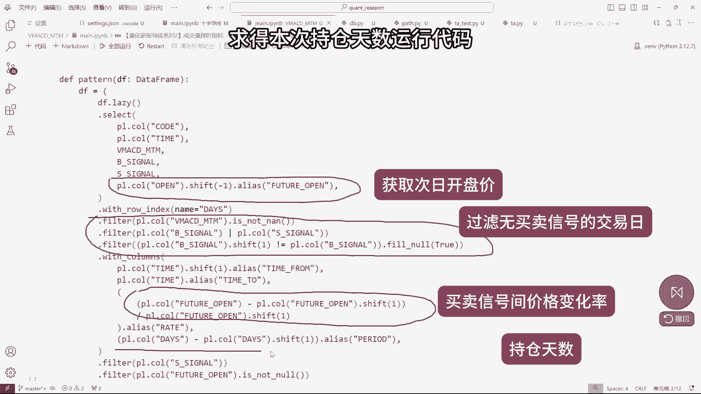

# 生成交易信号
df[‘signal’] = 0
df.loc[vmacd_mtm > 1, ‘signal’] = 1  # 买入信号
df.loc[vmacd_mtm < -1, ‘signal’] = -1 # 卖出信号

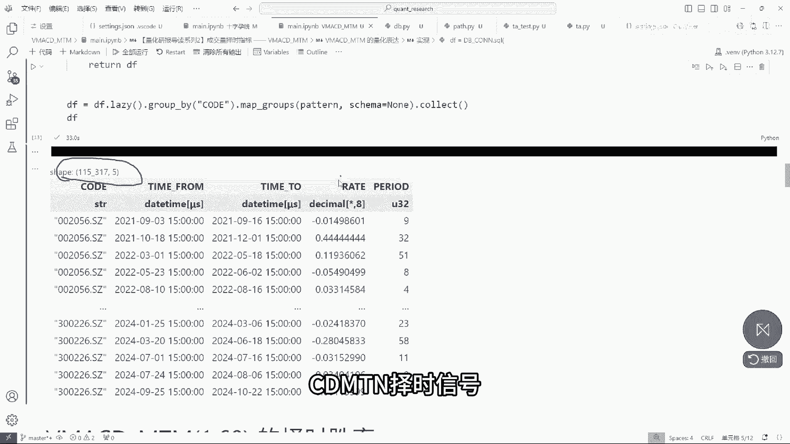

# 计算收益率（假设信号次日开盘价执行）
df[‘next_open’] = df[‘open’].shift(-1)
# ... 后续计算每次交易的收益率和持仓天数
```

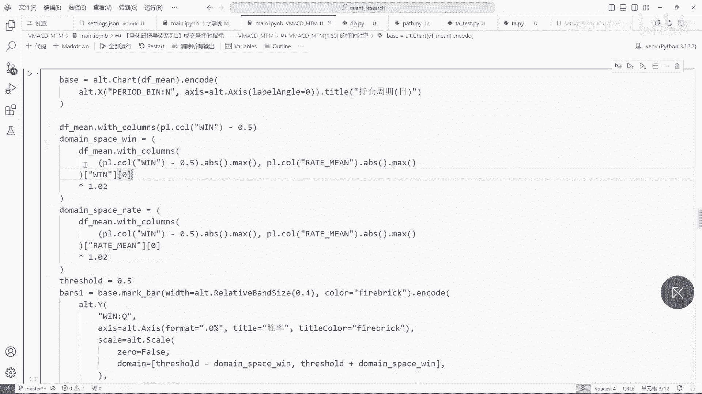

代码逻辑简述：
1.  计算成交量的VMACD，并进行标准化。
2.  计算60日窗口内的VMACD_MTM指标值。
3.  将指标值超过1的首日标记为买入信号日，低于-1的首日标记为卖出信号日。
4.  假设在触发信号的次日开盘时进行调仓，计算每次交易的收益率和持仓周期。

## 回测结果分析

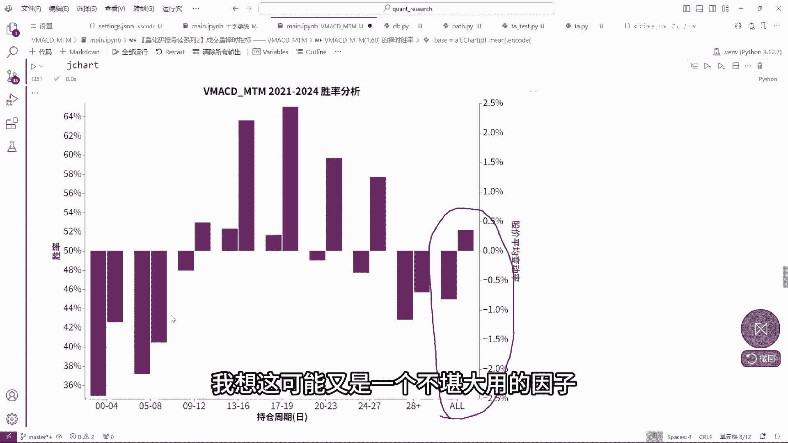

运行回测代码后，我们获得了近三年所有由VMACD_MTM信号指导的交易记录，包括每次交易的收益率和持仓天数。

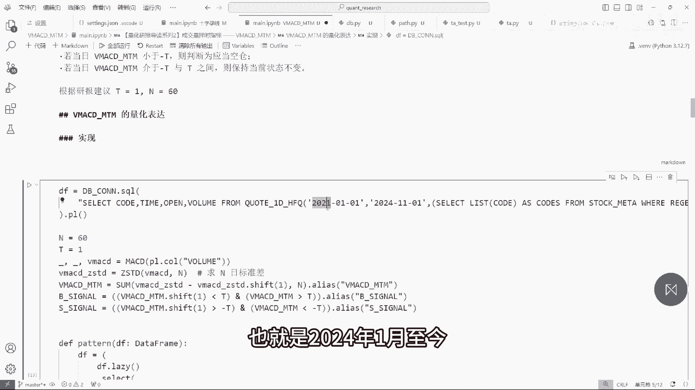

首先，我们对所有交易数据进行整体分析。根据持仓周期，我们将交易记录分组（例如以4天为一组），并统计各组的胜率（盈利交易占比）和平均收益率。

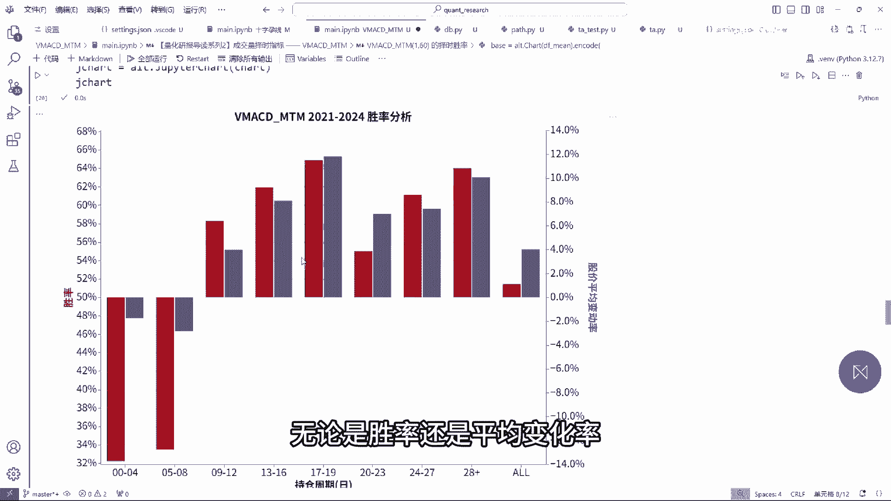

**整体来看（近三年数据），策略的胜率并不高，大约在45%左右。然而，所有交易的平均收益率却略微为正，接近0.4%。** 这个结果初看似乎表明因子虽不精准，但可能略有正向效果。

但是，当我们把分析的时间范围缩小到最近一年（2024年至今）时，情况发生了戏剧性的变化。

**在2024年的数据中，持仓周期较长的交易组（例如9天以上），无论是胜率还是平均收益率都非常出色，部分组别的平均收益率甚至能达到10%。** 如果仅看这部分“优质”交易，理论上能在一年内获得极高的累计收益。

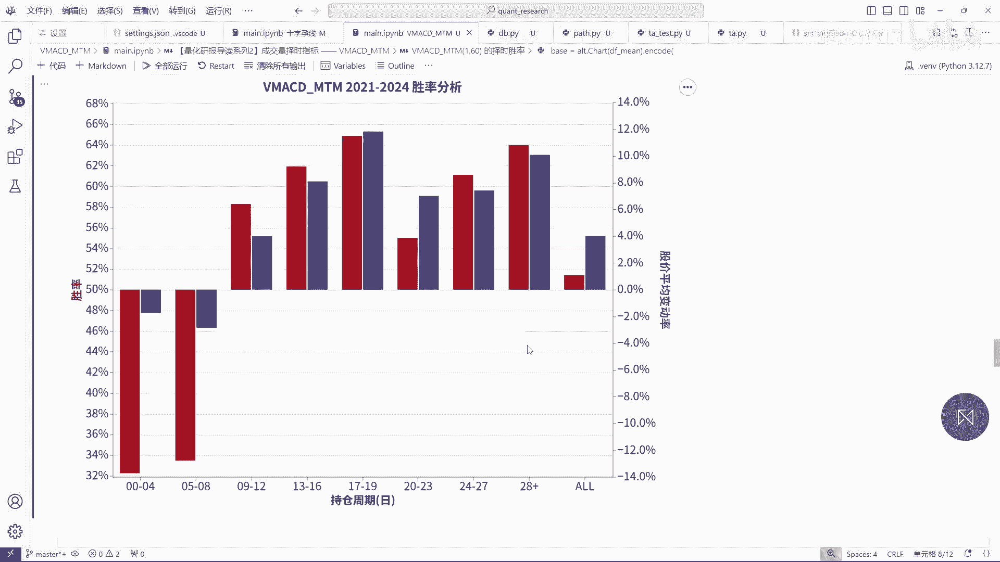

## 警惕“未来数据”陷阱

上一节的结果看起来非常诱人，但我们必须保持警惕。这里存在一个量化交易中经典的谬误——**引入未来数据**。

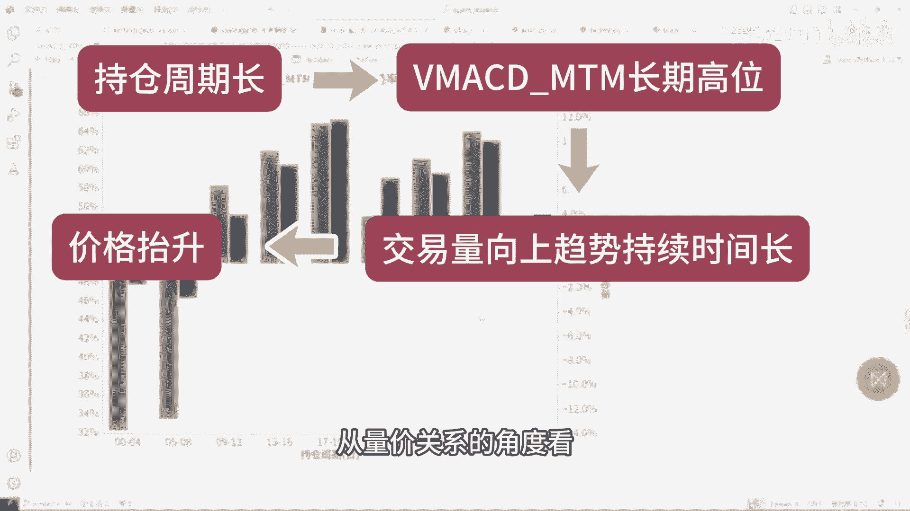

我们的分析是“根据持仓周期”这个维度来进行的。但关键在于，在实际交易中，当买入信号发生时，我们**无法预知**对应的卖出信号会在多久之后出现。我们不可能提前知道这次交易会是“长周期高收益”的，还是“短周期低收益”的。

因此，事后按照持仓周期长短来筛选高收益交易，相当于使用了当时不可能知道的信息（未来的持仓时长），这便引入了“未来数据”。基于这样的分析来认为找到了“圣杯”因子，结论是不可靠的。

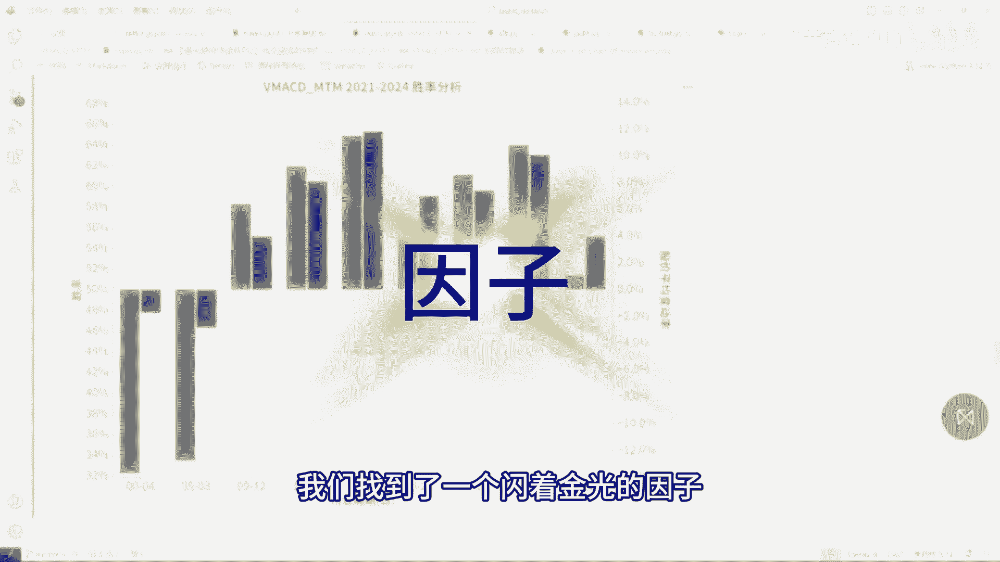

那么，如何理解2024年长周期持仓收益显著变好这个现象呢？结合VMACD_MTM的构造方式，长周期持仓意味着成交量持续处于放量趋势中。从量价关系角度看，这种情况自然与价格的持续上涨有较强的相关性。

所以，更合理的结论是：**在2024年的市场数据中，量价的相关性相较于前两年变得更强。** 这反映了市场阶段性的特征，而非我们找到了一个普遍有效的“金光闪闪”的因子。

## 思考与总结

本节课中我们一起学习了VMACD指标的由来、计算方法，并动手使用Python对其进行了回测验证。我们发现，虽然该指标在特定时间段（如2024年）内与价格走势展现出较强的相关性，但整体回测效果受“未来数据”陷阱影响，其普遍有效性有待商榷。

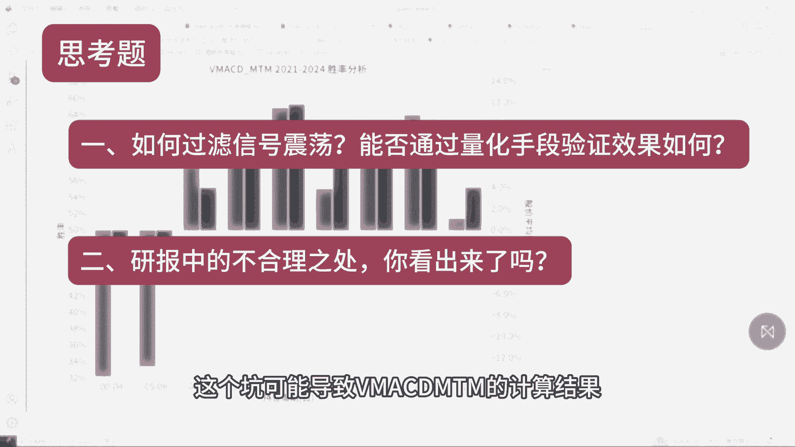

最后，我们留下两道思考题，供大家深入探讨：

以下是两道值得深思的问题：
1.  **信号过滤**：有人可能想到，能否通过“等待观察”的方式来过滤掉短周期的震荡信号？例如，当买入信号发生时，先等待5个交易日。如果5日内出现了卖出信号，则放弃本次操作；如果5日内未出现卖出信号，则在第5日入场。这种方法是否真的能避免未来数据并提升策略效果？你可以尝试通过回测来验证。
2.  **计算细节**：在VMACD_MTM的计算过程中，有一个不太容易被注意到的细节可能导致计算结果与研报设计初衷不符。你发现了吗？（提示：考虑标准化处理与滚动窗口求和的计算顺序和逻辑）

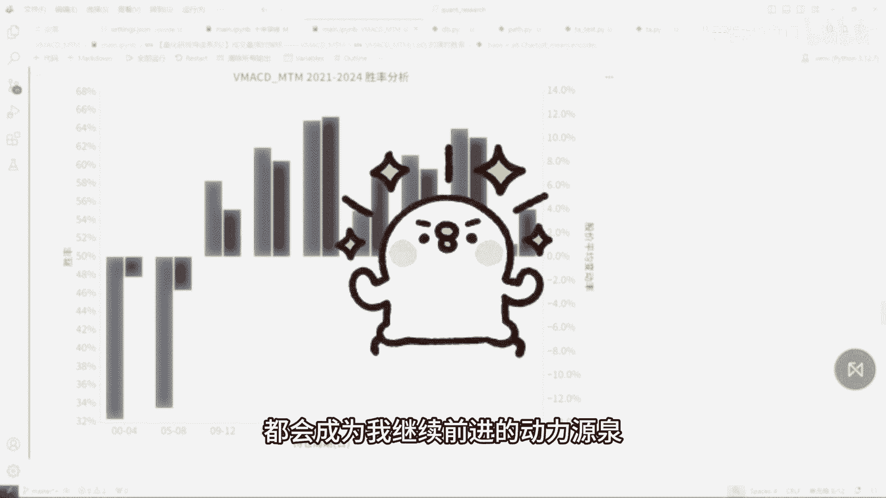

量化交易是一个不断证伪和迭代的过程。保持批判性思维，深入理解每一个指标和策略背后的逻辑与局限，远比追逐一个看似惊人的回测结果更为重要。