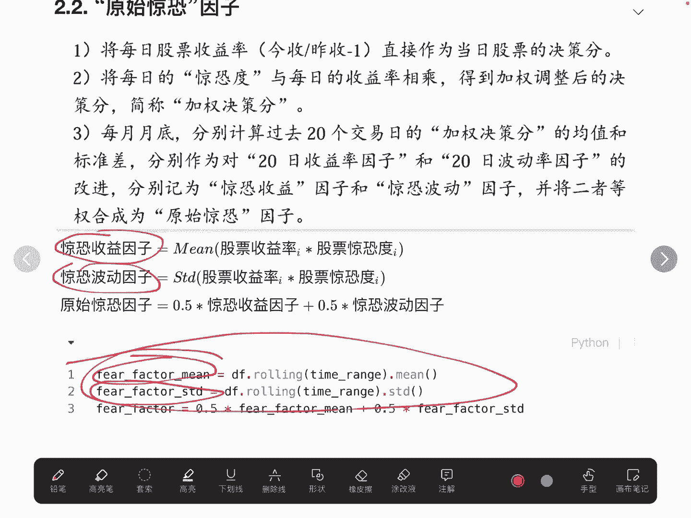
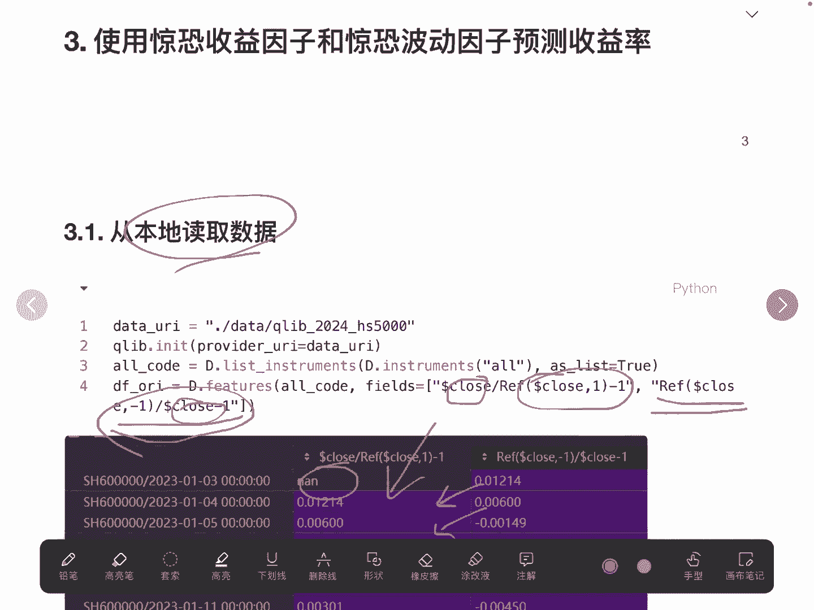
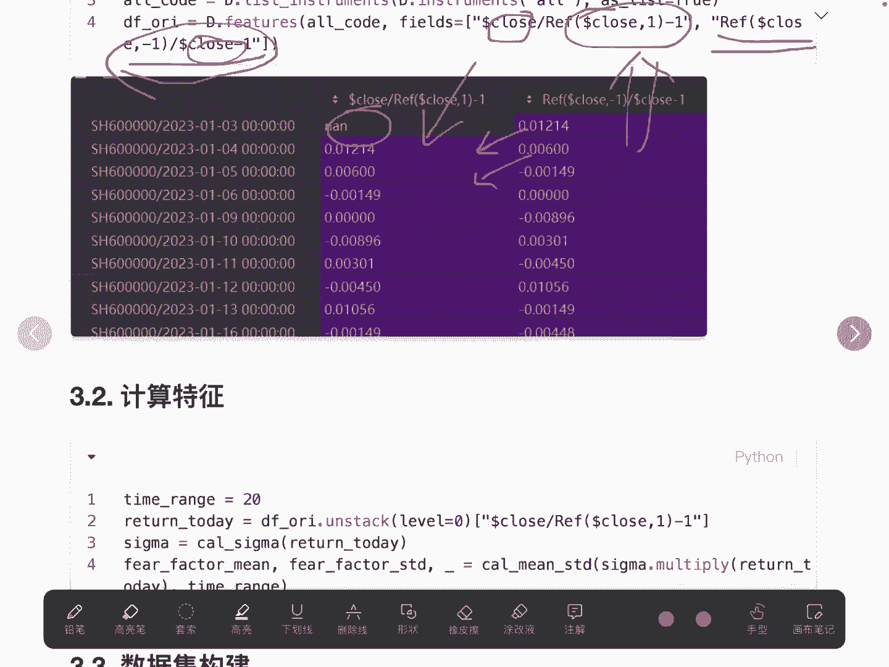
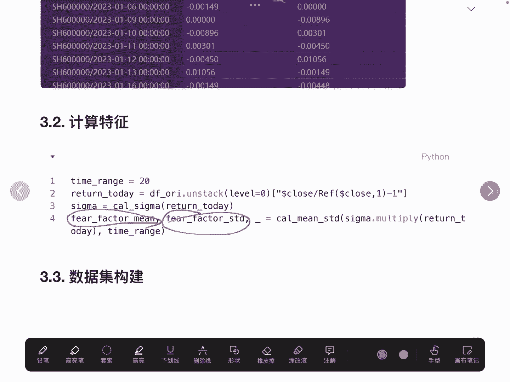
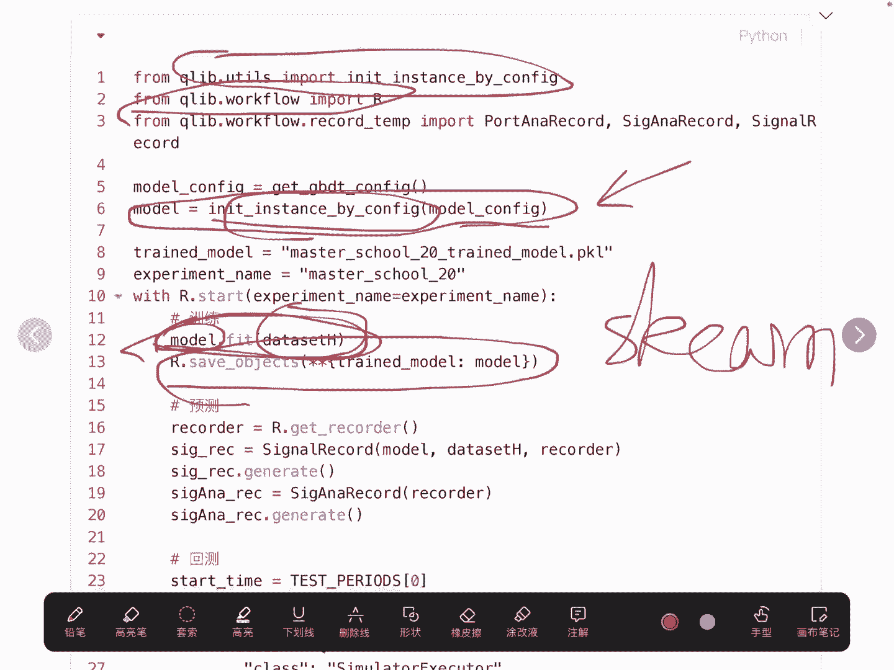
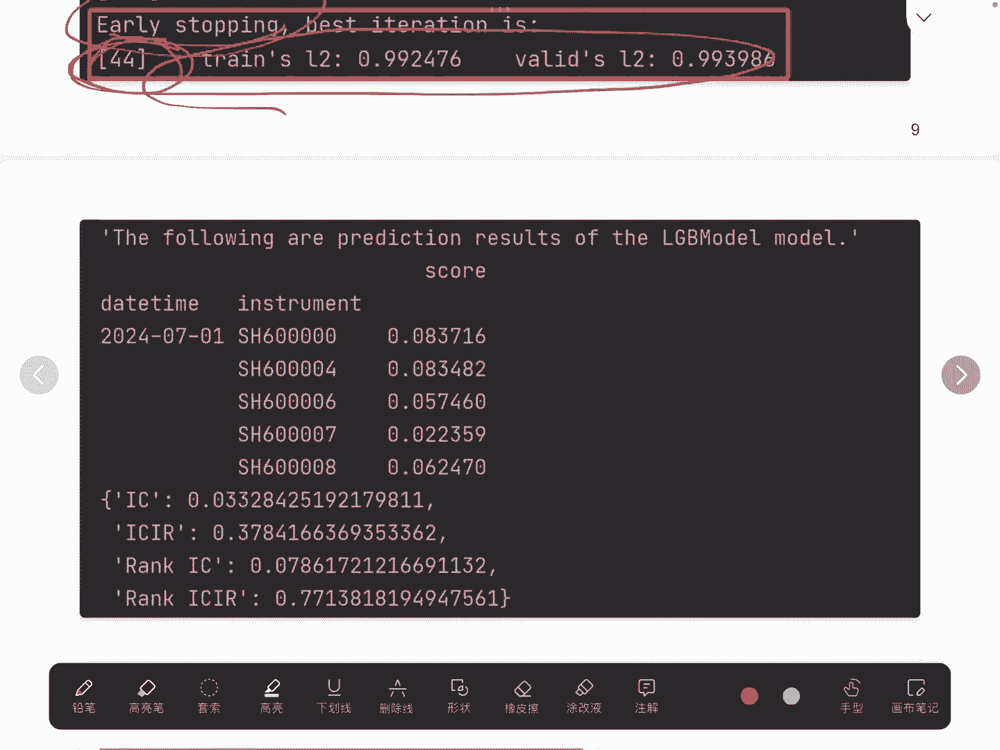

# 量化交易系列20：草木皆兵因子研报Python复现2（如何基于机器学习构建量化模型）📈

## 概述
在本节课中，我们将学习如何将传统的多因子线性组合方法，升级为使用机器学习模型（以GBDT为例）来构建和优化量化因子。我们将从数据准备、模型训练、评估到策略回测，完整地复现一个基于机器学习的量化因子构建流程。

在上一个视频中，我们介绍了如何使用单一的“草木皆兵”因子进行分层回测。本节中，我们将探讨如何利用机器学习模型，自动学习并优化多个原始因子（如惊恐收益因子和惊恐波动因子）之间的复杂关系，以预测未来收益率，从而构建更强大的合成因子。

## 数据准备与特征工程

首先，我们需要准备用于模型训练的数据集。数据集的核心由特征（X）和标签（y）构成。

以下是构建数据集的关键步骤：



1.  **读取本地数据**：从本地文件加载股票的历史行情数据。
2.  **计算收益率**：
    *   **当日收益率**：使用公式 `(当日收盘价 - 前一日收盘价) / 前一日收盘价` 计算。由于首日没有前一日数据，因此会产生空值。
    *   **次日收益率**：作为模型的预测目标（标签）。我们使用次日收益率而非当日收益率，是为了构建一个可行的预测任务：利用当日的因子特征来预测下一个交易日的收益。
3.  **计算因子**：基于上节课的方法，计算当日的“惊恐收益因子”和“惊恐波动因子”作为模型的特征。
4.  **构建数据集**：将计算好的两个因子作为特征（X），将对应的次日收益率作为标签（y）。需要确保特征和标签在时间索引上对齐。



```python
# 示例：计算次日收益率并调整索引以匹配特征
# df 为包含收盘价等数据的DataFrame
df[‘next_day_return‘] = df.groupby(‘stock_code‘)[‘close‘].pct_change().shift(-1)
# 调整索引，使时间在前，股票代码在后，以便与特征数据合并
df_returns = df[‘next_day_return‘].unstack().T.stack()
```



完成上述步骤后，我们得到一个名为 `df_ms` 的原始数据集。接着，需要对其进行预处理和划分。



## 数据集预处理与划分

原始数据需要经过清洗和标准化才能用于模型训练。我们使用 `qlib` 库提供的工具来完成这些工作。

以下是数据预处理的流程：

1.  **配置数据**：使用 `qlib` 的 `D` 类，传入我们构建的原始数据集 `df_ms`。
2.  **数据规范化**：调用 `D.infer` 和 `D.process` 方法。这两个步骤会自动处理数据中的缺失值、异常值，并进行必要的规范化，为模型训练做好准备。
3.  **划分数据集**：按照时间序列划分训练集、验证集和测试集。
    *   **训练集**：用于模型训练（例如：2023-02-07 至 2023-12-31）。
    *   **验证集**：用于在训练过程中调整超参数，防止过拟合（例如：2024-01-01 至 2024-06-30）。
    *   **测试集**：用于最终评估模型的泛化性能（例如：2024-07-01 至 2024-09-24）。
4.  **创建最终数据集对象**：使用 `qlib` 的 `DatasetH` 接口，传入处理好的数据和划分的时间段，生成可直接用于模型训练的数据集格式。

## 模型构建与训练

准备好数据后，我们开始构建和训练GBDT模型。GBDT（Gradient Boosting Decision Tree）是一种强大的集成学习算法，适合处理金融数据中的非线性关系。

以下是模型训练的具体步骤：

1.  **配置模型参数**：为GBDT模型设置一系列超参数，例如树的数量、深度、学习率等。这些参数可以根据经验设置，后续可以调整优化。
    ```python
    model_config = {
        “task”: “train”,
        “model”: {
            “class”: “LGBModel”,
            “module_path”: “qlib.contrib.model.gbdt”,
            “kwargs”: {
                “loss”: “mse”,
                “colsample_bytree”: 0.8,
                “learning_rate”: 0.1,
                “subsample”: 0.8,
                “lambda_l1”: 2,
                “lambda_l2”: 2,
                “max_depth”: 8,
                “num_leaves”: 2**8,
                “num_threads”: 20,
                “verbosity”: -1,
            },
        },
    }
    ```
2.  **初始化模型**：根据上述配置，使用 `qlib` 的接口初始化一个GBDT模型实例。
3.  **训练模型**：将训练集数据输入模型，调用 `.fit()` 方法进行训练。训练过程中会使用验证集进行早停（Early Stopping），以防止模型过拟合。例如，日志显示在第44轮训练后达到最优，训练提前停止。
4.  **保存模型**：训练完成后，使用实验管理器将训练好的模型保存下来，便于后续的预测和回测使用。

## 模型评估与回测



模型训练完成后，我们需要评估其预测能力，并基于预测结果进行量化策略的回测。

以下是评估与回测的步骤：

1.  **模型预测**：使用训练好的模型，分别在验证集和测试集上进行预测，得到每个股票在未来的预测收益率。
2.  **性能评估**：计算预测结果与实际收益率的评价指标，如 **IC（Information Coefficient，信息系数）** 和 **ICIR（Information Coefficient Information Ratio）**。这些指标衡量了因子预测收益的能力和稳定性。根据这些指标，我们可以判断模型效果，并决定是否需要调整模型参数。
3.  **策略回测**：
    *   **配置回测参数**：设定回测的起止时间、初始资金、交易费用（佣金）、基准指数等。
    *   **执行回测**：基于模型每日的预测收益率，构建投资组合（例如，买入预测收益最高的前N只股票），并按照时间序列模拟交易。
    *   **分析结果**：回测引擎会输出策略的累计收益率、年化收益率、夏普比率、最大回撤等关键绩效指标，并与基准指数进行对比，从而全面评估策略的有效性。

## 总结



本节课中，我们一起学习了如何将机器学习应用于量化因子构建。我们首先将问题转化为利用“惊恐收益因子”和“惊恐波动因子”预测次日收益率的监督学习任务。然后，我们完整地实践了数据准备、特征工程、GBDT模型训练与评估，以及最终策略回测的整个流程。

关键点在于，机器学习模型（如GBDT）能够自动捕捉多个原始因子之间复杂的、非线性的关系，这比简单的等权线性加和（如 `0.5 * 因子A + 0.5 * 因子B`）可能更具表现力。通过本课的框架，你可以尝试替换不同的模型（如XGBoost、神经网络），或引入更多因子，来构建和优化属于自己的量化交易策略。