# 量化交易系列研报精读：21：RSRS指标详解与策略构建 🚀

在本节课中，我们将以光大证券的研究报告为基础，系统学习RSRS指标。我们将了解该指标的核心概念、构建逻辑、优化方法以及如何将其应用于择时策略。RSRS指标在牛市周期中表现突出，其核心在于量化市场的支撑与阻力强度。

---

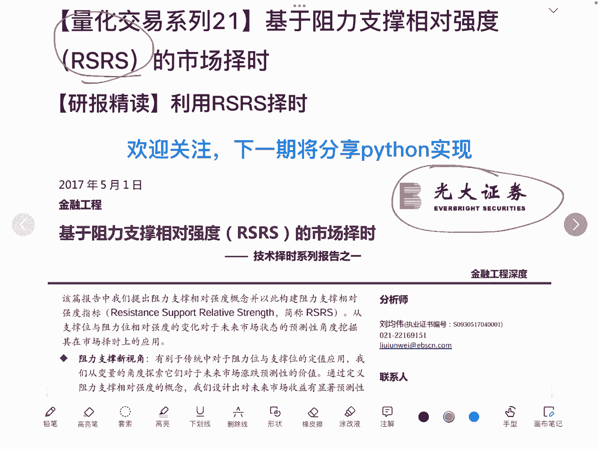

## 1.1：RSRS指标的核心概念与动机 📈

RSRS的全称是“Resistance Support Relative Strength”，即阻力支撑相对强度指标。顾名思义，该指标基于股票的阻力位和支撑位这两个关键位置来构建。

阻力位和支撑位实质上反映了市场参与者对当前市场顶部和底部的预期判断。RSRS指标在前人构建的阻力位与支撑位基础上，进一步衡量两者之间的相对强度。

如果支撑位的强度弱于阻力位，表明市场参与者对支撑位的分歧更大，市场接下来更可能转向熊市。相反，如果支撑位的强度强于阻力位，则市场更倾向于转向牛市。这就是RSRS指标构建的基本动机。

从上述动机可以看出，构建RSRS指标需要完成两件事：第一，如何量化支撑位和阻力位；第二，如何衡量它们之间的相对强度。

---

## 1.2：基础版RSRS指标的构建 🔨

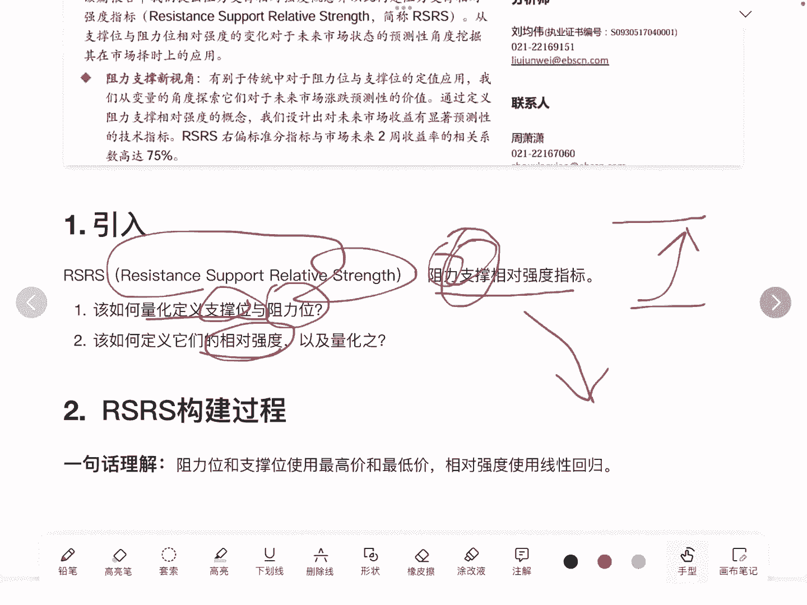

上一节我们介绍了RSRS指标的基本动机，本节中我们来看看研究报告是如何具体构建基础版指标的。

研究报告将阻力位和支撑位分别定义为最高价和最低价，并使用线性回归来拟合最高价序列和最低价序列。线性回归最终得到的斜率，即被定义为两者的相对强度。

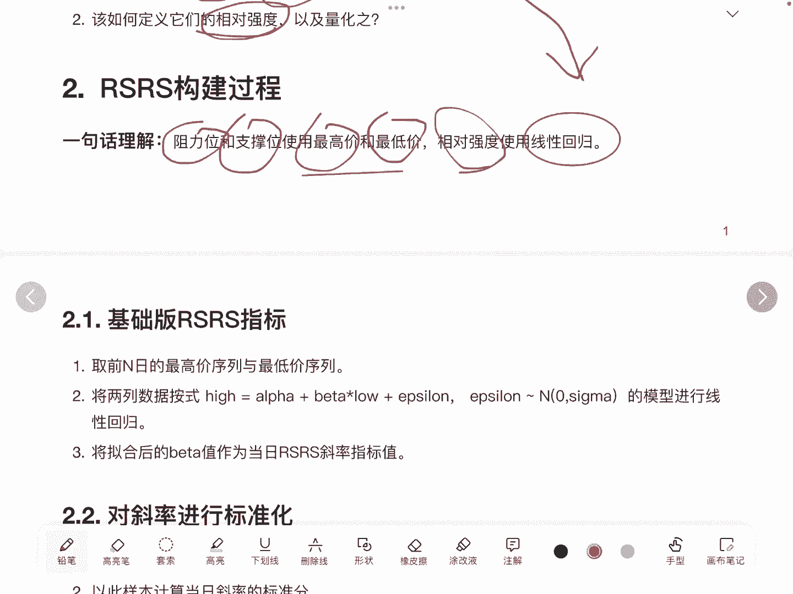

以下是具体的构建步骤：

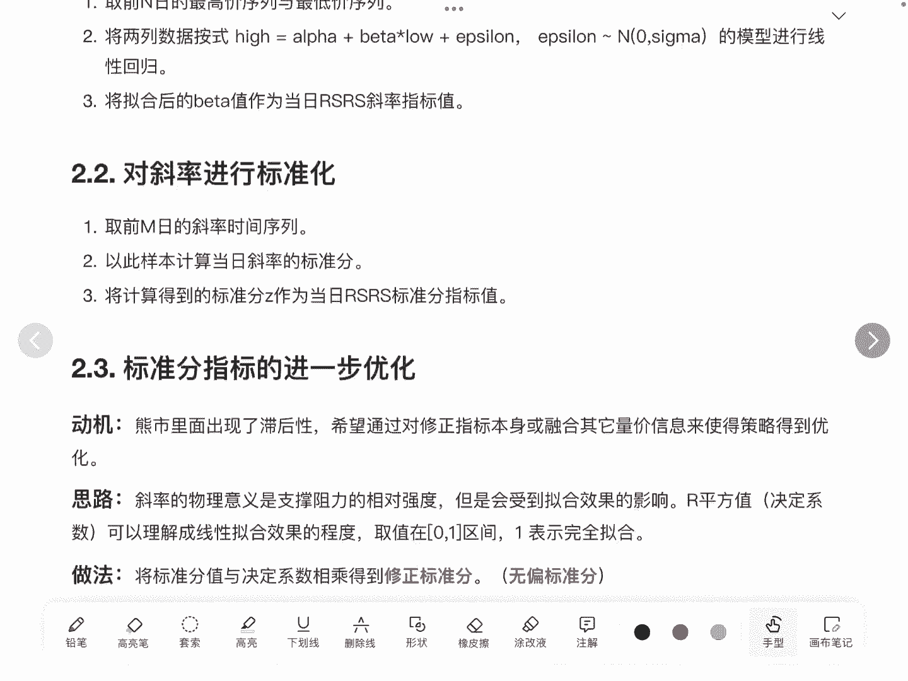

首先，获取一只股票前N天的最高价序列（*High*）和最低价序列（*Low*）。

接着，对这两个序列进行线性回归。回归方程可以表示为：
**`Low = α + β * High + ε`**
其中，斜率 **`β`** 就是我们当日的RSRS指标值。

这个斜率与股票一一对应。但考虑到不同行业的涨势可能不同，研究报告进一步对斜率进行了标准化处理。

所谓的标准化处理是常规操作：取该股票前M天的斜率时间序列，计算其标准分（Z-Score）。这个标准分就被视为RSRS标准分指标值。这是对基础RSRS指标的第一个优化。

---

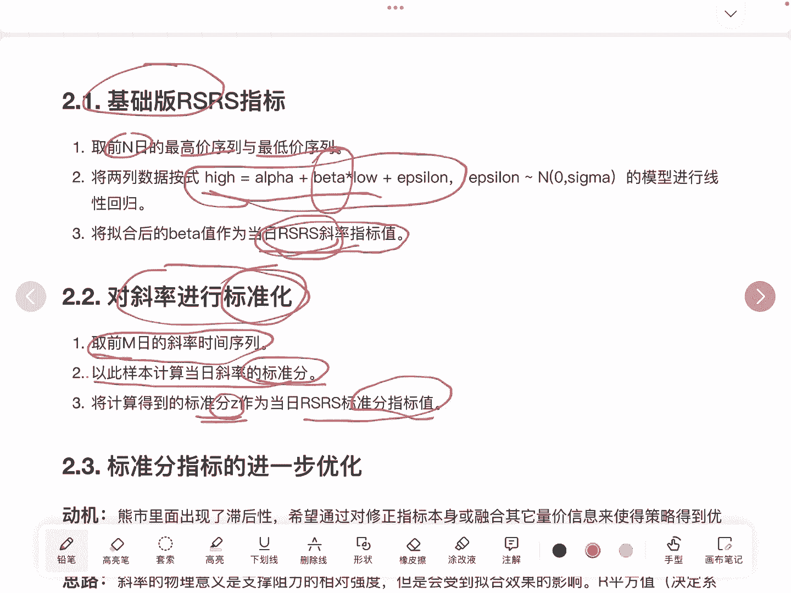

## 1.3：RSRS指标的优化：修正标准分 ⚙️

上一节我们介绍了基础版RSRS指标及其标准化处理，本节中我们来看看如何进一步优化该指标以规避熊市风险。

在回测标准化的RSRS指标时，发现它未能有效规避熊市择时。因此，研究报告希望通过修正指标或融合其他量价信息来优化策略。

RSRS指标基于线性拟合的斜率构建，但并非所有数据的回归效果都同样理想。对于回归效果较差的情况，应对其指标值进行“打压”。为此，研究报告引入了**R平方值**（或称决定系数，*R²*）来对指标进行增强或打压。

决定系数 *R²* 的取值范围在0到1之间。1表示完全拟合，0表示完全不拟合。当数据拟合度很高时（*R²* 接近1），我们无需改变指标值；当拟合度很低时（*R²* 很小），则应对指标值进行打压。

这就产生了第二个优化：**修正标准分**（或称无偏标准分）。

修正标准分的计算公式为：
**`修正标准分 = 标准分 * R²`**
其中，“标准分”即上一节中计算出的标准化RSRS值。

将修正标准分与原始标准分对比可以发现，修正后的分布更接近标准的正态分布。原文利用该因子计算了其与未来收益率的相关性，发现当因子值大于零时，相关性很高；小于零时，相关性较差。这引出了对小于零部分进行优化的需求。

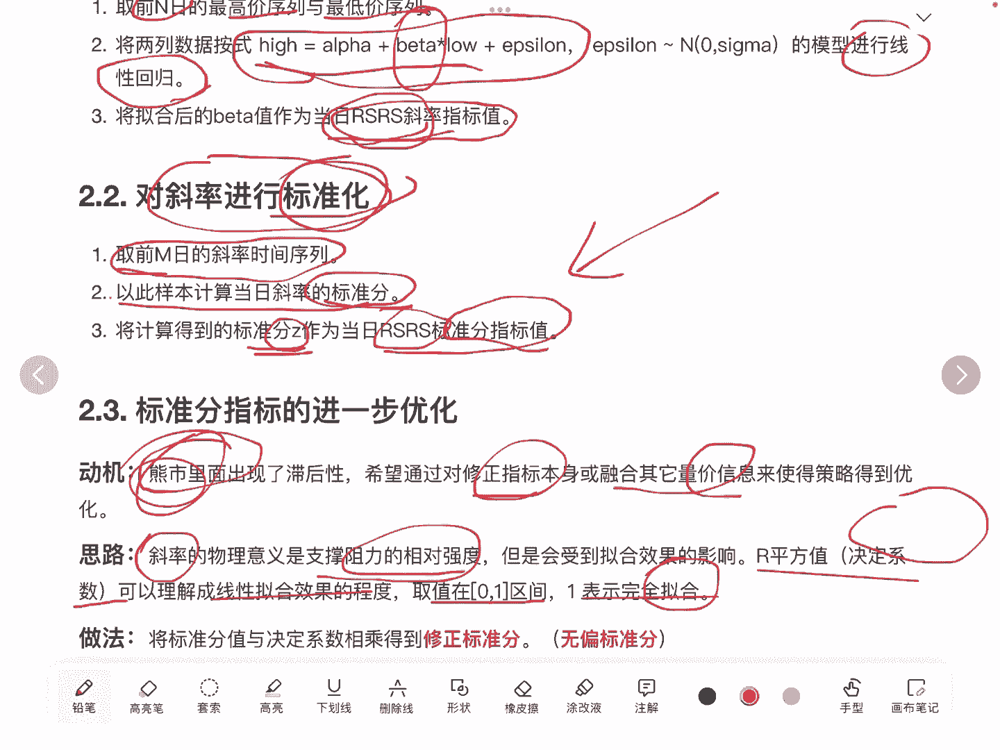

---

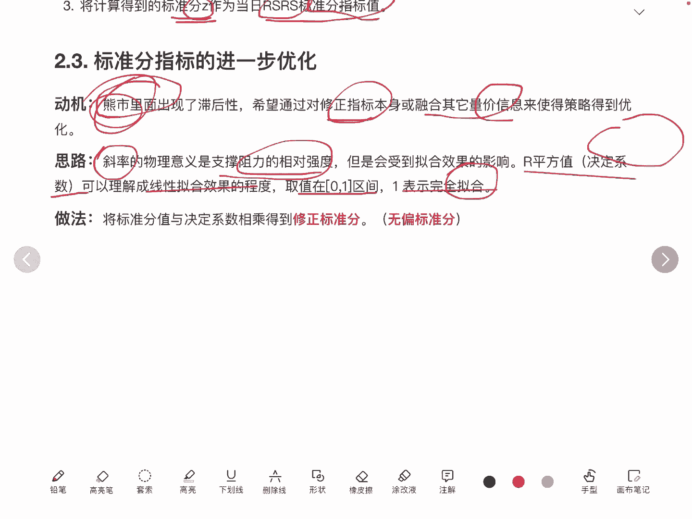

## 1.4：RSRS指标的优化：右偏标准分 📊

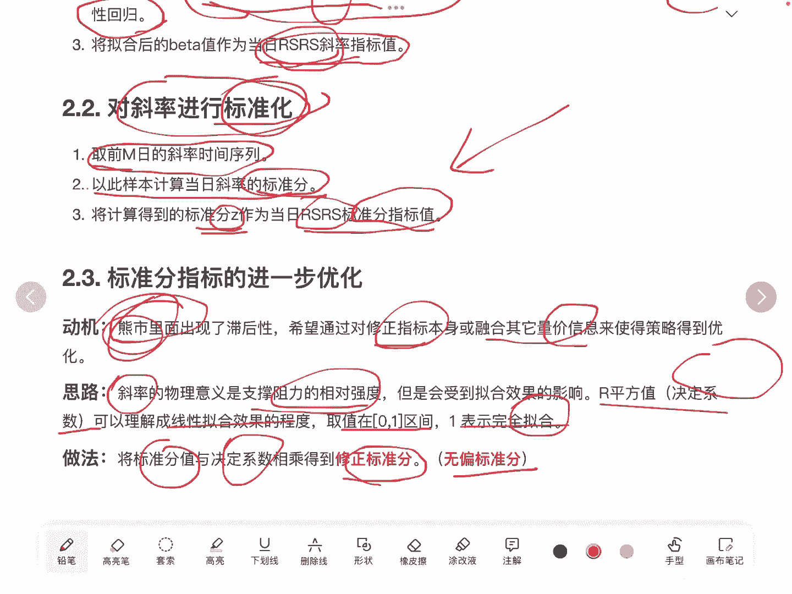

上一节我们引入了决定系数来修正标准分，本节中我们来看最后一个优化——右偏标准分。

为了优化修正标准分在小于零区间相关性较差的问题，研究报告提出了**右偏标准分**。

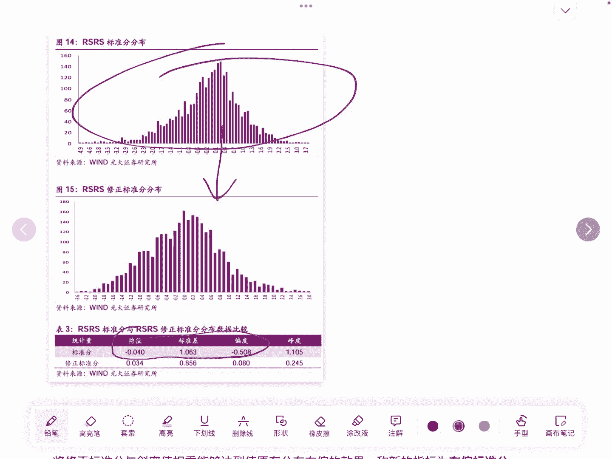

右偏标准分的计算方式是将修正标准分与原始的斜率值相乘：
**`右偏标准分 = 修正标准分 * β`**
（其中 **`β`** 为原始线性回归的斜率）

这样操作使得分布向右偏移（右偏），让大于零的因子值范围变得更大，从而使其与未来收益率的正相关性也变得更强。

至此，我们一共介绍了四个因子：
1.  基础斜率 **`β`**
2.  标准分
3.  修正标准分（标准分 * *R²*）
4.  右偏标准分（修正标准分 * **`β`**）

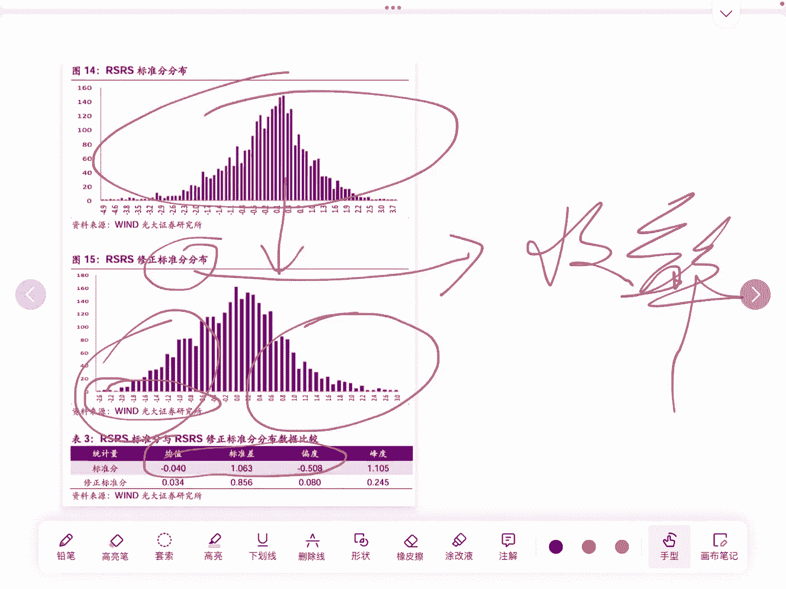

---

## 1.5：基于RSRS指标的择时策略 ⏰

上一节我们完成了RSRS指标因子的构建，本节中我们来看看如何将这些因子应用于具体的交易策略。

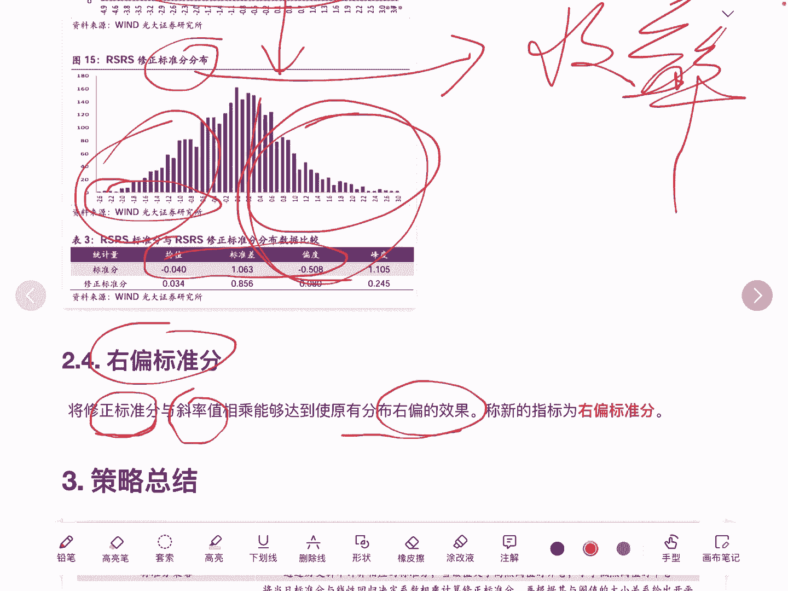

研究报告提出了几种策略思路，其核心逻辑相似。以下是策略的基本框架：

首先，以第一个“斜率策略”为例：
1.  计算斜率 **`β`**。
2.  设定两个阈值：高点阈值和低点阈值。
3.  当斜率值大于高点阈值时，发出开仓信号。
4.  当斜率值小于低点阈值时，发出平仓信号。

基于其他三个因子（标准分、修正标准分、右偏标准分）构建的策略，其开平仓逻辑与此完全相同，只是使用的指标值不同。

此外，研究报告还提出了两种结合其他技术指标的优化思路：

**第一种思路：配合均线过滤。**
在满足上述基础策略信号的同时，加入均线条件进行过滤。例如，只有当价格位于某条均线之上时，才接受买入信号。

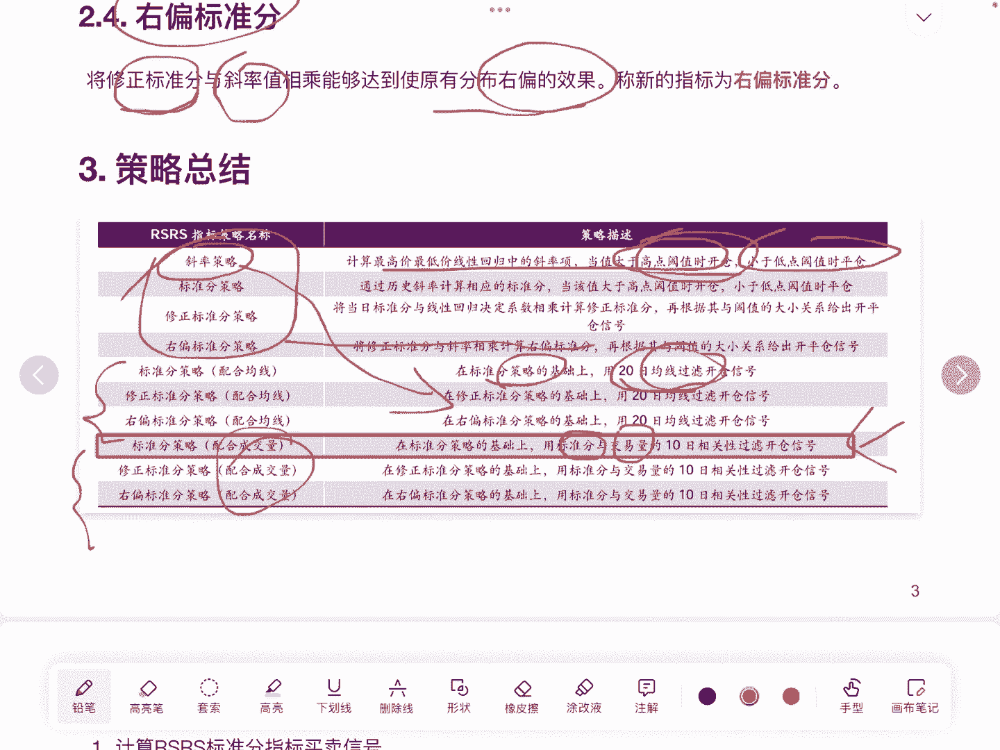

**第二种思路：配合成交量过滤。**
在指标发出买入信号时，还需计算当日成交量与RSRS标准分之间的相关性。只有当两者呈现正相关性时，才执行买入操作。如果指标发出卖出信号，则卖出持仓。这相当于进行了更严格的择时。

---

## 1.6：策略回测效果展示 📉

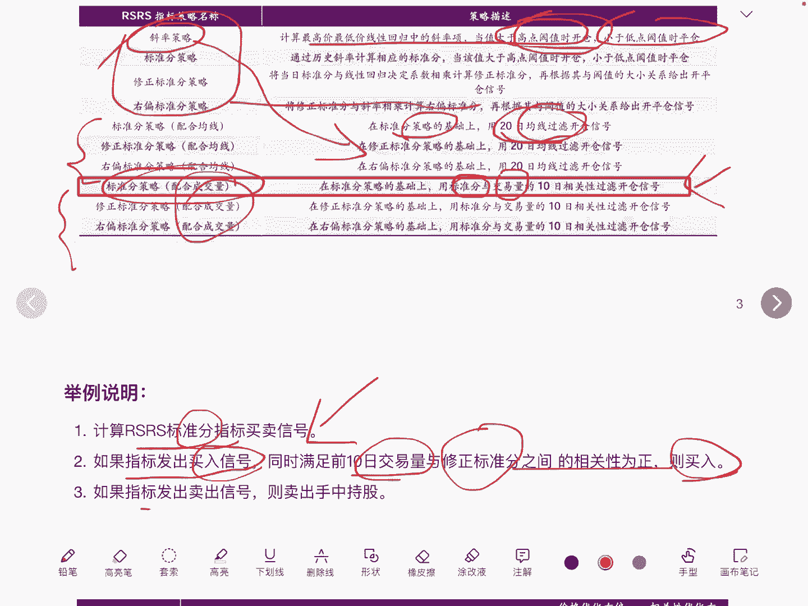

上一节我们介绍了具体的策略构建方法，本节中我们最后来看一下这些策略的历史回测效果。

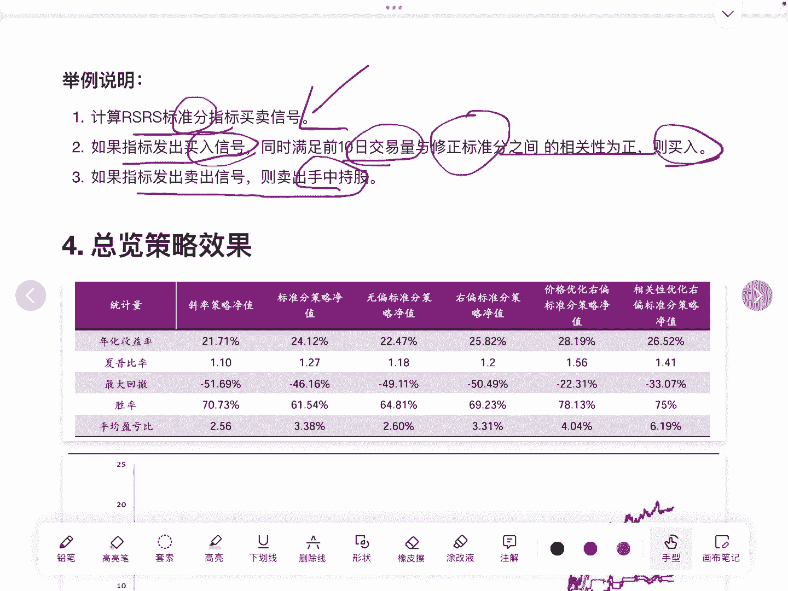

根据研究报告展示的回测结果（2005年至2017年）：
*   未经优化的基础斜率策略已能取得一定的年化收益。
*   每一次优化（标准分、修正标准分、右偏标准分）都带来了效果的提升。
*   其中，**右偏标准分策略**的表现最为优秀，在收益率和最大回撤控制方面都优于其他因子。

从净值曲线来看，基于右偏标准分构建的策略长期表现稳健，在牛市期间能较好地捕捉上涨行情。

---

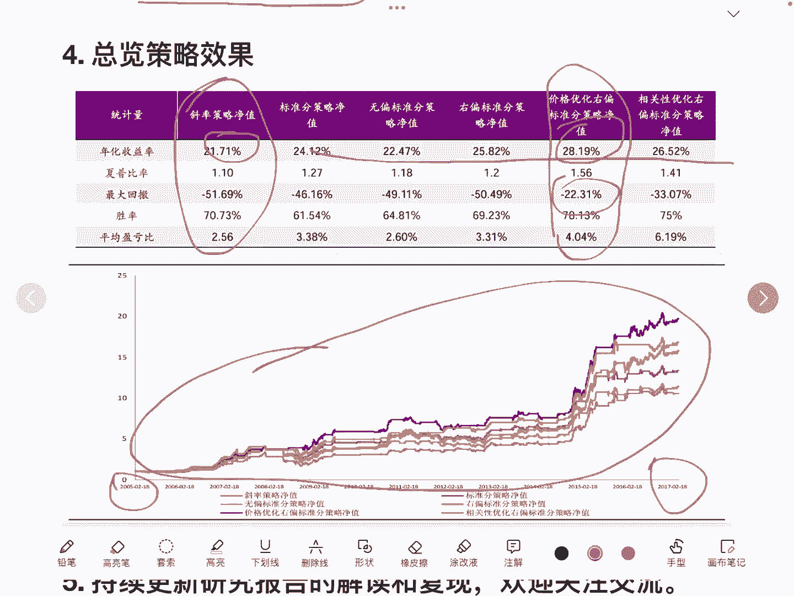

### 总结

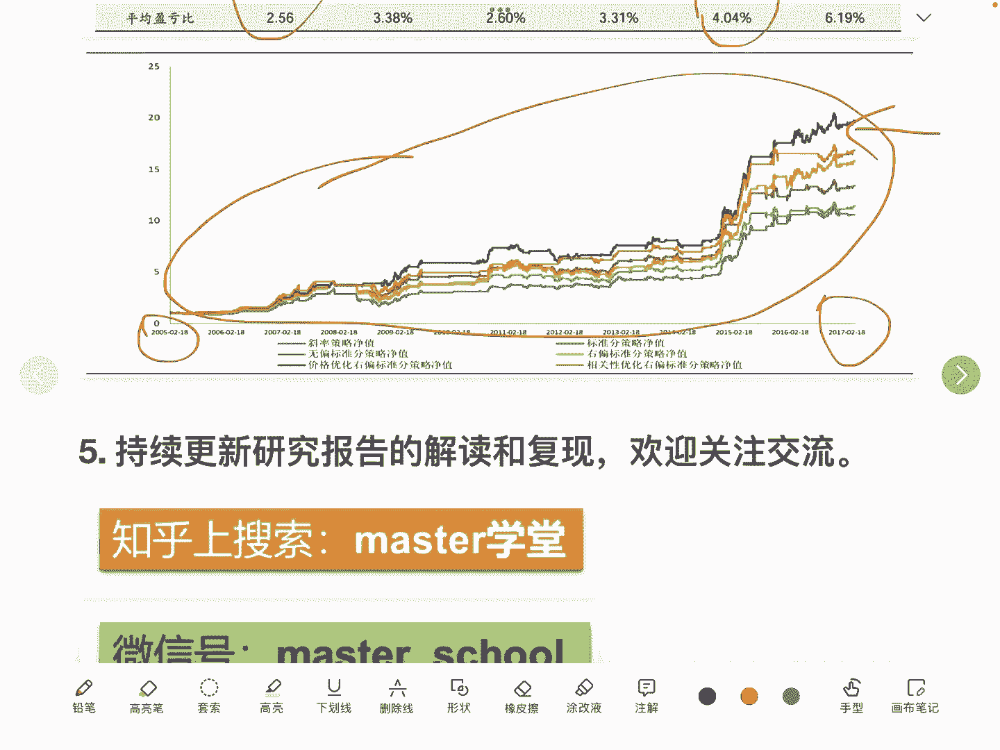

本节课中，我们一起学习了RSRS阻力支撑相对强度指标。我们从其核心概念与动机出发，逐步拆解了基础版指标的构建方法，并深入探讨了通过标准化、引入决定系数修正以及右偏处理这三种优化方式。最后，我们学习了如何将RSRS指标应用于具体的择时策略，并了解了其历史回测效果。RSRS指标通过量化市场支撑与阻力的相对强度，为判断市场趋势转换提供了一个有效的量化工具。