# 量化交易系列22研报复现：P1：RSRS牛市择时因子计算教程 📈

在本节课中，我们将学习如何计算一只股票的基础版RSRS因子。RSRS，即阻力支撑相对强度，是一种用于判断市场趋势的择时指标。我们将从读取数据开始，逐步讲解其核心计算逻辑，并最终实现因子的计算与可视化。

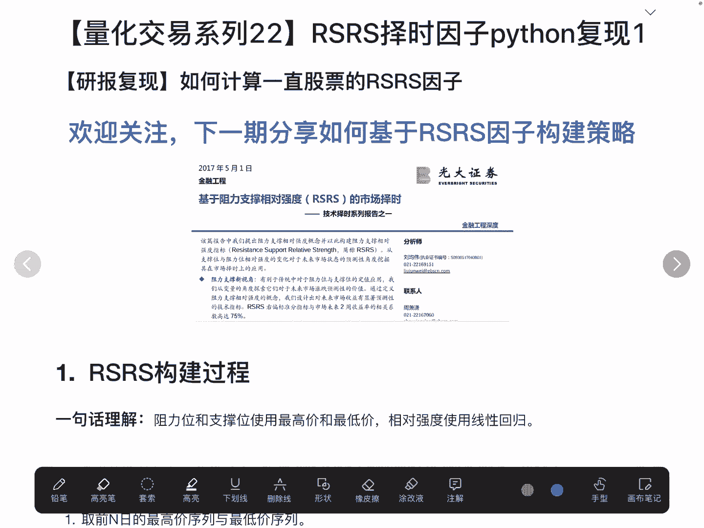

---

## 数据读取与准备

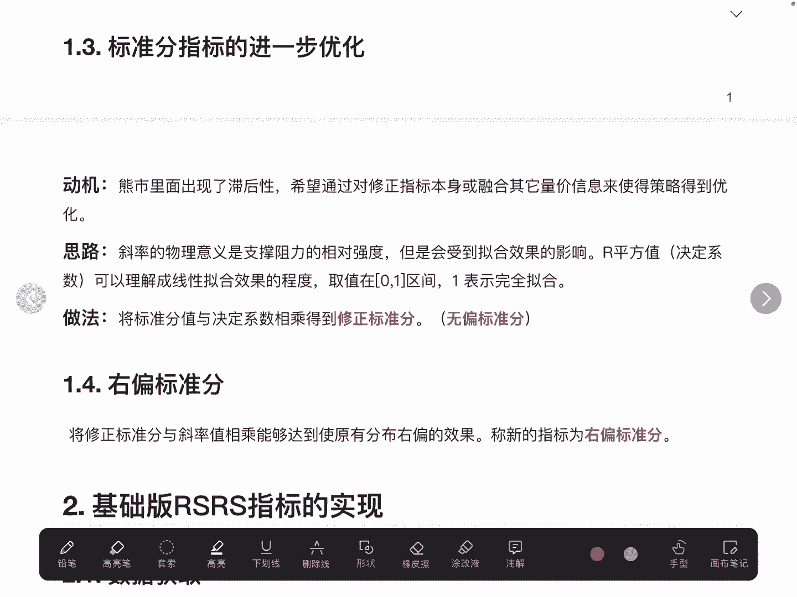

首先，我们需要获取用于计算因子的数据。本教程以沪深300ETF为例，计算其RSRS因子。数据读取过程主要利用`qlab`包从本地平台获取。

读取后的数据是一个`DataFrame`，其索引为股票代码和时间的多级索引，列名包含最高价（`high`）和最低价（`low`）。计算RSRS因子仅需用到最高价和最低价这两个价格序列。

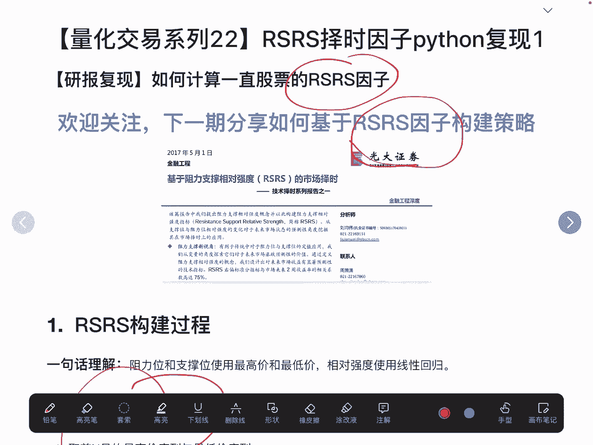

```python
# 示例：数据读取（假设数据已存入qlab平台）
import qlab
# 读取沪深300ETF的最高价和最低价数据
data = qlab.get_data(instrument='沪深300ETF', fields=['high', 'low'])
```

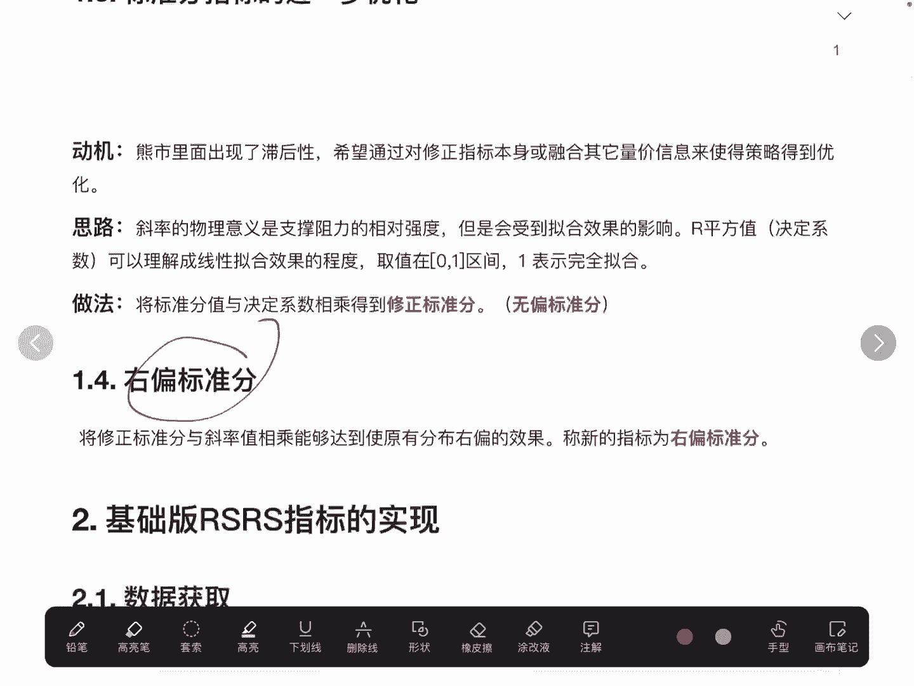

---

## 基础版RSRS因子计算

上一节我们介绍了数据准备，本节中我们来看看如何计算基础版RSRS因子。其核心思想是：对过去N个交易日的最低价格序列进行线性回归，所得回归直线的斜率即为RSRS因子。研究报告中使用的是过去18个交易日（N=18）的数据。

以下是计算过程中的关键步骤：

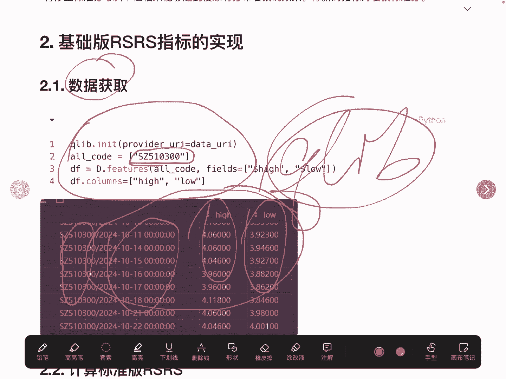

1.  **滚动窗口计算**：使用`rolling`方法，为每个交易日获取其前18个交易日的价格数据窗口。
2.  **线性回归拟合**：对每个窗口内的最低价序列进行一元线性回归。
3.  **提取斜率**：从回归结果中提取斜率系数，该值即为当日的RSRS因子值。
4.  **并行处理优化**：为提高计算效率，对每个窗口的回归计算使用多进程并行处理。

核心计算公式如下，我们对时间窗口 `t` 内的最低价序列 `low[t-N+1: t]` 进行线性回归：
`RSRS_t = slope( linear_regression(low[t-N+1: t]) )`

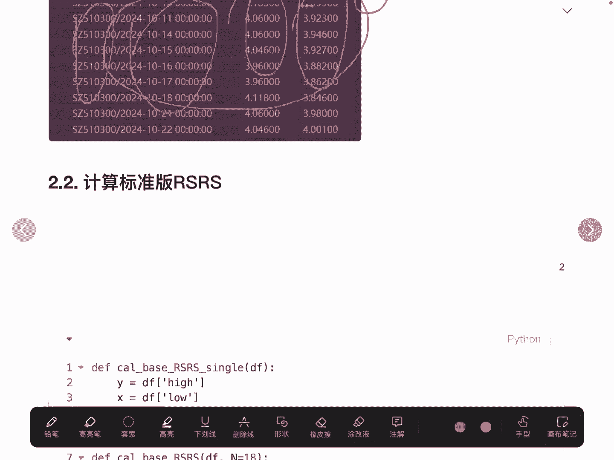

以下是实现该计算的核心代码片段：

```python
import numpy as np
from scipy.stats import linregress
from concurrent.futures import ProcessPoolExecutor

def calculate_slope(window):
    """计算一个价格窗口的线性回归斜率"""
    if len(window) < 18:  # 数据不足则不计算
        return np.nan
    x = np.arange(len(window))  # 自变量：时间序列 [0, 1, 2, ..., 17]
    slope, _, _, _, _ = linregress(x, window)  # 线性回归，获取斜率
    return slope

# 假设‘low_prices’是包含最低价的时间序列
window_size = 18
# 使用滚动窗口并应用多进程计算
with ProcessPoolExecutor() as executor:
    # 创建滚动窗口对象
    rolling_windows = [low_prices[i:i+window_size] for i in range(len(low_prices)-window_size+1)]
    # 并行计算每个窗口的斜率
    slopes = list(executor.map(calculate_slope, rolling_windows))

# 将结果与原始时间索引对齐，前17个位置为NaN
base_rsrs = pd.Series([np.nan]*17 + slopes, index=low_prices.index)
```

计算完成后，我们将结果整理为一个包含股票代码、日期和`base_rsrs`因子的`DataFrame`。

---

## 因子统计特征计算

在得到基础的RSRS因子序列后，我们需要计算其历史统计特征，即均值和标准差。这些统计量对于后续构建基于RSRS的择时策略至关重要，例如用于设定开仓和清仓的信号阈值。

以下是计算过程：
我们直接对计算出的`base_rsrs`因子序列（需剔除NaN值）调用统计函数。

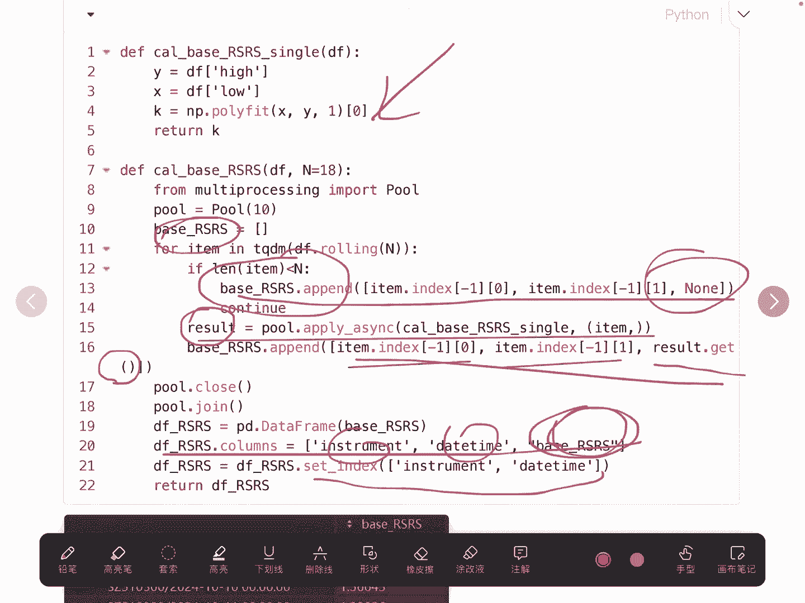

```python
# 计算历史RSRS因子的均值和标准差
rsrs_mean = base_rsrs.dropna().mean()
rsrs_std = base_rsrs.dropna().std()

print(f"RSRS因子历史均值: {rsrs_mean:.2f}")
print(f"RSRS因子历史标准差: {rsrs_std:.2f}")
```
在本示例中，计算得到的均值约为0.9，标准差约为0.12。这两个数值将在下一节课构建策略时使用。

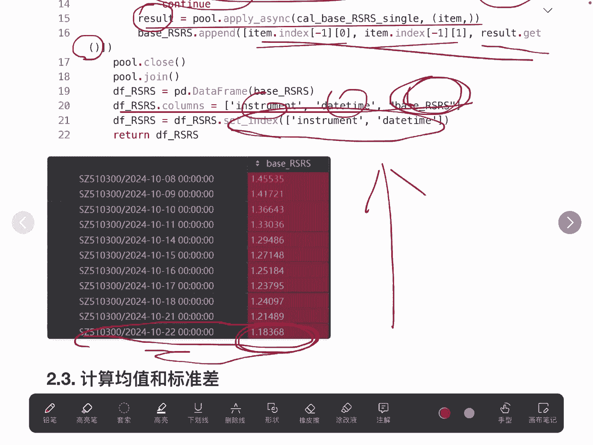

---

## 因子可视化

最后，我们将计算得到的RSRS因子进行可视化，以直观观察其分布和波动情况。

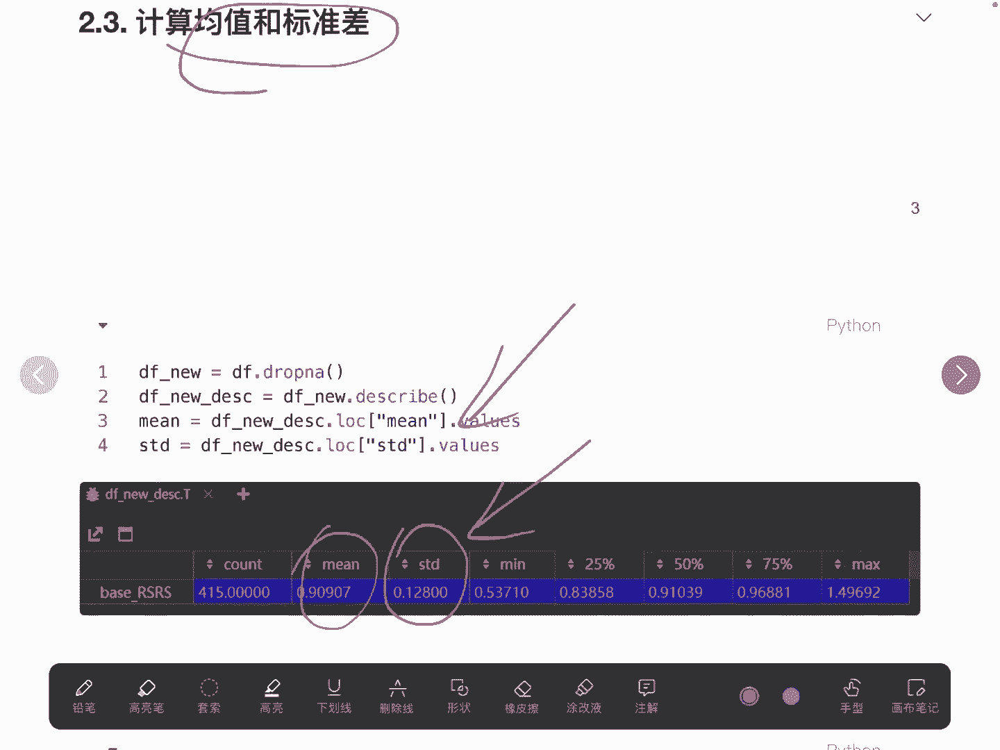

我们绘制RSRS因子随时间变化的曲线，并添加其历史均值线、均值加减一倍标准差的边界线。从图形上看，RSRS因子的分布大致符合正态分布。

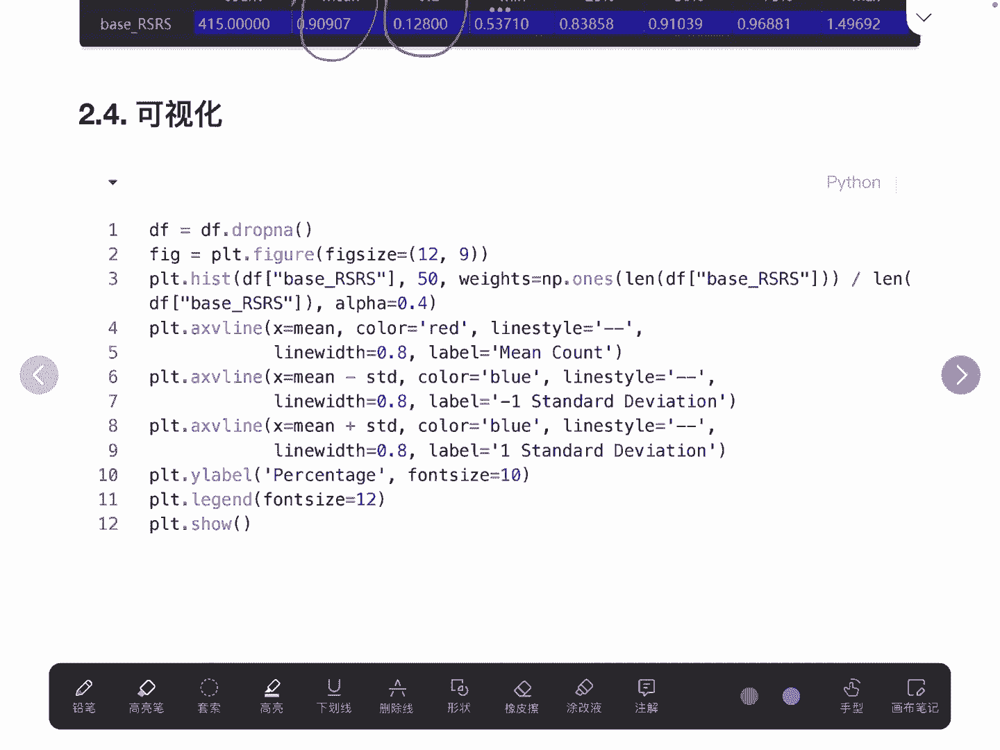

```python
import matplotlib.pyplot as plt

plt.figure(figsize=(12, 6))
plt.plot(base_rsrs.index, base_rsrs.values, label='Base RSRS Factor', linewidth=1)
plt.axhline(y=rsrs_mean, color='r', linestyle='--', label=f'Mean ({rsrs_mean:.2f})')
plt.axhline(y=rsrs_mean + rsrs_std, color='g', linestyle=':', label=f'Mean + 1 Std')
plt.axhline(y=rsrs_mean - rsrs_std, color='g', linestyle=':', label=f'Mean - 1 Std')
plt.title('沪深300ETF Base RSRS Factor')
plt.xlabel('Date')
plt.ylabel('RSRS Value')
plt.legend()
plt.grid(True)
plt.show()
```

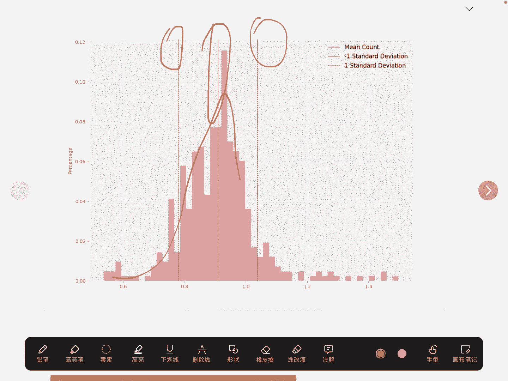

---

## 总结

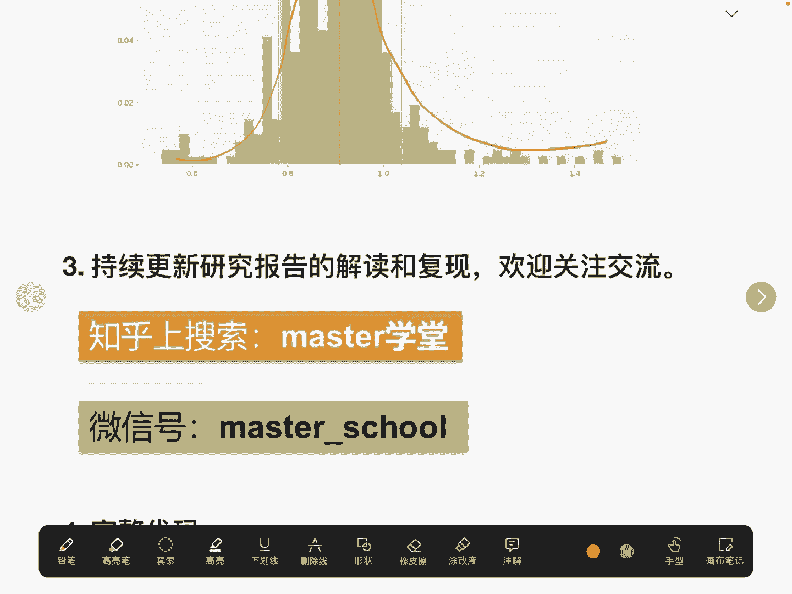

本节课中我们一起学习了基础版RSRS因子的完整计算流程。

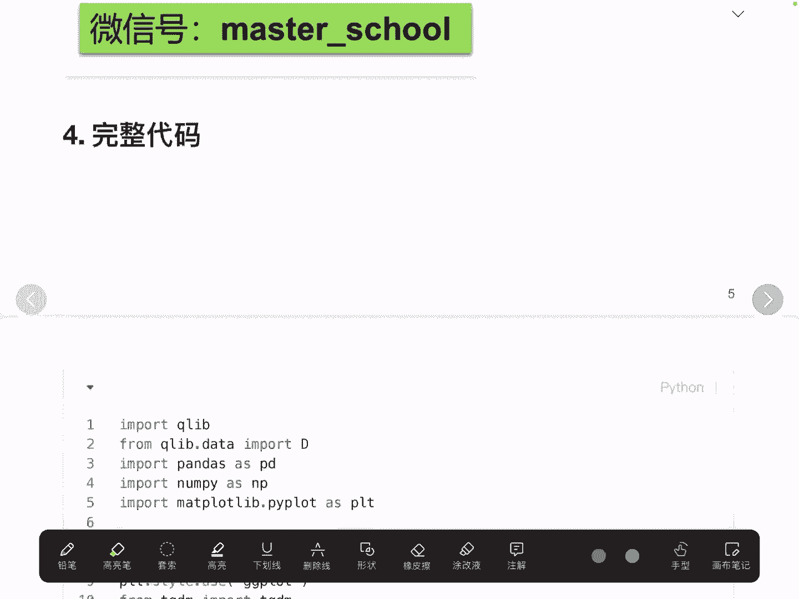

1.  **数据准备**：读取目标股票（如沪深300ETF）的最高价和最低价数据。
2.  **核心计算**：通过对过去18个交易日的最低价序列进行滚动窗口线性回归，将回归斜率作为每日的RSRS因子值。我们使用了多进程技术来提升计算效率。
3.  **统计分析**：计算了因子序列的历史均值与标准差，为策略构建做准备。
4.  **结果可视化**：绘制了因子走势图，并添加了统计参考线，直观展示了因子的分布特征。

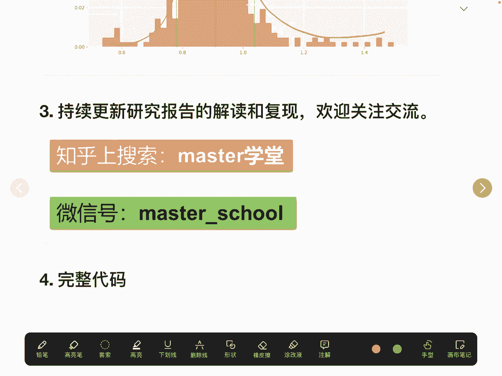

至此，我们已经成功复现了研报中的基础版RSRS因子。在下一节课中，我们将利用本节课计算得到的因子及其统计特征，来构建一个完整的牛市择时交易策略。