# 量化交易系列课程：P1：RSRS因子改进的Python复现教程 📈

在本节课中，我们将学习如何用Python代码实现光大证券研究报告中对RSRS因子的三种改进方案。我们将从获取数据开始，逐步计算基础版、标准化版、修正版和右偏版RSRS因子，为后续的回测分析做好准备。

## 概述

RSRS（阻力支撑相对强度）因子是一个基于价格高低点进行线性回归的技术指标。原始因子存在一定滞后性，研究报告提出了三种改进方法以提升其效果。本节课将详细讲解这些改进方案的代码实现逻辑。

## 数据准备

上一节我们介绍了RSRS因子的基本概念，本节中我们来看看如何准备计算所需的数据。与基础版计算类似，但这里有一个关键调整：我们预先计算下一交易日的收益率，以避免在回测中引入未来函数。

以下是数据准备的步骤：

1.  获取沪深300ETF的历史行情数据，包括日期、开盘价、最高价、最低价和收盘价。
2.  计算下一交易日的收益率，公式为：`次日收益率 = (次日收盘价 / 当日收盘价) - 1`。这确保了在计算当日RSRS因子时，使用的是未来的、尚未发生的价格信息。

```python
# 示例：计算次日收益率
data[‘next_return‘] = data[‘close‘].shift(-1) / data[‘close‘] - 1
```

运行后，数据尾部会出现空值，这是因为最新的交易日没有“次日”的数据，这符合预期。

## 计算基础版RSRS因子

在准备好数据后，我们就可以开始计算因子了。首先，我们来计算最基础的RSRS因子。

基础版RSRS的计算方法是：对过去N个交易日（通常N=18）的最高价和最低价序列进行线性回归，所得回归直线的斜率即为当日的RSRS值。这个过程可以通过`numpy`库的`polyfit`函数快速完成。

```python
# 示例：计算基础版RSRS斜率
window = 18
high = data[‘high‘].rolling(window=window)
low = data[‘low‘].rolling(window=window)

def calc_slope(high_series, low_series):
    # 使用线性回归 y = kx + b，返回斜率k
    slope, _ = np.polyfit(low_series, high_series, 1)
    return slope

data[‘rsrs_basic‘] = high.apply(lambda x: calc_slope(x, data[‘low‘].loc[x.index]))
```

## 计算标准化RSRS因子

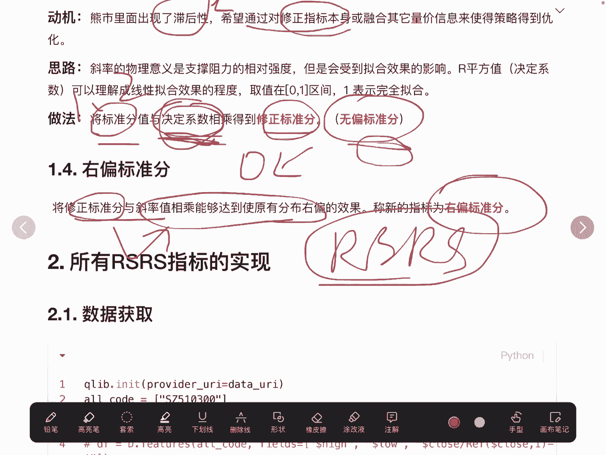

基础版RSRS的数值范围不稳定，第一种改进方案是对其进行标准化处理，以消除量纲影响，使其更具可比性。

标准化RSRS的计算方法是：取过去M个交易日（例如M=600）的基础RSRS值序列，计算其均值(`mean`)和标准差(`std`)。当日的基础RSRS值减去该均值，再除以该标准差，即得到标准化分数。

公式表示为：
`RSRS_standardized = (RSRS_basic_t - mean(RSRS_basic[t-M:t-1])) / std(RSRS_basic[t-M:t-1])`

以下是计算步骤：

1.  设定回看周期，例如600天。
2.  计算基础RSRS序列在该周期内的滚动均值和滚动标准差。
3.  应用上述公式进行计算。

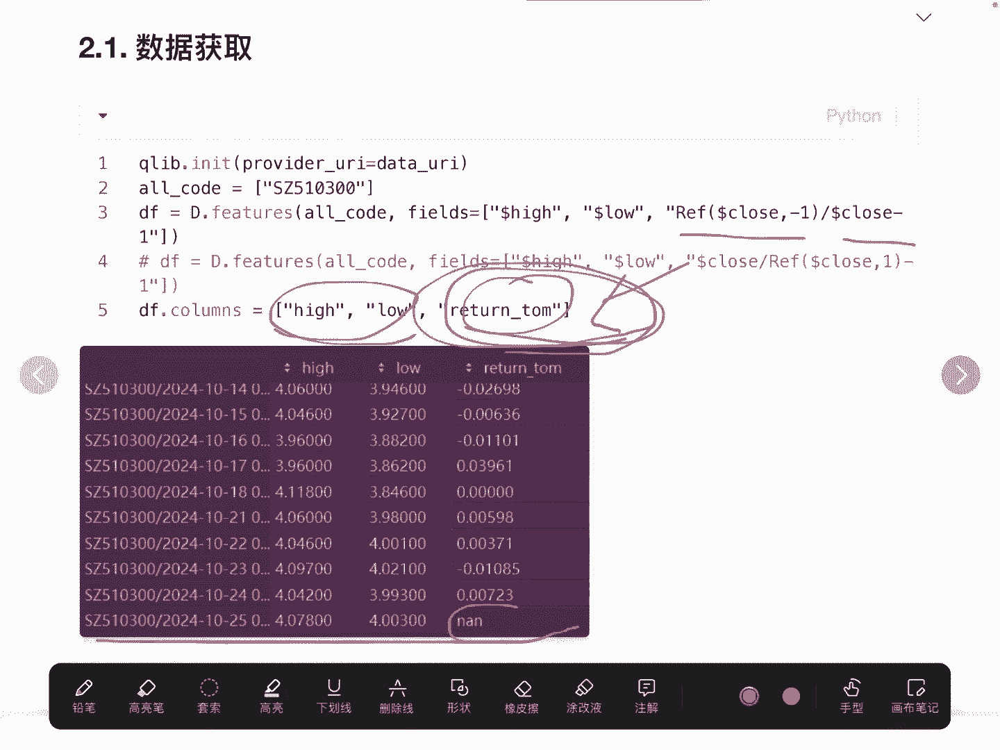

```python
lookback_days = 600
data[‘rsrs_mean‘] = data[‘rsrs_basic‘].rolling(window=lookback_days).mean()
data[‘rsrs_std‘] = data[‘rsrs_basic‘].rolling(window=lookback_days).std()
data[‘rsrs_standard‘] = (data[‘rsrs_basic‘] - data[‘rsrs_mean‘]) / data[‘rsrs_std‘]
```

## 计算修正标准分RSRS因子

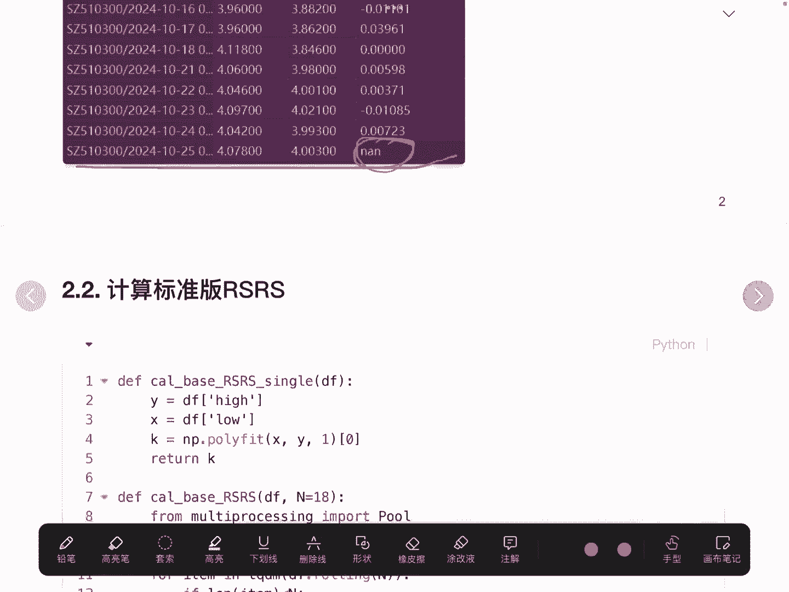

研究发现标准化后的因子仍存在滞后性。第二种改进方案是引入线性回归的决定系数（R²）来修正标准化分数，旨在降低拟合质量差时的信号权重。

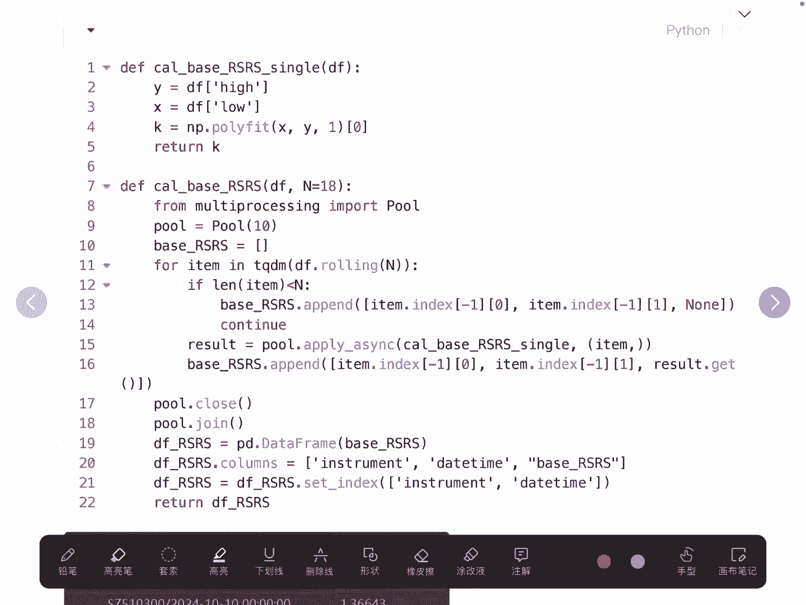

修正标准分的计算方法是：在计算标准化RSRS的同一回归窗口中，同时计算该次线性回归的决定系数R²。然后将标准化分数与R²相乘。

公式表示为：
`RSRS_modified = RSRS_standardized * R²`

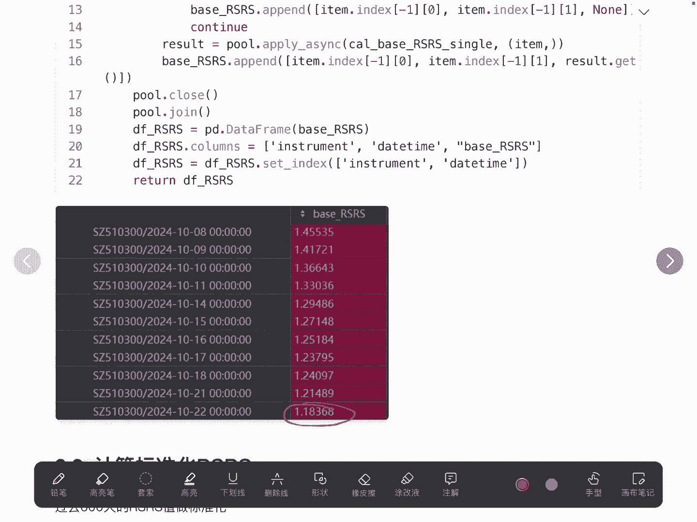

理解其逻辑：如果最高价与最低价的线性关系拟合得很好（R²接近1），则修正后的分数接近原标准化分数；如果拟合得很差（R²接近0），则原分数会被大幅削弱，从而减少不可靠信号的影响。

以下是实现方法：

1.  在计算斜率时，使用`statsmodels`库或类似方法，以便同时获取R²值。
2.  记录每个窗口回归的R²。
3.  将R²与对应的标准化RSRS值相乘。

```python
import statsmodels.api as sm

def calc_slope_and_r2(high_series, low_series):
    # 添加常数项用于OLS回归
    low_with_const = sm.add_constant(low_series)
    model = sm.OLS(high_series, low_with_const).fit()
    slope = model.params[1] # 斜率
    r_squared = model.rsquared # 决定系数 R²
    return slope, r_squared

# 应用函数计算斜率和R²
data[‘rsrs_basic‘], data[‘r_squared‘] = zip(*data.rolling(window=window).apply(lambda df: calc_slope_and_r2(df[‘high‘], df[‘low‘]), raw=False))
# 计算修正标准分
data[‘rsrs_modified‘] = data[‘rsrs_standard‘] * data[‘r_squared‘]
```

## 计算右偏标准分RSRS因子

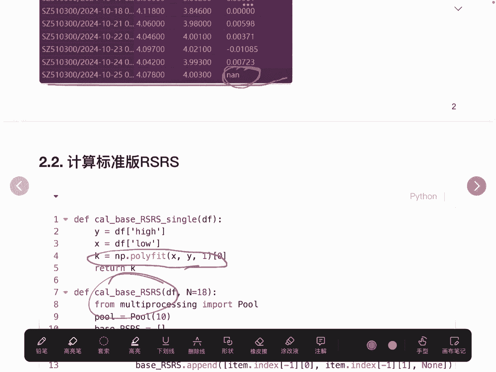

在分析中，研究者发现正值的标准分信号效果更好。第三种改进方案旨在将因子值更多地“推”向正半轴。

右偏标准分的计算方法非常简单：将第二种改进得到的修正标准分，与最初的基础版RSRS值相乘。

公式表示为：
`RSRS_right_skewed = RSRS_modified * RSRS_basic`

可以这样理解：由于基础版RSRS是斜率，其本身可正可负。当修正标准分与一个正的基础RSRS相乘时，结果为正；与一个负的基础RSRS相乘时，结果为负。但通过对历史序列的观察，这种乘法操作在整体上产生了使因子值更偏向正半轴的效果。

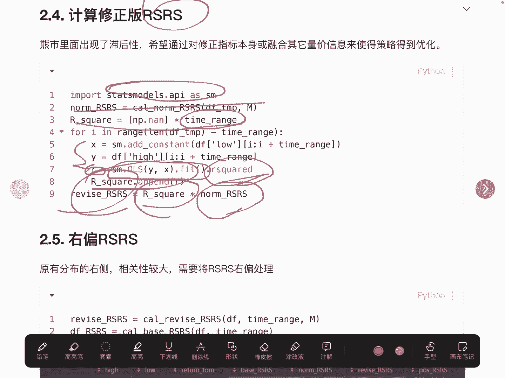

```python
data[‘rsrs_right_skewed‘] = data[‘rsrs_modified‘] * data[‘rsrs_basic‘]
```

## 结果汇总与后续步骤

至此，我们已经完成了四种RSRS因子的计算：

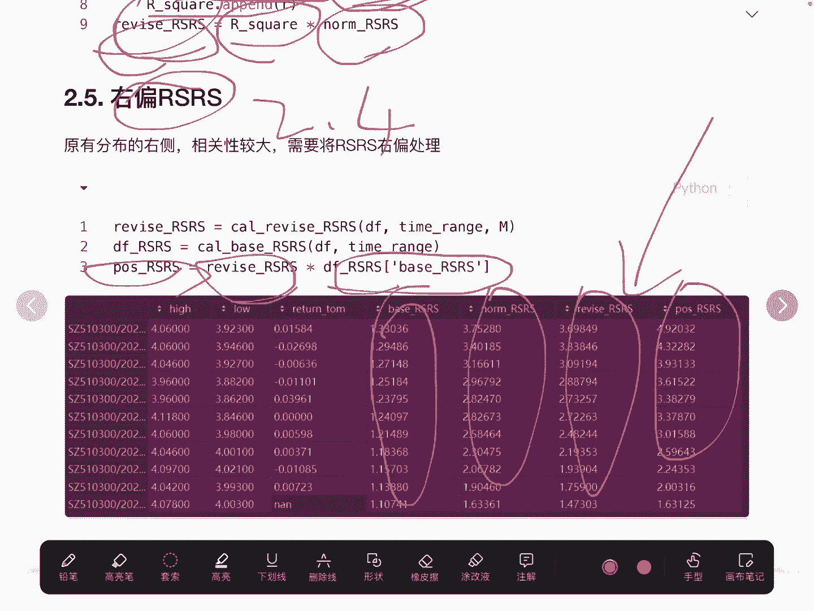

1.  `rsrs_basic`: 基础版斜率因子。
2.  `rsrs_standard`: 标准化后的因子。
3.  `rsrs_modified`: 用决定系数修正后的因子。
4.  `rsrs_right_skewed`: 右偏标准分因子。

我们可以将计算结果进行展示，以对比不同因子的数值序列。

```python
# 展示计算出的因子列
factor_columns = [‘rsrs_basic‘, ‘rsrs_standard‘, ‘rsrs_modified‘, ‘rsrs_right_skewed‘]
print(data[factor_columns].tail())
```

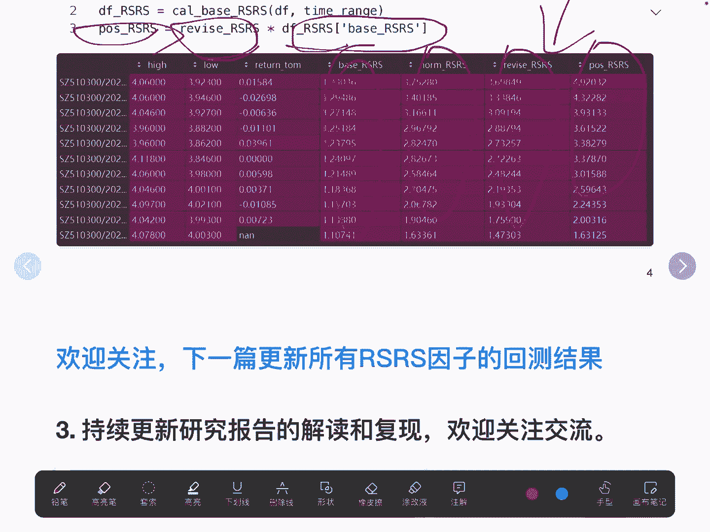

计算完成这些因子后，接下来的工作就是评估它们的表现。在下一节课中，我们将对这些因子进行回测，分析它们的收益、风险指标以及彼此间的相关性，从而验证不同改进方案的实际效果。

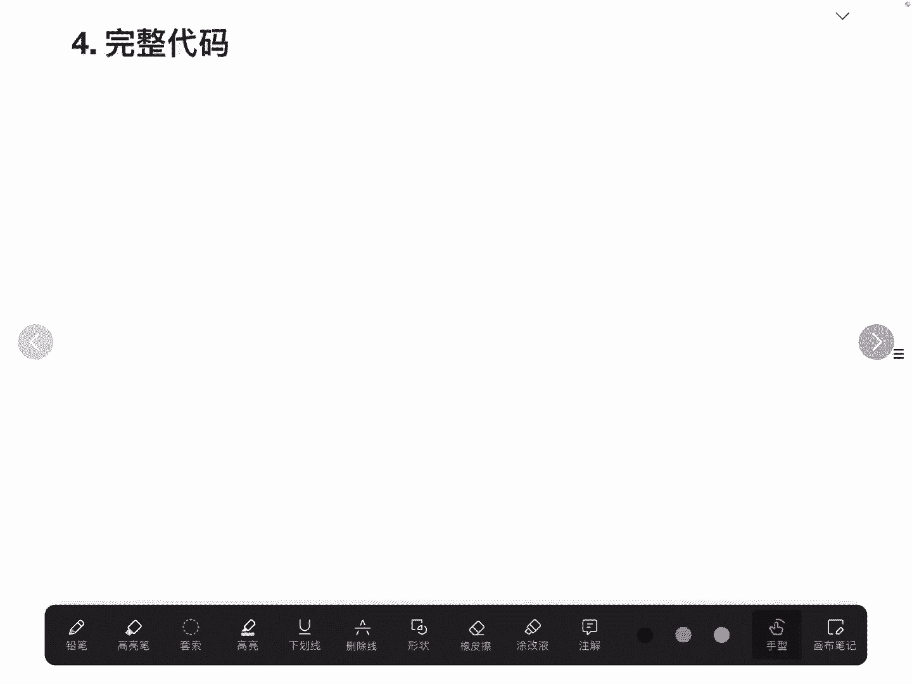

## 总结

本节课中我们一起学习了RSRS因子的三种Python改进实现。我们从数据预处理开始，避免了未来函数；然后逐步实现了基础版、标准化、修正标准分和右偏标准分四种RSRS因子。核心在于理解每种改进背后的逻辑：标准化是为了稳定数值分布，引入R²是为了惩罚低质量的拟合信号，而相乘构造右偏分则是为了强化正向信号。这些代码为后续的量化策略回测奠定了坚实的基础。

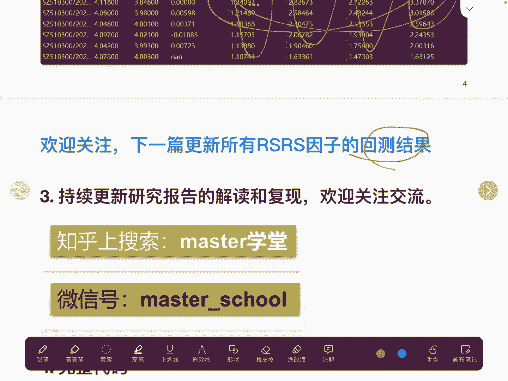

> 完整代码可在相关文章页面或作者动态中获取。