# 量化交易系列26研报复现：P1：基于CCK模型的股票市场羊群效应研究Python复现

在本节课中，我们将学习如何使用Python复现基于CCK模型的股票市场羊群效应研究。我们将从核心概念出发，逐步完成数据处理、因子计算、策略构建和回测分析的全过程。

## 概述

CCK模型于2000年被提出，其核心思想是利用成分股收益率相对于市场收益率离散度的变化来识别羊群效应的发生。策略分为两个主要步骤：首先计算绝对离散度，然后通过拟合回归方程获取关键系数，并以此作为判断羊群效应的指标，进而生成交易信号。

## 数据读取与处理

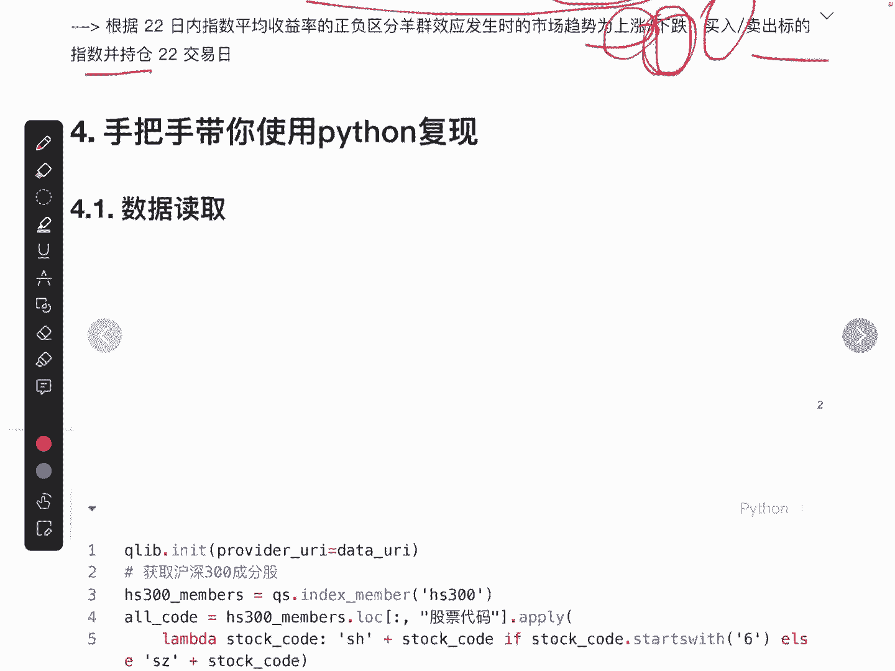

上一节我们介绍了CCK模型的基本原理，本节中我们来看看如何获取和处理所需数据。

数据读取涉及获取沪深300指数成分股及其历史收益率。我们使用特定API获取成分股列表，并额外加入沪深300ETF作为市场基准。最终，我们需要两类数据：每只成分股的日收益率和沪深300ETF的日收益率。

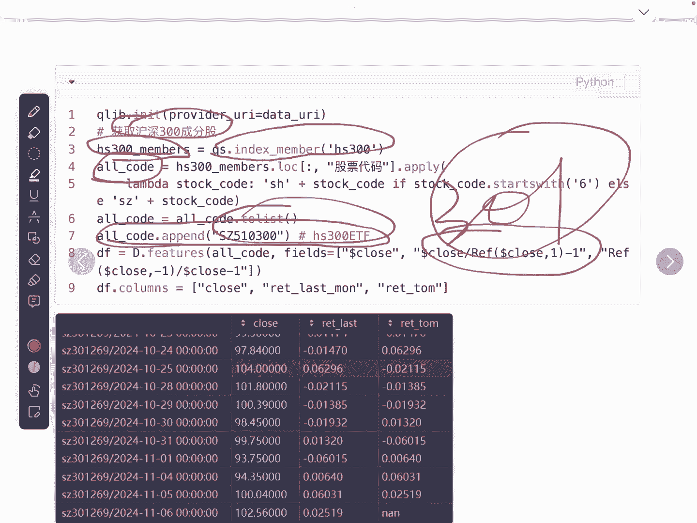

以下是数据处理的关键步骤：

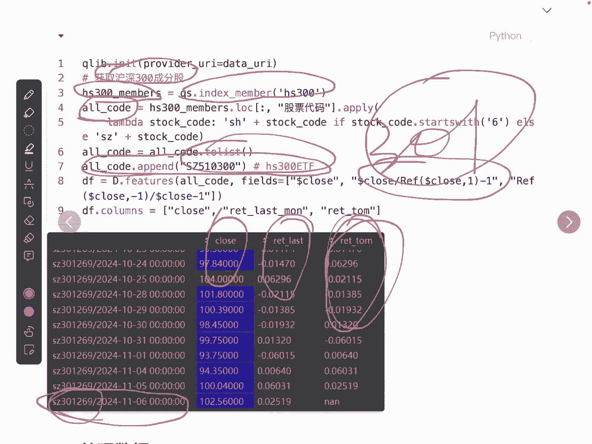

1.  **分离股票与指数数据**：将数据框中的股票数据（成分股）与指数数据（沪深300ETF）分开。
2.  **重塑股票数据格式**：原始股票数据通常是多层索引（股票代码、日期）。我们需要将其转换为以日期为索引、股票代码为列、收益率为值的宽表格式。这可以通过Pandas的 `pivot` 函数实现。
    ```python
    # 示例：重塑股票数据格式
    stock_returns_pivot = stock_returns_df.pivot(index=‘date’, columns=‘code’, values=‘return’)
    ```
3.  **处理指数数据**：指数数据只有一列，处理相对简单，确保其日期索引与股票数据对齐即可。

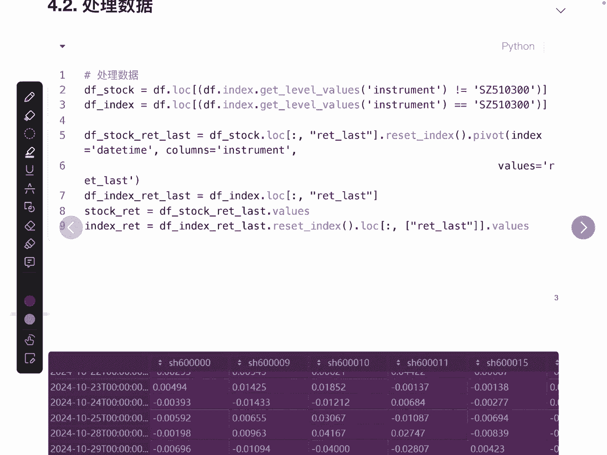

处理完成后，我们得到两个核心数据结构：一个包含所有股票日收益率的矩阵，和一个代表市场日收益率的序列。

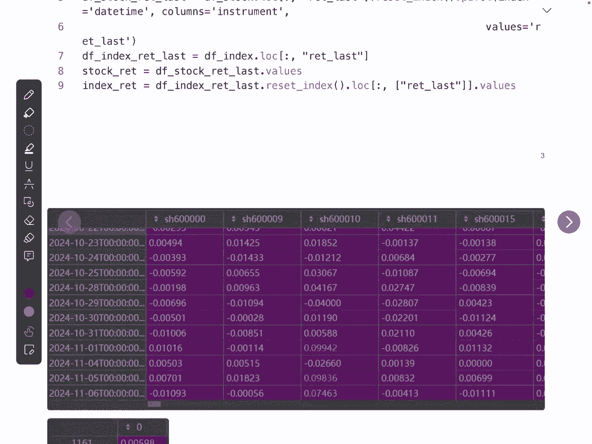

## 计算CCK模型因子（Beta系数）

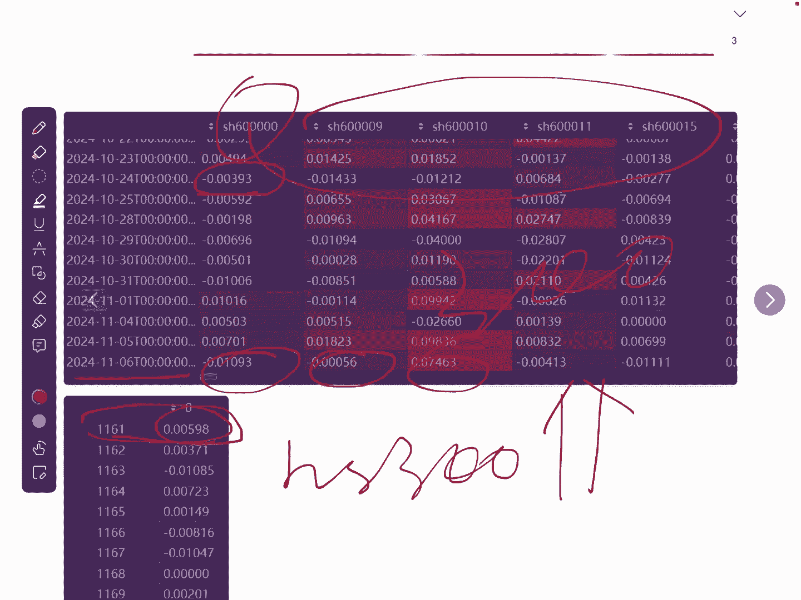

在准备好数据后，接下来我们进入核心环节：计算CCK模型的评价指标——Beta系数。这个过程分为两步：计算绝对离散度（CSAD）和进行回归拟合。

**第一步：计算绝对离散度（CSAD）**
绝对离散度衡量了在特定交易日，所有成分股收益率偏离市场收益率的平均程度。其计算公式如下：
`CSAD_t = (1/N) * Σ |R_i,t - R_m,t|`
其中，`R_i,t` 是股票i在t日的收益率，`R_m,t` 是市场（沪深300ETF）在t日的收益率，N是股票数量。计算时需注意处理缺失值（如停牌股票）。

**第二步：回归拟合获取Beta系数**
研究报告将CSAD作为因变量（Y），将市场收益率的绝对值（|R_m,t|）及其平方值（(R_m,t)^2）作为自变量（X1, X2），进行如下回归拟合：
`CSAD_t = α + β1 * |R_m,t| + β2 * (R_m,t)^2 + ε_t`
我们关注的是二阶项系数 `β2`。在Python中，可以使用NumPy的线性最小二乘法 `np.linalg.lstsq` 进行拟合。
```python
# 示例：使用最小二乘法进行回归拟合
# X 是自变量矩阵，包含 |R_m| 和 (R_m)^2 两列
# Y 是因变量 CSAD
beta_coefficient = np.linalg.lstsq(X, Y, rcond=None)[0][1]  # 获取 beta2 系数
```
最终得到的 `β2` 系数即为我们的核心因子。根据研报，当 `β2` 显著为负时，表明市场存在羊群效应。

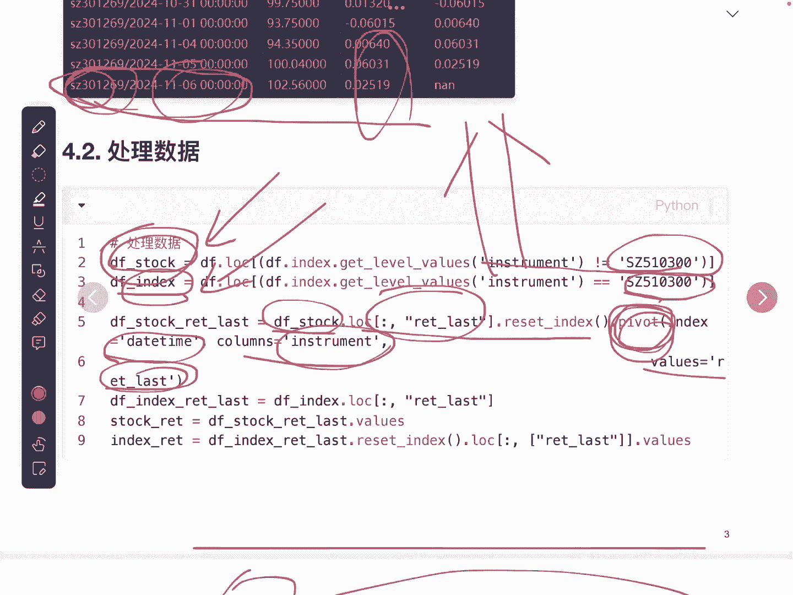

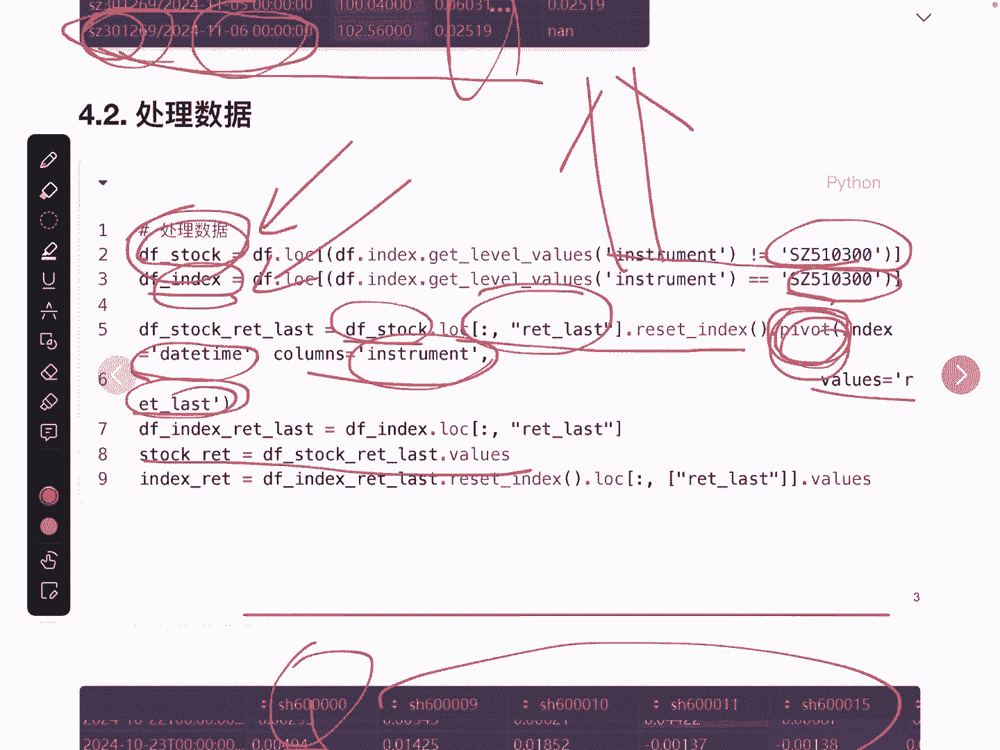

## 构建并执行交易策略

得到Beta因子后，我们就可以依据它来构建具体的择时交易策略。策略逻辑基于两个条件：羊群效应是否存在（由Beta因子判断），以及市场整体趋势是上涨还是下跌。

策略规则如下：
*   **买入/持仓信号**：当 `β2` 系数小于某个阈值（例如-1），**且**市场近期收益率大于0（上涨趋势）时，发出买入或持仓信号。
*   **卖出/空仓信号**：当 `β2` 系数小于阈值，**但**市场近期收益率小于或等于0（下跌或盘整趋势）时，发出卖出或空仓信号。

以下是策略执行的要点：

1.  **生成日频信号**：根据上述规则，逐日计算得到一个由0（空仓）和1（持仓）组成的信号序列。
2.  **转换为月频持仓**：研报采用月频率调仓。这意味着，在每月初根据信号决定本月操作。如果月初信号为1，则本月所有交易日持仓；如果为0，则本月所有交易日空仓。
3.  **计算基准信号**：同时生成一个始终持仓的基准信号序列，用于对比。
4.  **计算净值曲线**：利用持仓信号和下一交易日的收益率数据，计算策略和基准的资产净值曲线。计算需考虑有无交易手续费两种情景。
    ```python
    # 简化的净值计算逻辑（未考虑手续费）
    nav = (1 + (position_signal * next_day_return)).cumprod()
    ```

## 策略回测与结果分析

策略执行完毕后，我们需要对结果进行可视化和量化评估，以判断其有效性。

首先，对净值曲线进行可视化。通常将策略净值曲线（红色）与基准净值曲线（蓝色）绘制在同一图中进行对比。理想情况下，策略应在市场大跌（熊市）期间通过空仓有效控制回撤。

其次，生成详细的量化风险报告。报告应包含以下关键绩效指标：
*   年化收益率
*   最大回撤及其持续时间
*   夏普比率
*   胜率（盈利交易占比）
*   总交易次数
*   总持仓天数

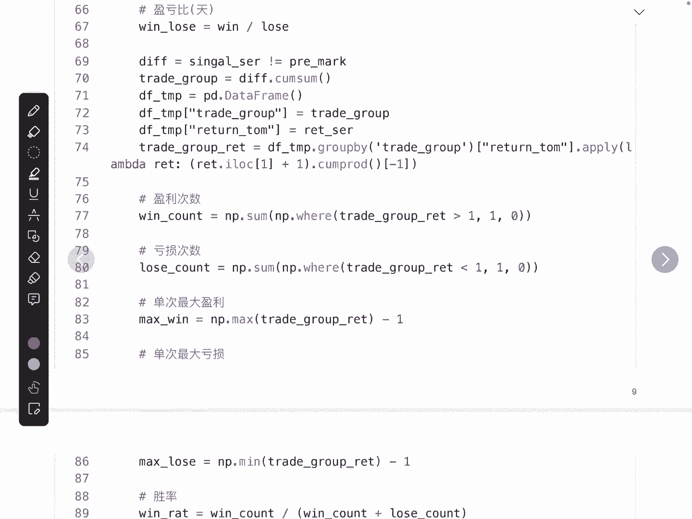

通过分析这些指标，我们可以全面评估该羊群效应择时策略的风险收益特征。

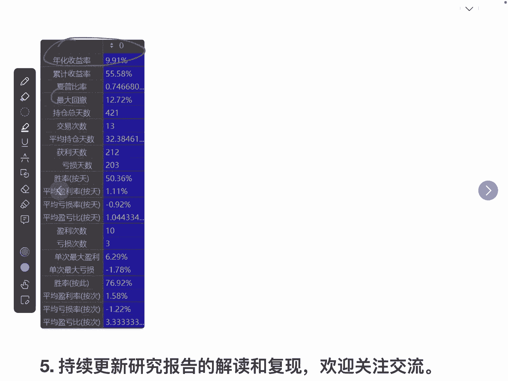

## 总结

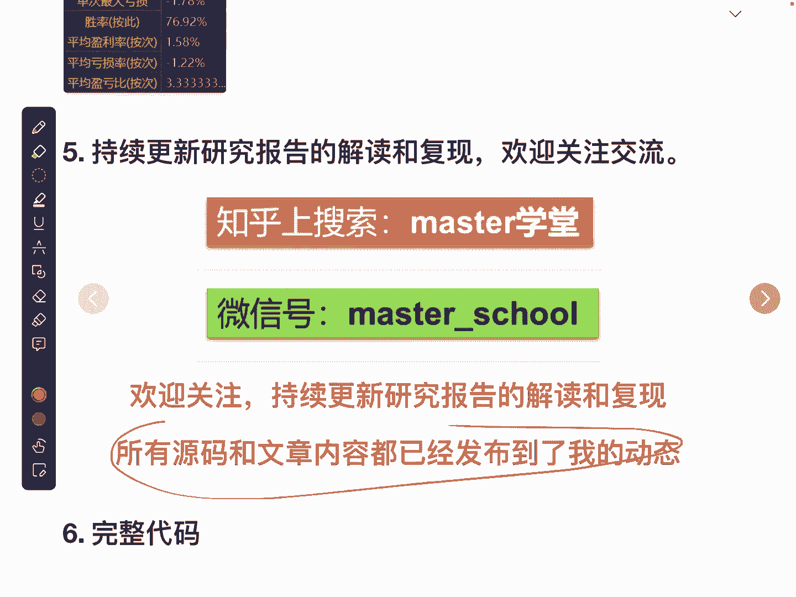

本节课我们一起学习了基于CCK模型的股票市场羊群效应研究的完整Python复现流程。我们从数据获取与处理开始，详细讲解了CCK模型核心因子（Beta系数）的计算方法，接着依据研报逻辑构建了择时交易策略，并最终完成了策略的回测与绩效分析。该策略的核心在于利用市场离散度与收益率之间的非线性关系（`β2`系数）来识别群体非理性行为，并在市场下跌且存在羊群效应时通过空仓规避风险。所有实现代码均已提供，可供进一步研究和优化。