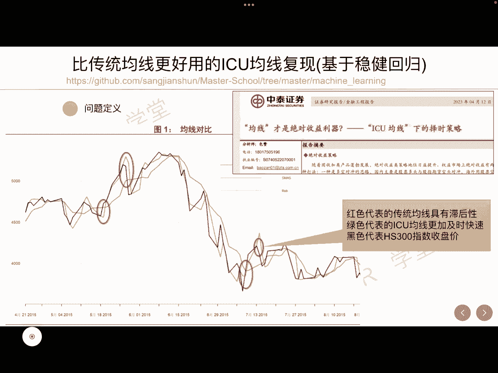
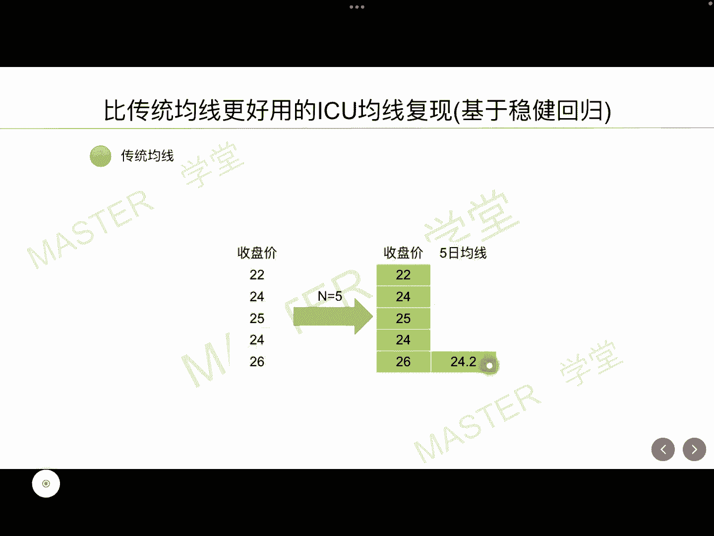
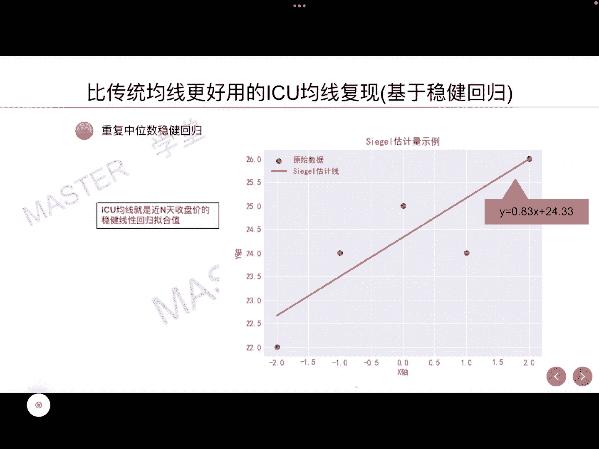
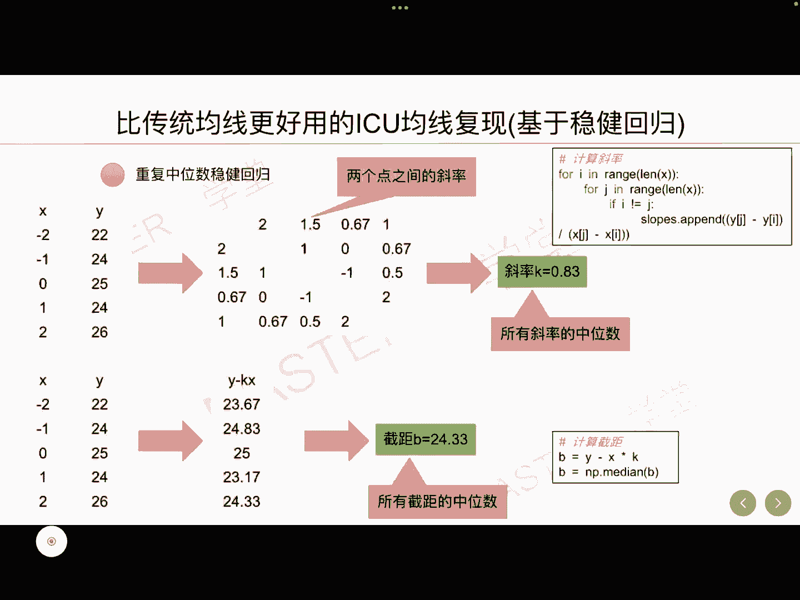
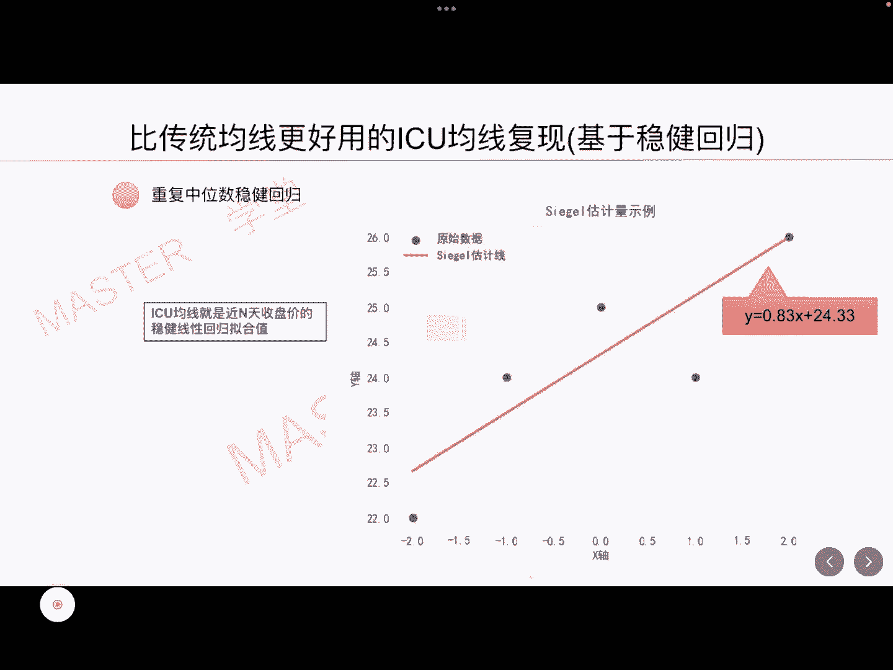
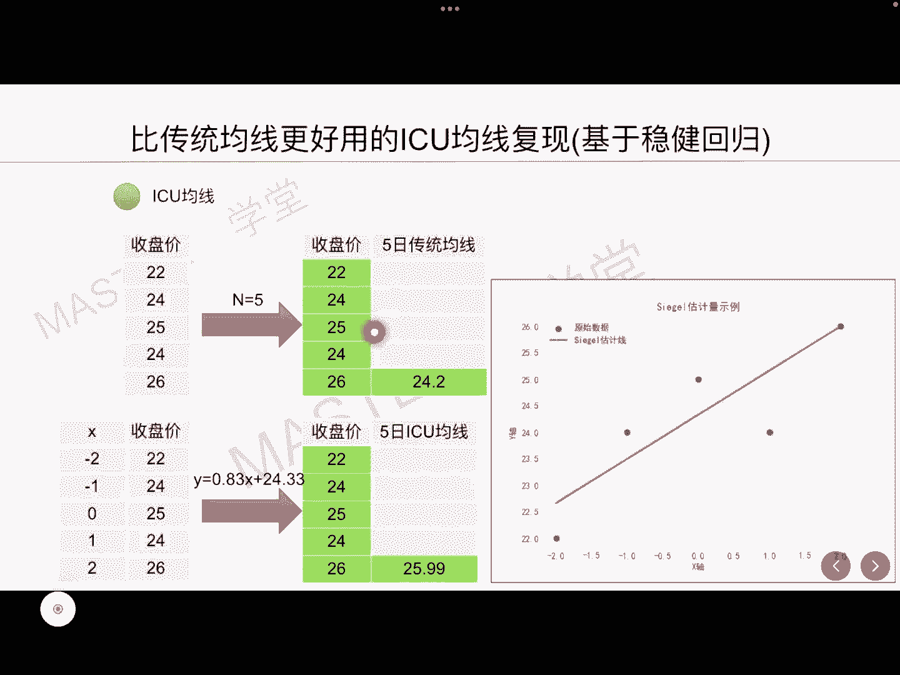
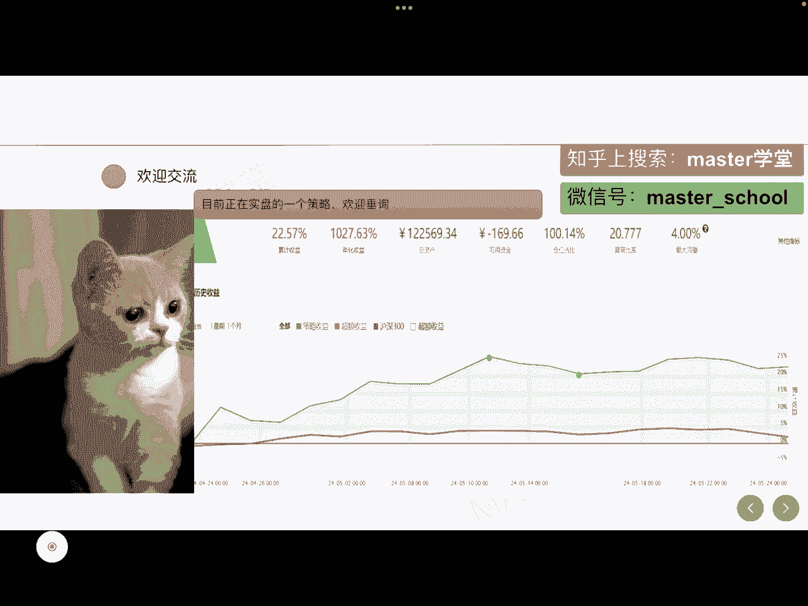

# 量化交易系列：6：比传统均线更好用的ICU均线复现（基于稳健回归）📈

在本节课中，我们将要学习一种名为ICU均线的技术指标。ICU均线基于稳健回归方法构建，相比传统移动平均线，它对市场噪音数据更加鲁棒，能够更及时地反映股价变化，有效缓解传统均线的滞后性问题。

## 传统均线与ICU均线对比

上一节我们介绍了课程目标，本节中我们来看看ICU均线与传统均线的核心区别。

传统移动平均线（如5日均线）是近期收盘价的算术平均值。其计算公式为：
`MA = (P1 + P2 + ... + Pn) / n`
其中，`P`代表收盘价，`n`代表周期数。例如，收盘价为`[20, 22, 24, 25, 26]`时，5日传统均线值为`(20+22+24+25+26)/5 = 24.2`。



传统均线的主要缺点是具有滞后性，尤其在长周期下，延迟更为严重。而ICU均线则能更快速地感知价格变化。

## ICU均线的核心原理



理解了传统均线的不足后，本节我们来深入探讨ICU均线的核心计算原理。

ICU均线最核心的技术是**重复中位数稳健回归**。以5日ICU均线为例，它并非简单平均，而是对近五天的收盘价进行稳健线性回归拟合。

以下是其计算思想的感性认识：
1.  为五个收盘价数据点分配一个横坐标序列，例如 `[-2, -1, 0, 1, 2]`。
2.  收盘价作为纵坐标（Y值）。
3.  使用一条直线去拟合这五个数据点，拟合技术采用稳健线性回归。
4.  最终得到的直线公式中，将最新的横坐标（例如 `x=2`）代入，计算出的Y值即为当日的ICU均线值。

## ICU均线计算步骤详解



上一节我们了解了ICU均线的思想，本节中我们通过一个具体例子，一步步拆解其详细计算过程。

假设最近五个收盘价为：`[22, 24, 25, 24, 26]`，对应横坐标 `x = [-2, -1, 0, 1, 2]`。

**第一步：计算斜率K的中位数**
我们需要计算所有数据点两两组合的斜率。

以下是计算斜率的代码逻辑：
```python
# 假设 prices = [22, 24, 25, 24, 26], x = [-2, -1, 0, 1, 2]
slopes = []
for i in range(len(prices)):
    for j in range(i+1, len(prices)):
        slope = (prices[j] - prices[i]) / (x[j] - x[i])
        slopes.append(slope)
# 计算斜率中位数
K = median(slopes)
```
根据数据计算，会得到一系列斜率值，例如：`[2, 1.5, 0.67, 1, ...]`。取这些斜率的中位数，得到 `K = 0.83`。

**第二步：计算截距B的中位数**
得到斜率K后，计算每个数据点对应的截距 `B_i = Y_i - K * X_i`。

计算过程如下：
1.  分别将五个点`(x, y)`代入公式 `B = y - K*x`。
2.  得到五个截距值：`[23.66, 24.83, 25, 23.17, 24.34]`。
3.  取这五个截距的中位数，得到 `B = 24.33`。



**第三步：确定直线公式并计算ICU值**
至此，我们得到稳健回归的直线公式为：
`y = 0.83 * x + 24.33`



要计算最后一天（`x=2`）的ICU均线值，将 `x=2` 代入公式：
`ICU = 0.83 * 2 + 24.33 = 25.99`

可以看出，对于收盘价序列`[22, 24, 25, 24, 26]`，5日传统均线值为`24.2`，而5日ICU均线值为`25.99`。ICU均线的计算结果更接近最新的价格`26`，体现了其对价格变化的快速响应能力。



## 总结



本节课中我们一起学习了ICU均线。我们首先对比了传统均线的滞后性与ICU均线的快速响应优势。然后，我们深入探讨了ICU均线的核心——基于重复中位数法的稳健回归原理。最后，我们通过一个完整的计算示例，一步步演示了如何从收盘价计算出ICU均线值。掌握该方法后，你可以将其应用于量化策略中，构建对市场变化更敏感的择时指标。