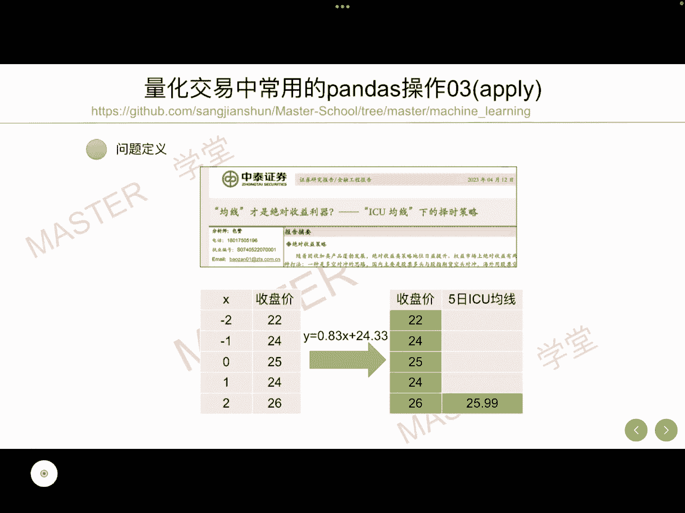
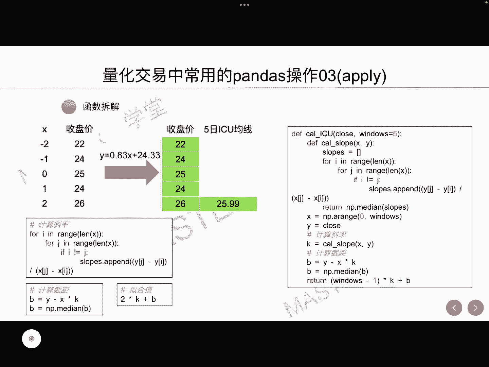
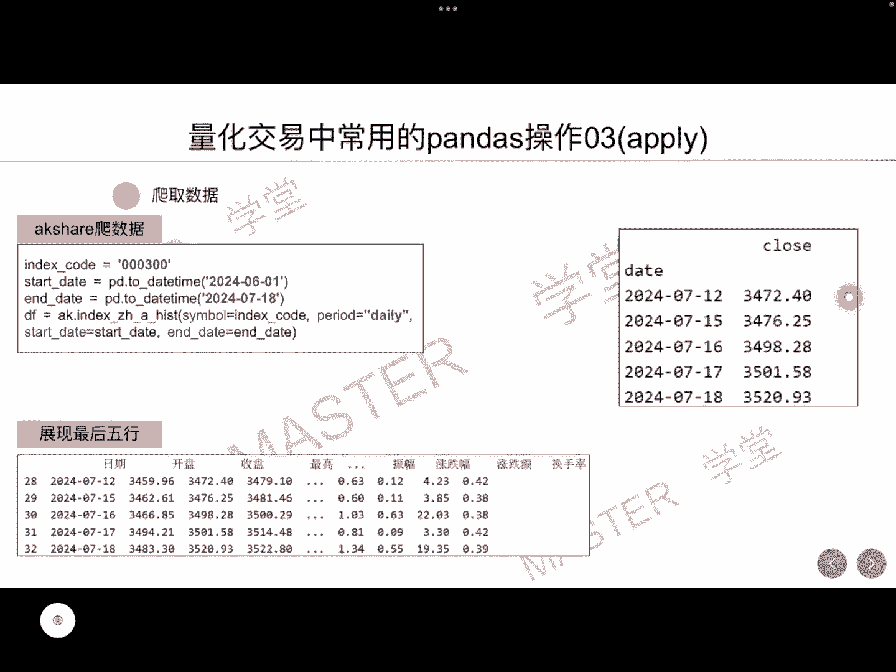
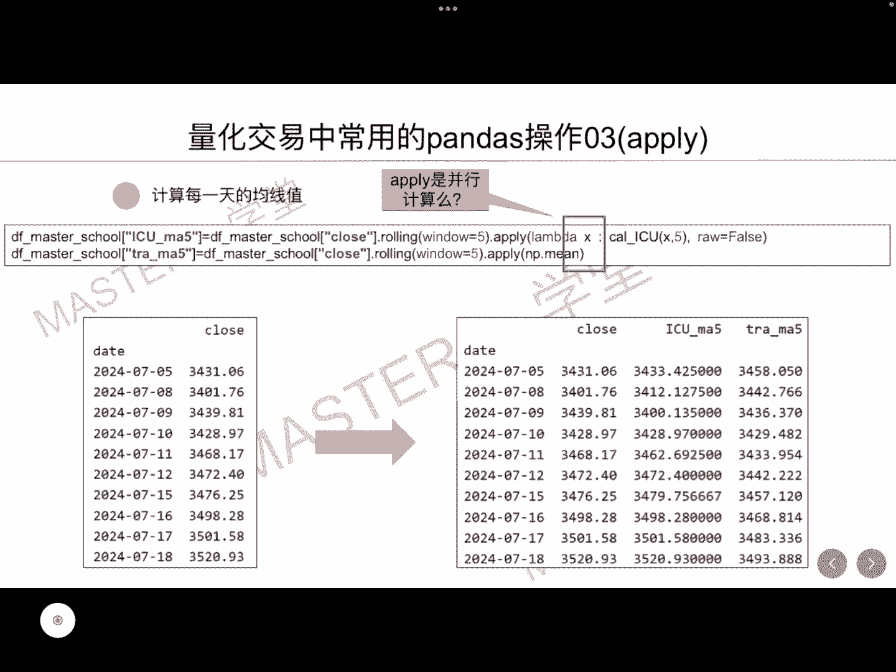
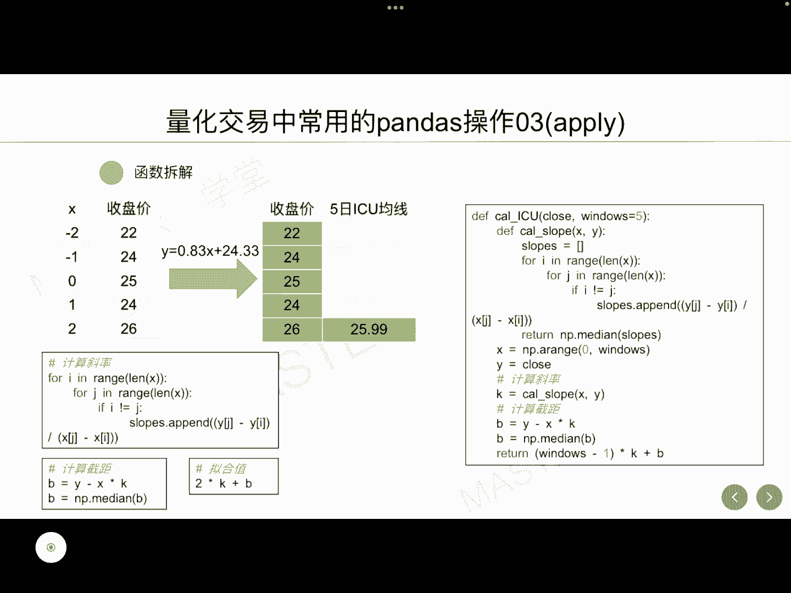
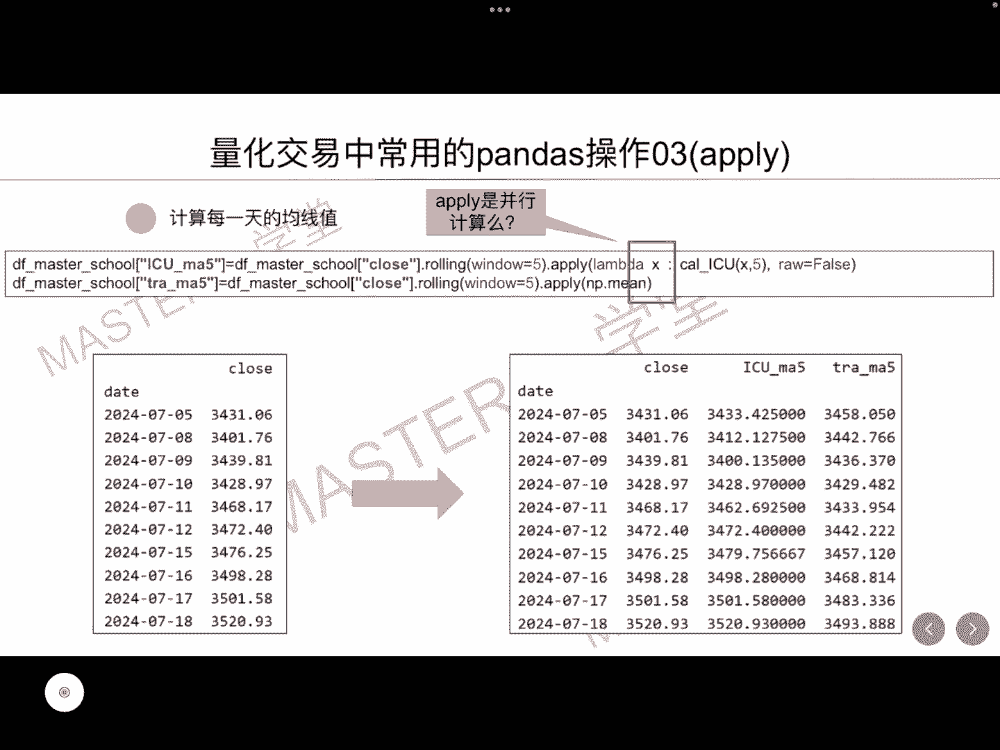
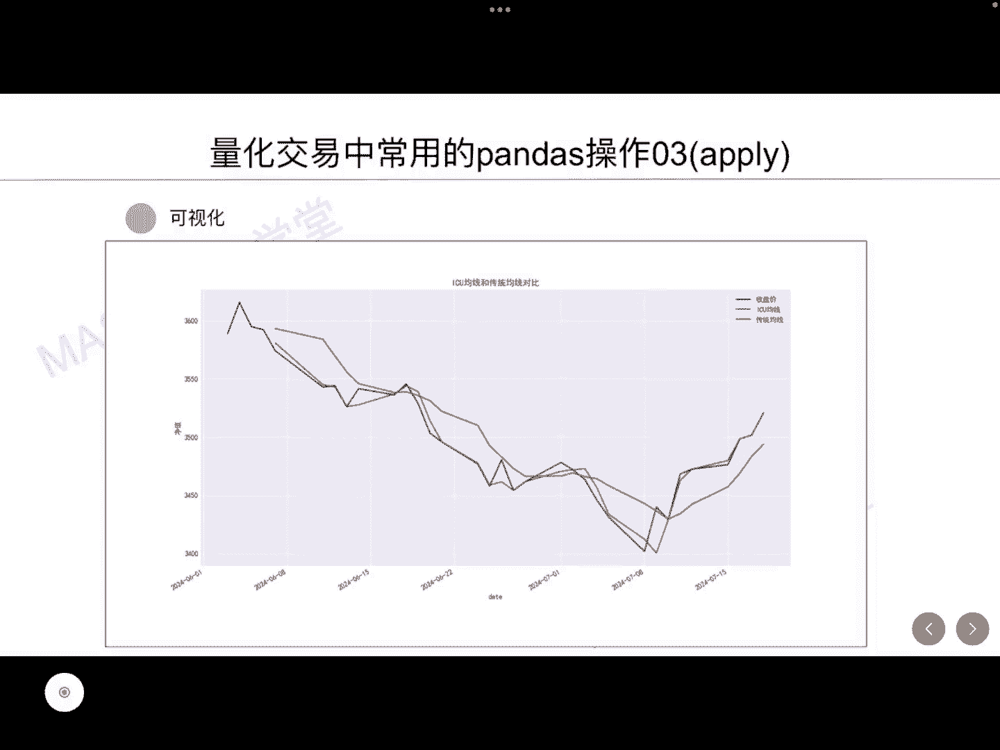

# 量化交易系列：7：量化交易中常用的pandas操作03（apply）📈

在本节课中，我们将学习如何在量化交易中使用pandas的`apply`函数。我们将通过一个具体的案例——计算ICU均线，来掌握如何高效地对数据序列进行滚动计算。`apply`函数是处理复杂数据转换的强大工具，能让我们避免繁琐的循环，写出更简洁、高效的代码。

## 概述：ICU均线简介

上一节我们介绍了中泰证券研究报告中的ICU均线择时策略。ICU均线是一种比传统均线反应更及时、更快速的均线系统。它的输入是收盘价序列。基于ICU均线的计算方式，我们可以计算收盘价序列对应的斜率和截距，然后利用公式计算出特定日期的ICU均线值，例如某一天的5日ICU均线值为25.99。

接下来，我们将分享如何利用`apply`接口，对整个时间序列的5日ICU均线进行平滑计算。本节课的所有代码示例都将分享在GitHub上。

## 计算步骤分解

前面我们将ICU均线的计算拆解为三个步骤：
1.  计算斜率。
2.  计算截距。
3.  基于斜率和截距计算拟合值（即ICU均线值，例如25.99）。

我们将这三个步骤封装成一个函数。这个函数的输入是一个收盘价序列。需要注意的是，传入的序列长度等于我们设定的窗口大小（例如5天）。因此，我们可以对函数进行简化，例如去掉显式的窗口参数，因为序列长度本身就隐含了窗口信息。

## 传统循环计算方式

如何计算每一天对应的ICU均线呢？一个容易想到的方法是使用循环。我们可以遍历收盘价序列，每次取出连续的5个收盘价，调用封装好的函数计算出一个均线值。通过这种循环，我们可以计算出所有的均线值。

## 使用apply函数进行计算 🚀

本节我们将重点介绍使用`apply`函数进行计算的方法。首先，我们需要获取数据。

以下是获取和准备数据的步骤：
*   第一步：爬取沪深300指数从6月1日到7月18日的收盘价数据。
*   第二步：将获取到的数据转换为pandas DataFrame格式，并以时间为索引，收盘价为列。

数据准备完成后，我们就可以使用`rolling`和`apply`这两个接口，结合一个简化的lambda函数，来计算每一天的ICU均线。

具体计算逻辑如下：
*   `rolling(window=5)`表示我们每次抓取一个长度为5的收盘价序列（一个子DataFrame）。
*   `apply`方法会针对这个包含5条数据的子DataFrame，调用我们封装好的ICU计算函数。
*   函数的输入是这5条收盘价数据，输出则是通过封装函数计算得到的ICU均线值（一个数值，例如25.99）。

通过这种方式，`apply`函数会为整个时间序列中的每一个窗口自动执行计算，从而得到所有的5日ICU均线值。我们将计算结果赋值到一个新的列中。

同样地，我们也可以使用相同的方法计算传统的5日移动平均线。我们取5天的子序列，然后应用求均值的函数（如`np.mean`），即可得到传统的5日均线。

最终，我们得到包含收盘价、ICU均线和传统均线的完整DataFrame。通过观察数据可以发现，ICU均线值比传统均线更接近收盘价。

## 数据可视化展示 📊

最后，我们将收盘价、ICU均线（绿色）和传统均线进行可视化展示。结果符合我们的预期：绿色的ICU均线更加贴近收盘价的走势，这印证了其反应更及时、更快速的特点。

## 总结

本节课我们一起学习了pandas中`apply`函数在量化交易中的应用。我们通过计算ICU均线的具体案例，掌握了如何将复杂计算封装成函数，并利用`rolling().apply()`的组合对时间序列进行高效的滚动计算。这种方法不仅代码简洁，而且避免了显式循环，提升了计算效率。希望你能将这个方法应用到自己的量化策略开发中。