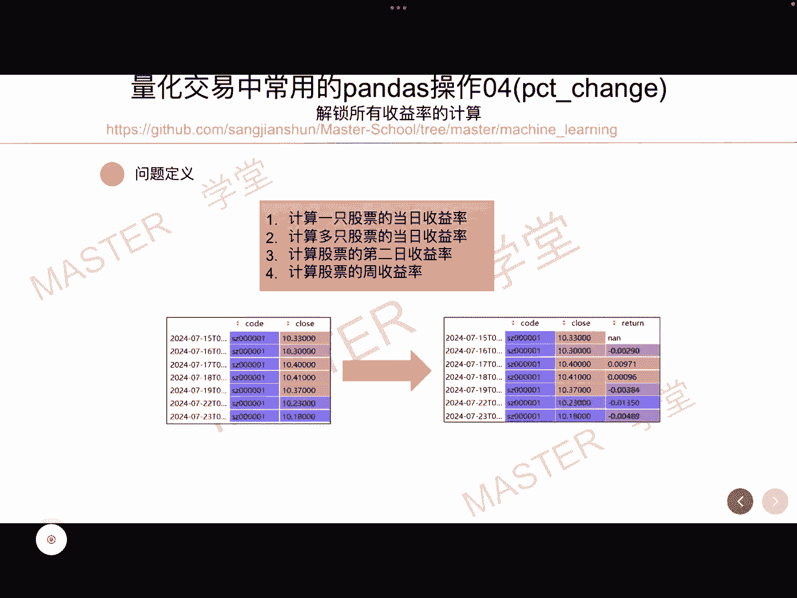
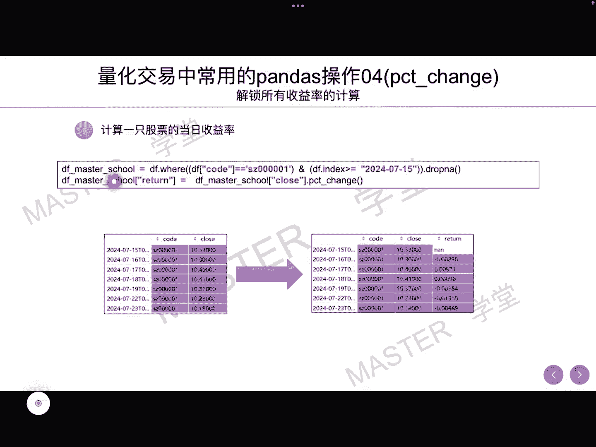
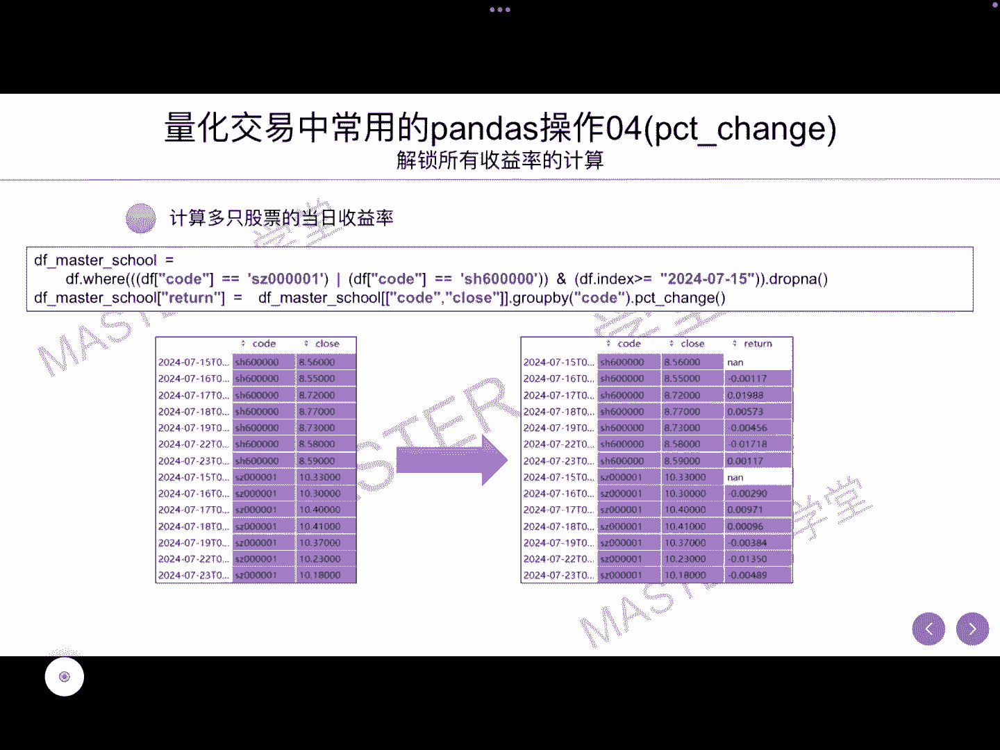
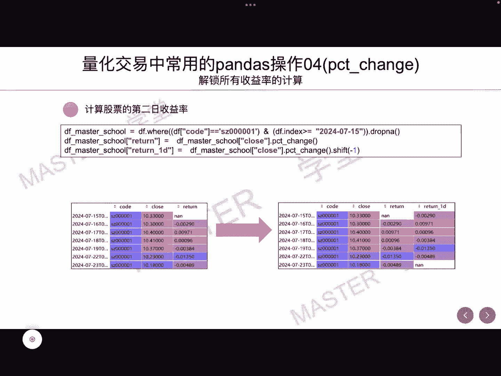
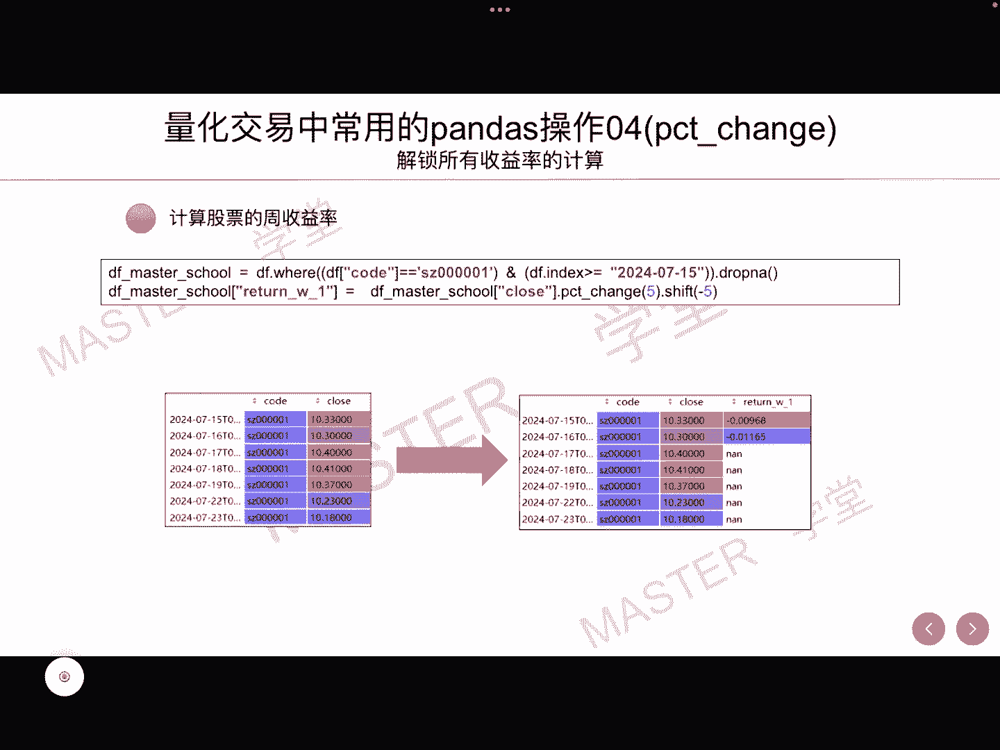
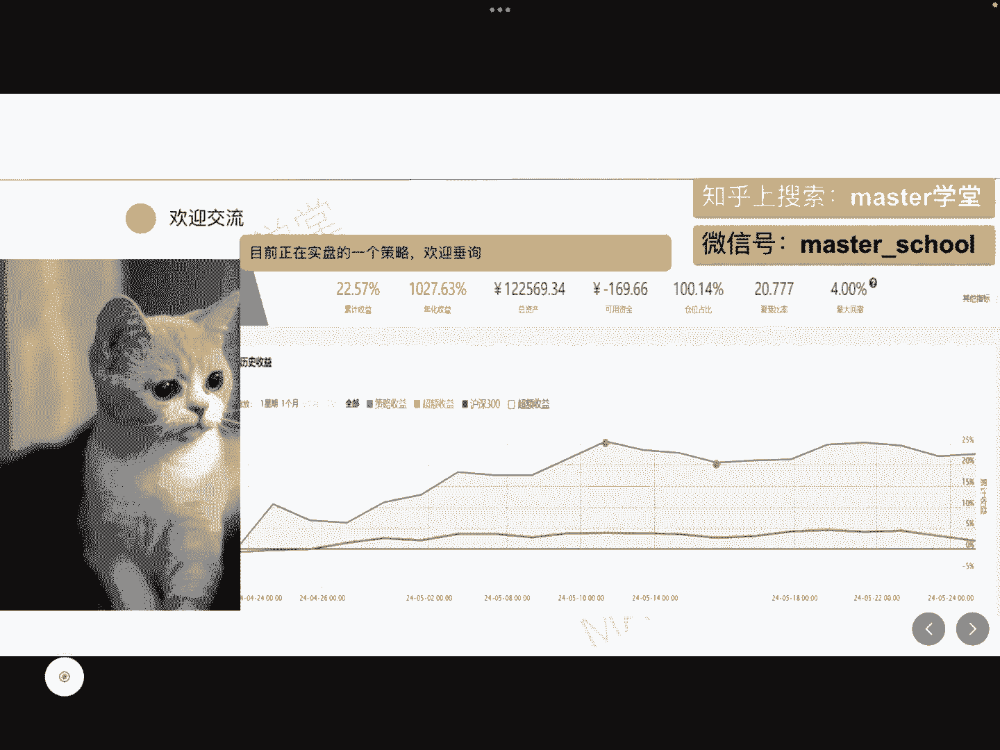

# 量化交易系列：8：解锁所有收益率的计算 📈

在本节课中，我们将学习如何使用 pandas 的 `pct_change` 函数来计算量化交易中常用的各种收益率。掌握这些计算方法是构建机器学习预测模型、生成标签数据的基础。

## 概述

收益率是量化分析中的核心指标。无论是计算单只股票当日的涨跌，还是预测未来一段时间的收益，都需要准确、高效地计算收益率。pandas 库中的 `pct_change` 函数为此提供了强大的支持。本节我们将从单只股票的日收益率开始，逐步扩展到多只股票、未来收益率以及周收益率的计算。

## 收益率的基本概念

给定一只股票的历史数据，包含日期和收盘价。要计算某一天（例如7月16日）的日收益率，公式为：
**收益率 = (当日收盘价 / 前一日收盘价) - 1**

例如，若7月16日收盘价为10.3，7月15日收盘价为10.33，则收益率为 `(10.3 / 10.33) - 1 = -0.002`。虽然可以用循环逐日计算，但 pandas 提供了更简洁高效的方法。

## 使用 `pct_change` 计算单只股票日收益率



在 pandas 中，我们可以直接对 DataFrame 的某一列（如收盘价）使用 `pct_change()` 函数来计算收益率。该函数会自动计算当前值与前一值的百分比变化。

以下是计算单只股票（代码为‘000001’）日收益率的代码示例：

```python
# 假设 df 是包含‘close’（收盘价）列的DataFrame，且已按日期排序
df[‘return’] = df[‘close’].pct_change()
```

这段代码会为每一行（除第一行外）计算基于前一日收盘价的收益率，并将结果存入名为 `‘return’` 的新列中。



## 计算多只股票的收益率

在实际分析中，我们通常需要同时处理多只股票的数据。这时，需要先按股票代码分组，再对每个组分别应用 `pct_change` 函数。

以下是同时计算多只股票日收益率的方法：

```python
# 假设 df 包含‘code’（股票代码）和‘close’列
df[‘return’] = df.groupby(‘code’)[‘close’].pct_change()
```

这段代码首先根据 `‘code’` 列将数据分组，然后在每个分组内计算收盘价的日收益率。这样可以确保收益率计算不会在不同股票的数据之间交叉进行。

## 计算未来收益率（标签）



在机器学习模型中，我们常使用“未来收益率”作为预测标签。例如，用今天及之前的数据预测明天的涨跌。这就需要计算“未来一日收益率”。

计算方法是先计算常规的日收益率，然后使用 `shift` 函数将结果向前平移一个位置。

```python
# 计算未来一日收益率
df[‘future_return’] = df[‘close’].pct_change().shift(-1)
```

通过 `shift(-1)` 操作，7月15日行的 `future_return` 值就变成了7月16日的实际收益率（-0.002），这正是我们想要的“未来一天”的标签。



## 计算周收益率

有时我们需要计算更长周期的收益率，例如周收益率（假设一周5个交易日）。这里需要注意，直接使用 `pct_change(5)` 计算的是“过去5天的累计收益率”，而非“未来一周的收益率”。

要计算“未来一周的收益率”，需要结合 `pct_change` 和 `shift` 函数：

```python
# 计算未来周收益率（5个交易日）
df[‘weekly_future_return’] = df[‘close’].pct_change(5).shift(-5)
```



`pct_change(5)` 计算了与5天前相比的收益率，再通过 `shift(-5)` 将这个值赋给5天前的日期行，从而表示从该日期起未来一周的收益率。

## 总结



本节课我们一起学习了使用 pandas 计算各类收益率的方法。我们首先介绍了收益率的基本公式，然后使用 `pct_change()` 函数高效计算了单只股票的日收益率。接着，我们通过 `groupby` 将其扩展到多只股票的场景。对于机器学习中常用的标签，我们学会了用 `shift()` 函数计算未来一日收益率。最后，我们探讨了如何组合 `pct_change(periods)` 和 `shift` 来计算未来周收益率。掌握这些操作，将为你的量化交易策略和模型构建打下坚实的基础。