# 量化交易系列：09：引入并行计算提高执行速度 🚀

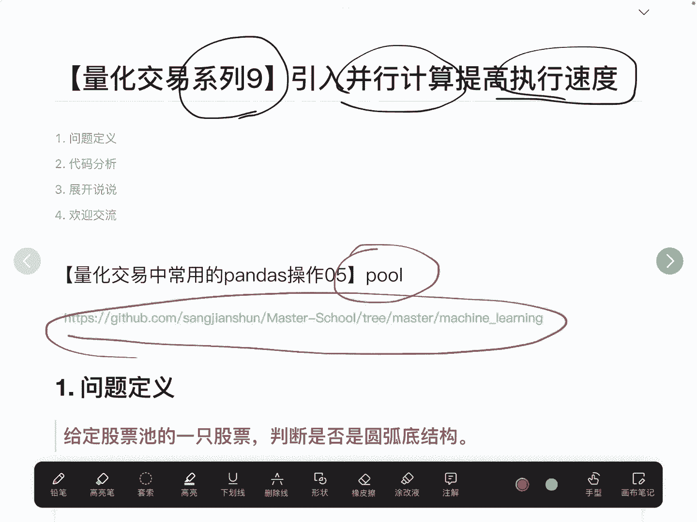

在本节课中，我们将学习如何在量化交易中引入并行计算，以显著提升数据处理和策略回测的执行速度。我们将重点介绍Python的`multiprocessing.Pool` API，并通过一个判断股票“圆弧底”形态的实际案例，演示如何将串行循环改造为并行处理。

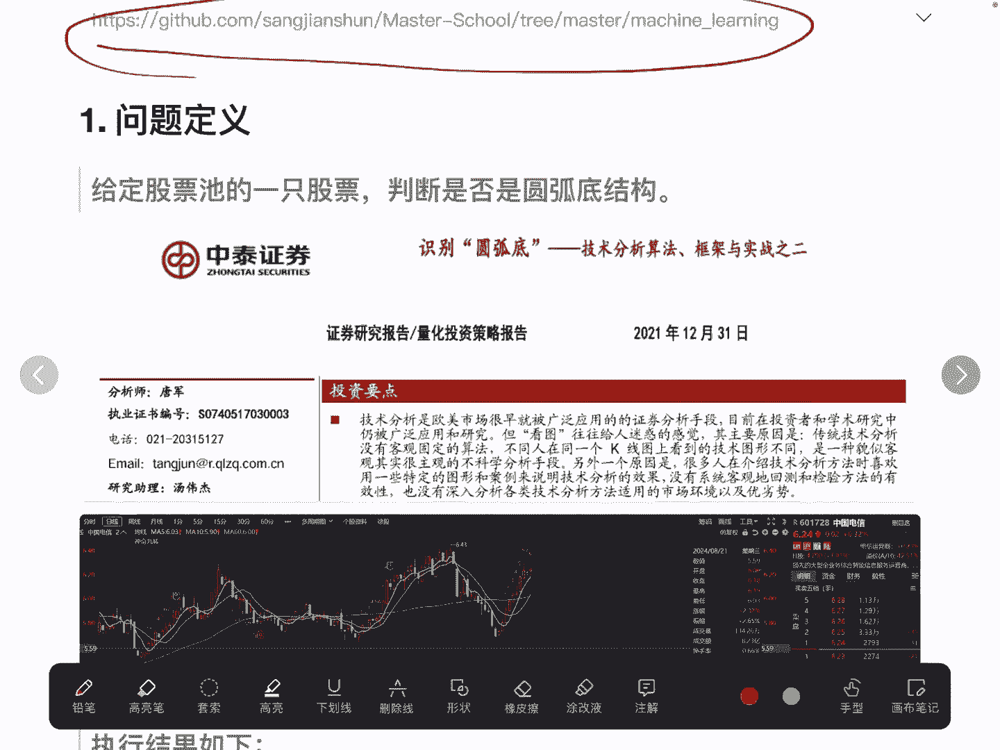

## 问题背景与动机

上一节我们介绍了pandas在量化交易中的常规操作。本节中，我们来看看当处理大规模股票数据时，如何解决计算速度慢的问题。

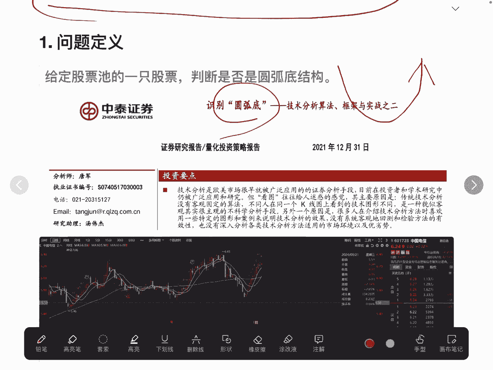

最近，我在复现一篇关于判断股票“圆弧底”形态的研究报告。所谓的“圆弧底”形态，其价格走势图形类似于一个碗状，在多数情况下，这种形态预示着股价可能已处于底部并开始向上反转。

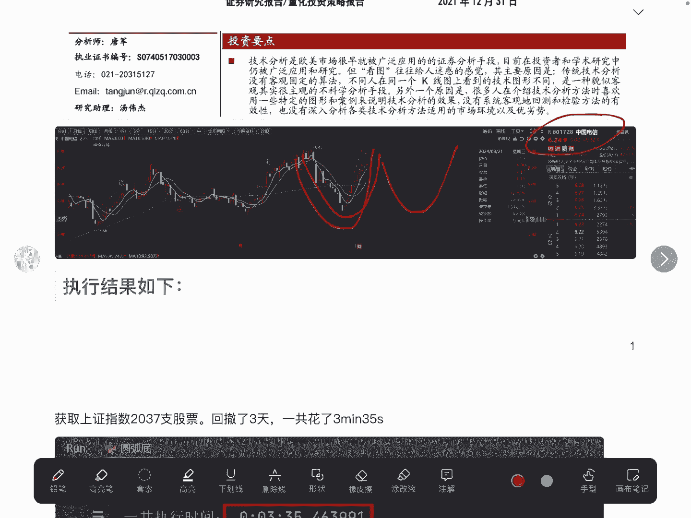

例如，中国电信的日线图就呈现出一个典型的圆弧底结构。这种结构常被视作底部判断的信号，意味着其中可能存在交易机会。

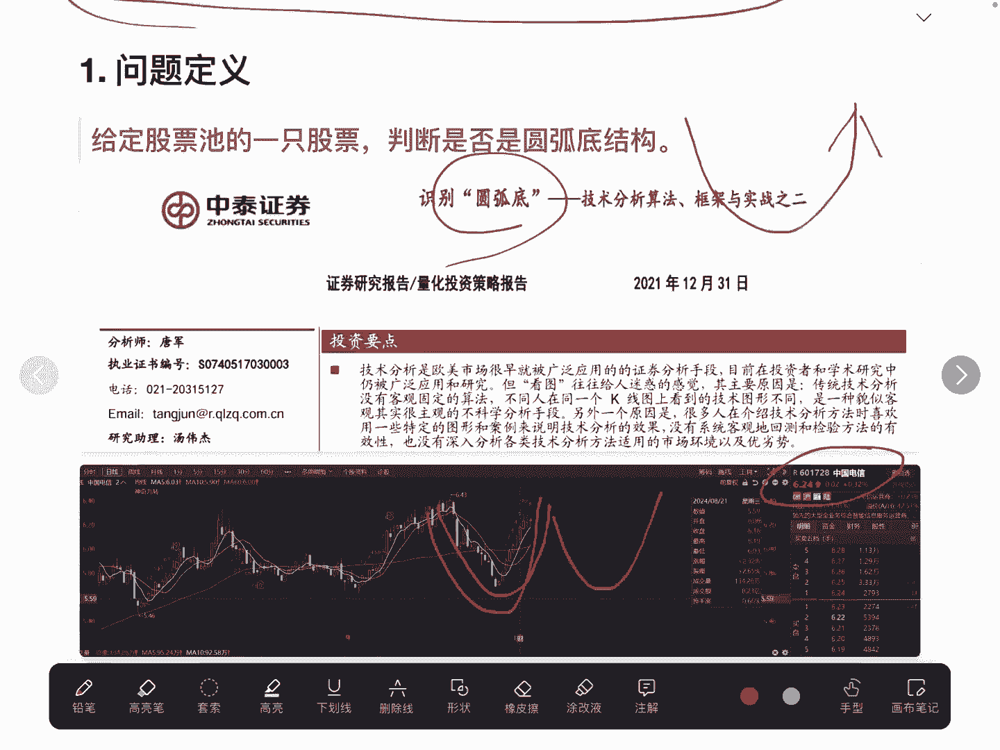

然而，当我复现完整个判断逻辑并执行回测时，发现了一个效率问题：仅针对上证指数的2037只股票回测最近三天，就花费了约3分钟。如果要对全市场5000多只股票进行长达一年的回测，耗时将长达数小时。因此，寻找方法减少计算时间变得非常必要。

## 解决方案：从串行到并行

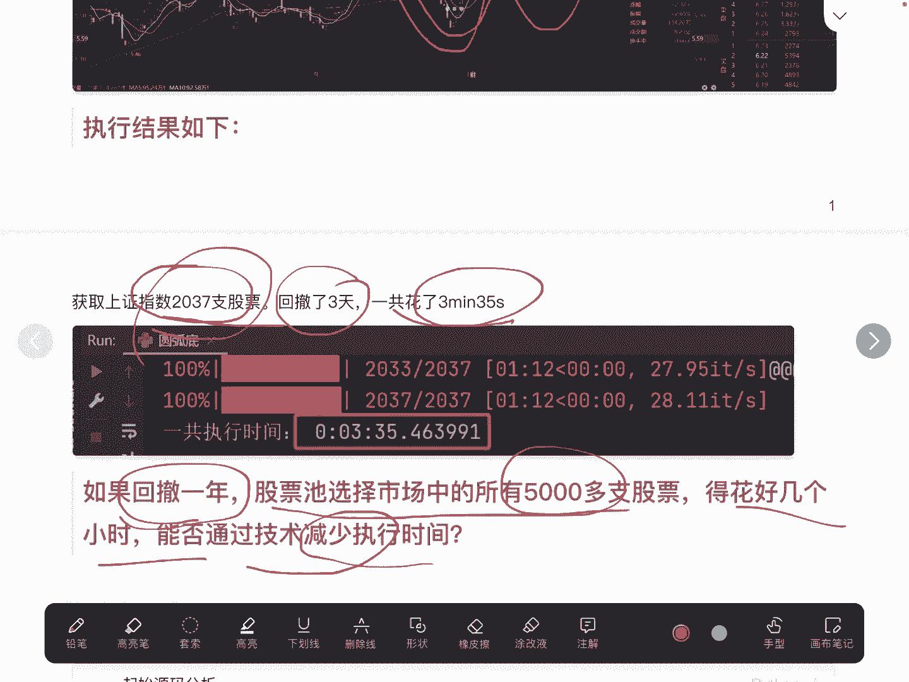

答案是肯定的，我们可以通过并行计算来优化。首先，我们分析一下原始的串行处理代码。

原始代码的核心是一个两层循环结构：外层循环遍历时间，内层循环依次遍历股票池中的每一只股票。这种“依次遍历”是一种串行处理方式，即必须等第一只股票计算完成后，才能开始计算第二只股票。

由于不同股票之间的判断逻辑是相互独立、没有依赖关系的，因此完全可以让它们同时执行。在Python中，我们可以利用`multiprocessing.Pool`这个API，将我们的判断逻辑改造为并行处理。

以下是代码改造前后的核心对比：

*   **串行处理（原始代码）**:
    ```python
    for stock in stock_list:
        result = judge_arc_bottom(stock)
    ```

*   **并行处理（优化后代码）**:
    ```python
    from multiprocessing import Pool
    pool = Pool(processes=10) # 创建包含10个进程的池
    results = pool.map(judge_arc_bottom, stock_list)
    pool.close()
    pool.join()
    ```

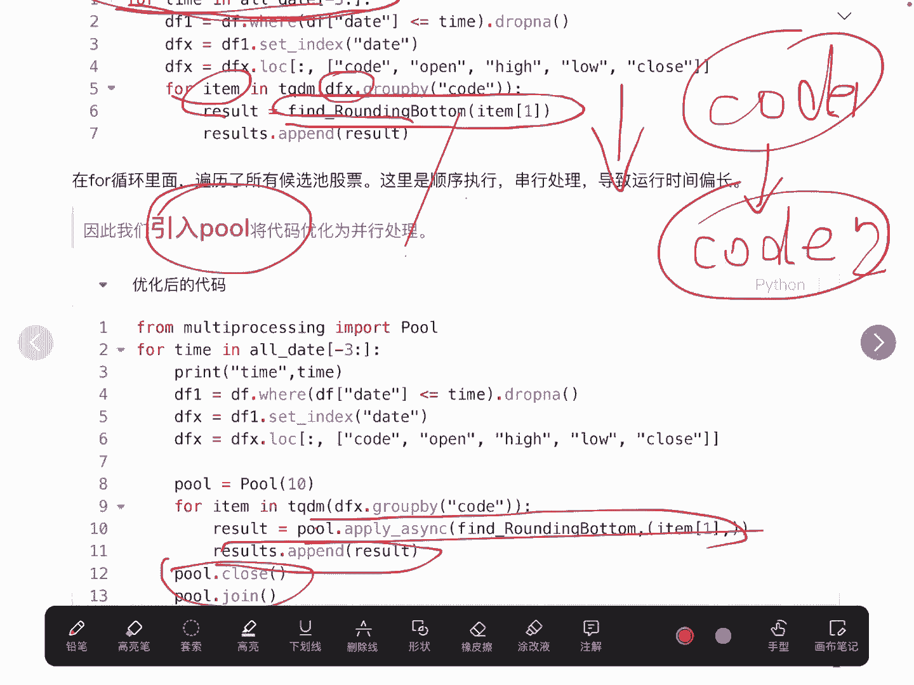

可以看到，主要的改动在于引入了`Pool`，并使用其`map`方法替代了`for`循环。其他业务逻辑代码保持不变。优化后的效果非常显著：同样是回测2037只股票的三天数据，运行时间从3分钟缩短到了51秒。如果电脑性能更强，可以适当增加进程数，以获得更快的速度。

## 关键注意事项与最佳实践

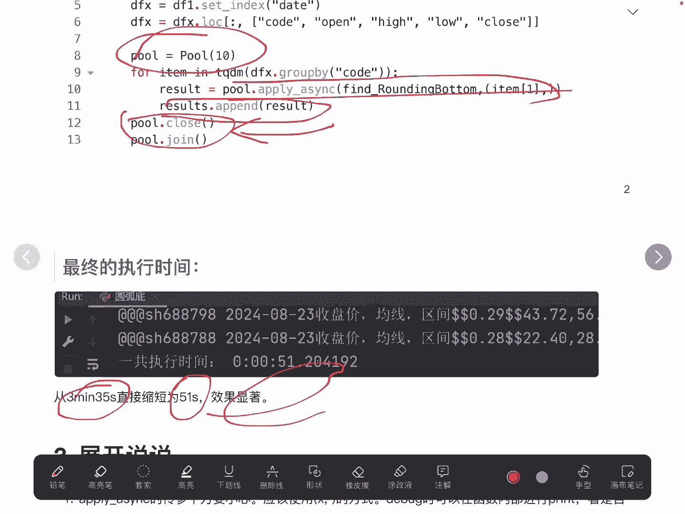

在应用`multiprocessing.Pool`时，有几个关键点需要注意：

1.  **正确选择API**：我们调用的是`Pool.map()`或`Pool.starmap()`。需要注意的是，pandas DataFrame也有一个`.apply()`方法，但它是**串行执行**的，无法实现并行，使用时需小心区分。
2.  **注意参数传递形式**：向并行函数传参时需谨慎。对于单参数函数，使用`pool.map(func, iterable)`。如果函数需要多个参数，应使用`pool.starmap(func, iterable)`，其中`iterable`是一个由参数元组组成的列表。调试时可以在函数内部打印参数，以确保传参正确。
3.  **必须调用`close()`和`join()`**：这是之前代码中强调要加上的两行。如果不调用`pool.close()`，就不能继续向进程池提交新任务。如果不调用`pool.join()`，主进程可能会在子进程完成任务前提前结束，导致程序异常退出。这两行代码的作用是等待所有子进程执行完毕。

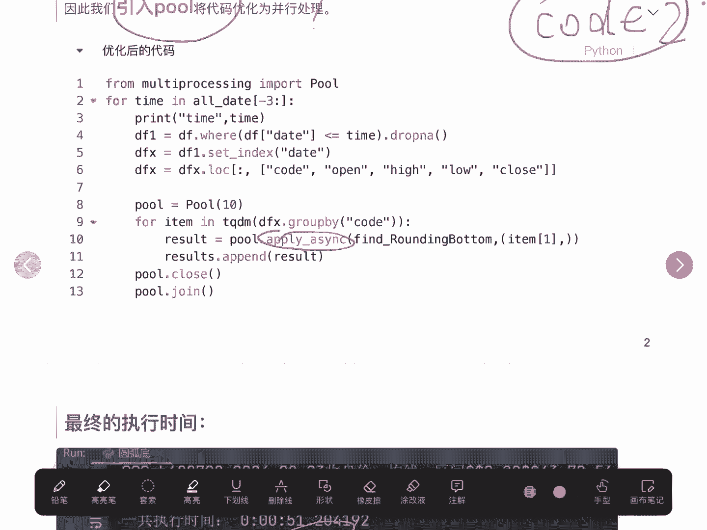

## 一个简单的并行计算示例

为了更清晰地理解，这里提供一个简单的`Pool`使用示例：

```python
import time
from multiprocessing import Pool

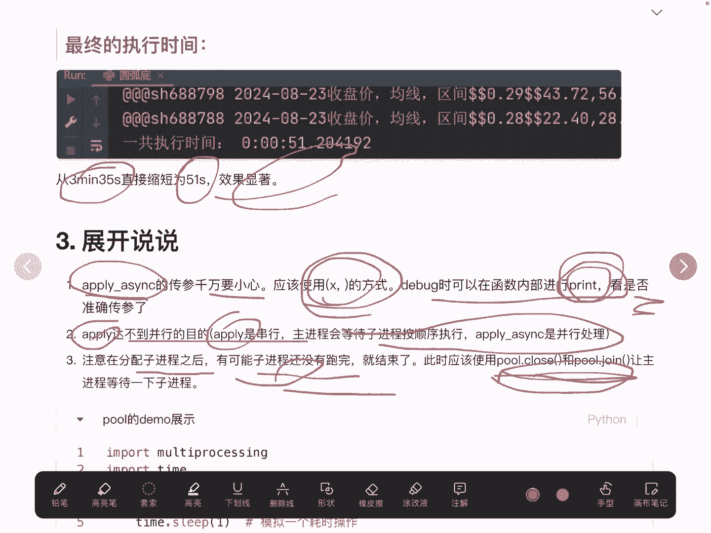

def slow_function(number):
    """一个模拟的耗时操作"""
    time.sleep(1)  # 模拟计算耗时1秒
    return number * number

if __name__ == '__main__':
    numbers = [1, 2, 3, 4, 5, 6, 7, 8, 9, 10]

    # 串行执行
    start = time.time()
    serial_results = [slow_function(x) for x in numbers]
    print(f"串行执行时间: {time.time() - start:.2f}秒， 结果: {serial_results}")

    # 并行执行 (假设使用4个进程)
    start = time.time()
    with Pool(processes=4) as pool:
        parallel_results = pool.map(slow_function, numbers)
    print(f"并行执行时间: {time.time() - start:.2f}秒， 结果: {parallel_results}")
```

在这个例子中，`slow_function`模拟了一个耗时1秒的操作。串行执行10次需要约10秒，而使用4个进程并行执行，理论上只需约3秒（10 / 4 ≈ 2.5，加上进程启动和管理开销）。通过`pool.map()`返回的列表，我们可以轻松获取所有任务的结果。

## 总结

本节课中，我们一起学习了如何利用Python的`multiprocessing.Pool`实现并行计算，以解决量化交易中大数据量回测或计算耗时过长的问题。核心步骤包括：识别可并行的独立任务、使用`Pool`创建进程池、用`map`方法替代串行循环、以及务必使用`close`和`join`来正确管理进程生命周期。

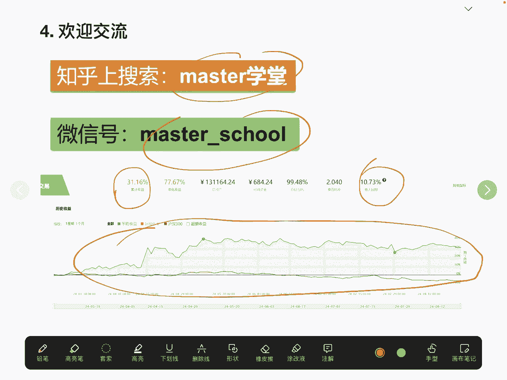

当你的代码中存在相互独立的循环计算，并且成为性能瓶颈时，都可以考虑采用这种并行化改造思路，从而充分利用多核CPU的计算能力，大幅提升程序运行效率。