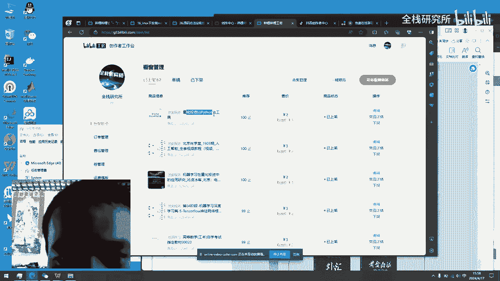
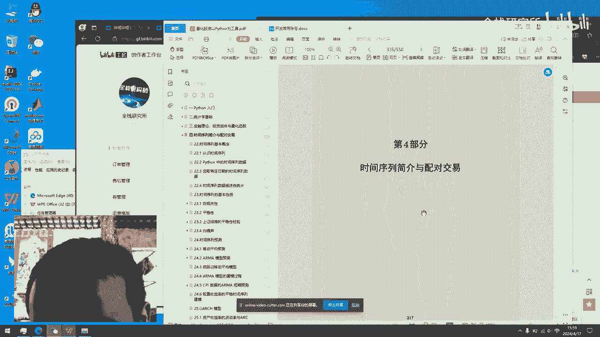
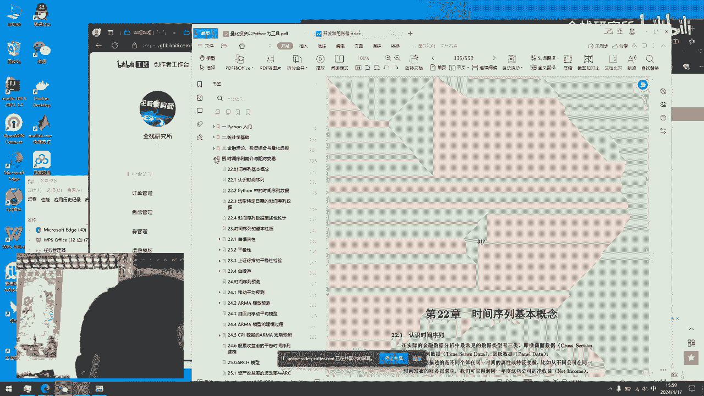

# 《量化投资以Python为工具》：P1：课程概览与内容导读 📚

在本节课中，我们将一起了解《量化投资以Python为工具》这本书的整体结构和核心学习内容。本书为希望进入量化投资领域的初学者提供了一个全面的学习路径，结合了Python编程、统计学、金融理论及实战策略。

## 书籍内容概览

本书的内容结构清晰，分为几个主要部分，旨在帮助读者从零开始构建量化投资的知识体系。

以下是本书涵盖的核心模块：

1.  **Python入门**：这部分内容介绍了Python编程的基础知识。即使你没有编程基础，也可以通过学习这一部分掌握必要的技能。如果你已有Python基础，可以跳过此部分。
2.  **统计学基础**：量化投资离不开数据分析，而统计学是数据分析的基石。这部分内容将为你打下坚实的理论基础。
3.  **金融理论与投资组合**：在掌握了编程和统计学之后，你将学习经典的金融理论，并了解如何构建和管理投资组合。
4.  **量化选股与策略**：本书提供了具体的Python代码示例，展示如何实现不同的量化选股策略和模型，例如因子选股。
5.  **时间序列分析与配对交易**：这部分深入探讨了时间序列数据的分析方法，并介绍了配对交易这一经典策略。
6.  **技术指标分析**：最后，本书会讲解金融市场中常用的技术指标，例如K线图和RSI（相对强弱指数），帮助你进行技术分析。

## 学习路径建议

上一节我们介绍了书籍的各个模块，本节中我们来看看如何根据自身情况规划学习路径。

以下是根据不同基础给出的学习建议：

*   **无编程基础者**：建议从第一部分“Python入门”开始，按顺序学习。
*   **有Python基础但无金融/统计基础者**：可以跳过第一部分，直接从“统计学基础”和“金融理论”开始学习。
*   **所有学习者**：书中配套的Python代码是实践的关键，务必结合理论进行实操，以加深理解。

## 总结

本节课中，我们一起学习了《量化投资以Python为工具》这本书的总体框架。它从**Python编程**和**统计学**基础出发，逐步深入到**金融理论**、**量化策略实现**（包含具体的代码示例）以及**技术分析**，形成了一个完整的学习闭环。无论你的起点如何，都可以通过本书找到适合自己的学习路径，逐步踏入量化投资的大门。