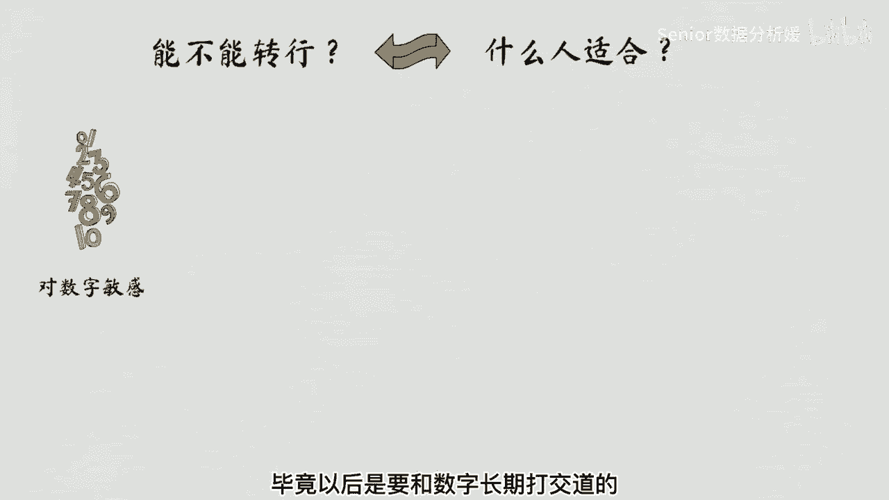
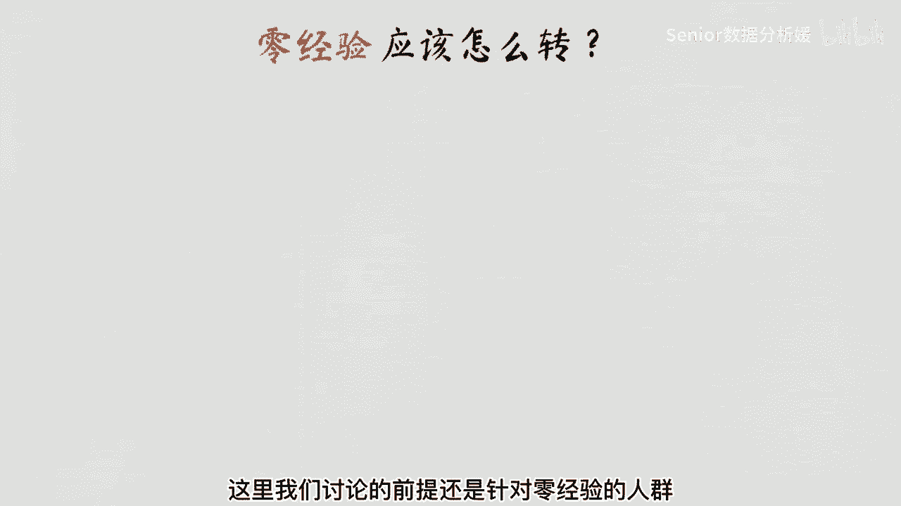
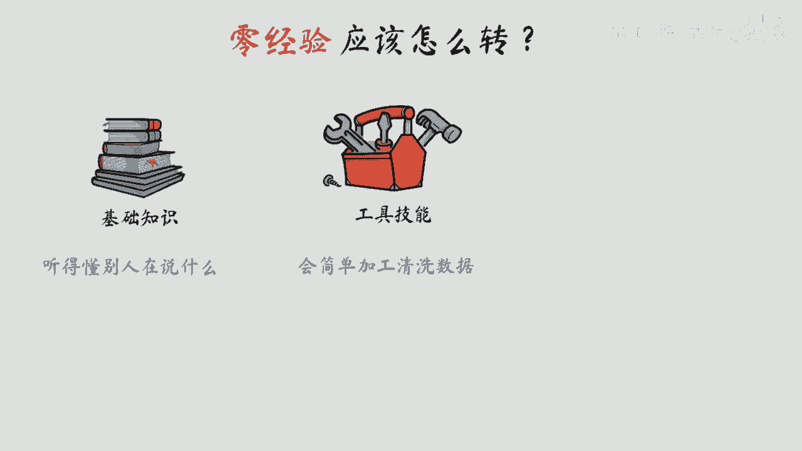
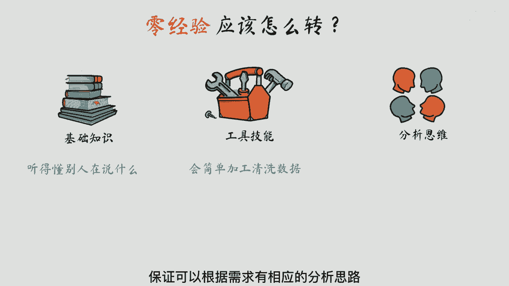
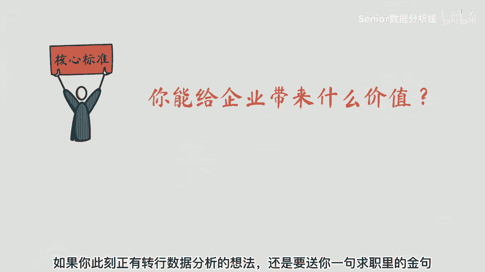
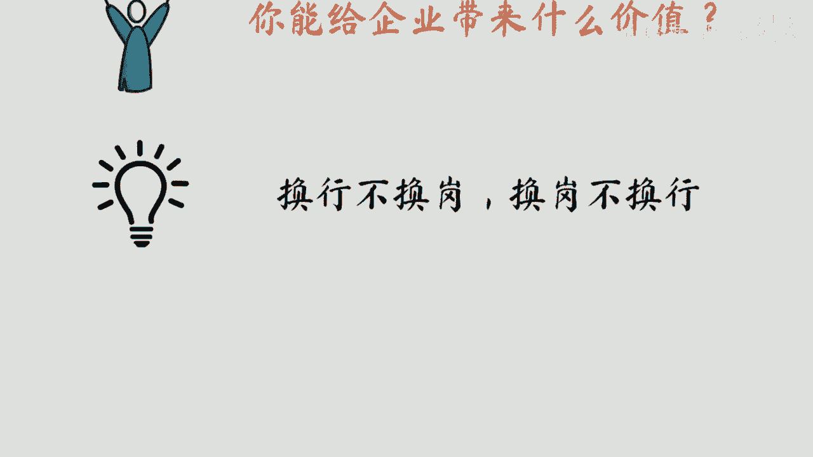

# 数据分析+金融量化+数据清洗：P1：数据分析入门指南 📊

在本节课中，我们将要学习数据分析入门的基础知识，探讨转行数据分析的可能性与路径。我们将从行业特点、所需技能和核心标准等方面，为你提供一个清晰的入门指南。

## 转行数据分析的可能性

最近很多人咨询如何转行数据分析的问题。提到转行问题，我们不禁要问两个问题：能不能转和怎么转。

### 你是否适合数据行业？

能不能转行，换个问题就是你适不适合数据行业。数据从业者普遍会有以下几个特点：

首先，你要对数字比较敏感，毕竟以后是要和数字长期打交道的。

其次，你要有足够的细心和耐心。大概率你会花费大量的时间处理数据。如果你处理的数据有问题，那得出的结论肯定也是错误的。

第三点，是你需要有相关的行业经验和业务经验。毕竟数据分析的目的是为了能给业务带来价值。

最后，是需要你有比较好的沟通汇报能力。如何包装你的分析结果，让别人知道是非常关键的能力。

你可以结合自身的优势进行分析判断，从内心上去感受你是否适合做数据分析。

## 如何转行数据分析？

那具体应该怎么转呢？这里我们讨论的前提还是针对零经验的人群。

### 学习基础知识与技能

之前对数据分析的了解几乎为零，你需要了解这个行业的基础知识，保证你能听得懂别人在说什么，具备互相沟通的条件。

你还需要学习相关的工具技能。最常用的工具，比如像 **SQL**，保证你会简单加工清洗数据。这是必备的基本功了。

最后，你要了解一些常见的数据分析方法，保证可以根据需求有相应的分析思路，而不至于有了数据也不知道怎么分析。

当然，不是说以上内容你全部要学的很厉害，才能去转行。大部分人的工作能力都是30%在工作外学习，70%都是在工作中学习成长的。

### 核心价值标准

以上分析了这么多，其实有一个核心的标准，判断你是否能转行成功，那就是你能给企业带来什么价值。在企业里都是以结果价值导向的。

如果你此刻正有转行数据分析的想法，还是要送你一句求职里的金句：**换行不换岗，换岗不换行**。这样可以最大化保证自己的转行成功率。

如果你真心热爱，请一定坚持自己内心的想法。

---

本节课中我们一起学习了数据分析入门的关键考量。我们探讨了转行数据分析需要具备的个人特质，如对数字的敏感度、细心耐心、业务理解力和沟通能力。接着，我们梳理了零基础转行的学习路径，包括掌握基础知识、学习SQL等工具技能以及了解常见的数据分析方法。最后，我们明确了转行成功的核心在于能为企业创造价值，并给出了“换行不换岗，换岗不换行”的实用建议。希望这些内容能帮助你开启数据分析的学习之旅。