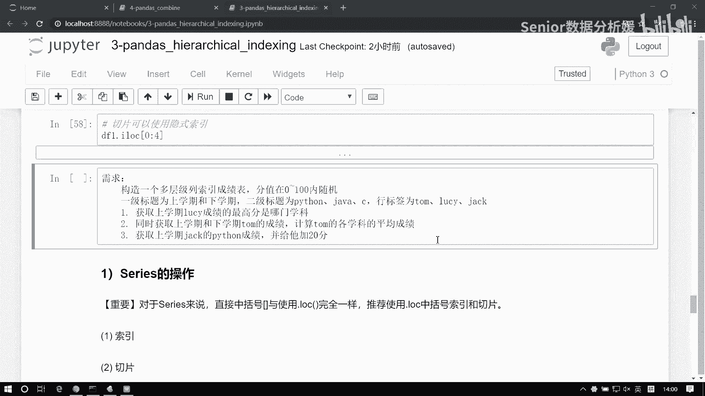
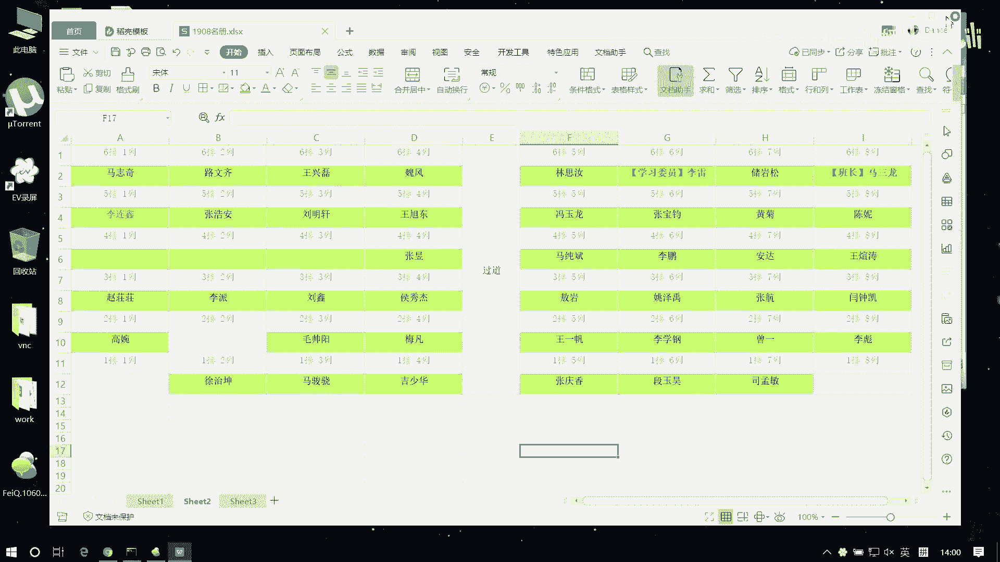
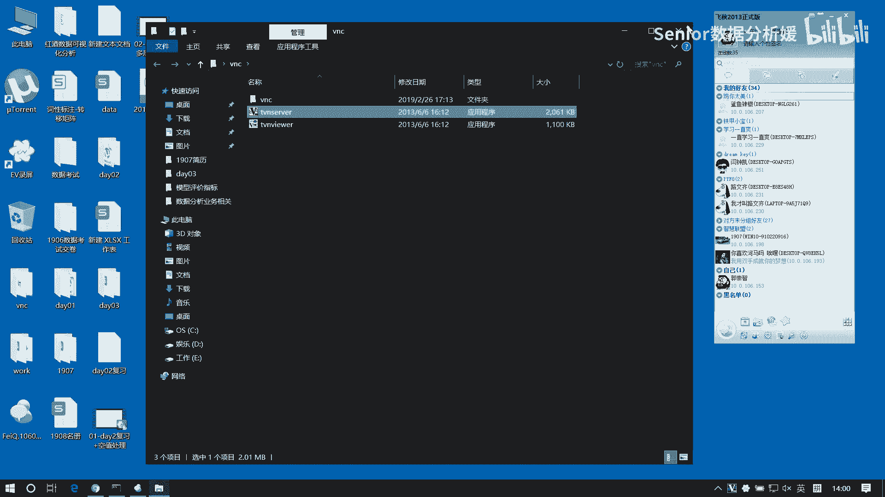
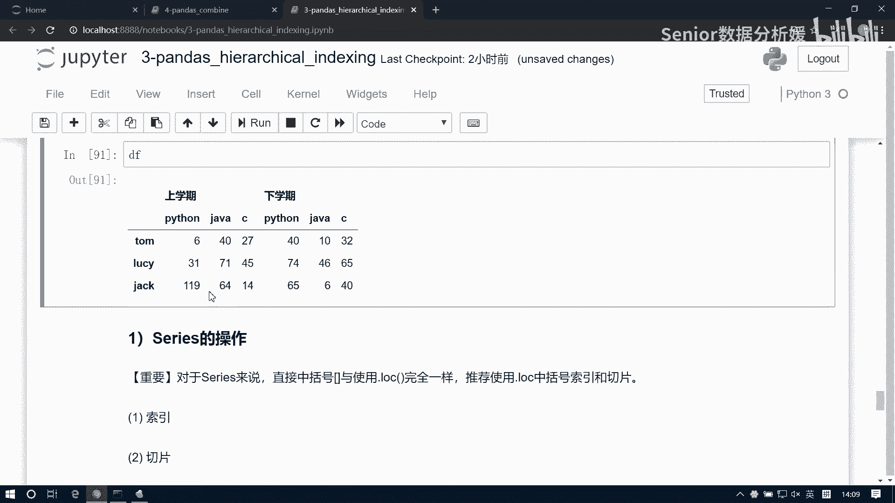

# 数据分析+金融量化+数据清洗：P35：03 上午练习



## 概述
在本节练习中，我们将运用Pandas库处理一个具有多层级列索引的DataFrame。我们将学习如何构造这样的数据结构，并完成一系列数据查询与修改任务，包括按层级筛选数据、计算聚合值以及修改特定单元格。





---

## 构造多层级索引DataFrame

首先，我们需要构造一个符合要求的DataFrame。它应具有多层级列索引，行索引为人物姓名，数据为0到100之间的随机整数。

以下是构造该DataFrame的步骤与代码：

1.  使用 `pd.MultiIndex.from_product` 创建多层级列索引。第一层为“上学期”和“下学期”，第二层为“Python”、“java”和“c”。
2.  定义行索引为三个人物：“汤姆”、“LUCY”、“杰克”。
3.  使用 `np.random.randint` 生成一个3行6列的随机整数矩阵作为数据。
4.  将以上部分组合成一个DataFrame。

```python
import pandas as pd
import numpy as np

# 构造多层级列索引
columns = pd.MultiIndex.from_product([['上学期', '下学期'], ['Python', 'java', 'c']])
# 定义行索引
index = ['汤姆', 'LUCY', '杰克']
# 生成随机数据
data = np.random.randint(0, 101, size=(3, 6))
# 创建DataFrame
df = pd.DataFrame(data, index=index, columns=columns)
print(df)
```

---

## 任务一：查找LUCY上学期的最高分学科

上一节我们构造了DataFrame，本节中我们来看看第一个任务：找出LUCY在上学期哪门学科的成绩最高。

思路是分步筛选和计算：
1.  首先，通过一级列索引“上学期”筛选出上学期的数据子集。
2.  然后，通过行索引“LUCY”定位到LUCY上学期的所有成绩（一个Series）。
3.  接着，计算这个Series的最大值。
4.  最后，找出最大值对应的学科名称。

以下是实现此任务的代码步骤：

```python
# 1. 筛选上学期的数据
df_semester1 = df['上学期']
# 2. 获取LUCY上学期的成绩
lucy_scores = df_semester1.loc['LUCY']
# 3. 找到最高分
max_score = lucy_scores.max()
# 4. 找出最高分对应的学科
subject = lucy_scores[lucy_scores == max_score].index[0]
print(f"LUCY上学期最高分学科是：{subject}，分数为：{max_score}")
```

---

## 任务二：计算汤姆各学科的平均成绩

接下来，我们处理第二个任务：同时获取汤姆上学期和下学期的成绩，并计算他每个学科在两个学期的平均分。

这个任务需要我们将汤姆两个学期的成绩对齐后进行计算：
1.  分别获取汤姆上学期和下学期的成绩。
2.  将两个Series按学科对齐相加。
3.  将总和除以2，得到平均分。

以下是计算汤姆平均成绩的代码：

```python
# 1. 获取汤姆上学期和下学期的成绩
tom_semester1 = df['上学期'].loc['汤姆']
tom_semester2 = df['下学期'].loc['汤姆']
# 2. 计算平均成绩
tom_avg = (tom_semester1 + tom_semester2) / 2
print("汤姆各学科的平均成绩：")
print(tom_avg)
```

---

## 任务三：修改杰克的Python成绩

最后，我们完成第三个任务：将杰克上学期的Python成绩增加20分。

这是一个针对特定单元格的修改操作，我们可以通过组合行索引和列索引来精确定位目标单元格。

以下是修改成绩的代码：

```python
# 定位到‘杰克’行，‘上学期’列下的‘Python’单元格，并加20分
df.loc['杰克', ('上学期', 'Python')] += 20
print("修改后，杰克的成绩表为：")
print(df.loc['杰克'])
```

---



## 总结
本节课中我们一起学习了如何处理具有多层级索引的Pandas DataFrame。我们通过实践完成了三个核心任务：使用分层索引筛选数据并查找特定值、对分层数据执行聚合计算（求平均）、以及精确修改DataFrame中的单个元素。这些操作是数据清洗和分析中的基础技能。