# Python金融量化：P19：重复值和异常值的清洗 📊


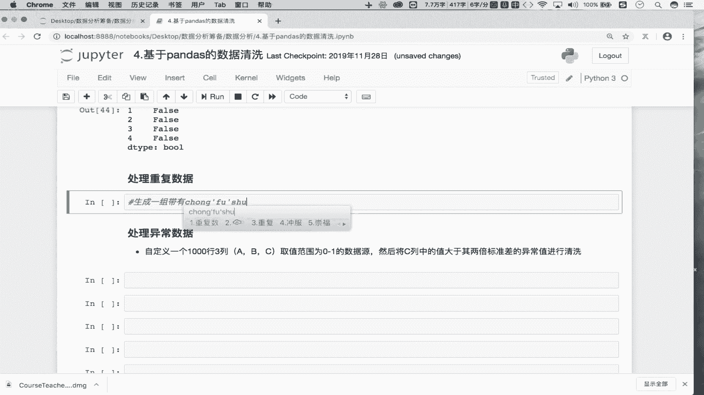


在本节课中，我们将学习数据清洗的另外两个重要部分：如何处理数据集中的重复行数据以及如何识别并清洗异常值。掌握这些技能对于保证数据分析结果的准确性至关重要。

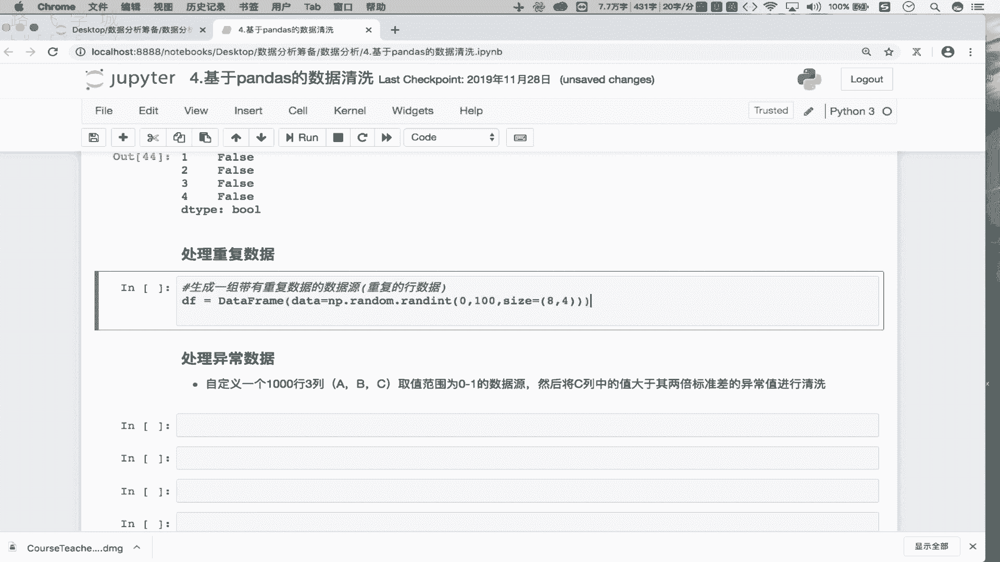

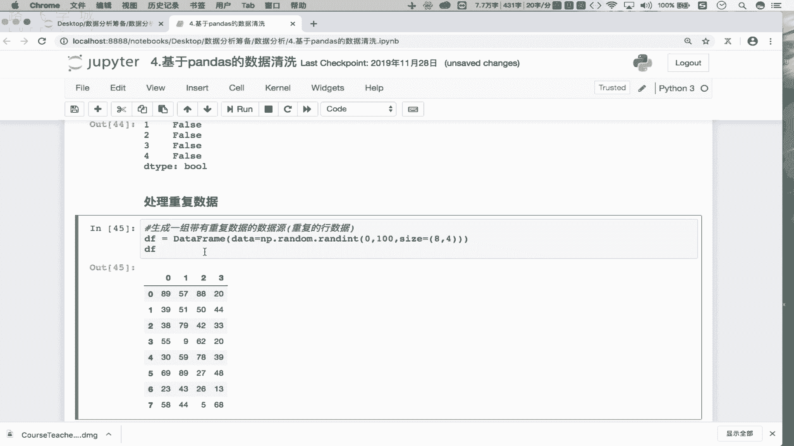

上一节我们介绍了缺失值的处理方法，本节中我们来看看如何清理重复和异常的数据。

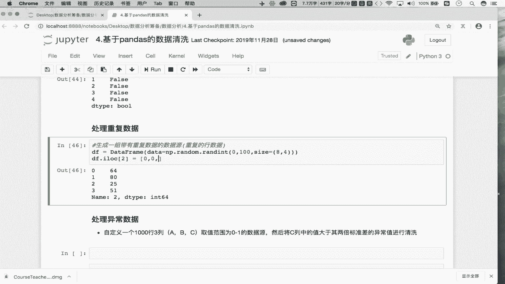


## 重复数据的清洗 🔄

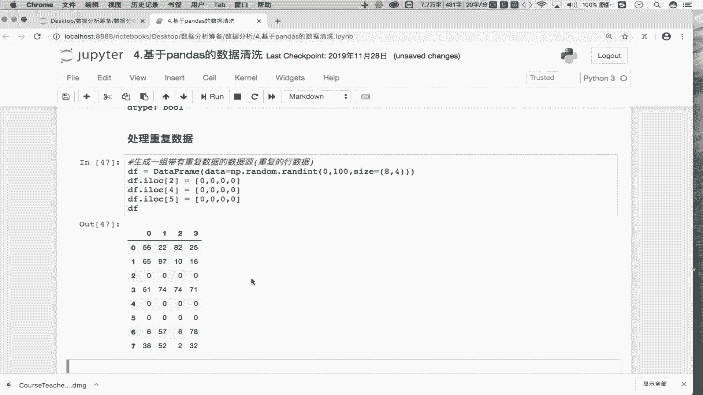


重复数据指的是在数据集中完全相同的行。这些重复行可能由于数据采集或合并过程中的错误而产生，会干扰分析结果。

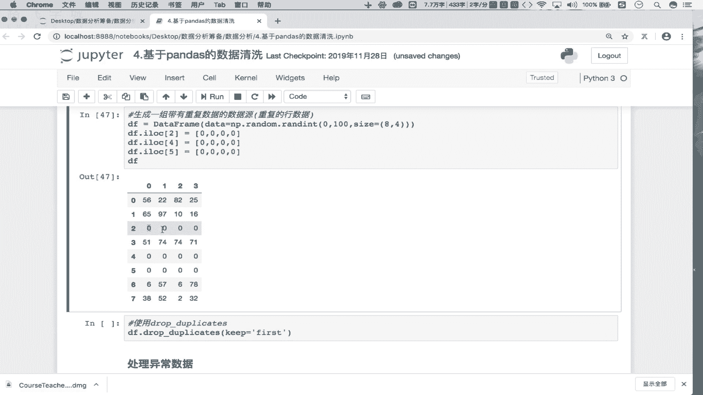

以下是创建并处理重复数据的步骤：


1.  首先，我们创建一个包含重复行的示例DataFrame。
    ```python
    import pandas as pd
    import numpy as np

    # 创建一个8行4列的初始DataFrame
    DF = pd.DataFrame(np.random.randint(0, 100, size=(8, 4)))
    print("原始数据：")
    print(DF)
    ```

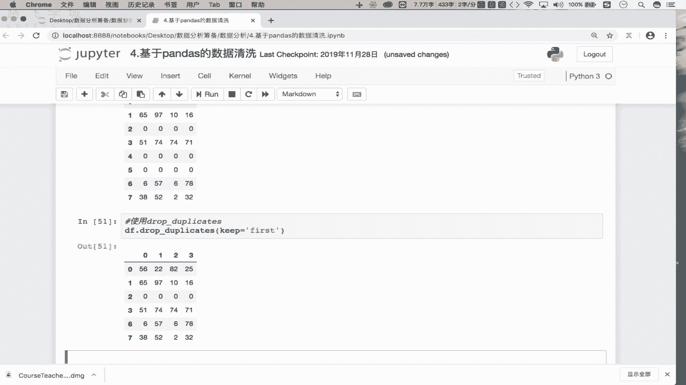


2.  接着，我们手动制造几行重复数据。
    ```python
    # 将第2、4、5行的数据设置为与第2行相同，从而创建重复行
    DF.iloc[4] = DF.iloc[2]
    DF.iloc[5] = DF.iloc[2]
    print("\n制造重复行后的数据：")
    print(DF)
    ```

3.  最后，使用`drop_duplicates()`函数清洗重复数据。该函数的关键参数是`keep`，用于指定保留哪一行。
    ```python
    # 清洗重复数据，默认keep='first'，保留第一次出现的行
    DF_cleaned = DF.drop_duplicates()
    print("\n清洗重复数据后（保留首次出现）：")
    print(DF_cleaned)

    # keep='last' 保留最后一次出现的行
    DF_cleaned_last = DF.drop_duplicates(keep='last')
    print("\n清洗重复数据后（保留最后出现）：")
    print(DF_cleaned_last)

    # keep=False 删除所有重复行
    DF_cleaned_none = DF.drop_duplicates(keep=False)
    print("\n清洗重复数据后（删除所有重复）：")
    print(DF_cleaned_none)
    ```


处理重复数据相对简单直接。接下来，我们将探讨一个更复杂的问题：异常值的清洗。

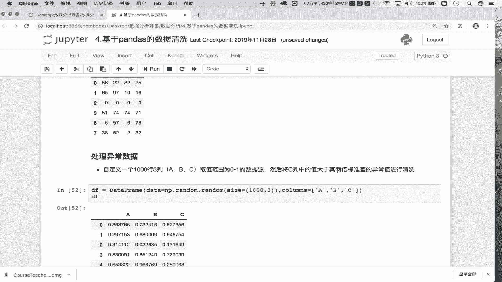

## 异常数据的清洗 🚨


异常值是指与数据集中的其他观测值存在显著差异的值，可能由测量错误、录入失误或罕见事件引起。例如，在蔬菜大棚的温度记录中，出现120℃显然是一个异常值。

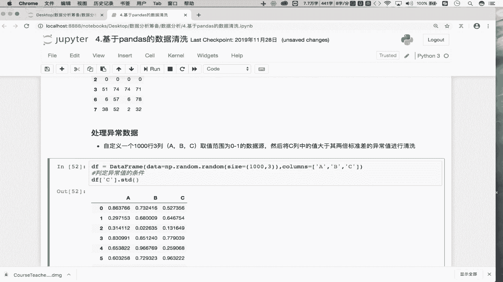

清洗异常值的关键在于定义一个合理的判定条件。以下是一个处理异常值的完整示例：

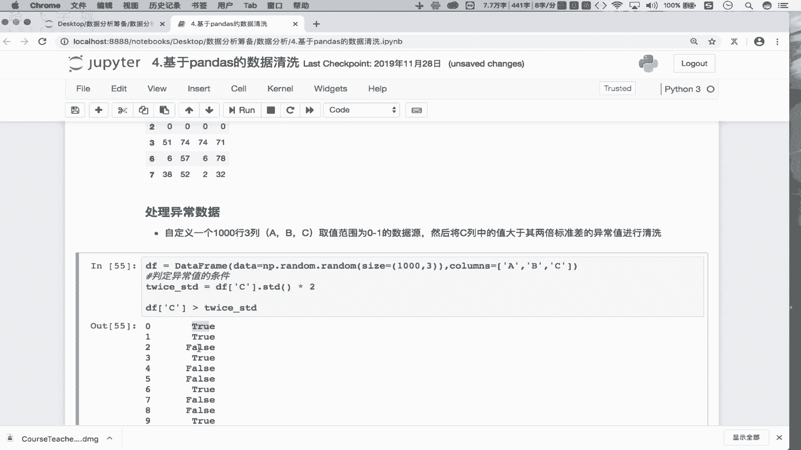

1.  首先，我们生成一个模拟数据集。
    ```python
    # 创建一个1000行3列的数据集，数值范围在0到1之间
    DF = pd.DataFrame(np.random.random(size=(1000, 3)), columns=['A', 'B', 'C'])
    print("原始数据形状：", DF.shape)
    print(DF.head())
    ```

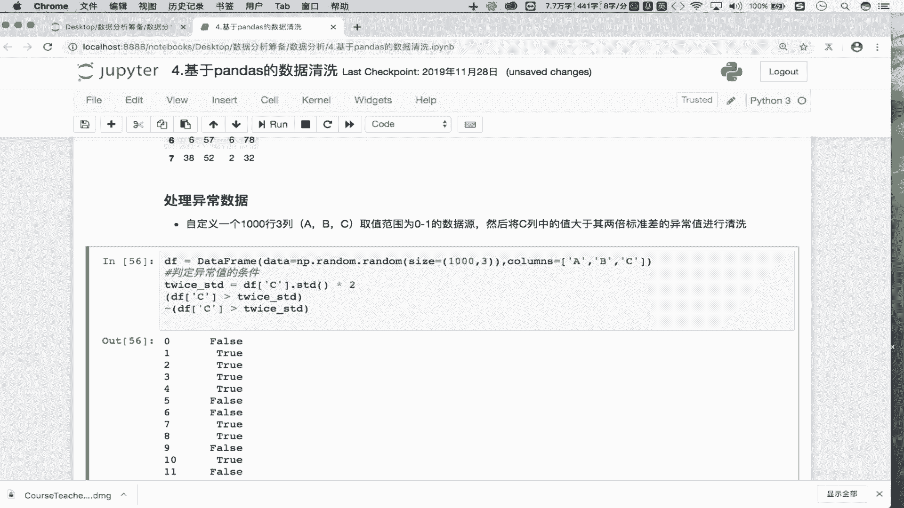

2.  然后，定义异常值的判定条件。本例中，我们约定：如果`C`列中的某个值大于`C`列所有值的两倍标准差，则将该值判定为异常值。
    ```python
    # 计算C列的两倍标准差
    twice_std = DF['C'].std() * 2
    print(f"\nC列的两倍标准差为：{twice_std:.4f}")
    ```


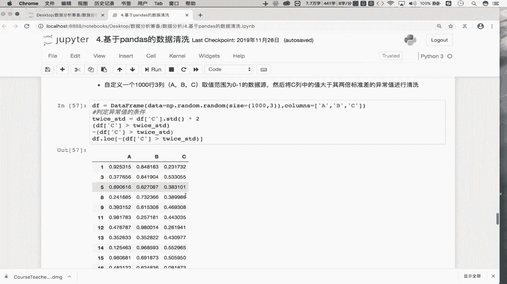

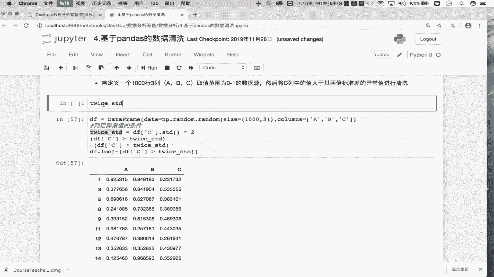

3.  根据条件创建布尔掩码，识别异常值所在的行。
    ```python
    # 创建布尔序列，True表示对应行的C列值大于两倍标准差（即异常值）
    abnormal_mask = DF['C'] > twice_std
    print(f"\n异常值数量：{abnormal_mask.sum()}")
    print("异常值行索引示例：", DF[abnormal_mask].index[:5].tolist())
    ```

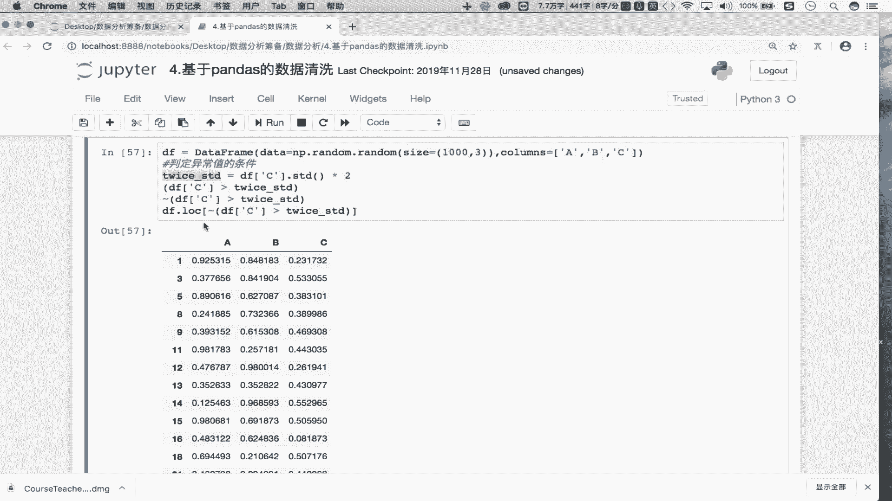


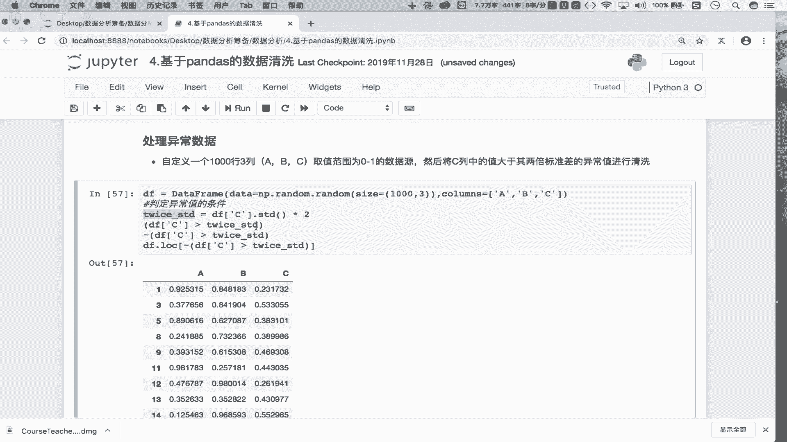

4.  最后，利用布尔索引的取反操作（`~`），保留所有正常值所在的行，从而实现异常值的清洗。
    ```python
    # 使用 ~ 对布尔掩码取反，然后索引原数据，即可过滤掉异常行
    DF_cleaned = DF[~abnormal_mask]
    print(f"\n清洗异常值后数据形状：{DF_cleaned.shape}")
    print("清洗后C列最大值：", DF_cleaned['C'].max())
    ```


本节课中我们一起学习了数据清洗的核心环节。我们掌握了如何使用`drop_duplicates()`方法高效清除重复行，并通过定义统计条件（如**`value > 2 * std`**）结合布尔索引来精准识别和过滤异常值。至此，你已经具备了处理缺失值、重复值和异常值这三大数据清洗任务的能力，为后续的数据分析和建模打下了坚实的基础。