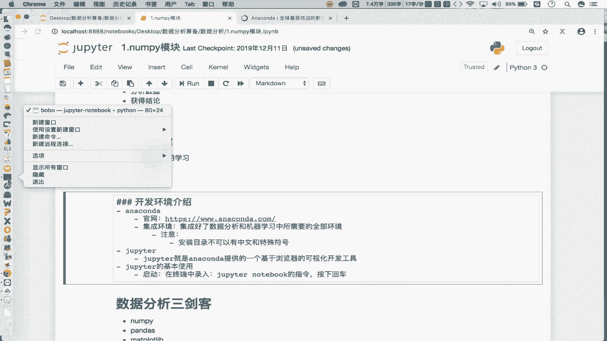
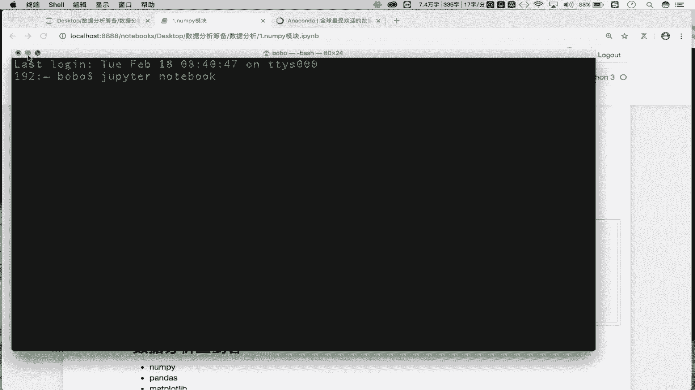
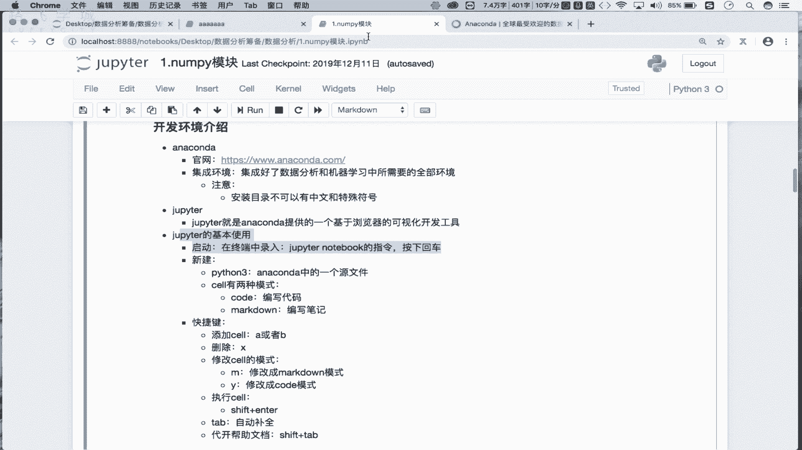

# Python数据分析：P2：02：修炼前的准备-环境搭建 🛠️

在本节课中，我们将学习如何搭建Python数据分析所需的开发环境。我们将介绍核心工具Anaconda和Jupyter Notebook，并详细讲解其安装与基本使用方法。

上一节我们对数据分析进行了初步介绍。本节中，我们来看看数据分析所对应的开发环境搭建流程。

## Anaconda：集成环境

首先，我们需要了解Anaconda。Anaconda是一个集成环境。这意味着它已经为我们集成好了数据分析和机器学习开发所需的全部环境。如果要在本机进行数据分析或机器学习开发，首先需要安装Anaconda。

以下是关于Anaconda的关键点：
*   **定义**：Anaconda是一个集成了数据分析和机器学习所需全部环境的软件包。
*   **安装**：需要从Anaconda官网下载对应操作系统（Windows、Mac、Linux）的安装包，然后按照向导进行安装。
*   **注意事项**：安装目录路径中**不可以有中文和特殊符号**，建议安装在某个盘符的根目录下。

细致的安装流程会以文档形式提供，大家可参照文档进行安装。



## Jupyter Notebook：可视化开发工具



安装好Anaconda后，我们就拥有了开发环境。接下来，我们需要一个可视化的开发工具来编写和执行代码。这个工具就是Jupyter Notebook。

Jupyter Notebook是Anaconda提供的一个基于浏览器的可视化开发工具。我们将在其中进行数据分析相关代码的编写与执行。它无需单独安装，Anaconda安装好后即可使用。


### 启动与界面


以下是启动Jupyter Notebook并新建文件的基本步骤：
1.  **启动**：在系统终端（命令行）中输入指令 `jupyter notebook` 并按下回车。
2.  **界面**：指令执行后，会启动一个本地服务并自动在浏览器中打开Jupyter界面。该界面显示的是当前终端所在目录的文件结构。
3.  **新建文件**：点击界面上的“New”按钮，选择“Python 3”，即可创建一个新的源代码文件（后缀为 `.ipynb`）。

### 核心概念：Cell（单元格）

在Jupyter Notebook中，所有内容都在一个个“Cell”（单元格）中编写。Cell有两种主要模式：

*   **Code模式**：用于编写和运行Python代码。
    ```python
    # 这是一个Code模式的Cell
    print("Hello, Data Analysis!")
    ```
*   **Markdown模式**：用于编写格式化的文本、笔记或说明。
    ```markdown
    # 这是一个Markdown模式的Cell
    这是一个标题，用于记录笔记。
    ```

每个Cell编写完成后，都需要执行才能看到效果（如运行代码或渲染Markdown文本）。

### 常用快捷键

熟练使用快捷键可以极大提升在Jupyter中的工作效率。以下是几个最常用的快捷键：

*   **添加Cell**：
    *   `A`：在当前选中Cell的上方插入一个新Cell。
    *   `B`：在当前选中Cell的下方插入一个新Cell。
*   **删除Cell**：`X` 删除当前选中的Cell。
*   **切换Cell模式**：
    *   `M`：将当前Cell切换到 **Markdown模式**。
    *   `Y`：将当前Cell切换到 **Code模式**。
*   **运行Cell**：`Shift + Enter` 运行当前Cell，并跳转到下一个Cell。
*   **代码补全**：`Tab` 键可以触发代码自动补全功能。
*   **查看帮助**：在函数或方法名上按 `Shift + Tab`，可以查看其帮助文档。

## 总结

本节课中，我们一起学习了Python数据分析环境的搭建。
1.  我们首先介绍了 **Anaconda**，它是一个集成了数据分析和机器学习所需全部环境的软件包，是我们开发的基础。
2.  接着，我们讲解了 **Jupyter Notebook**，它是Anaconda提供的基于浏览器的可视化开发工具，是我们编写和运行代码的主要场所。
3.  最后，我们详细说明了Jupyter中 **Cell（单元格）** 的两种模式（Code和Markdown）以及一系列提升效率的 **常用快捷键**。



请务必根据介绍完成环境的安装与配置。接下来，我们将正式进入数据分析的代码实战环节。