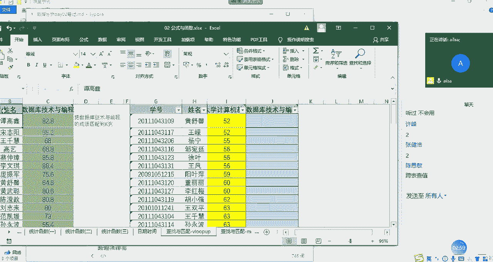

# Python数据分析实战：P12：07 查找与匹配函数

## 概述
在本节课中，我们将学习Excel中两个极其重要的查找与匹配函数：`VLOOKUP`和`MATCH`。它们是处理跨表数据匹配、数据核对等任务的核心工具，掌握它们能极大提升数据处理的效率。

---

## VLOOKUP函数：数据匹配的明星函数

上一节我们介绍了多种函数类型，本节中我们来看看查找与引用函数中的核心——`VLOOKUP`。它被称为“明星函数”，在数据分析、数据清洗等工作中应用非常广泛。

### VLOOKUP的应用场景
`VLOOKUP`主要用于从一张表格中查找特定信息，并将其匹配到另一张表格中。一个典型的场景是：你需要将分散在不同来源（如不同部门、不同系统）但属于同一类型的数据（例如人员成绩）整合到一张总表中。

直接复制粘贴看似可行，但如果源数据的排序不一致，手动查找和粘贴将变得非常低效且容易出错。`VLOOKUP`函数可以自动化这个过程。

### VLOOKUP基础操作与语法
以下是`VLOOKUP`函数的基本操作步骤和语法解释。

**函数语法：**
`=VLOOKUP(lookup_value, table_array, col_index_num, [range_lookup])`

**参数解释：**
*   **`lookup_value`**：要查找的值（查找对象）。
*   **`table_array`**：要查找的区域（查找区域）。**关键点：** 查找对象必须位于该区域的第一列。
*   **`col_index_num`**：返回数据在查找区域中的列序号（从1开始计数）。
*   **`[range_lookup]`**：查找方式。`0`或`FALSE`代表精确匹配；`1`或`TRUE`代表近似匹配。数据分析中通常使用精确匹配。

**操作演示：**
假设我们有一张总表（表A）包含学生姓名，另一张分表（表B）包含姓名和对应的“数据库”成绩。我们需要将成绩匹配到总表中。
1.  在总表的成绩列输入公式：`=VLOOKUP(姓名单元格, 表B的姓名和成绩区域, 2, 0)`
2.  公式含义：在当前表根据“姓名”去“表B区域”查找，并返回该区域第2列（即成绩列）的值，进行精确匹配。
3.  为固定查找区域，防止公式下拉时区域变化，需对`table_array`参数使用绝对引用（按`F4`键添加`$`符号，如`$B$2:$C$100`）。
4.  双击填充柄，完成所有行的匹配。

**注意事项：**
*   若匹配结果出现`#N/A`错误，可能原因有：查找值在源表中不存在、姓名中存在不可见字符（如空格）、或未使用精确匹配。
*   匹配完成后，应核对报错项，根据实际业务需求处理（例如，补充缺失数据）。

---

## MATCH函数：定位数据的位置

学会了`VLOOKUP`进行值匹配后，我们来看看另一个相关的函数`MATCH`。它不返回值本身，而是返回查找值在指定区域中的相对位置。

### MATCH函数的应用场景
`MATCH`函数常用于核对两个列表之间的差异。例如，对比两个部门的人员名单，快速找出只存在于A名单但不在B名单中的人员（反之亦然）。

### MATCH函数语法与使用
以下是`MATCH`函数的使用方法。

**函数语法：**
`=MATCH(lookup_value, lookup_array, [match_type])`

**参数解释：**
*   **`lookup_value`**：要查找的值。
*   **`lookup_array`**：要查找的单行或单列区域。
*   **`[match_type]`**：匹配类型。`0`为精确匹配；`1`为小于；`-1`为大于。通常使用`0`（精确匹配）。

**操作演示：**
假设有名单A（A列）和名单B（F列），想检查名单B中的人是否都存在于名单A中。
1.  在名单B旁输入公式：`=MATCH(F2, $A$2:$A$100, 0)`
2.  公式含义：查找F2单元格的值在A列区域中的位置。
3.  如果返回值是一个数字（如`4`），表示该人员位于A列区域的第4行，即存在。
4.  如果返回`#N/A`错误，则表示该人员在A列中不存在。

**核心要点：**
`MATCH`函数返回的是**位置序号**，而非具体的值。通过判断其是否返回有效数字，即可快速识别数据是否存在差异。

---

## 函数对比与总结

本节课中我们一起学习了`VLOOKUP`和`MATCH`这两个强大的查找匹配函数。

**VLOOKUP函数总结：**
*   **功能**：根据一个查找值，在指定区域的首列进行搜索，并返回该区域中对应行的某一列的值。
*   **核心公式**：`=VLOOKUP(查找值, 查找区域, 返回列序号, 0)`
*   **用途**：跨表数据匹配与整合。

**MATCH函数总结：**
*   **功能**：返回指定值在某个单行或单列区域中的相对位置。
*   **核心公式**：`=MATCH(查找值, 查找区域, 0)`
*   **用途**：数据核对，查找值是否存在及所在位置。

简单来说，`VLOOKUP`用于“找值并带回来”，而`MATCH`用于“找值并告诉我在哪”。理解两者的区别与联系，能帮助你在实际工作中更灵活地解决数据匹配问题。请务必通过练习巩固这两个函数的使用。