# Python数据分析：P15：10 数据透视表简介 📊

在本节课中，我们将要学习Excel中一个非常强大的功能——数据透视表。我们将通过一个具体的业务需求，了解数据透视表是什么、它能解决什么问题，以及如何快速创建和使用它。

## 概述

数据透视表是Excel中用于快速汇总、分析、探索和呈现大量数据的工具。它通过简单的“拖拽”操作，就能实现复杂的数据分类汇总计算，比传统的筛选或函数方法高效得多。

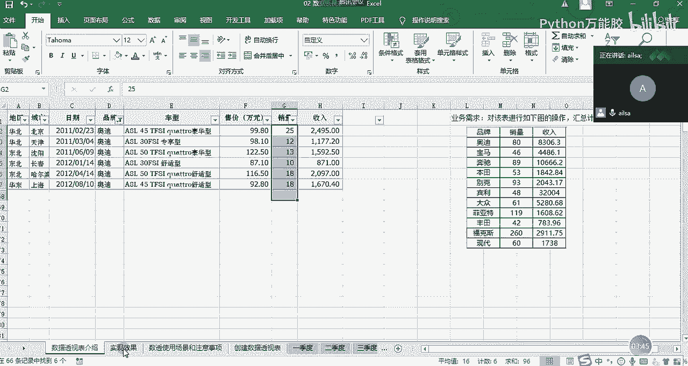

## 从一个需求开始

假设领导给了一张销售数据表，记录了不同城市、不同品牌、不同车型的销量和收入。

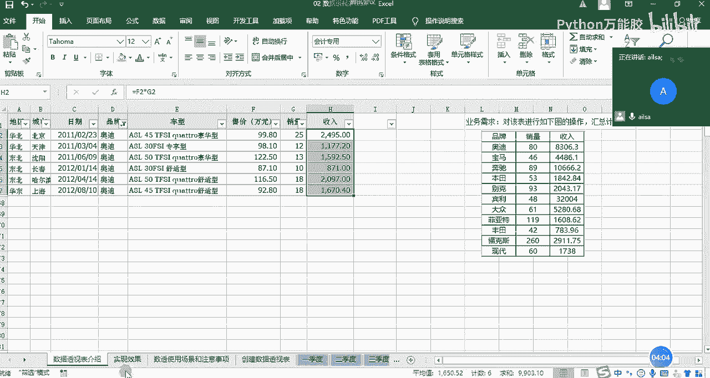

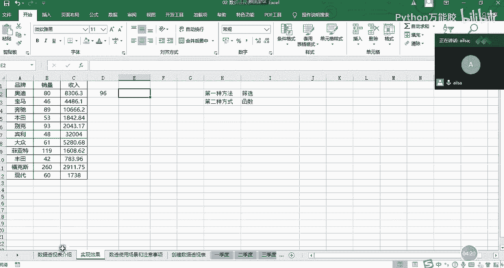

领导要求将这份详细数据整理成一份汇总报表，按品牌分别计算总销量和总收入。

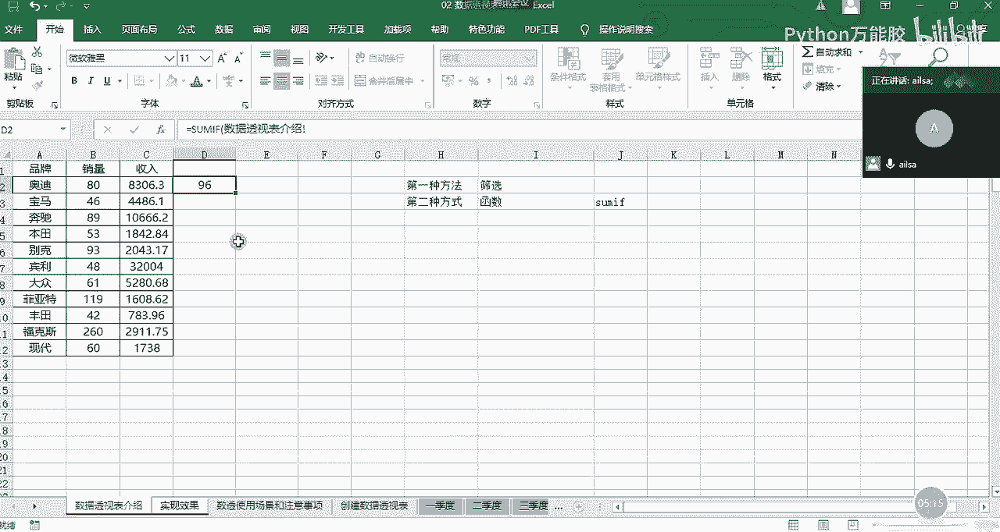

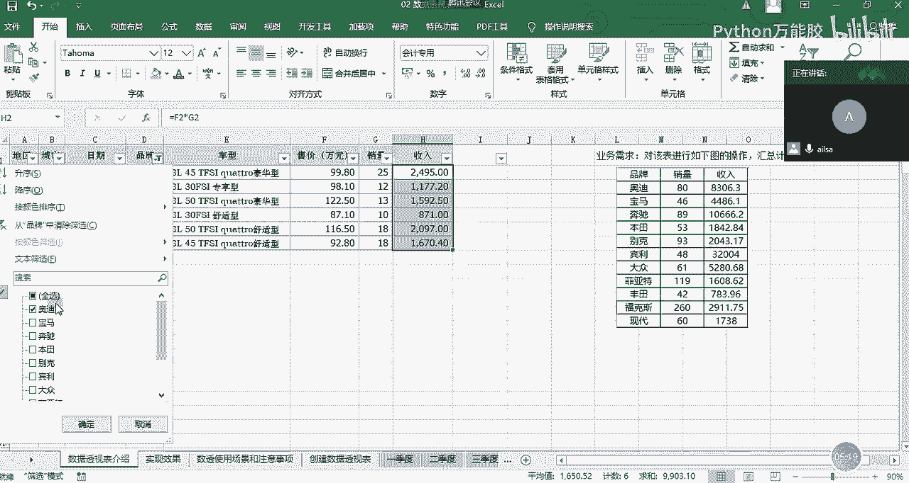

面对这个需求，通常有以下几种思路：
*   **手动筛选与求和**：筛选出每个品牌的数据，手动计算总和并填写。
*   **使用函数**：例如使用 `SUMIF` 函数进行条件求和。
*   **使用数据透视表**：我们将重点学习这种方法。

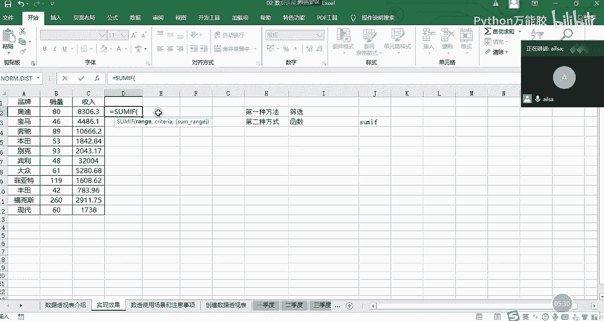

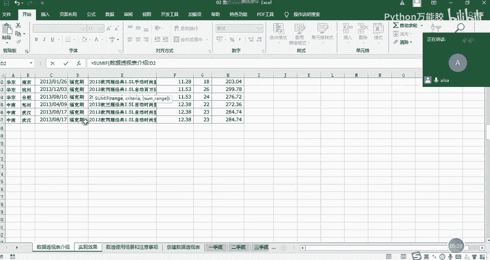

上一节我们介绍了处理数据的多种思路，本节中我们来看看如何用数据透视表高效地解决这个问题。

## 方法对比：传统 vs 数据透视表

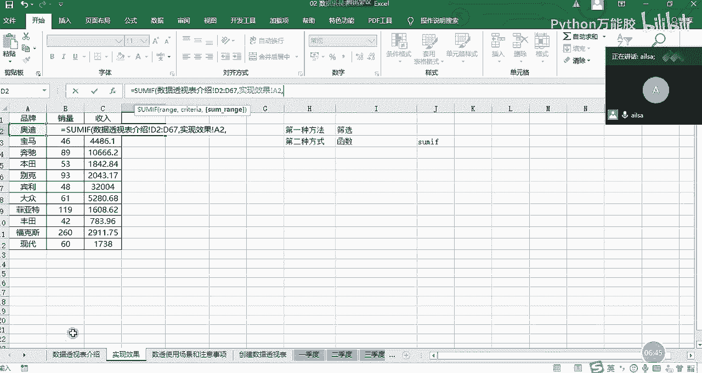

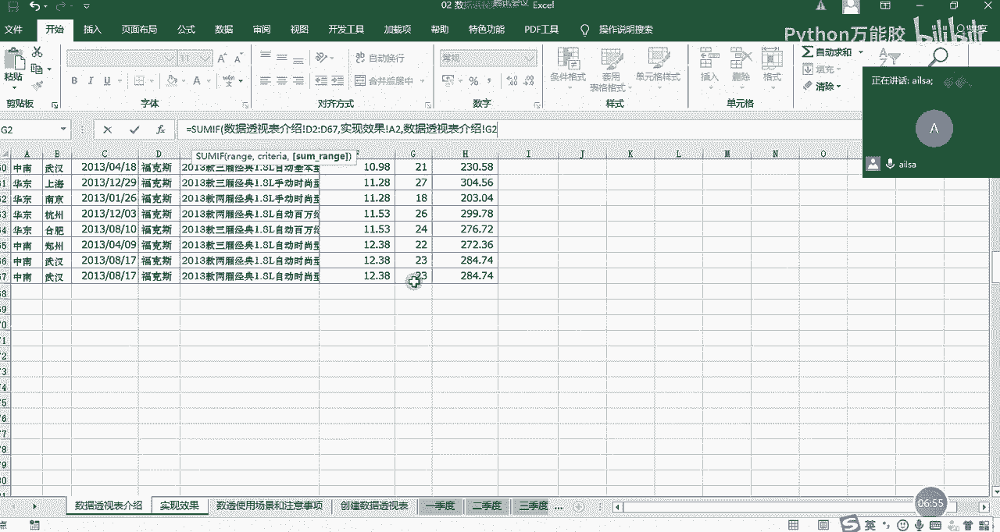

### 方法一：手动筛选
以下是手动筛选的操作步骤：
1.  使用筛选功能，筛选出特定品牌（如“奥迪”）的所有行。
2.  选中该品牌对应的“销量”列，在Excel状态栏查看求和值。
3.  将求和值手动填写到汇总表的对应位置。
4.  对“收入”列重复步骤2和3。
5.  为每一个品牌重复上述所有步骤。

这种方法虽然直观，但效率低下且容易出错，尤其当品牌数量多或数据经常更新时。

### 方法二：使用SUMIF函数
我们可以使用 `SUMIF` 函数进行条件求和。公式的基本结构为：
`=SUMIF(条件区域, 条件, 求和区域)`

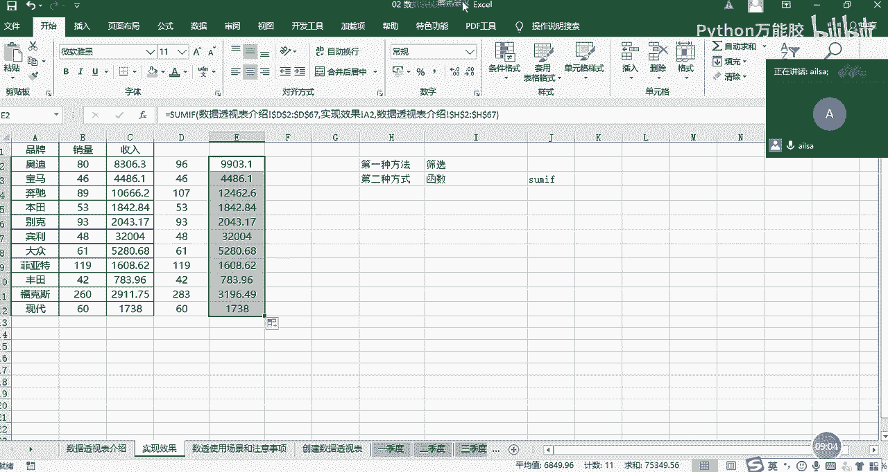

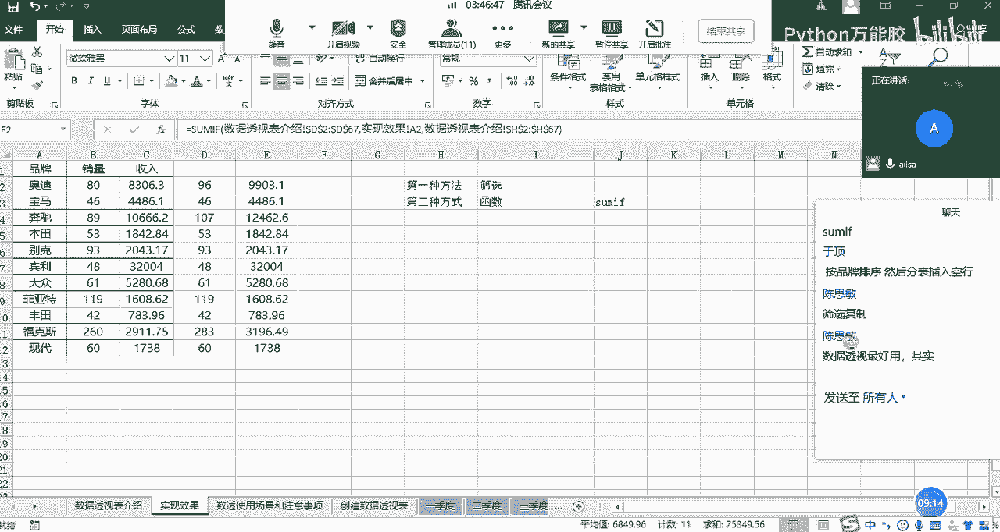

以下是具体操作步骤：
1.  在汇总表的“销量”单元格中输入公式。例如，对“奥迪”的销量求和公式可能类似于：
    `=SUMIF(原始数据表!$B$2:$B$100, A2, 原始数据表!$G$2:$G$100)`
    *   `原始数据表!$B$2:$B$100` 是品牌所在的条件区域（使用绝对引用 `$` 确保下拉公式时区域不变）。
    *   `A2` 是条件，即当前行的品牌名称“奥迪”。
    *   `原始数据表!$G$2:$G$100` 是需要求和的销量区域。
2.  输入公式后，向下拖动填充柄，为每个品牌计算销量总和。
3.  计算总收入时，复制销量公式，仅将求和区域从“销量列(G)”改为“收入列(H)”即可。

`SUMIF` 函数法比手动筛选更自动化，但需要编写和调整公式，对于多维度分析仍不够灵活。

## 核心方法：创建数据透视表 🚀

数据透视表提供了一种更直观、更强大的解决方案。它通过拖拽字段就能完成复杂的汇总分析。

### 创建步骤
1.  **定位与插入**：将鼠标光标置于原始数据区域的任意单元格内。点击【插入】选项卡，选择【数据透视表】。
2.  **设置创建选项**：
    *   **表/区域**：Excel会自动识别并选中连续的数据区域（如 `A1:H67`），请确认该区域正确。
    *   **选择放置数据透视表的位置**：可以选择“新工作表”或“现有工作表”。为了演示，我们选择“现有工作表”，并点击一个空白单元格（如 `J1`）作为透视表的起始位置。
3.  **点击【确定】**，一个空的数据透视表框架和“数据透视表字段”窗格将会出现。

### 字段布局
“数据透视表字段”窗格包含了原始数据的所有列标题（字段）。我们通过拖拽字段来构建报表：
*   **将“品牌”字段拖到【行】区域**。所有品牌将作为行标签列出。
*   **将“销量”字段拖到【值】区域**。默认情况下，Excel会对数值型字段进行“求和”。
*   **将“收入”字段拖到【值】区域**。现在，“值”区域显示了两个字段：“求和项:销量”和“求和项:收入”。

只需这三步，我们就得到了一个按品牌汇总销量和收入的清晰报表。数据透视表会自动完成所有分类和计算工作。

### 值字段设置
你可以轻松改变计算方式。在【值】区域，点击字段（如“求和项:销量”）右侧的下拉箭头，选择【值字段设置】。
在弹出的窗口中，你可以将计算类型从“求和”改为“计数”、“平均值”、“最大值”、“最小值”等，以满足不同的分析需求。

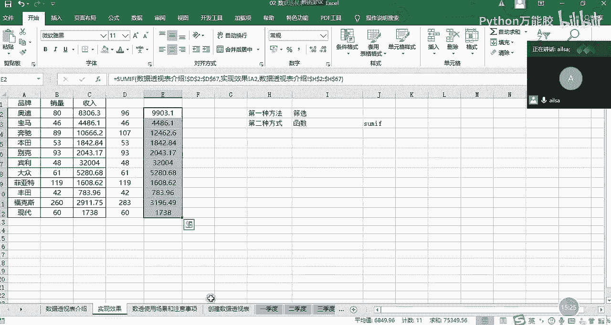

## 数据透视表的优势与注意事项

### 核心优势
*   **高效快捷**：通过拖拽操作，无需编写复杂公式。
*   **灵活交互**：可以轻松调整行、列、值字段，从不同角度透视数据。
*   **动态更新**：当原始数据更新后，只需在数据透视表上右键选择【刷新】，汇总结果就会自动更新。
*   **功能强大**：支持分组、排序、筛选、计算字段等高级功能。

### 使用前的数据准备
并非所有表格都适合创建数据透视表。为确保成功创建和正确计算，你的数据源应满足以下条件：
*   **列标题完整且唯一**：每一列都必须有标题，且不能重复。
*   **数据连续无空行/空列**：确保数据区域是连续的，中间没有空白行或列将其断开。
*   **避免合并单元格**：合并单元格会破坏数据结构，导致数据识别错误。
*   **数据类型一致**：同一列中的数据应保持相同类型（如“销量”列全部为数字格式，而非文本格式的数字）。

## 应用场景
数据透视表非常适合以下情况：
*   需要快速从大量明细数据中生成汇总报告。
*   需要从不同维度（如时间、地区、产品类别）对数据进行交叉分析。
*   数据源经常变动，需要快速更新分析结果。
*   希望以交互方式探索数据，发现其中的模式和趋势。

## 总结

本节课中我们一起学习了数据透视表的基础知识。我们从一个汇总需求出发，对比了手动操作、函数公式和数据透视表三种方法，清晰地展示了数据透视表在效率与灵活性上的巨大优势。我们掌握了创建数据透视表的基本三步：插入、拖拽行字段、拖拽值字段。同时，我们也了解了使用数据透视表前，确保数据源规范整洁的重要性。数据透视表是Excel数据分析的核心工具之一，熟练掌握它将极大提升你处理和分析数据的效率。