# Python数据分析：P26：08 数据透视表作业 📊

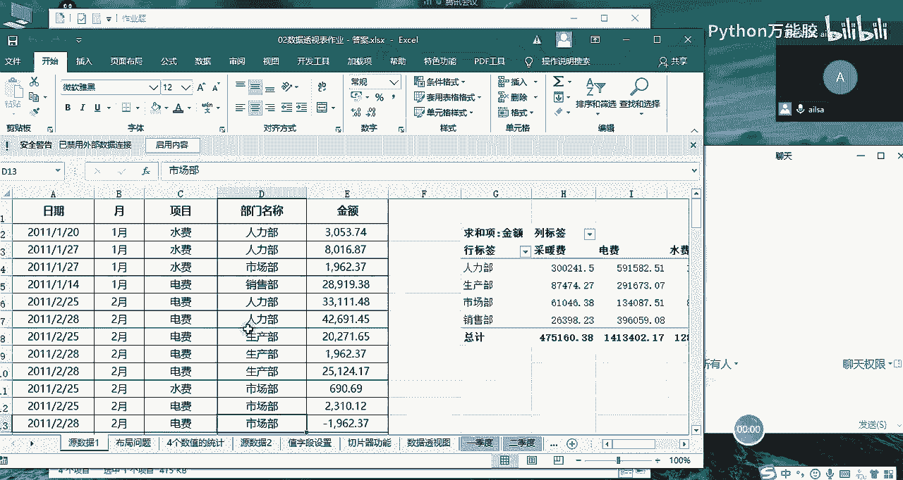

## 概述
在本节课中，我们将学习如何完成数据透视表的相关作业。我们将通过几个具体的案例，掌握数据透视表中“值显示方式”的高级应用、二维列联表的创建、以及数据透视图的联动操作。这些技巧能帮助我们更灵活地分析和呈现数据。

---

## 第一题：计算部门消费金额及占比

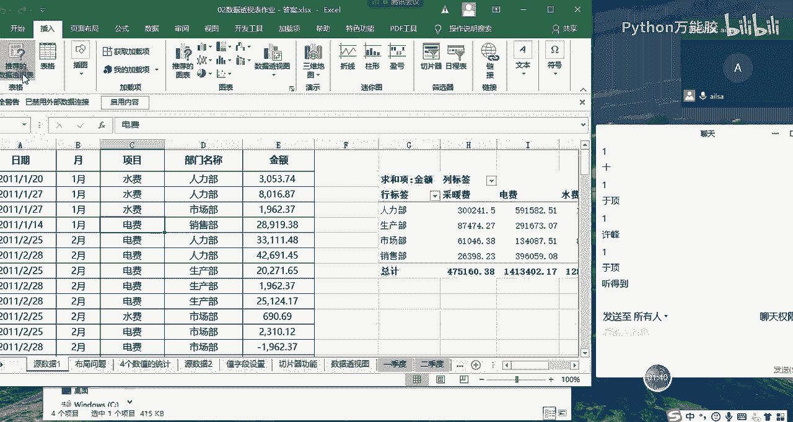

上一节我们介绍了数据透视表的基础操作，本节中我们来看看如何计算每个部门的消费金额及其占总金额的百分比。

首先，观察原数据，其中包含部门、项目名称（如水费、电费）和金额。目标是计算每个部门的总消费金额，并显示该金额占总金额的百分比。

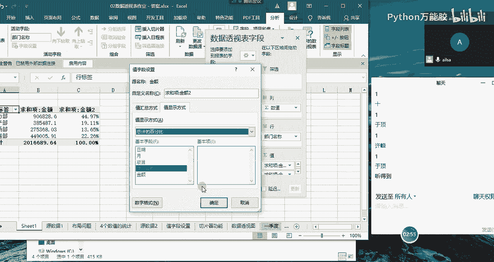

1.  选中数据区域，点击 **插入** -> **数据透视表** -> **确定**。
2.  在数据透视表字段列表中，将“部门”字段拖至“行”区域，将“金额”字段拖至“值”区域。此时，值区域默认对金额进行求和。
3.  接下来计算占比。点击值区域中的“求和项：金额”，选择 **值字段设置**。
4.  在弹出的对话框中，切换到 **值显示方式** 选项卡。
5.  在值显示方式的下拉列表中，选择 **总计的百分比**，然后点击 **确定**。

此时，数据透视表会同时显示每个部门的消费金额和该金额占总和的百分比。这个功能通过“值显示方式”实现，它提供了多种计算数据间关系的方式。

---

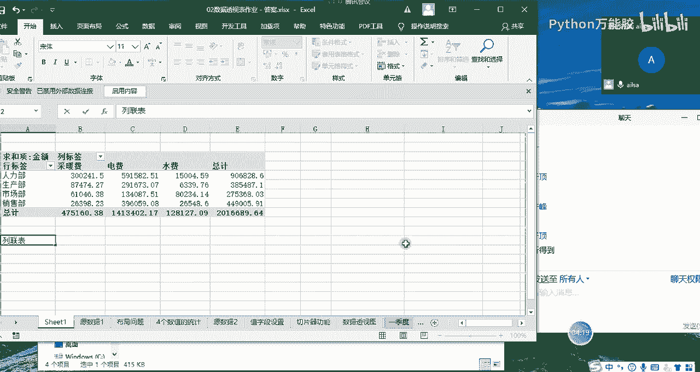

## 第二题：创建二维列联表

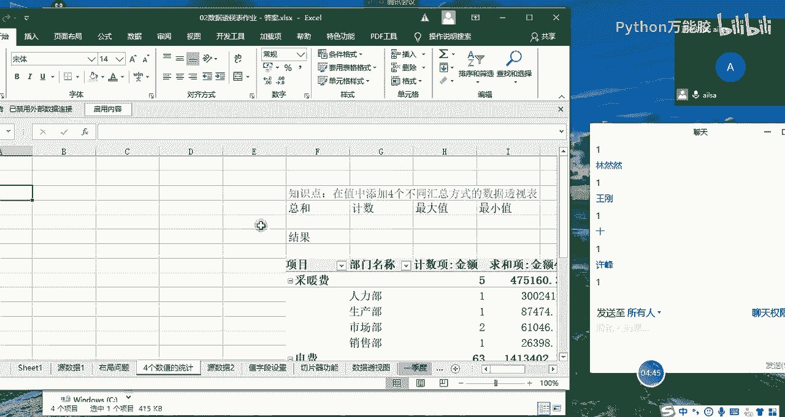

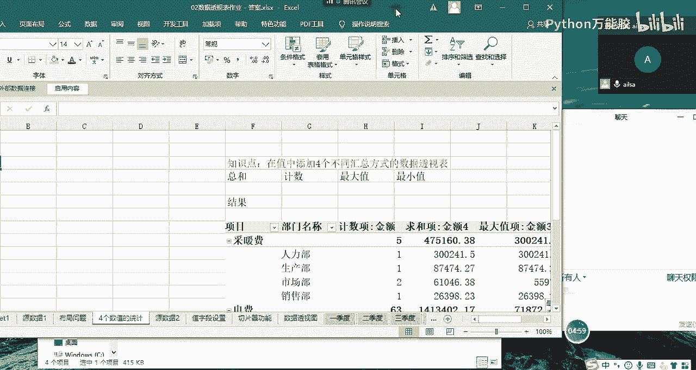

在展示了单项汇总后，我们有时需要从两个维度观察数据的交叉分布。本节我们将学习如何创建二维列联表。

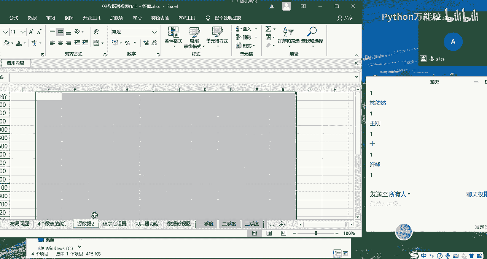

目标是创建一个表格，行方向是部门，列方向是费用类型（项目名称），交叉单元格显示对应的金额总和。这种表格在统计学中称为列联表。

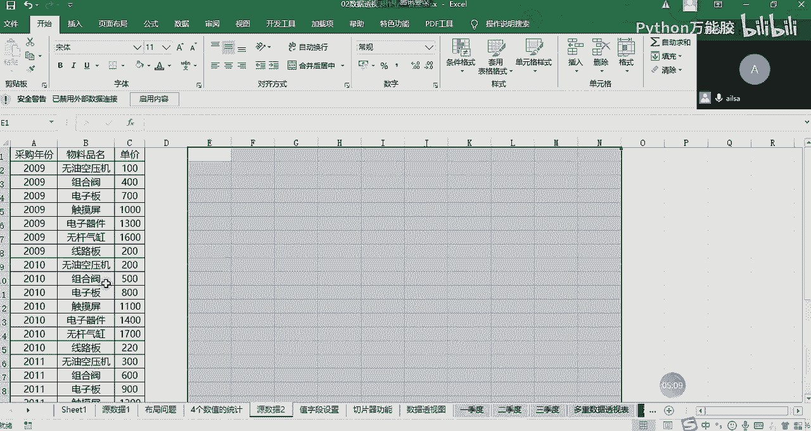

以下是创建步骤：
1.  新建一个数据透视表，或将现有透视表字段清空重新布局。
2.  将“部门”字段拖至 **行** 区域。
3.  将“项目名称”字段拖至 **列** 区域。
4.  将“金额”字段拖至 **值** 区域。

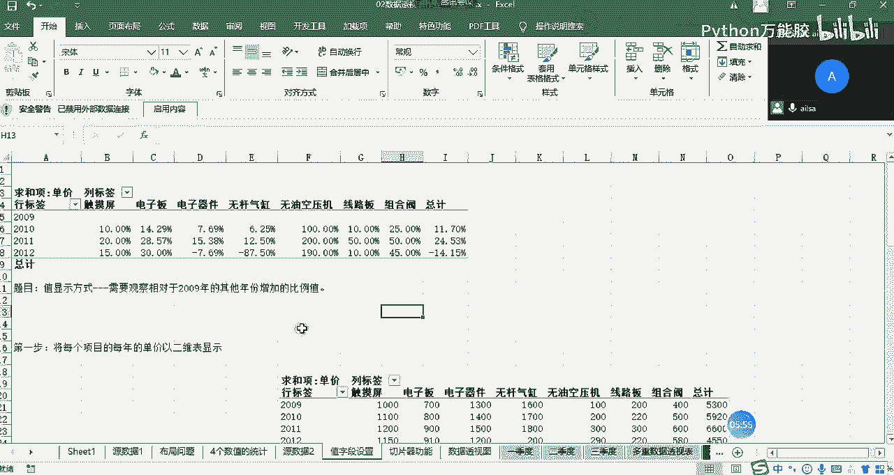

完成以上步骤后，即可得到一个清晰的二维列联表，可以直观地对比不同部门在不同费用项目上的支出情况。

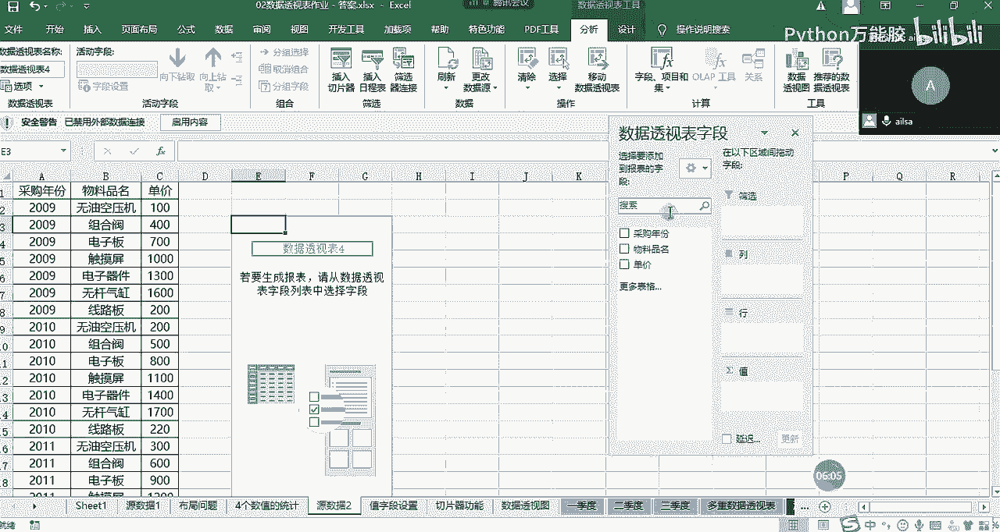

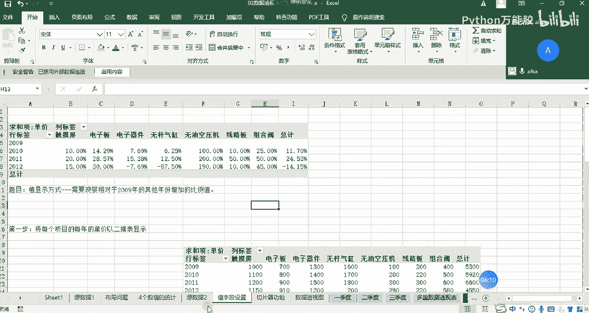

---

## 第三题：计算相对于基年的差异百分比

数据透视表不仅能进行静态汇总，还能进行动态比较。本节我们学习如何计算各年份数据相对于一个特定基年（如2009年）的变化百分比。

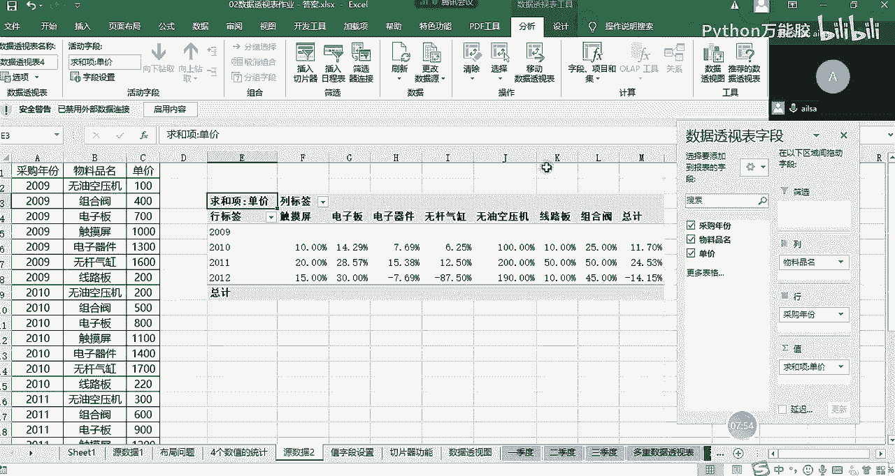

我们使用新的数据源，包含采购年份、物料名称和单价。目标是计算2010年及之后年份的物料单价，相对于2009年单价的变化百分比。

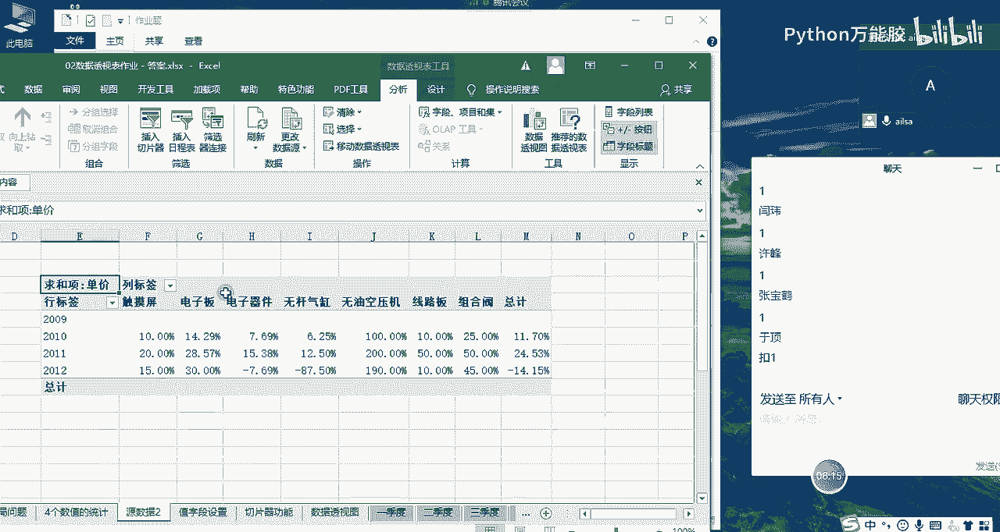

操作步骤如下：
1.  插入数据透视表，将“采购年份”拖至行区域，将“物料名称”拖至列区域，将“单价”拖至值区域。
2.  点击值区域中的“求和项：单价”，选择 **值字段设置**。
3.  在 **值显示方式** 选项卡中，选择 **差异百分比**。
4.  在“基本字段”中选择“采购年份”，在“基本项”中选择“2009”。点击 **确定**。

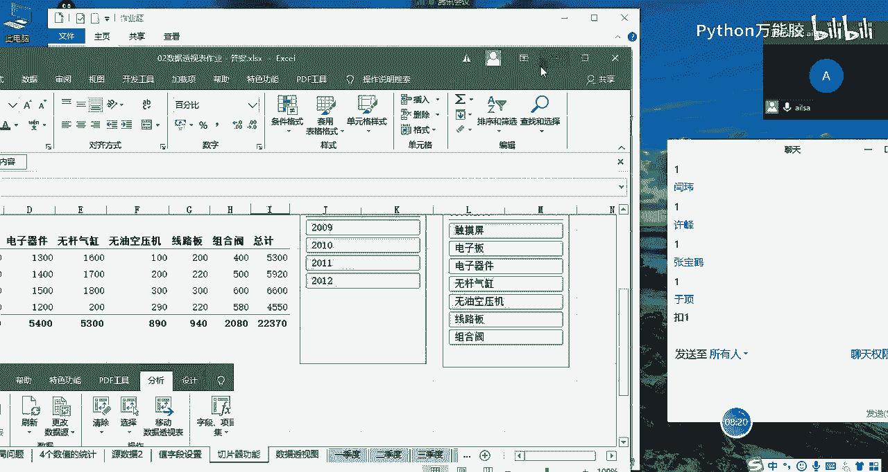

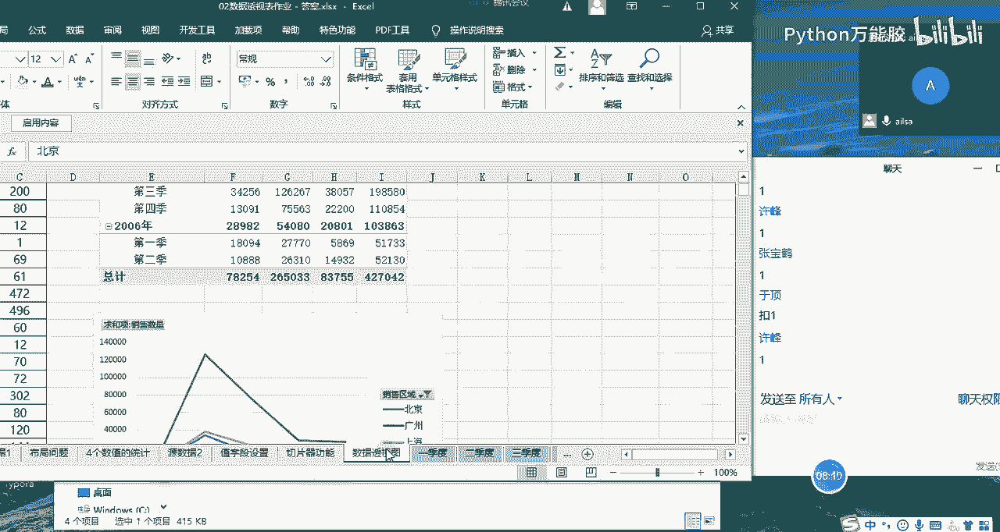

设置完成后，数据透视表将显示各年份物料单价相对于2009年的增长或减少百分比。例如，2010年触摸屏的“110%”表示价格相比2009年增长了10%。

---

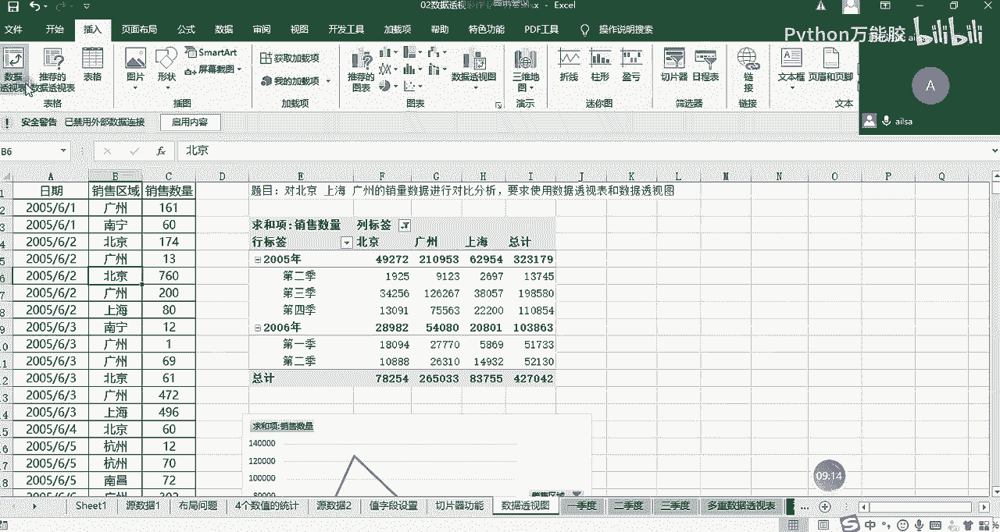

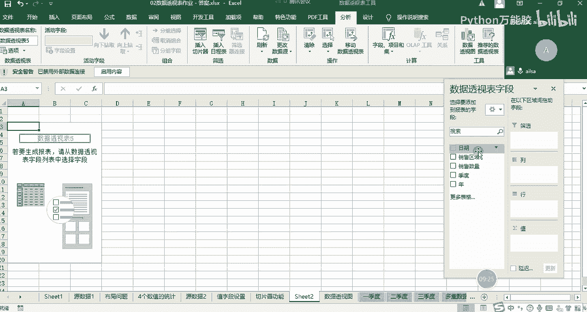

## 第四题：创建联动数据透视图

最后，我们将数据透视表与图表结合，让分析结果更加可视化。本节我们学习创建与数据透视表联动的数据透视图。

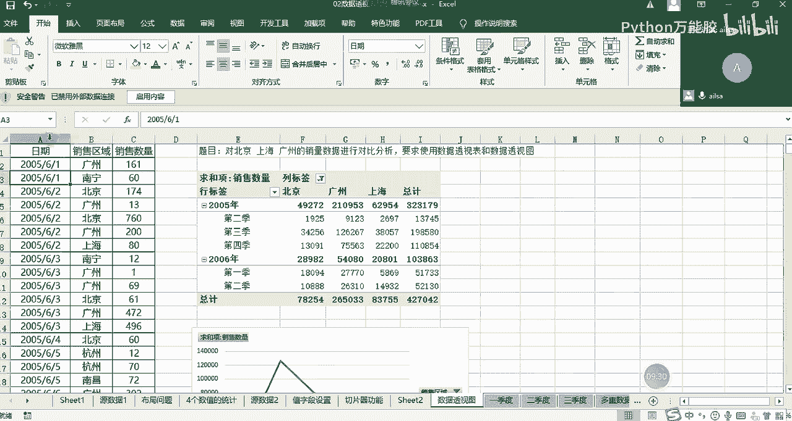

需求是分析北京、上海、广州三个城市随时间变化的销量对比，并要求使用数据透视图。

1.  插入数据透视表，将“日期”字段拖至行区域。**注意**：如果原数据中的日期是标准日期格式，数据透视表会自动将其按年、季度、月进行分级，方便后续分析。
2.  将“销售区域”字段拖至列区域，并通过筛选功能只保留“北京”、“上海”、“广州”。
3.  将“销量”字段拖至值区域。
4.  选中数据透视表任意单元格，点击 **分析** -> **数据透视图**，选择一种图表类型（如折线图）。

创建完成后，数据透视图与数据透视表完全联动。例如，在数据透视表中展开“年”字段到“月”级别，图表也会同步更新，显示更细粒度的时间趋势。需要注意的是，数据透视图的数据源直接绑定到数据透视表，因此不能像普通图表那样随意更改数据源区域。

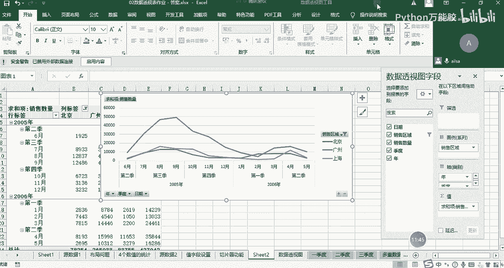

---

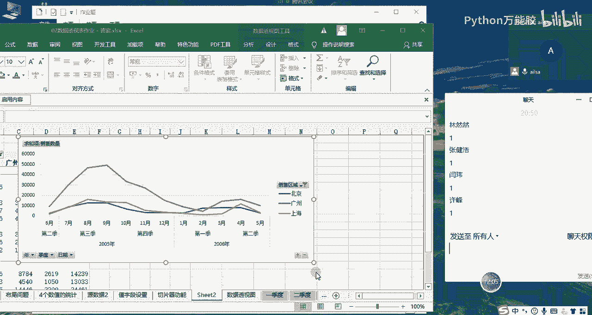

## 总结
本节课中我们一起学习了数据透视表作业的完成方法。我们掌握了利用“值显示方式”计算百分比和差异百分比，学会了构建二维列联表进行交叉分析，并实践了创建与数据透视表动态联动的数据透视图。这些技能能极大地提升我们多维度、动态分析数据的能力。