# Python数据分析：P37：RFM分析模型 📊

在本节课中，我们将学习RFM分析模型。这是一种用于评估用户行为的经典分析模型，通过三个核心指标对客户进行分层，从而实现精细化运营。

## 什么是RFM分析模型？🤔

RFM分析模型由三个部分组成，分别代表三个核心指标：
*   **R (Recency)**：最近一次消费时间间隔。
*   **F (Frequency)**：消费频率。
*   **M (Monetary)**：消费金额。

这三个指标共同构成了评估客户价值的模型基础。

## RFM指标详解 📈

上一节我们介绍了RFM模型的三个组成部分，本节中我们详细看看每个指标的具体含义。

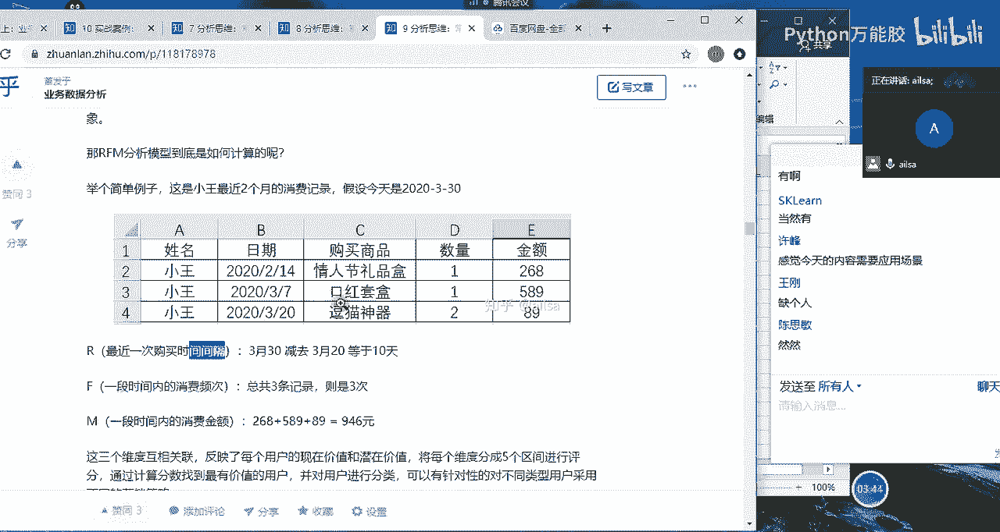

**R (最近一次消费时间间隔)**
这个指标代表客户最近一次消费日期距离当前分析日期的天数。例如，客户在3月20日购物，而今天是3月30日，那么他的R值就是 `10`。R值越小，说明客户最近越活跃，流失风险越低。

**F (消费频率)**
这个指标代表客户在选定时间段内的消费总次数。例如，在两个月内消费了3次，F值就是 `3`。F值越高，说明客户与品牌的互动越频繁。

**M (消费金额)**
这个指标代表客户在选定时间段内的消费总金额。例如，三次消费金额分别为100、150、50元，那么M值就是 `300`。M值越高，说明客户对企业的收入贡献越大。

## 客户分层与运营策略 🎯

仅仅计算出RFM值还不够，我们需要根据这些值对客户进行分层，并针对不同层级的客户采取不同的运营策略。以下是基于RFM值（高/低）的客户分层逻辑及对应策略：

*   **重要价值客户 (R高, F高, M高)**
    这是最优质的客户，需要重点保持。运营策略包括提供VIP服务、个性化推荐和附加销售。

*   **重要发展客户 (R高, F低, M高)**
    这类客户消费金额高但频率低，有发展潜力。运营策略包括推荐关联商品、提供会员忠诚计划以提高其消费频率。

*   **重要保持客户 (R低, F高, M高)**
    这类客户过去消费频繁且金额大，但最近未消费，有流失风险。运营策略包括主动触达、发送促销信息以唤回。

*   **重要挽留客户 (R低, F低, M高)**
    这类高价值客户流失风险极高。运营策略需要重点联系与拜访，尽力提高留存。

*   **一般价值客户 (R高, F高, M低)**
    这类客户活跃且忠诚，但消费能力有限。运营策略可尝试推荐高价值商品，挖掘其潜力。

*   **一般发展客户 (R高, F低, M低)**
    这类客户可能是新客户。运营策略包括提供新手优惠、免费试用，以培养兴趣和品牌认知。

*   **一般保持客户 (R低, F高, M低)**
    这类客户有粘性但价值不高。运营策略可采用积分制、打折促销等方式保持联系，防止流失。

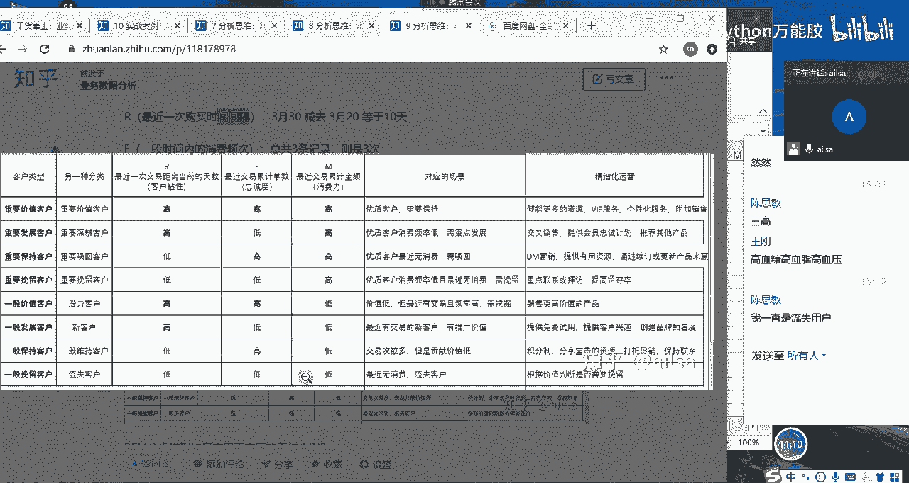

*   **流失客户 (R低, F低, M低)**
    这类客户三个维度都低。运营策略需要评估挽留成本与价值，决定是否采取挽留措施（如广告、短信），或选择放弃。

## RFM分值计算方法 🧮

了解了分层策略后，我们来看看如何将原始数据转化为可用于分层的RFM分值。主要有两种方法：评分法和均值法。

### 方法一：评分法
这种方法需要人为设定评分规则，具有一定主观性。例如，为R值设定区间和对应分数：

| R值区间（天） | 得分 |
| :------------ | :--- |
| 0-5           | 5    |
| 5-10          | 4    |
| 10-15         | 3    |
| 15-20         | 2    |

假设有客户张三，其R值为10天，根据上表，他的R得分就是3分。同理，为F值和M值设定评分规则，计算出每个客户的三项得分，然后根据总分或组合进行分层。

### 方法二：均值法
这种方法更客观，以数据的平均值为基准进行划分。
1.  首先计算所有客户R、F、M值的平均值。
2.  将每个客户的指标与平均值比较：
    *   对于R值：**小于**均值记为`1`（高），大于等于均值记为`0`（低）。因为R值越小越好。
    *   对于F值和M值：**大于等于**均值记为`1`（高），小于均值记为`0`（低）。
3.  得到一个由0和1组成的三位代码（如`101`），对应到之前的分层矩阵中，即可确定客户类型。

**举例说明：**
假设有三名客户数据如下：

| 客户 | R (天) | F (次) | M (元) |
| :--- | :----- | :----- | :----- |
| 张三 | 10     | 3      | 300    |
| 李四 | 18     | 5      | 600    |
| 王五 | 7      | 10     | 200    |

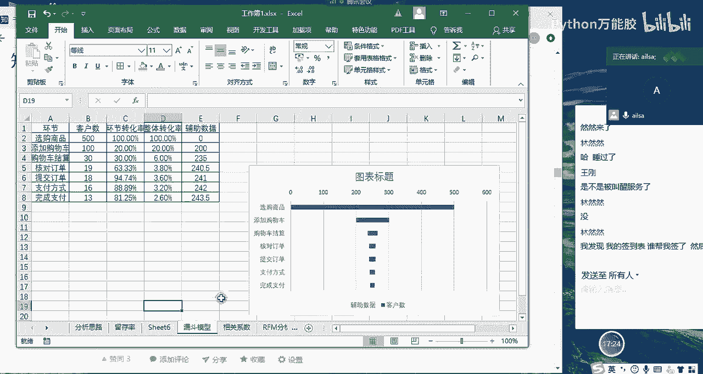

计算平均值：
*   R均值 = `(10+18+7)/3 ≈ 11.67`
*   F均值 = `(3+5+10)/3 = 6`
*   M均值 = `(300+600+200)/3 ≈ 366.67`

应用均值法得到RFM代码：
*   张三：R(10 < 11.67 -> `1`), F(3 < 6 -> `0`), M(300 < 366.67 -> `0`) => 代码 `100`
*   李四：R(18 > 11.67 -> `0`), F(5 < 6 -> `0`), M(600 > 366.67 -> `1`) => 代码 `001`
*   王五：R(7 < 11.67 -> `1`), F(10 > 6 -> `1`), M(200 < 366.67 -> `0`) => 代码 `110`

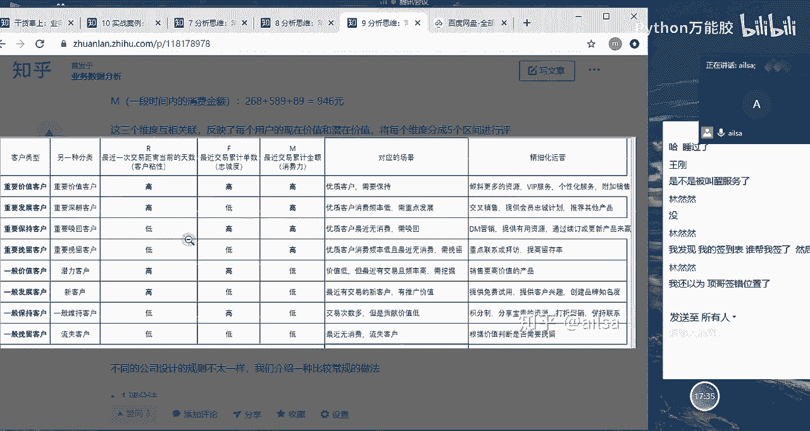

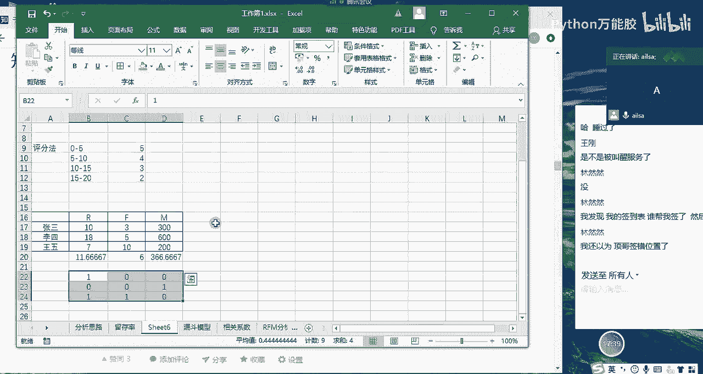

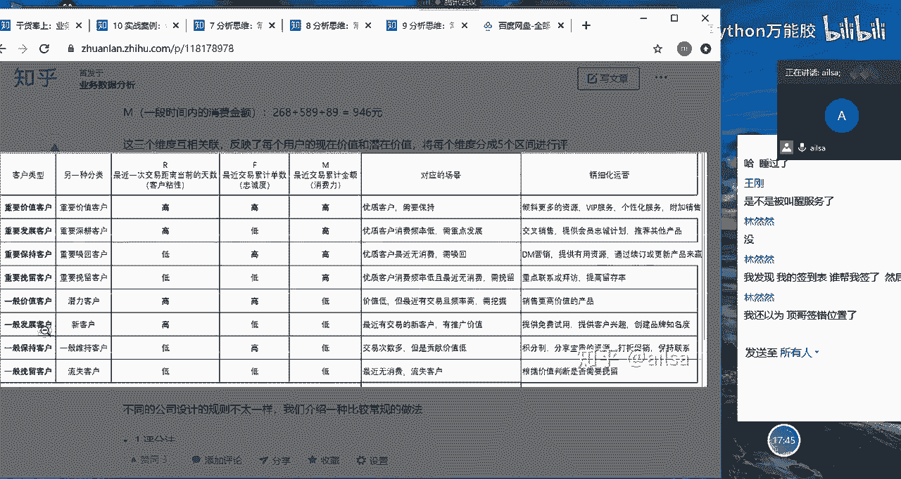

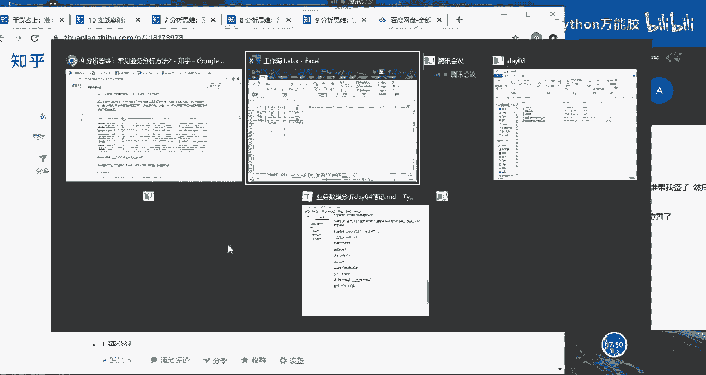

对照分层矩阵：
*   `100` 对应 **一般发展客户**
*   `001` 对应 **重要挽留客户**
*   `110` 对应 **一般价值客户**

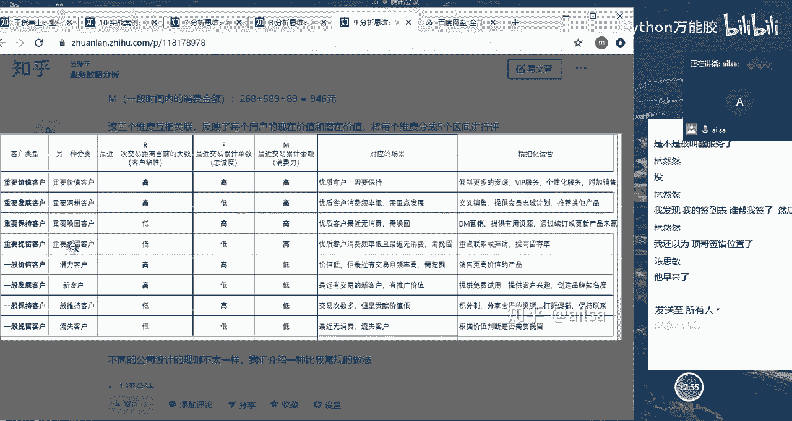

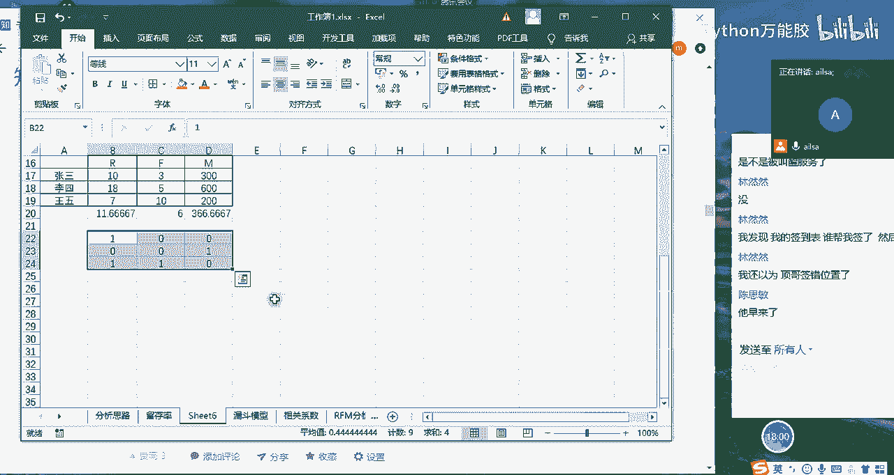

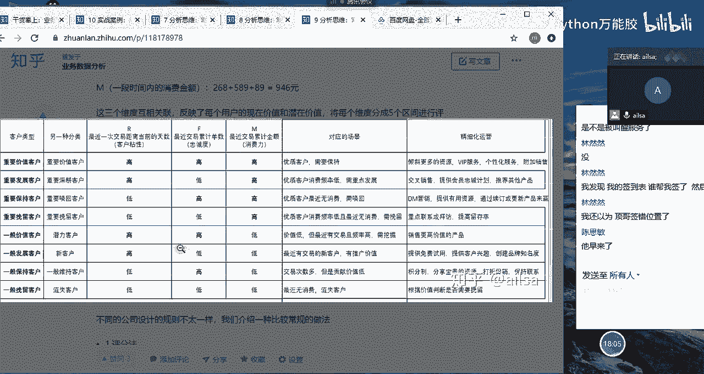

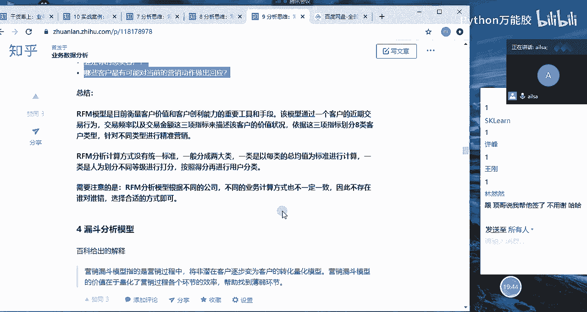

## 总结 📝

本节课中我们一起学习了RFM分析模型。
*   RFM模型通过**最近消费时间(R)**、**消费频率(F)**和**消费金额(M)**三个核心指标评估客户价值。
*   根据RFM值的高低组合，可以将客户分为**重要价值客户**、**重要发展客户**、**重要保持客户**、**重要挽留客户**、**一般价值客户**、**一般发展客户**、**一般保持客户**和**流失客户**等八大类型。
*   针对不同类型的客户，需要采取差异化的精细化运营策略，以实现资源最优配置和收益最大化。
*   计算RFM分值主要有**评分法**和**均值法**两种，在后续的实际项目操作中我们将应用这些方法进行具体分析。

掌握RFM模型能帮助你清晰识别核心客户、预警流失风险，并指导制定有效的客户关系管理策略。