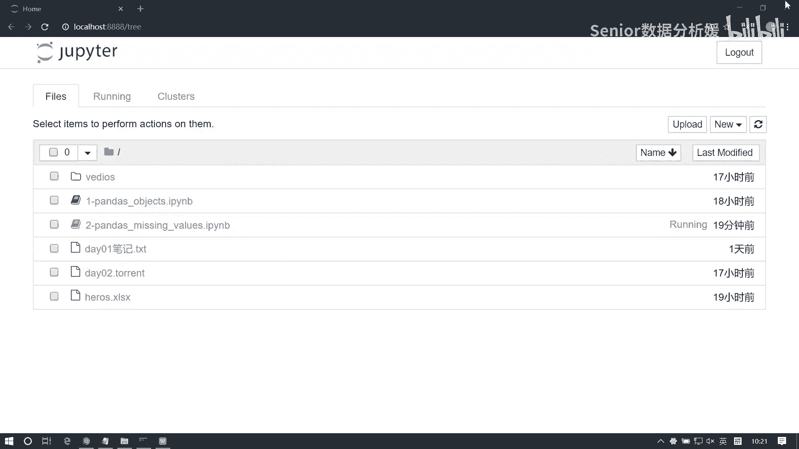
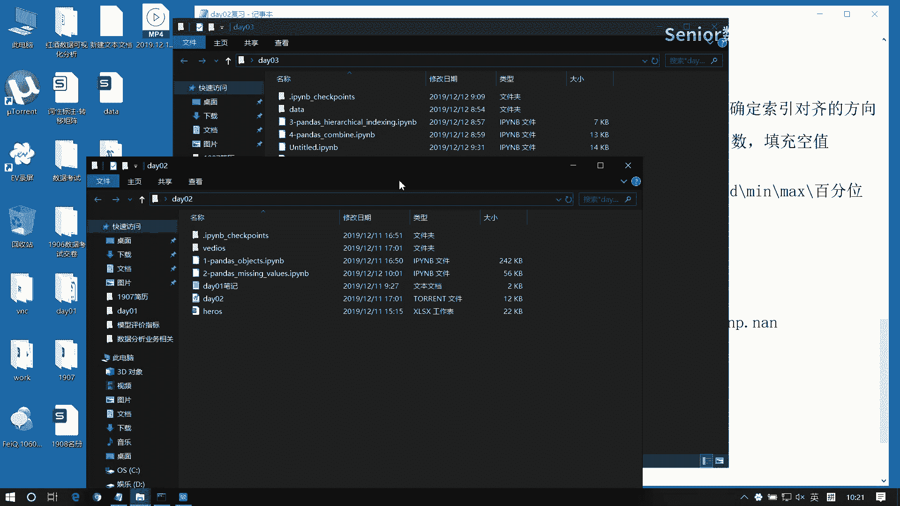
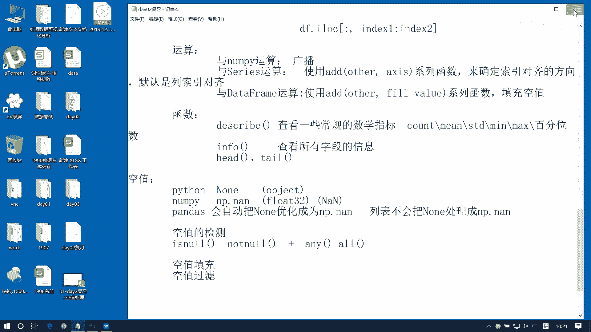
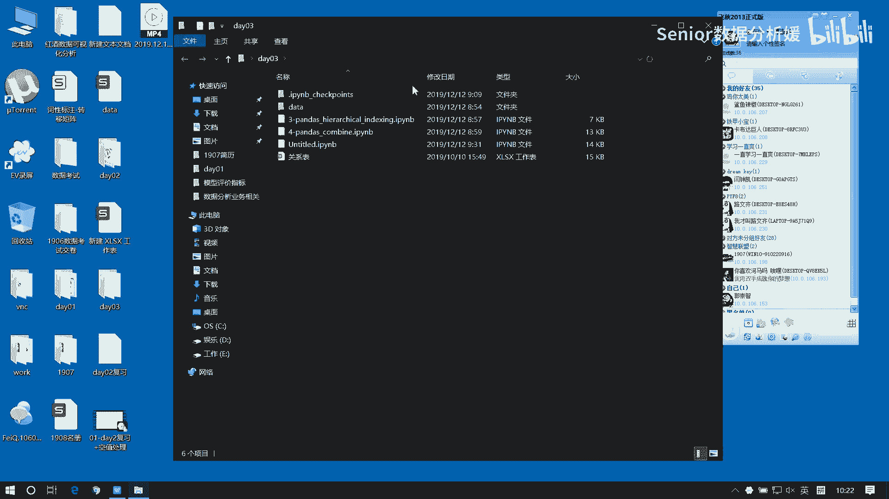
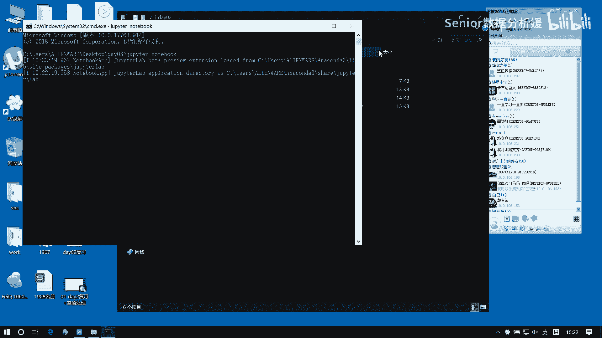
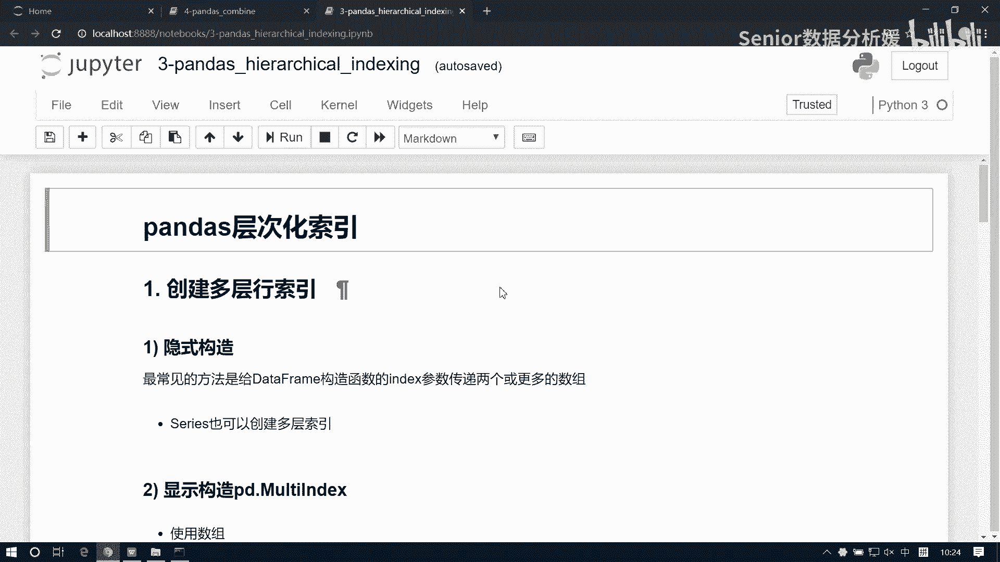
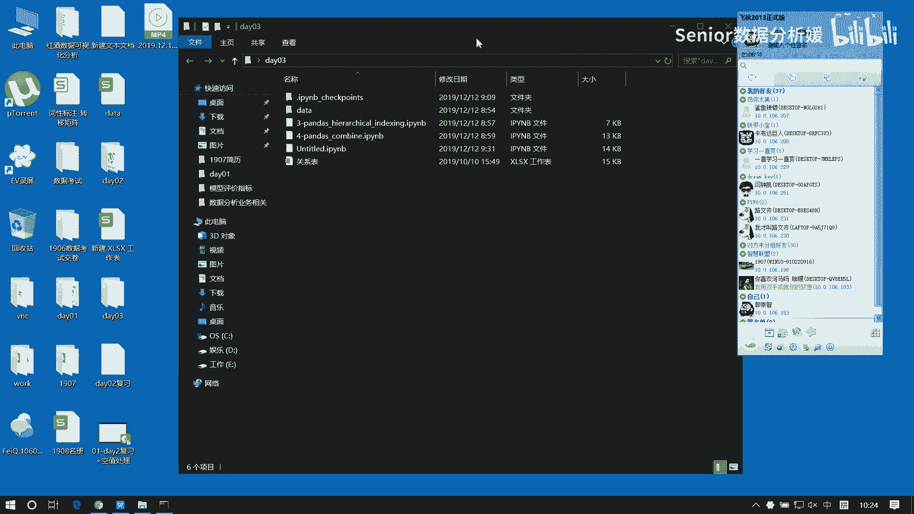
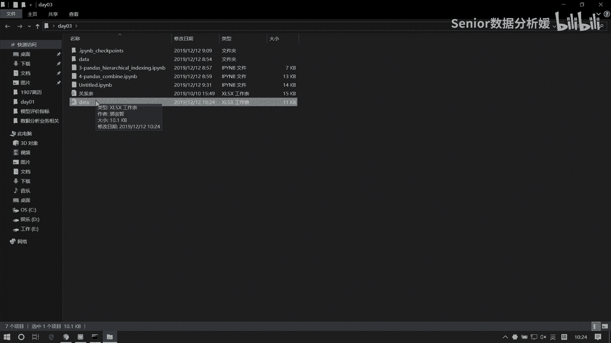
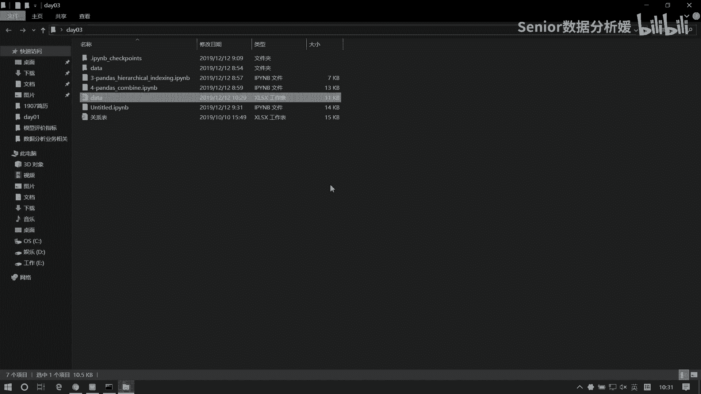
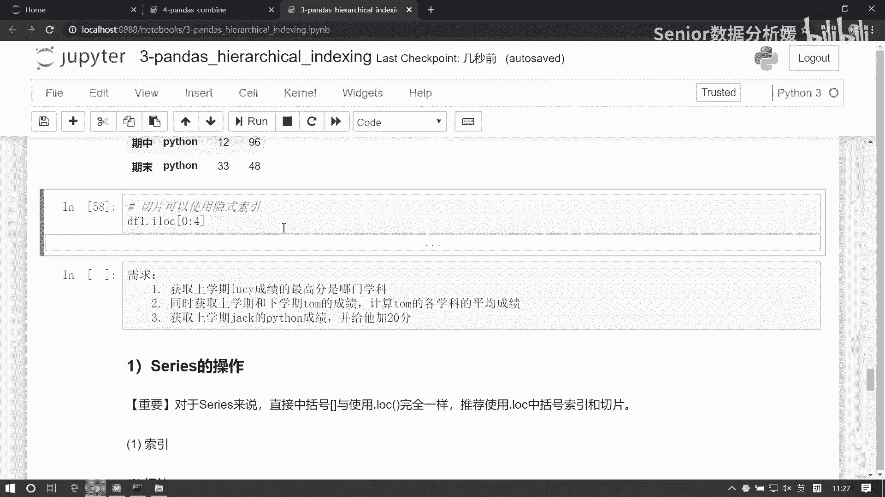

# 数据分析+金融量化+数据清洗：P34：02 DataFrame多层级索引 📊












在本节课中，我们将要学习Pandas中一个非常实用的功能——DataFrame的多层级索引。多层级索引在处理复杂的业务数据表（例如包含多个维度或分组的销售数据、成绩单等）时非常常见。掌握它的创建和访问方法，是进行高效数据分析的基础。






上一节我们介绍了DataFrame的基本操作，本节中我们来看看如何处理更复杂的索引结构。



## 多层级索引概述

什么是多层级索引？在业务场景中，数据表往往不是简单的行和列。例如，一个公司产品的年度销量表，列可能同时包含“时间段”（如上半年、下半年）和“指标”（如销量、单价、费用、利润），行可能包含不同的产品型号。这种具有两个或以上层级的索引，就是多层级索引。

## 创建多层级索引

创建多层级索引表，核心是**先使用`pd.MultiIndex`对象构造索引**，再将其传递给DataFrame。以下是三种主要的构造方式。

### 1. 使用数组（Array）构造




通过一个二维数组来定义每一层索引的具体值。

```python
import pandas as pd
import numpy as np

# 定义列索引的层级结构
array = [['first', 'first', 'first', 'second', 'second', 'second'],
         ['Java', 'Python', 'C', 'Java', 'Python', 'C']]

columns = pd.MultiIndex.from_arrays(array)
```

### 2. 使用元组（Tuples）列表构造

通过一个元组列表来定义每个列索引的组合。

```python
tuples = [('first', 'Java'), ('first', 'Python'), ('first', 'C'),
          ('second', 'Java'), ('second', 'Python'), ('second', 'C')]

columns = pd.MultiIndex.from_tuples(tuples)
```

### 3. 使用笛卡尔积（Product）构造

这是最简洁的方式，适用于层级间是组合关系的情况。

```python
levels = [['first', 'second'], ['Java', 'Python', 'C']]
columns = pd.MultiIndex.from_product(levels)
```

构造好多层级索引对象后，即可创建DataFrame。**必须确保数据形状与索引匹配**。

```python
# 生成3行6列的随机数据
data = np.random.randint(0, 100, size=(3, 6))
# 行索引
index = ['Tom', 'Jack', 'Mary']

df = pd.DataFrame(data=data, index=index, columns=columns)
print(df)
```

## 访问多层级索引的数据

访问多层级索引的核心原则是：**DataFrame的基本访问逻辑不变，变化的是索引的表达方式**。我们可以使用元组 `(level_1, level_2, ...)` 来精确指定一个多层级的标签。

以下是具体的访问示例，假设`df`是一个列索引为多层级（‘学期’， ‘科目’），行索引为单层级（学生姓名）的DataFrame。

### 访问列

- **访问单列**：使用元组指定列标签。
    ```python
    # 访问‘期中’学期的‘Python’科目列
    df.loc[:, ('期中', 'Python')]
    ```
- **访问多列**：在列表中放入多个元组。
    ```python
    # 访问‘期末’学期的‘Java’和‘C’科目列
    df.loc[:, [('期末', 'Java'), ('期末', 'C')]]
    ```

### 访问行

- **访问单行**：与单层索引相同，直接使用行标签。
    ```python
    # 访问学生‘张三’的所有数据
    df.loc['张三']
    ```

### 访问元素（单元格）

遵循“先行后列”的原则，使用元组表达列索引。

```python
# 访问‘李四’在‘期末’学期‘Java’科目的成绩
df.loc['李四', ('期末', 'Java')]

# 为其赋值
df.loc['李四', ('期末', 'Java')] = 100
```

### 访问多行

在行索引位置传入一个元组列表。

```python
# 访问‘期中-Python’和‘期末-Python’这两行数据
df.loc[[('期中', 'Python'), ('期末', 'Python')]]
```

**重要提示**：使用元组指定索引的方式**不适用于切片操作**（如`df.loc[:, (‘期中‘, ‘Python’):(‘期末‘, ‘C’)]`会报错）。

## 多层级索引的切片技巧

当需要进行切片时，可以尝试以下两种方法：

1.  **使用隐式整数索引**：忽略标签，直接使用数据在内存中的连续位置进行切片。
    ```python
    # 假设想切出前4行数据
    df.iloc[0:4]
    ```
2.  **使用堆栈（Stack）变换**：通过`stack()`和`unstack()`方法改变数据形状，将多层级索引“展平”或“重塑”，以便于操作。这将在后续课程中详细讲解。

## 行索引与列索引

多层级索引既可以应用在列（`columns`）上，也可以应用在行（`index`）上，其访问逻辑完全一致，只是方向不同。创建时，只需将构造好的`MultiIndex`对象赋给相应的参数即可。

```python
# 创建行索引为多层级的DataFrame
row_multi_index = pd.MultiIndex.from_product([['期中', '期末'], ['Python', 'Java', 'C']])
df_row = pd.DataFrame(data=np.random.randn(6, 2), index=row_multi_index, columns=['张三', '李四'])
print(df_row)
```

## 总结

本节课中我们一起学习了DataFrame的多层级索引。
*   **核心概念**：多层级索引用于描述具有多个维度的复杂数据。
*   **创建方法**：必须使用`pd.MultiIndex.from_arrays`/`from_tuples`/`from_product`先构造索引对象。
*   **访问原则**：基本访问逻辑（`loc`, `iloc`）不变，使用**元组**来表达多层级的标签。记住，元组索引方式不支持切片。
*   **切片替代**：可通过隐式索引`iloc`或后续学习的`stack`/`unstack`方法实现。



掌握多层级索引的处理，是迈向真实业务数据分析的关键一步，它让你能更灵活地组织和查询结构化的数据。