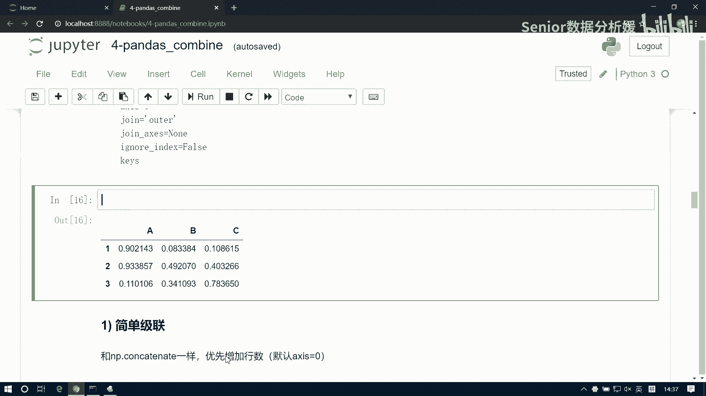
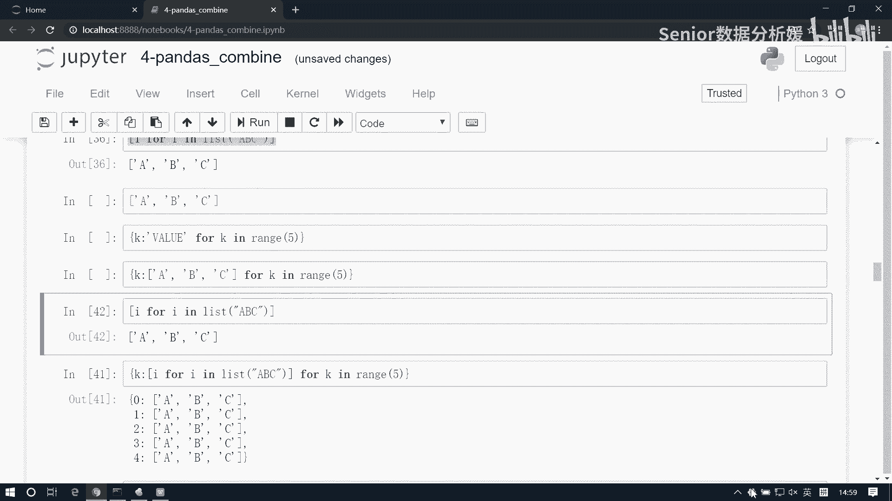

# 数据分析课程：P37：DataFrame级联-01

在本节课中，我们将学习Pandas中一个重要的数据汇总操作——DataFrame的级联。我们将从回顾NumPy的级联开始，逐步过渡到Pandas更灵活、更强大的级联方法，并探讨其在实际业务场景中的应用。

## 回顾NumPy级联

上一节我们介绍了数据汇总的基本概念。在开始学习Pandas级联之前，我们先回顾一下NumPy中的级联操作。

NumPy的级联遵循两个原则：
1.  可以同时级联多个数组。
2.  级联方向上数组的形状必须一致。

以下是NumPy级联的示例代码：

```python
import numpy as np

# 生成两个数组
n1 = np.random.randint(100, size=(3, 3))  # 三行三列
n2 = np.random.randint(100, size=(3, 4))  # 三行四列

# 尝试在列方向（axis=0）级联，会因列数不同而报错
# result = np.concatenate([n1, n2], axis=0)

# 在行方向（axis=1）级联，可以成功
result = np.concatenate([n1, n2], axis=1)
print(result)
```

NumPy级联的局限性在于，它严格要求级联方向上的维度形状必须匹配，这在处理结构可能变化的业务数据时不够灵活。

## 认识Pandas级联

本节中我们来看看Pandas的级联操作。Pandas的级联比NumPy更加灵活和智能，它能够处理列结构不完全相同的数据表。

首先，我们创建两个DataFrame：

```python
import pandas as pd

# 将之前的数组封装成DataFrame
df1 = pd.DataFrame(data=n1, columns=list('ABC'))
df2 = pd.DataFrame(data=n2, columns=list('ABCD'))

print("df1:")
print(df1)
print("\ndf2:")
print(df2)
```

Pandas中使用 `pd.concat()` 函数进行级联。其基本语法是 `pd.concat(objs, axis=0)`，其中 `objs` 是一个需要级联的DataFrame列表。

以下是Pandas级联的示例：

```python
# 默认纵向级联（axis=0）
result_vertical = pd.concat([df1, df2])
print("纵向级联结果：")
print(result_vertical)

# 横向级联（axis=1）
result_horizontal = pd.concat([df1, df2], axis=1)
print("\n横向级联结果：")
print(result_horizontal)
```

观察结果可以发现Pandas级联的特点：
*   **保留所有字段**：纵向级联时，会保留所有出现过的列标签。如果某个DataFrame缺少某一列，Pandas会自动用空值（NaN）填充。
*   **索引对齐**：级联操作遵循索引对齐原则。数据会根据行索引或列索引进行匹配，未匹配到的位置用空值填充。

## 索引对齐原则详解

Pandas级联的核心是索引对齐。这意味着级联时，数据会按照索引（行标签或列标签）进行匹配和组合。

让我们通过一个例子来加深理解：




```python
# 创建另一个列顺序不同的DataFrame
df3 = pd.DataFrame(data=np.random.randint(0, 10, size=(3, 4)),
                   columns=list('BDAC'))
print("df3:")
print(df3)

# 将df1和df3纵向级联
result_aligned = pd.concat([df1, df3])
print("\ndf1与df3纵向级联结果（注意列对齐）：")
print(result_aligned)
```

在这个例子中，`df1`的列顺序是`[‘A‘， ‘B‘， ‘C‘]`，而`df3`的列顺序是`[‘B‘， ‘D‘， ‘A‘， ‘C‘]`。级联时，Pandas不会简单地按位置拼接，而是根据列名进行对齐。`df1`中没有的`‘D‘`列会被填充为NaN，所有列都会按照并集出现在结果中。

## 动手练习：理解级联对齐

为了巩固对索引对齐的理解，我们进行一个简单的练习。

以下是创建两个DataFrame并进行级联的代码：

```python
# 创建两个DataFrame
df1_ex = pd.DataFrame(data=np.random.randn(3, 3).round(2),
                      columns=list('ABC'),
                      index=[1, 2, 3])
df2_ex = pd.DataFrame(data=np.random.randn(3, 3).round(2),
                      columns=list('ABC'),
                      index=[3, 4, 5])

print("df1_ex:")
print(df1_ex)
print("\ndf2_ex:")
print(df2_ex)

# 纵向级联
concat_vertical = pd.concat([df1_ex, df2_ex])
print("\n纵向级联结果：")
print(concat_vertical)

# 横向级联
concat_horizontal = pd.concat([df1_ex, df2_ex], axis=1)
print("\n横向级联结果：")
print(concat_horizontal)
```

观察横向级联的结果。因为`df1_ex`的行索引是`[1， 2， 3]`，`df2_ex`的行索引是`[3， 4， 5]`，所以在横向级联时，只有行索引`3`能完全匹配。索引`1`和`2`在`df2_ex`中不存在，索引`4`和`5`在`df1_ex`中不存在，这些位置都会被填充为NaN。

## 级联的应用场景

了解了级联的操作后，我们来思考它的应用场景。

级联主要用于处理**结构相同或相似**的业务表格的数据汇总。这里的“结构”主要指表的字段（即列）。

以下是几个典型应用场景：
*   **月度/年度数据合并**：例如，公司每月的销售数据表结构相同（都有产品、销售额、成本等字段），年底时需要将12个月的数据纵向级联成一张年度总表进行分析。
*   **多来源数据合并**：从不同部门或系统导出的数据，如果核心字段一致，可以通过级联进行初步整合。
*   **增量数据追加**：例如，每日新增的用户注册数据，其表结构与历史数据一致，可以定期级联到总用户表中。

当业务表的结构（字段）相同或相近时，可以使用级联来进行数据汇总。

## 生成示例数据的辅助函数

在后续深入学习`pd.concat`的其他参数时，为了更清晰地观察效果，我们需要一个能生成具有规律性、易于辨识数据的函数。

以下是一个能根据给定的行索引和列索引生成对应DataFrame的函数：

```python
def create_df(index_list, columns_list):
    """
    根据行索引列表和列索引列表生成DataFrame。
    每个单元格的值是“行索引_列索引”的字符串格式。
    """
    data = []
    for row_label in index_list:
        row = []
        for col_label in columns_list:
            # 将行标签和列标签组合成单元格的值，例如 ‘A_1‘
            cell_value = f"{row_label}_{col_label}"
            row.append(cell_value)
        data.append(row)
    df = pd.DataFrame(data=data, index=index_list, columns=columns_list)
    return df

# 测试函数
test_index = ['A', 'B', 'C']
test_columns = ['1', '2', '3']
test_df = create_df(test_index, test_columns)
print(test_df)
```

这个函数通过双层循环，将行标签和列标签拼接起来，填充到DataFrame的每个单元格中，生成一个标识清晰的表格，方便我们观察级联时的数据对齐情况。

---



本节课中我们一起学习了Pandas DataFrame级联的基础知识。我们从NumPy级联的回顾开始，认识了Pandas `pd.concat()` 方法在纵向和横向上的级联操作，并重点理解了其**索引对齐**的核心原则。我们还探讨了级联在合并结构相似表格时的典型应用场景，并创建了一个辅助函数来生成测试数据。在下一节中，我们将继续探讨`pd.concat()`函数的其他重要参数，如`join`、`ignore_index`等，它们能让我们对级联过程进行更精细的控制。