# 数据分析+金融量化+数据清洗：P45：05 map函数+rename函数 🧮

在本节课中，我们将要学习Pandas库中两个重要的数据处理函数：`map`和`rename`。`map`函数主要用于对Series（一列数据）进行批量映射转换，而`rename`函数则用于修改DataFrame的行索引或列索引标签。掌握这两个函数能帮助我们高效地清洗和转换数据，为后续分析做好准备。

## map函数详解

上一节我们介绍了`replace`函数用于替换某些特定值。本节中我们来看看`map`函数，它主要用于对一整列数据进行批量映射处理。需要注意的是，`map`是Series对象的方法，而不是DataFrame的方法，因此它每次只处理一列数据。

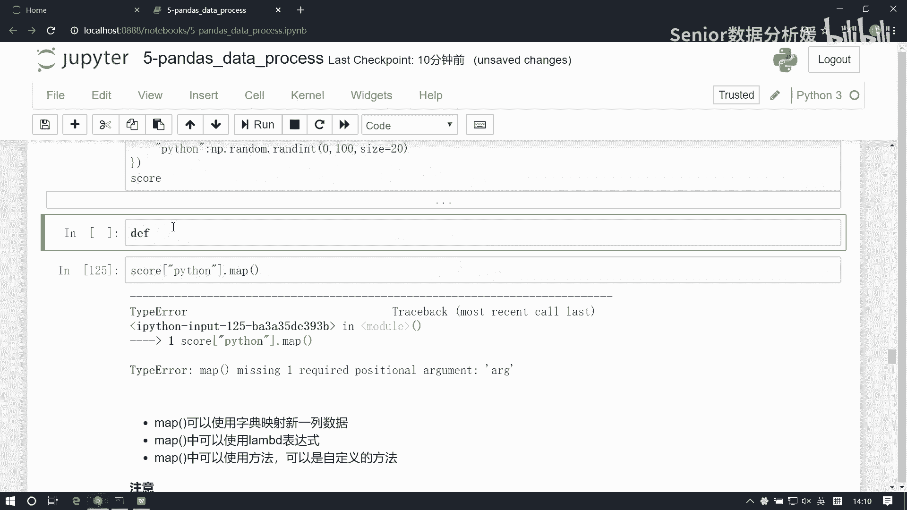

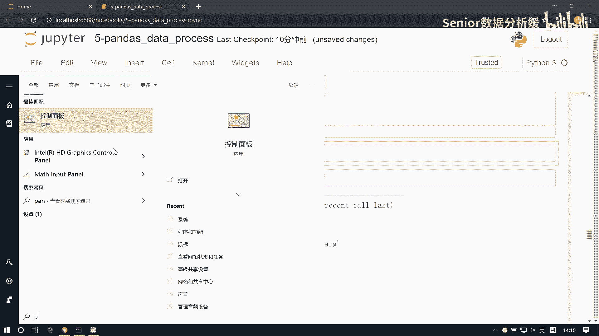

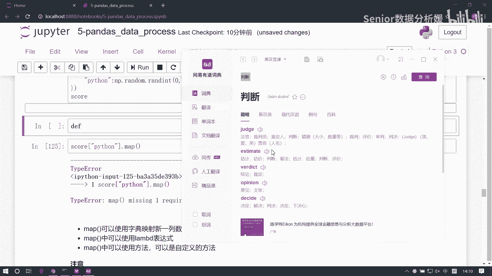

### map函数的基本用法

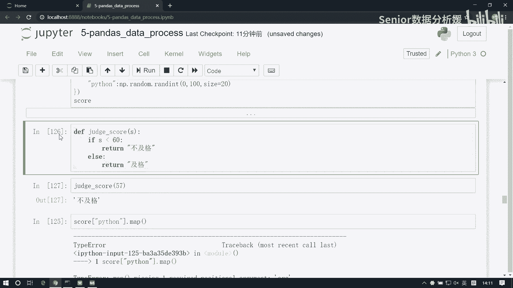

`map`函数接收的参数主要有三种形式：字典、lambda表达式或自定义函数。以下我们将通过实例逐一介绍。

首先，我们创建一个包含成绩的DataFrame作为示例数据：

```python
import numpy as np
import pandas as pd

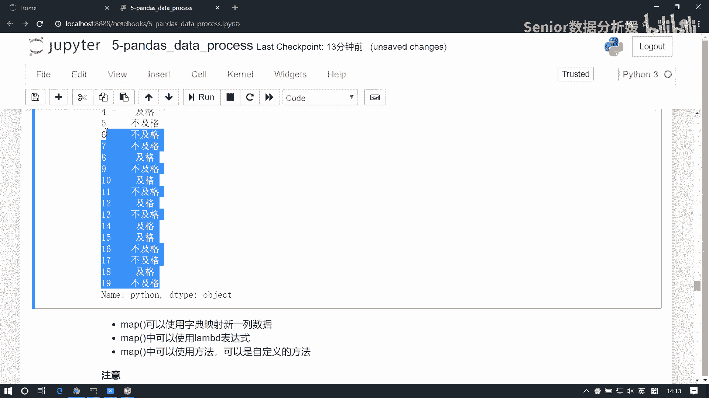

# 创建一个包含Python成绩的DataFrame
score_df = pd.DataFrame({
    'Python': np.random.randint(0, 100, size=20)
})
print(score_df.head())
```

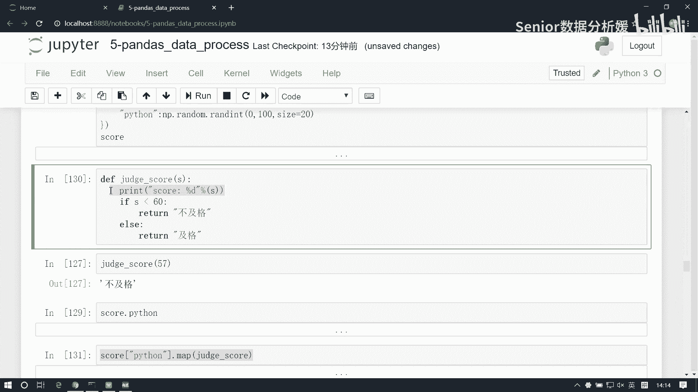

### 使用自定义函数进行映射

假设我们想将成绩映射为“及格”和“不及格”两类。我们可以先定义一个判断函数，然后将其传入`map`函数。

```python
# 定义一个判断成绩是否及格的函数
def judge_score(s):
    if s < 60:
        return '不及格'
    else:
        return '及格'

# 对‘Python’这一列应用map函数
# 注意：map是Series的方法，所以需要先取出‘Python’列
score_df['状态'] = score_df['Python'].map(judge_score)
print(score_df.head())
```

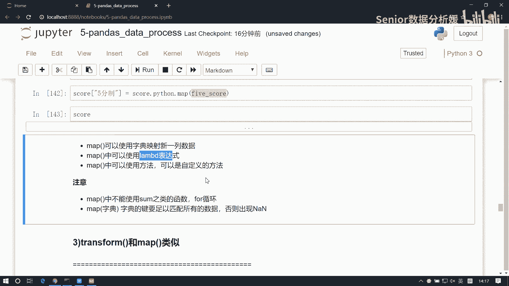

**调用逻辑**：`map`函数会将Series中的每一个值依次传递给`judge_score`函数，并将返回值组合成一个新的Series。因此，自定义函数通常只接收一个参数。

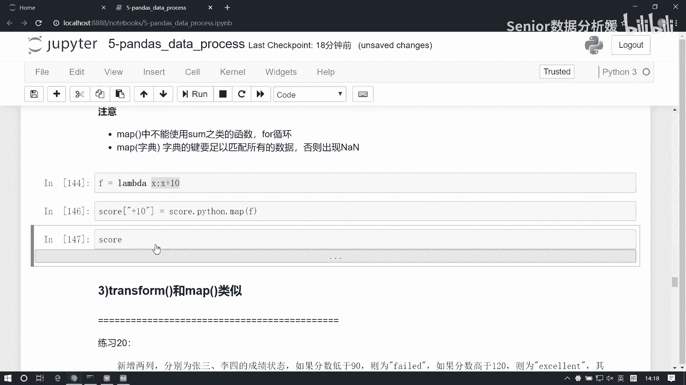

### 使用lambda表达式进行映射

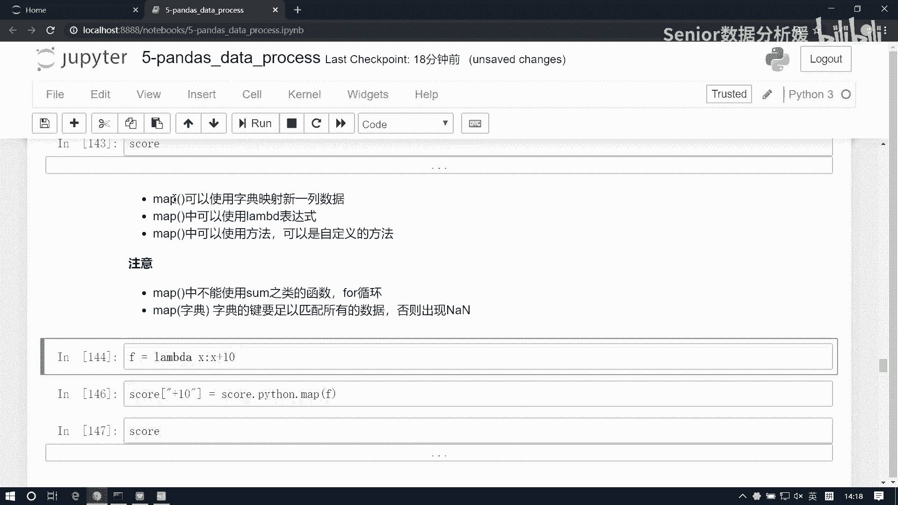

对于简单的映射逻辑，使用lambda表达式更为简洁。例如，将所有成绩统一加10分：

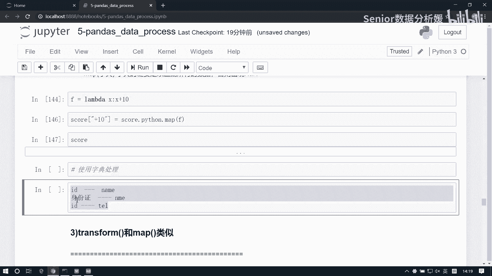

```python
# 使用lambda表达式给所有成绩加10分
score_df['加十分'] = score_df['Python'].map(lambda x: x + 10)
print(score_df.head())
```

### 使用字典进行映射

当映射关系是固定且无规律时（例如ID与姓名的对应），使用字典非常方便。

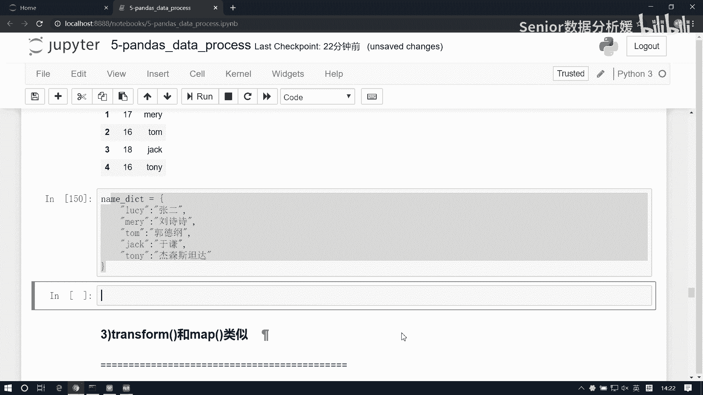

```python
# 创建一个用户信息表
user_df = pd.DataFrame({
    'name': ['lucy', 'marry', '汤姆', '杰克', 'tony'],
    'age': np.random.randint(15, 20, size=5)
})

# 定义一个曾用名字典
old_name_dict = {
    'lucy': '张二',
    'marry': '刘诗诗',
    '汤姆': '郭德纲',
    '杰克': '于谦'
    # 注意：tony没有在字典中
}

# 使用map函数和字典进行映射
user_df['old_name'] = user_df['name'].map(old_name_dict)
print(user_df)
```

**注意**：如果字典中找不到对应的键，`map`函数会返回`NaN`（空值）。

### 处理字典映射不全的情况

在实际业务中，映射字典可能不完整。我们可以封装一个函数，利用字典的`.get()`方法，在找不到映射时返回原始值。

```python
# 封装一个函数处理映射不全的情况
def get_name(x):
    # 如果字典中有x，返回映射值；否则返回x本身
    return old_name_dict.get(x, x)

user_df['old_name_fixed'] = user_df['name'].map(get_name)
print(user_df)
```

### 小练习：统计成年人与未成年人比例

以下是实现该需求的一个示例：

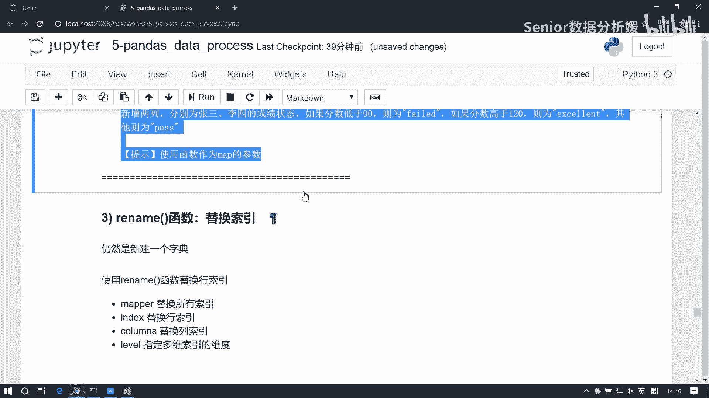

```python
# 1. 生成包含20个年龄（16-20岁）的数据表
user_age_df = pd.DataFrame({
    'age': np.random.randint(16, 21, size=20)
})

# 2. 定义判断是否成年的函数
def is_adult(x):
    if x < 18:
        return '未成年'
    else:
        return '成年'

# 3. 使用map函数添加状态列
user_age_df['状态'] = user_age_df['age'].map(is_adult)

# 4. 使用value_counts统计比例
state_counts = user_age_df['状态'].value_counts()
print("计数结果：")
print(state_counts)
print("\n比例（成年:未成年）：")
print(state_counts['成年'] / state_counts['未成年'])
```

### 关于transform函数

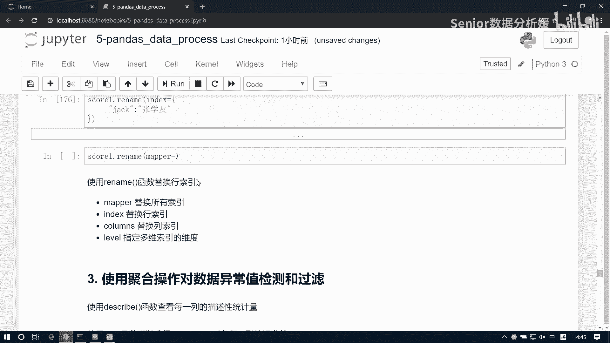

`transform`函数与`map`功能类似，但它只接收函数作为参数，不接收字典或lambda表达式。在简单映射场景下，两者可以互换使用。

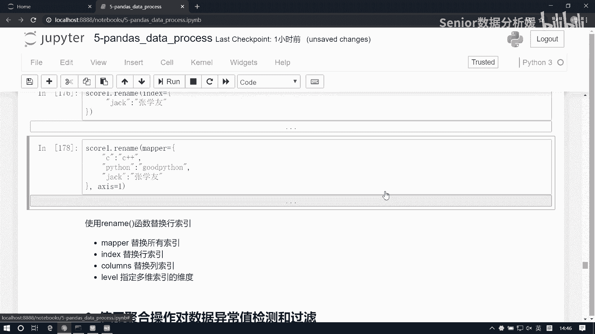

```python
# 使用transform达到同样效果
user_age_df['状态_transform'] = user_age_df['age'].transform(is_adult)
print(user_age_df.head())
```

## rename函数详解

`map`函数用于处理列内的数据值，而`rename`函数则用于修改DataFrame的行索引或列索引的标签。

### 基本用法：修改列名

我们首先创建一个示例DataFrame。

```python
# 创建一个成绩DataFrame
score1_df = pd.DataFrame(
    np.random.randint(0, 100, size=(5, 3)),
    columns=['Python', 'Java', 'C'],
    index=['张三', '李四', '王五', '杰克', '韩梅梅']
)
print("原始DataFrame:")
print(score1_df)
```

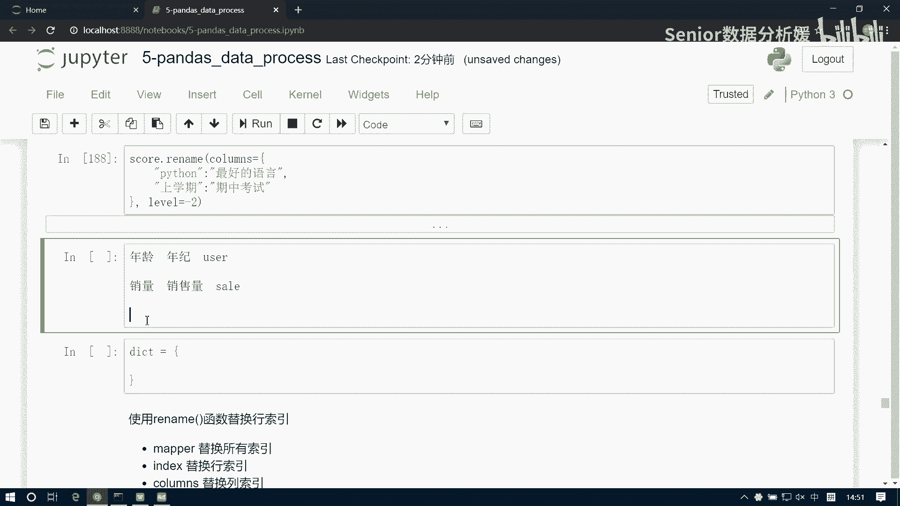

使用`rename`函数修改列名，通过`columns`参数传入一个字典（旧列名:新列名）。


```python
# 将‘C’列改名为‘C++’
score1_df.rename(columns={'C': 'C++'}, inplace=True)
print("修改列名后:")
print(score1_df)
```

**参数`inplace=True`**：表示直接在原DataFrame上修改，而不返回新的DataFrame。

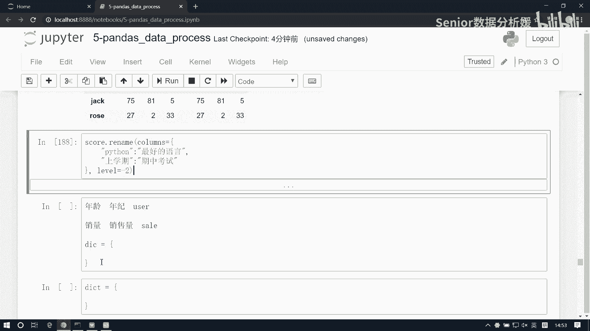

### 同时修改多个列名

可以一次性修改多个列名。

```python
score1_df.rename(columns={'Python': 'Good Python', 'Java': 'Strong Java'}, inplace=True)
print("修改多个列名后:")
print(score1_df)
```


### 修改行索引

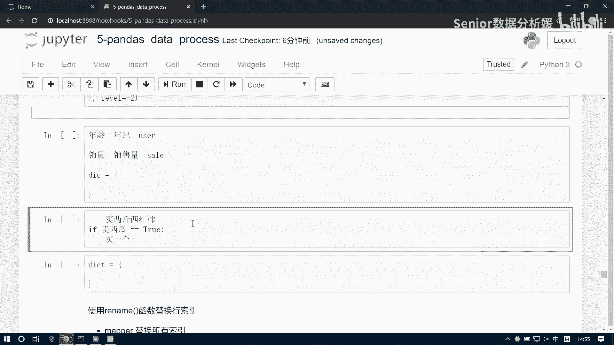

修改行索引需要使用`index`参数。

```python
# 将‘杰克’改为‘张学友’
score1_df.rename(index={'杰克': '张学友'}, inplace=True)
print("修改行索引后:")
print(score1_df)
```


### 处理多级索引

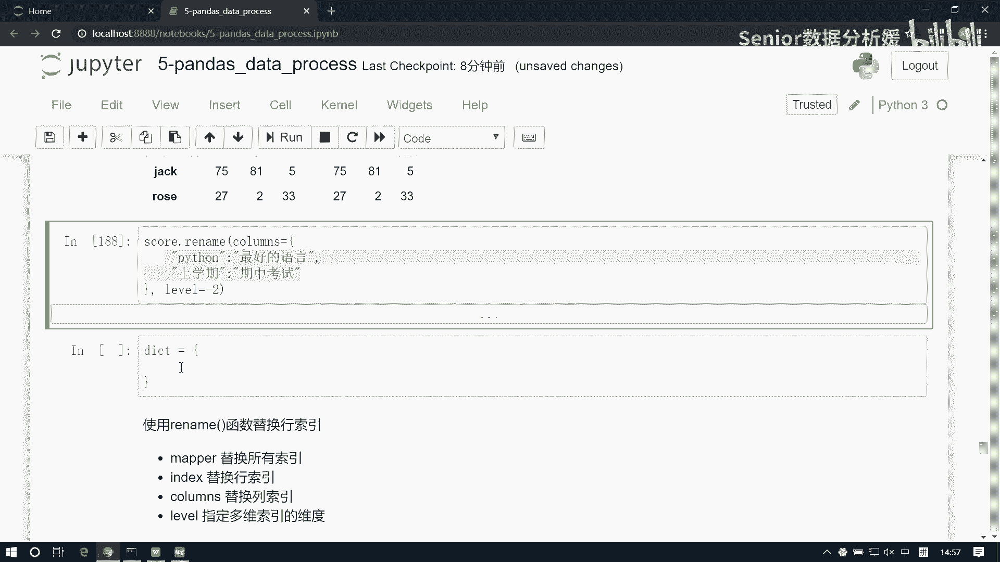

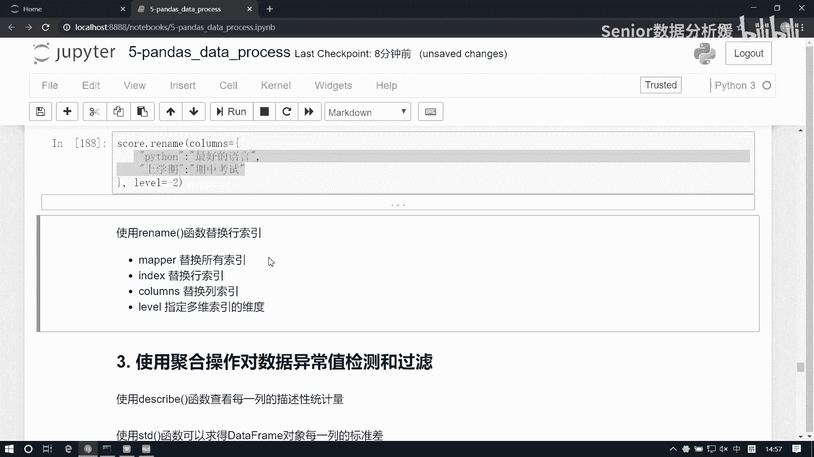

当DataFrame具有多级列索引时，可以使用`level`参数指定要修改的层级。

```python
# 创建一个具有多级列索引的DataFrame
multi_col_df = pd.concat([score1_df, score1_df], keys=['上学期', '下学期'], axis=1)
print("多级索引DataFrame:")
print(multi_col_df.columns)
print(multi_col_df.head())

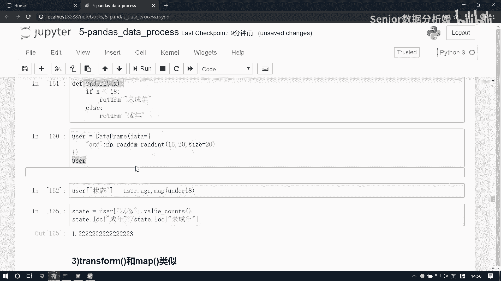

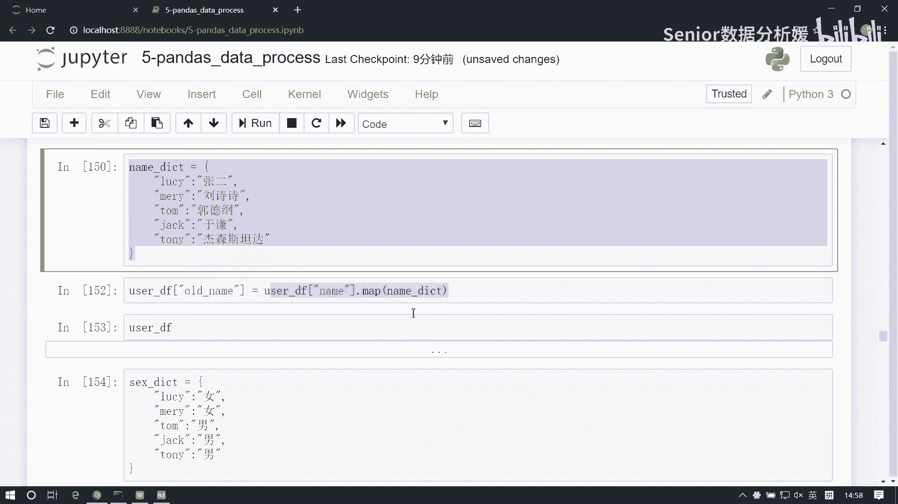

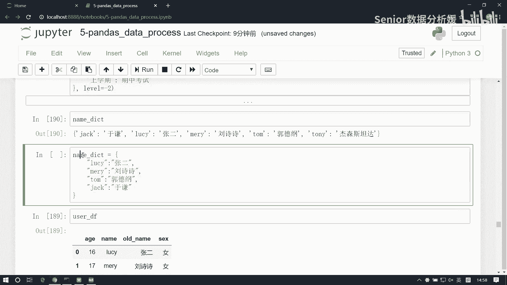

# 指定层级进行重命名
# level=0 表示第一级索引（‘上学期’，‘下学期’）
# level=1 表示第二级索引（具体的列名）
multi_col_df_renamed = multi_col_df.rename(columns={'上学期': '期中考试'}, level=0)
print("重命名第一级索引后:")
print(multi_col_df_renamed.columns)
```

### 业务场景思考

在实际工作中，我们可能需要维护一个全局的字段映射字典，它涵盖了所有数据表可能需要的重命名规则。`rename`函数允许我们灵活地从这个大字典中选取当前表需要的部分进行映射，这在与业务人员协作、统一数据规范时非常有用。沟通时，将映射关系整理成业务人员能看懂的表格（如Excel），比直接讨论代码更高效。

## 总结

本节课中我们一起学习了Pandas中两个强大的数据清洗工具：
1.  **`map`函数**：用于对Series进行批量值映射。它接受自定义函数、lambda表达式或字典作为参数，是数据转换的利器。我们特别学习了如何处理字典映射不全的情况。
2.  **`rename`函数**：用于修改DataFrame的行或列索引标签。通过`columns`和`index`参数，我们可以轻松地重命名数据表的标题。在处理多级索引时，`level`参数能帮助我们精准定位。

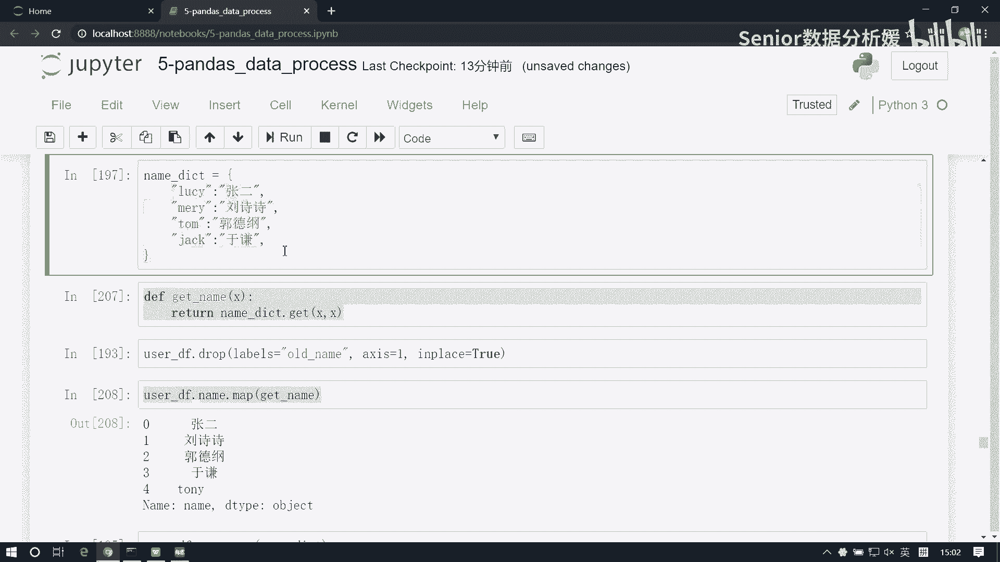

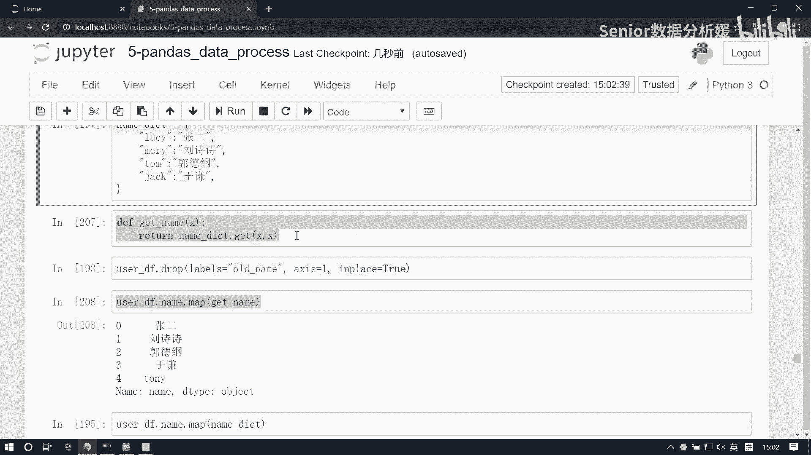

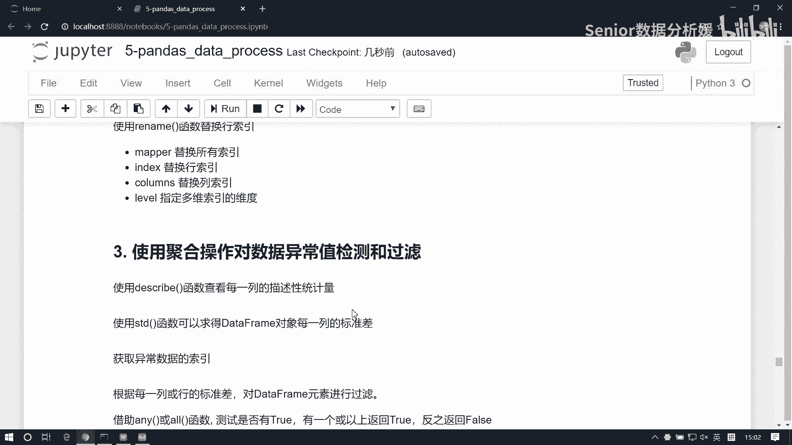

通过结合使用`map`和`rename`，我们可以有效地规范数据格式，为后续的数据分析和金融量化建模打下坚实的基础。记住，清晰、规范的数据是任何分析项目成功的第一步。