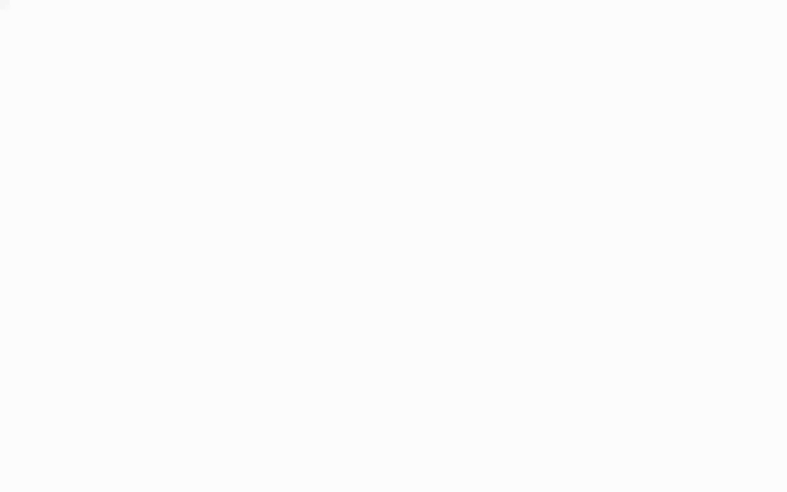
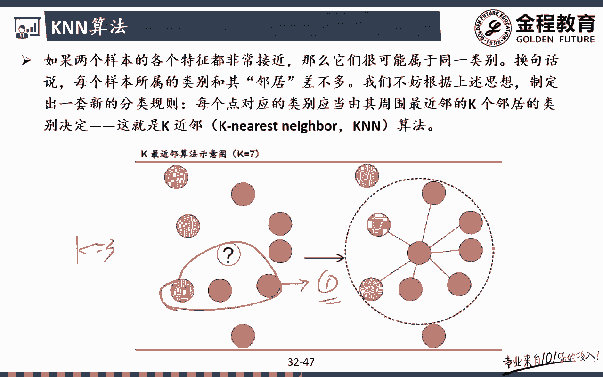
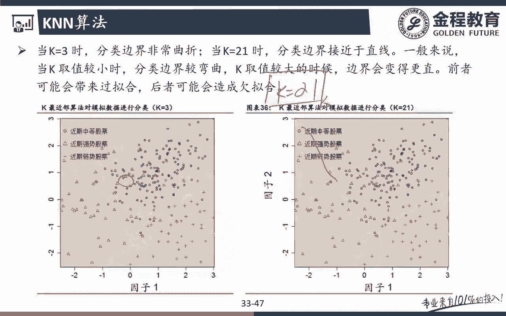

# 量化金融分析师.AQF：P10：《人工智能与机器学习策略》04：KNN算法原理 🧠

在本节课中，我们将要学习一个非常直观且简单的机器学习算法——K近邻算法。我们将了解它的核心思想、工作原理、关键参数K的选择，以及它可能带来的过拟合与欠拟合问题。

## 概述

K近邻算法是一种用于分类问题的机器学习方法。它的核心思想非常简单：要判断一个新数据点的类别，只需查看它在特征空间中“最近的邻居”们属于哪个类别，并遵循“少数服从多数”的原则进行判断。

## KNN算法核心思想

上一节我们介绍了机器学习算法的基本概念，本节中我们来看看KNN的具体原理。

KNN算法的全称是K Nearest Neighbors，即K个最近邻。该算法用于解决分类问题。其基本逻辑是：对于一个待分类的新数据点，在已有的训练数据集中找出距离它最近的K个数据点（即“邻居”），然后统计这K个邻居中各类别的数量。新数据点将被归类为数量最多的那个类别。

**核心公式**可以描述为：
`y_pred = mode( y_train[ indices_of_k_nearest_neighbors ] )`
其中，`mode`表示取众数（即出现次数最多的类别）。

## 关键参数：K值的选择

KNN算法中最重要的参数就是K，它决定了我们需要考虑多少个“邻居”来做出判断。

以下是关于K值选择需要注意的几个要点：

*   **K值必须为奇数（对于两分类问题）**：这是为了避免平票情况。例如，在二分类（如涨/跌）问题中，若K=2，则可能出现两个邻居意见各占一半（一个涨、一个跌），导致无法做出判断。因此，K通常取3、5、7等奇数。
*   **K值可通过参数优化确定**：与其它机器学习算法类似，K值可以通过交叉验证等参数优化方法来选择，以找到在验证集上表现最好的值。
*   **K值影响决策边界**：K值的大小直接影响模型的复杂度和泛化能力。

## K值对模型的影响：过拟合与欠拟合

K值的选择直接决定了模型的复杂程度，并可能导致过拟合或欠拟合。

我们通过一个股票分类的例子来理解这一点。假设我们要根据某些特征将股票分为“近期强势”、“中等强势”和“近期弱势”三类。

以下是两种不同K值设置下的模型表现：

*   **当K值较小时（例如K=3）**：模型只关注最近的极少数样本。这会导致决策边界非常曲折和不规则，模型会过于关注训练数据中的细节和噪声，从而更容易导致**过拟合**。
*   **当K值较大时（例如K=21）**：模型需要考虑更多邻居的意见。这使得决策边界变得更加平滑和简单。然而，如果K值过大，模型可能会过于简化，忽略数据中应有的模式，从而导致**欠拟合**。

简而言之，**K越小，模型越复杂，越可能过拟合；K越大，模型越简单，越可能欠拟合**。选择合适的K值是在偏差（欠拟合）和方差（过拟合）之间取得平衡的关键。

## 总结

本节课中我们一起学习了K近邻算法。我们了解到，KNN是一种基于实例的惰性学习算法，其核心是通过计算距离来找到最近的K个邻居，并通过投票机制进行分类。我们重点讨论了参数K的选择原则，特别是对于两分类问题K需为奇数，并深入分析了K值大小如何影响模型的复杂度和泛化能力，即导致过拟合或欠拟合的不同倾向。KNN算法原理简单直观，是理解机器学习分类问题的一个良好起点。