# 量化金融分析师.AQF：P13：优矿平台介绍 🚀


在本节课中，我们将要学习优矿量化交易平台。这是一个功能强大的云端平台，集成了海量金融数据和策略回测环境，是实现量化策略开发和半自动化交易的重要工具。

## 平台概述与选择原因

优矿平台提供了丰富的金融数据，这些数据都存储在云端，可以直接调用。目前市面上类似的平台有很多，例如米矿、聚宽等。本课程选择优矿平台，主要原因是其数据整理得非常完善，便于直接使用。

我们的实盘交易环节将分为三个部分：
1.  优矿平台（本节内容）
2.  OANDA平台
3.  IB（盈透证券）平台

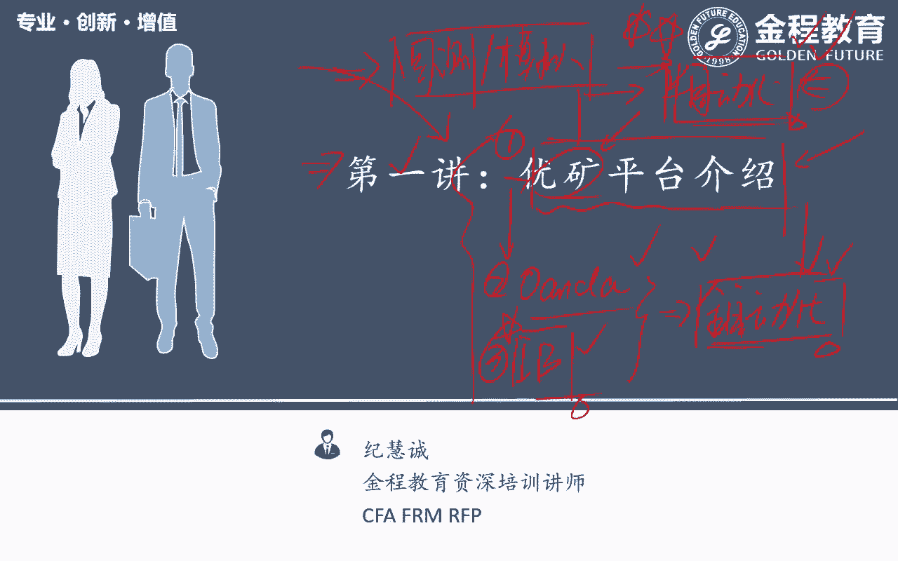

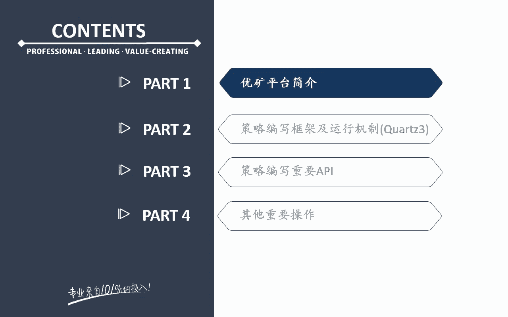

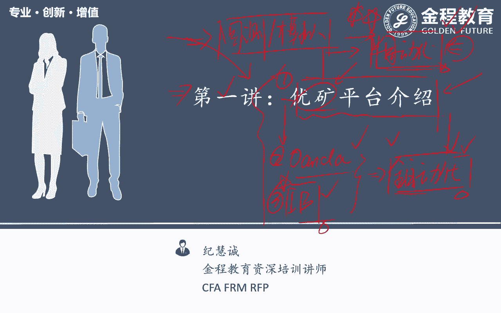

优矿平台主要侧重于策略回测和模拟交易，属于半自动化交易平台。它不能直接连接券商进行全自动下单，但有一个重要功能：当策略产生交易信号时，平台可以通过绑定的微信发送提醒，用户根据提醒手动下单。这是由于目前国内对股票交易API的严格管控，普通投资者难以获得全自动交易接口。

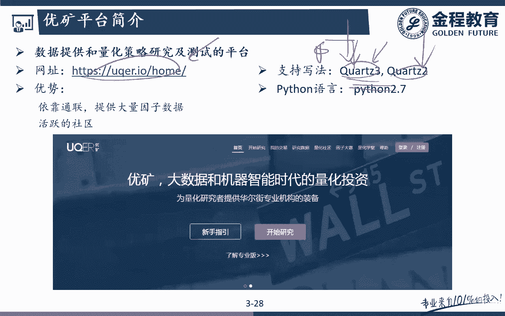

OANDA和IB平台则可以实现全自动化交易，但它们主要交易的是国外资产。课程中包含这两个平台，是为了让大家掌握全自动化交易的原理和方法。特别是IB平台，其接口相对复杂，掌握后对于理解其他交易接口会更有帮助。

## 平台界面与核心功能

优矿平台的网址可通过搜索引擎找到。平台目前支持两种回测框架：老版本的 `Quantra 2` 和新版本的 `Quantra 3`。本课程将基于最新的 `Quantra 3` 框架进行讲解。

注册登录后，核心操作区域是“开始研究”。它本质上是一个云端的 Jupyter Notebook，你可以在其中编写和运行Python代码。

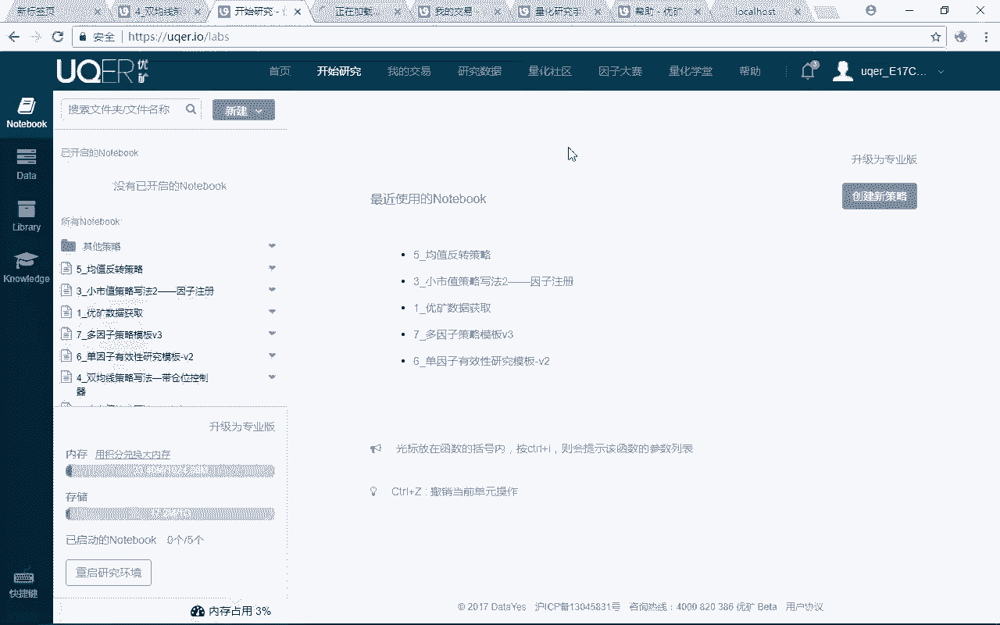

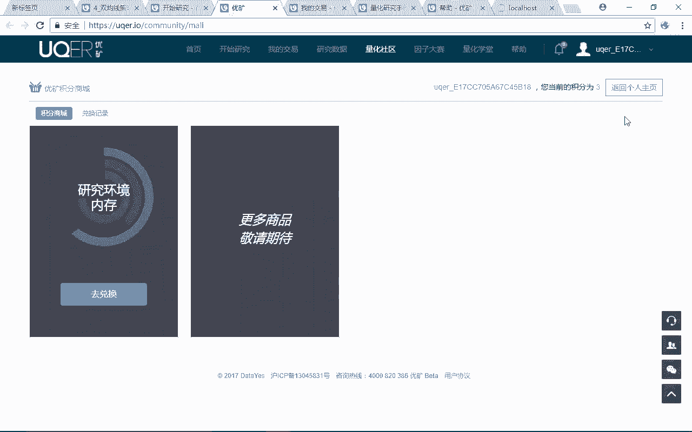

**以下是平台的主要功能区介绍：**

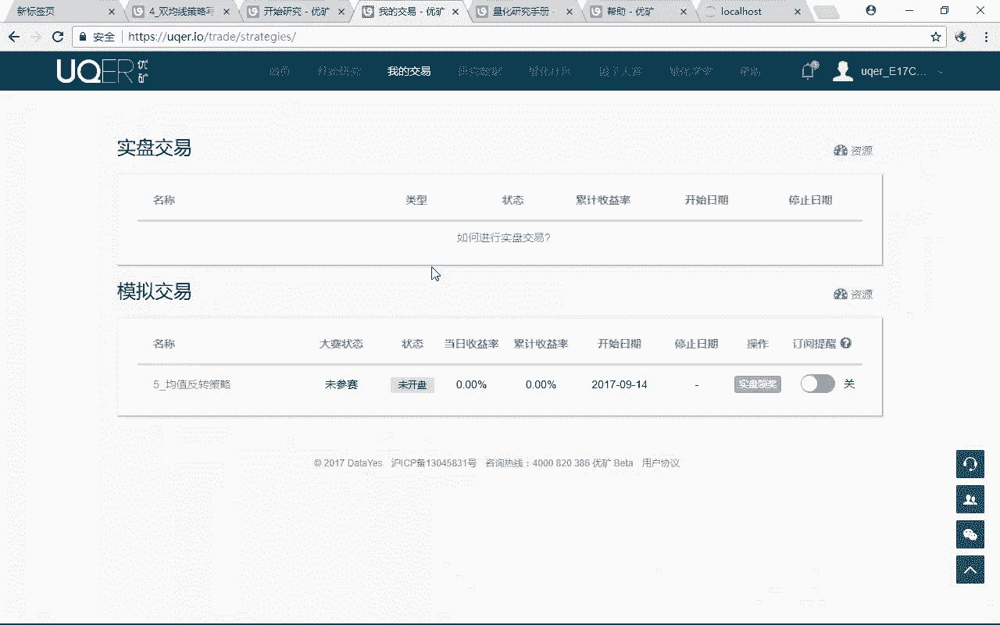

*   **开始研究**：策略编写、回测和模拟交易的核心区域。免费账户初始内存为1GB，可通过积分兑换或购买升级。对于课程中的大多数策略，初始内存基本够用。
*   **我的交易**：管理已创建策略的模拟交易。你可以在此启动策略的模拟运行，并开启微信订阅提醒，接收交易信号。
*   **研究数据**：优矿的核心优势之一，提供股票、基金、债券、港股等多市场、多频率（日线、分钟线、Tick数据）的免费金融数据。数据可以直接调用，并支持限量下载到本地。
*   **量化社区**：包含大量用户分享的策略代码。你可以直接“克隆”感兴趣的策略到自己的研究空间进行学习和修改。这是非常好的学习资源。
*   **帮助文档**：在“帮助”->“量化研究手册”中，可以找到平台的API文档。但需要注意的是，其官方文档和教程的组织对初学者可能不够友好。

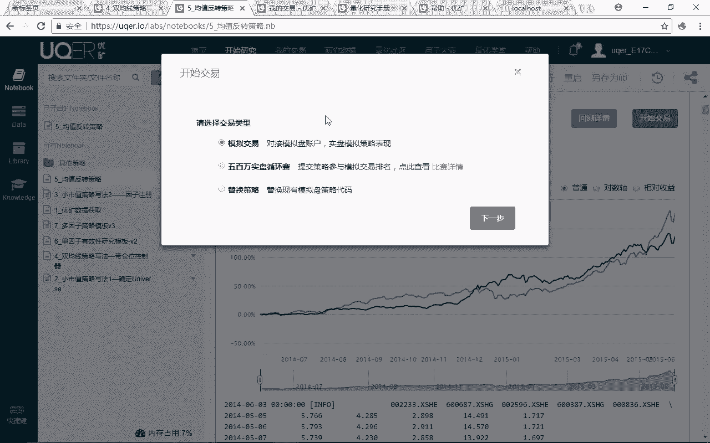

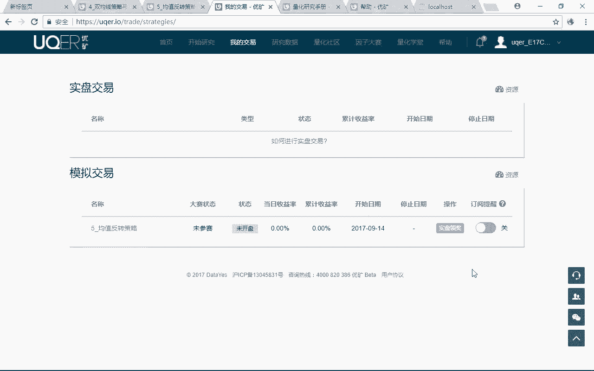

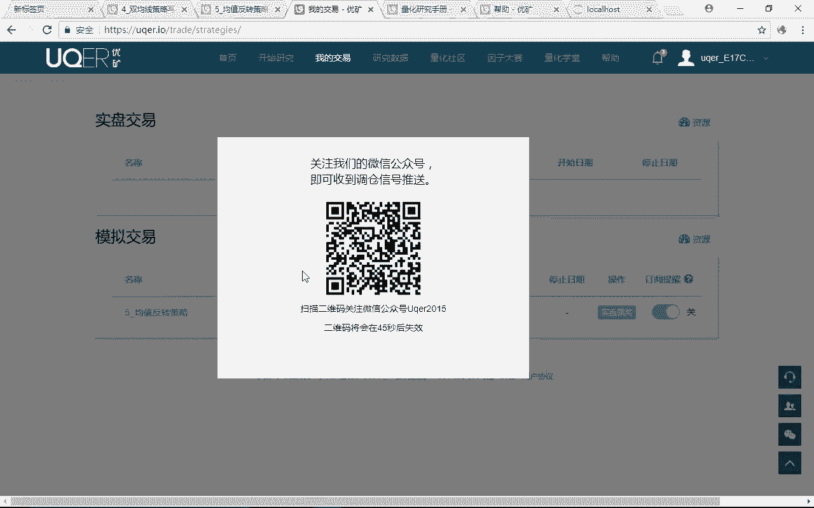

> 提示：社区中仍有大量基于 `Quantra 2` 框架的策略代码。虽然本课程学习 `Quantra 3`，但掌握核心思想后，你也有能力去阅读和理解 `Quantra 2` 的代码。

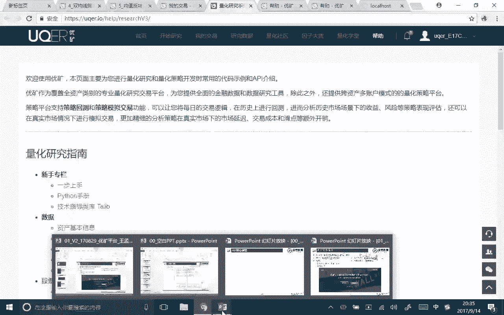

## 平台运行机制与面向对象思想

上一节我们介绍了优矿平台的功能界面，本节中我们来看看其底层的运行机制。优矿的策略编写基于面向对象编程思想。

简单来说，优矿框架主要由两个核心类构成：

1.  **`Context` (策略上下文)**：这是一个大类，代表了策略运行的整体环境。它提供了一系列**方法**，让你能够获取市场数据、时间等信息。例如，你可以通过 `context.history()` 方法获取历史行情数据。
2.  **`StockAccount` (股票账户)**：这是另一个大类，代表了交易账户。它内部包含多个属性，这些属性本身又是其他类的实例：
    *   `order` 属性：负责下单操作。
    *   `position` 属性：负责管理持仓信息。

这两个大类之间如何交互呢？在策略环境中，你可以通过 `context.get_account()` 这个方法，来获取到 `StockAccount` 账户对象的实例。一旦获得了账户对象，你就可以进一步调用其下的 `order` 或 `position` 属性来进行下单或查询持仓操作。

**公式/代码描述其关系：**
```python
# 获取账户对象
account = context.get_account()

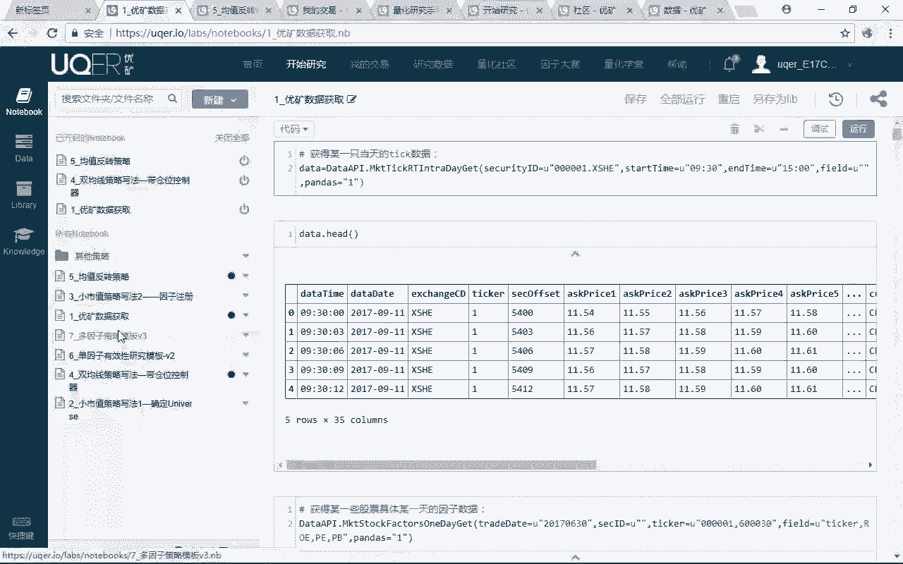

# 通过账户对象进行下单 (示例，非实际API)
account.order.buy(symbol="000001.SZ", amount=100)

# 查询持仓 (示例，非实际API)
current_positions = account.position.portfolio
```

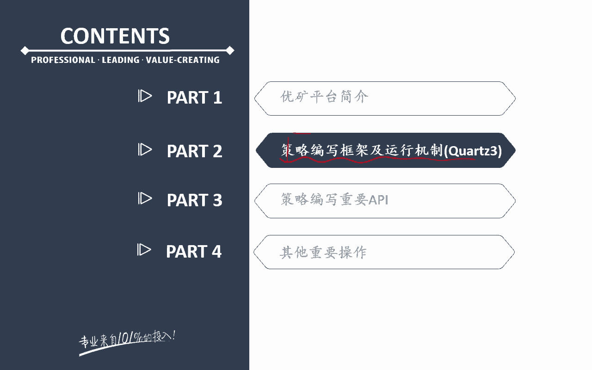

这种设计将交易环境(`Context`)和交易账户(`Account`)分离，逻辑清晰。`Context` 关注“市场发生了什么”，`Account` 关注“我的账户做了什么”，二者通过特定方法连接，共同完成策略决策。

## Python版本注意事项

优矿平台默认使用 Python 2.7，而本课程其他部分主要使用 Python 3。两者在语法上有细微差别，初学者需注意以下两点：

1.  **`print` 函数**：
    *   Python 3: `print(“Hello”)` 需要括号。
    *   Python 2.7: `print “Hello”` 不需要括号。
2.  **除法运算**：
    *   Python 3: `1 / 3` 结果默认为浮点数 `0.333...`。
    *   Python 2.7: `1 / 3` 结果默认为整数 `0`。若要得到浮点数结果，需写为 `1.0 / 3`。

在优矿编写策略时，请遵循 Python 2.7 的这些语法规则。

## 总结

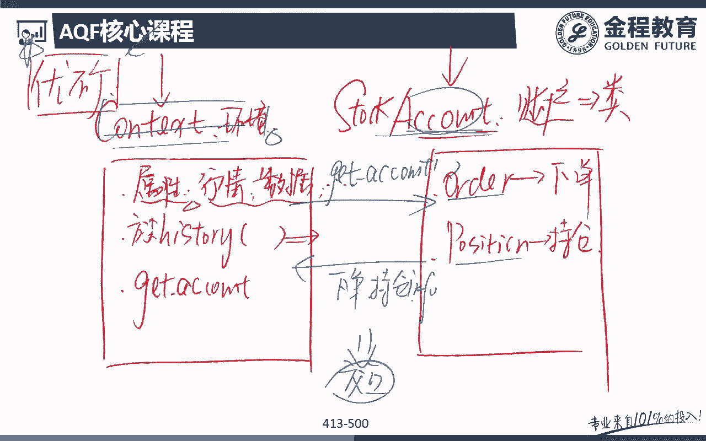

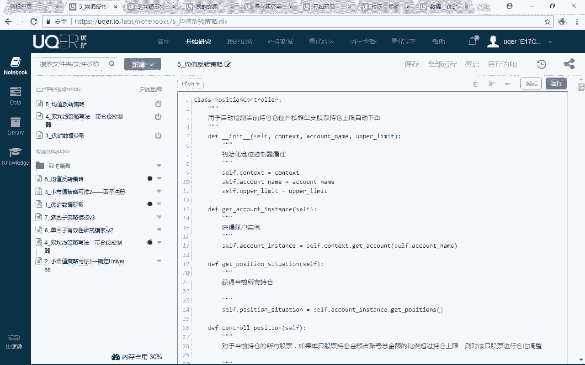

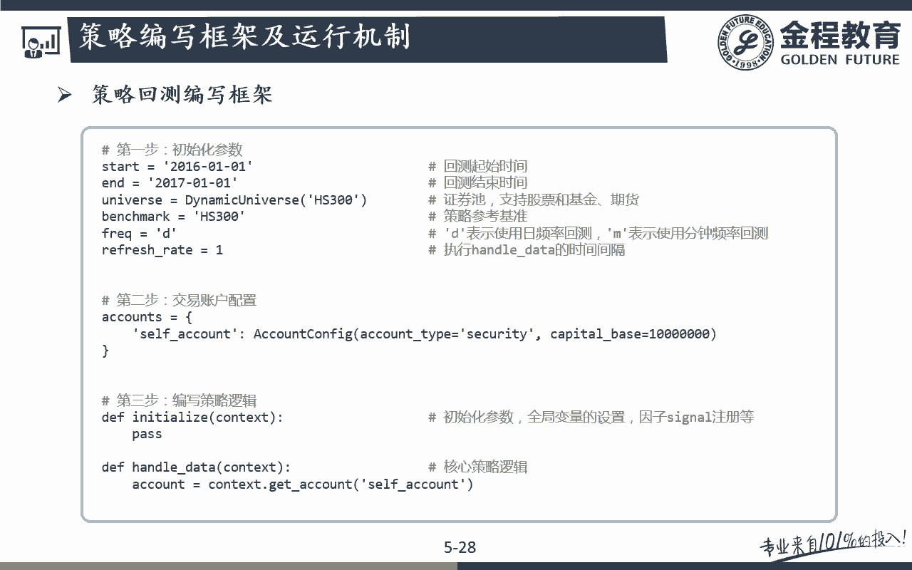


本节课中我们一起学习了优矿量化平台。我们了解了选择该平台的原因在于其优质、易用的金融数据。掌握了平台的核心功能区域，包括策略研究、数据获取、社区学习和模拟交易。更重要的是，我们剖析了其基于面向对象的运行机制，理解了 `Context` 和 `StockAccount` 两个核心类的作用与交互方式，这是后续编写策略的基石。最后，我们留意了平台使用的 Python 2.7 与课程主流的 Python 3 在语法上的关键区别。