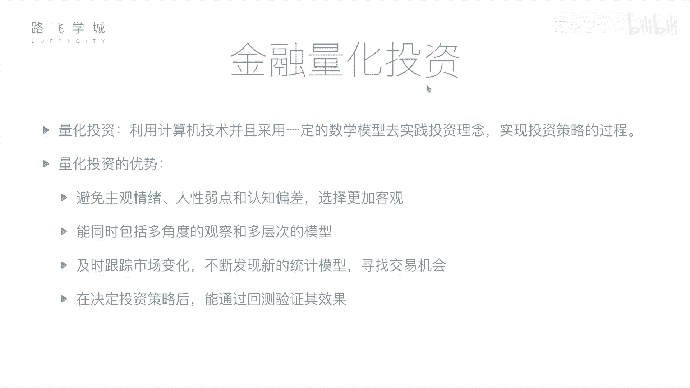
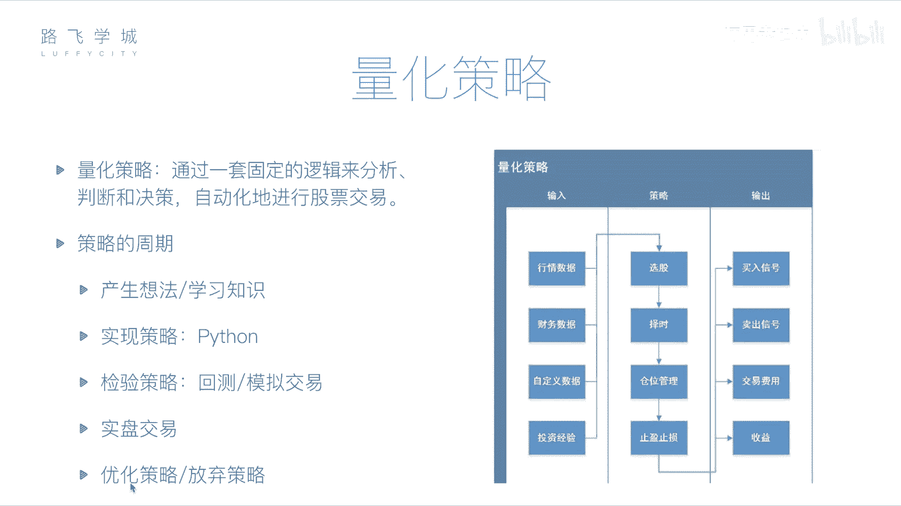

# Python金融量化实战：P7：06 金融量化投资介绍

## 概述
在本节课中，我们将要学习金融量化投资的核心概念。我们将了解什么是量化投资，它与传统人工投资相比有哪些优势，并深入探讨构成量化策略的关键组成部分及其完整的生命周期。

## 什么是量化投资？💡
上一节我们介绍了金融分析的基本面与技术面方法。本节中我们来看看如何将这些分析过程自动化。

金融分析是通过基本面或技术面对公司或股票做出判断。这个判断过程可以交给计算机来完成。因为基本面分析所需的财务报表，以及技术面分析所需的历史价格和交易记录，都可以被获取。将这些分析过程交由计算机处理，就称为量化投资或量化分析。

所谓量化投资，是指利用计算机技术，并采用一定的数学模型，去实践投资理念、实现投资策略的过程。量化投资包含三个重要部分：
1.  **计算机技术**：即使用计算机编程的方式。
2.  **数学模型**：即具体的策略或套路，例如均线就是一个数学模型。
3.  **实践**：拿着编写好的计算机程序去真实投资，或预先进行尝试以检验策略的可靠性。

## 量化投资的优势🚀
了解了量化投资的定义后，我们来看看它相较于传统人工投资有哪些显著优势。

量化投资相对于人工投资的好处主要包括以下几点：

以下是量化投资的四大优势：
1.  **避免主观情绪**：程序可以避免人性弱点、认知偏差和主观情绪，使选择更加客观。例如，投资者可能因情感因素不舍得卖出下跌的股票，或因恐慌而过早抛售上涨的股票。
2.  **处理海量信息**：计算机能够同时进行多角度观察和多层次分析。它可以快速处理大量股票的多方面数据（如均线、财报等），而人类难以同时处理如此多的信息。
3.  **及时跟踪市场**：程序可以24小时不间断监测市场变化，及时发现新的统计套利机会和交易信号，其反应速度远超人工盯盘。
4.  **回测验证策略**：在实施策略前，可以通过历史数据进行回测，验证策略在过去的表现，从而评估其有效性并加以优化，降低实盘交易的风险。

## 量化策略的核心构成⚙️
认识到量化投资的优势后，我们来剖析其核心——量化策略的具体构成。

量化策略主要包括三个部分：输入、处理逻辑和输出。

### 策略输入（数据源）
策略程序需要数据来进行分析。主要输入数据包括：
*   **行情数据**：股票历史交易数据，如每日的开盘价、收盘价、交易量等。
*   **财务数据**：上市公司的财务报表数据。
*   **自定义数据**：任何可量化的信息，如新闻舆情分析（利用机器学习判断新闻正面/负面）、甚至个人投资经验（如某些非传统指标）。

### 策略处理（做什么）
策略程序主要完成四件事：

以下是量化策略处理的四个关键环节：
1.  **选股**：从数千只股票中筛选出值得投资的目标。
2.  **择时**：决定买卖的具体时机，旨在低买高卖。
3.  **仓位管理**：决定资金在不同股票之间的分配比例，例如，对上涨概率更高的股票分配更多资金。
4.  **止盈止损**：设置必要的风险控制手段。**止损**指在亏损达到一定比例时卖出以控制损失；**止盈**指在盈利达到一定比例时卖出以锁定利润，避免回落。

### 策略输出（结果）
策略运行后会产生以下输出：
*   **交易信号**：生成买入或卖出指令。可以提示投资者，或直接连接到券商系统自动执行。
*   **交易费用与收益**：计算每次交易产生的手续费、佣金等成本，并核算最终的收益或亏损，以及各项绩效指标。

## 量化策略的生命周期🔄
掌握了策略的静态构成后，我们再来看看一个策略从诞生到应用的动态过程。

一个完整的量化策略周期包含以下几个阶段：

以下是量化策略从构思到实盘的完整流程：
1.  **产生想法**：基于投资经验、新学的指标或任何灵感，形成初步的策略思路。
2.  **程序实现**：使用编程语言（如Python）将想法转化为可执行的计算机程序。
3.  **回测验证**：使用历史数据运行策略，检验其在过去一段时间内的表现。
4.  **模拟交易**：使用当前开始的实时数据进行模拟交易，进一步验证策略在近期市场的有效性，此过程不涉及真实资金。
5.  **实盘交易**：经过充分验证后，将策略投入真实市场进行交易。也可以将成熟的策略出售。
6.  **优化与迭代**：在回测、模拟或实盘过程中，根据表现对策略进行持续优化和调整，或决定放弃并开发新策略。

## 总结
本节课中，我们一起学习了金融量化投资的基础知识。我们明确了量化投资是利用计算机和数学模型执行投资策略的过程，并分析了其客观、高效、可回测的优势。我们深入拆解了量化策略的三大组成部分：**输入**（数据）、**处理**（选股、择时、仓位管理、止盈止损）和**输出**（信号与收益）。最后，我们了解了策略从想法产生、程序实现、回测模拟到最终实盘交易的完整生命周期。

接下来，我们将开始学习如何使用Python工具来实现这些量化策略，为后续的实战分析打下基础。