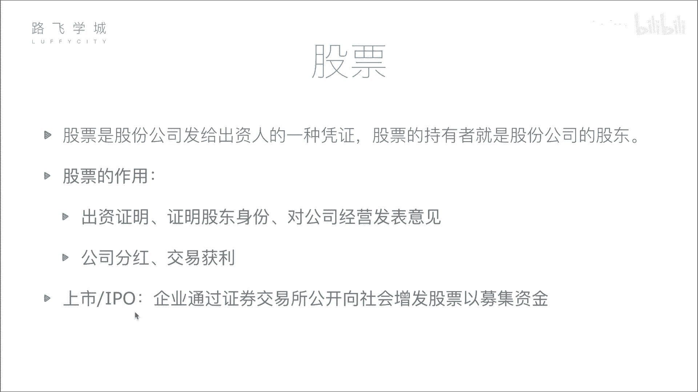

# 金融量化分析：02：股票基本知识与分类 📈

在本节课中，我们将要学习股票的核心概念、作用以及主要的分类方式。理解这些基础知识是进行金融量化分析的第一步。

## 股票的定义与作用

上一节我们介绍了金融量化分析的整体框架，本节中我们来看看构成金融市场的基础——股票。

股票是股份公司发给出资人的一种凭证。股票的持有者就是股份公司的股东。

形象地解释，假设一位创业者需要资金，而投资者看好其前景。投资者将资金给予创业者，创业者则向投资者发行代表公司所有权的股票。例如，一个公司初始市值为5亿，由五位出资人各出资1亿建立，那么每位出资人将获得该公司20%的股票。

股票的核心作用有以下两点：

以下是股票的两个主要作用：

1.  **证明股东身份与权利**：持有股票意味着对公司出资，是股东身份的证明。股东有权参与公司重大决策，例如在股东大会上投票。
2.  **获取收益**：股东可以通过两种主要方式获利：
    *   **公司分红**：当公司盈利时，股东有权按持股比例分享利润。
    *   **交易获利**：股东可以在二级市场（如证券交易所）买卖股票，通过买卖价差获利。例如，初始投资1亿获得20%股份，当公司市值增长到50亿时，该部分股份价值变为10亿。股东可通过出售部分股份实现“套现”。

对于广大普通股民而言，虽然持股比例小，但获利逻辑与上述大型投资者相同，区别主要在于交易必须通过国家认可的证券交易所进行。

## 公司上市与IPO

理解了股票是什么，接下来我们看看公司如何向公众发行股票，即“上市”。

所谓上市，就是企业通过证券交易所，首次公开向社会增发股票以募集资金的过程。

公司不能随意向公众募集资金。它需要达到一定体量，并向证监会提交申请，经过严格的财务与合规审查。证监会评估认为公司经营稳健、风险可控后，才会批准其上市。上市后，公司的股票就能在证券交易所挂牌交易，所有符合条件的投资者都可以买卖。

公司寻求上市的主要目的是为了融资。相对于向有限的少数富人融资，上市可以让公司面向全国乃至全球数以千万计的投资者，汇聚大众资金，融资潜力巨大。为了保护广大投资者的资金安全，证监会对上市公司的审核非常严格。

公司**首次**公开募股的行为，就称为 **IPO**。

## 股票的分类

了解了上市的概念后，我们来看看股票有哪些常见的分类方式。

### 按公司业绩分类

以下是按公司业绩表现的三种常见股票分类：

*   **蓝筹股**：指资本雄厚、信誉优良的公司的股票。通常规模巨大、经营稳定，如同市场中的“巨人”。例如，中国的石油、银行等行业巨头。
*   **绩优股**：指业绩优良公司的股票。它们可能规模不及蓝筹股，但盈利能力突出，增长表现良好。例如，一些持续高盈利的消费或科技公司。
*   **ST股**：中文称为“特别处理股票”。如果公司连续两年亏损，或每股净资产低于股票面值，其股票名称前会被加上“ST”标记，以警示投资者该公司存在较高风险。

### 按上市地区分类

股票还可以根据其上市交易的地点和货币进行区分。

以下是主要的按上市地区分类的股票类型：

*   **A股**：在中国大陆（上海、深圳证券交易所）上市，以人民币认购和交易的股票。
*   **B股**：同样在中国大陆上市，但以外币（如美元、港币）认购和交易的股票。
*   **H股**：在中国香港上市的公司发行的股票。
*   **N股/S股**：分别指在美国纽约和新加坡上市的公司发行的股票。

不同市场的交易规则有所不同，主要体现在以下两点：

1.  **涨跌幅限制**：中国A股设有每日**±10%**的涨跌幅限制（部分板块除外），旨在平抑市场剧烈波动，保护投资者。许多海外市场（如美股、港股）无此硬性限制。
2.  **交易交割制度**：
    *   A股实行 **T+1** 制度。`T`代表交易当天。`T+1`意味着**当天买入的股票，下一个交易日才能卖出**。
    *   美股、港股等市场普遍实行 **T+0** 制度，即**当天买入的股票可以当天卖出**，允许日内多次交易。

A股的这些限制性规则，主要是为了减少市场投机行为，维护市场稳定。

## 总结

本节课中我们一起学习了股票的基础知识。我们明确了股票是股东权的凭证，其作用在于确权与获利。我们探讨了公司通过IPO上市向公众融资的过程。最后，我们学习了股票按业绩分为蓝筹股、绩优股和ST股，按上市地区分为A股、B股、H股等，并了解了不同市场在涨跌幅和交易制度上的关键差异。掌握这些概念是后续进行股票数据分析与量化交易策略开发的基石。