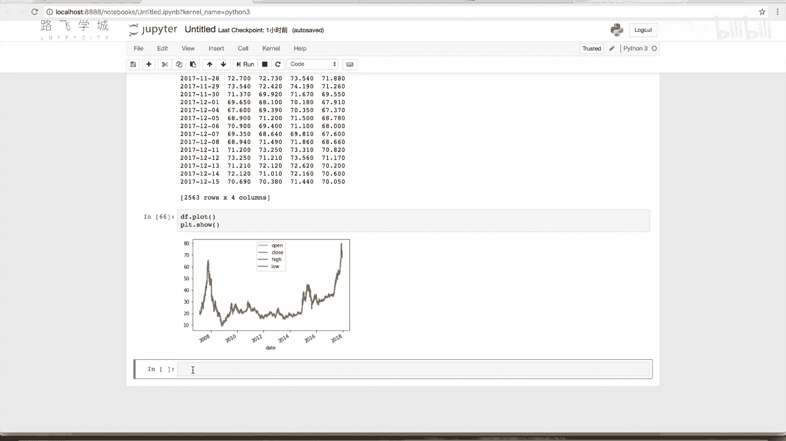
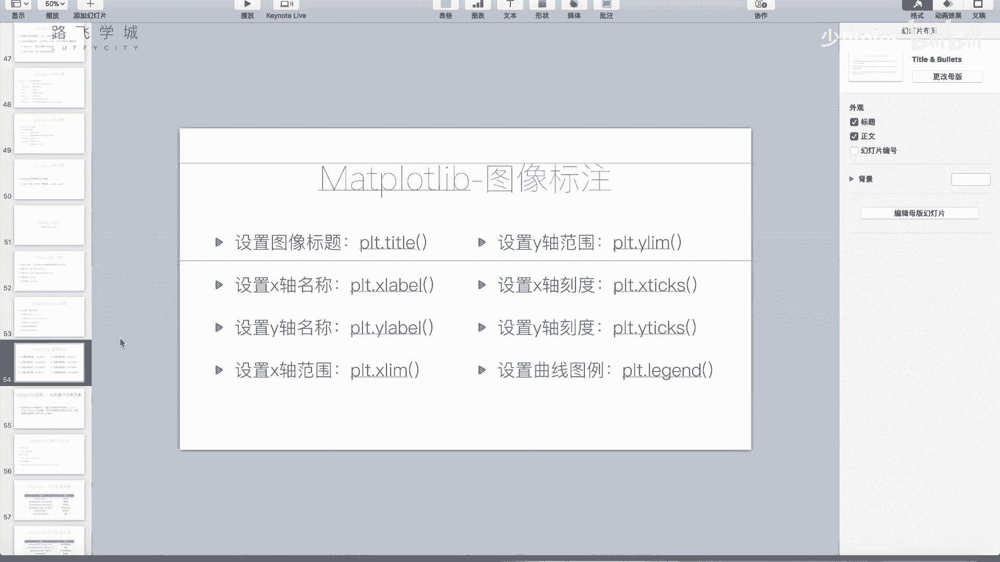

# Python金融量化分析：P34：pandas与Matplotlib结合绘图

## 概述
在本节课中，我们将学习如何将pandas库中的DataFrame和Series数据结构与Matplotlib绘图库相结合，实现数据的快速可视化。我们将通过一个股票数据的实例，演示如何直接将DataFrame绘制成图表，并了解其背后的原理。

---

## pandas与Matplotlib的关联

上一节我们介绍了`plot`函数及其相关参数。本节中我们来看看pandas库与Matplotlib库之间的便捷联系。

具体而言，pandas的DataFrame和Series对象内置了`.plot()`方法，该方法底层调用了Matplotlib，可以让我们无需直接操作Matplotlib的复杂接口，就能快速生成图表。

## 实战：绘制股票数据

我们将使用一个股票数据文件（例如`601318.csv`）进行演示。首先，我们需要加载并处理数据。

```python
import pandas as pd

# 读取股票数据文件
df = pd.read_csv('601318.csv')
# 将日期列转换为datetime对象，并设置为索引
df['date'] = pd.to_datetime(df['date'])
df.set_index('date', inplace=True)
```

数据中包含多个列，其中可能包含字符串（如股票代码）或无用的序列。我们使用花式索引选取需要的价格数据列。

以下是选取特定数据列的操作：

```python
# 选取开盘价、收盘价、最高价、最低价这四列
price_df = df[['open', 'close', 'high', 'low']]
```

现在，我们有了一个包含四列价格数据的DataFrame（`price_df`）。

## 直接绘制DataFrame

如果我们想将这个DataFrame可视化为图表，有一个非常简便的方法：直接调用DataFrame对象的`.plot()`方法。

```python
import matplotlib.pyplot as plt

# 直接调用DataFrame的plot方法
price_df.plot()
plt.show()
```

执行上述代码后，Matplotlib会生成一个图表。图表会智能地将DataFrame的索引（此处是日期）作为X轴坐标，将选取的四列数据分别绘制成四条折线，并自动分配不同颜色。

图表可能显示四条线几乎重叠，这是因为股票每日的开盘价、收盘价、最高价和最低价数值通常非常接近。图表窗口支持交互式缩放，可以更清晰地查看细节。



**核心机制**：`DataFrame.plot()` 方法本质上是对Matplotlib `plt.plot()` 的一个封装，它自动处理了数据映射和基本的图表样式。

同样，Series对象也可以直接调用`.plot()`方法进行绘制，结果将是一条单线。



## 课程作业

在掌握了DataFrame快速绘图的方法后，为了巩固Matplotlib的基本绘图技能，请大家尝试完成以下练习。

以下是作业的具体要求：

1.  在同一张图表中绘制三个数学函数：
    *   `y = x` （一条直线）
    *   `y = x^2` （一条抛物线）
    *   `y = 3*x^3 + 5*x^2 + 2*x + 1` （一个三次函数）
2.  使用不同颜色的线条区分这三个函数。
3.  为图表添加图例（legend），清晰地标明每条线对应的函数公式。

大家可以先独立尝试编写代码。在下一个视频中，我们将一起完成这个作业，并对比不同的实现思路。


---

## 总结
本节课中我们一起学习了pandas与Matplotlib结合使用的便捷方式。核心要点是，pandas的DataFrame和Series对象可以通过`.plot()`方法直接调用Matplotlib生成图表，这大大简化了数据可视化的步骤。我们还通过股票数据的实例看到了这种方法的实际效果，并布置了一个绘制数学函数图像的作业来练习基本的绘图技巧。