# Python金融量化分析：P37：Matplotlib柱状图与饼图 📊

## 概述
在本节课中，我们将学习Matplotlib库中除折线图外的两种常用图表：柱状图和饼图。我们将了解它们的基本绘制方法、常用参数以及如何通过简单的代码实现数据可视化。

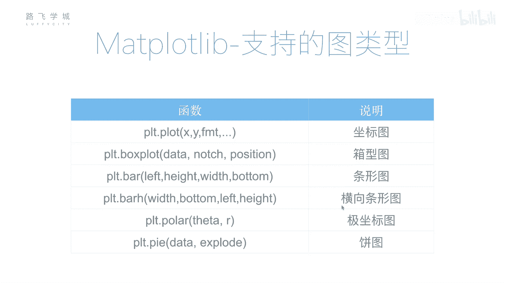

---

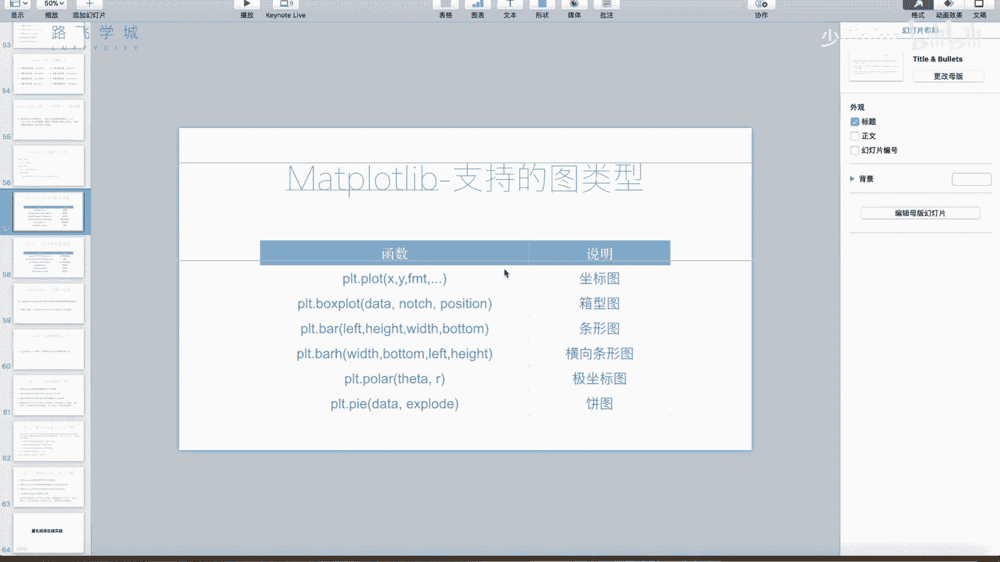

## 从折线图到其他图表
上一节我们重点介绍了`plt.plot()`函数用于绘制折线图。实际上，Matplotlib支持绘制多种图表类型，例如象形图、条形图、极坐标图、饼图、功率谱密度图、相关性函数图、散点图和直方图等。其中，散点图和直方图在数据分析中较为常见。本节我们将重点学习两种最直观的图表：柱状图和饼图。

---

## 绘制柱状图
柱状图用于展示分类数据的数值大小对比。在Matplotlib中，我们使用`plt.bar()`函数来绘制。

### 基本参数
`plt.bar()`函数的核心参数有两个：
*   **第一个参数**：代表每个柱子在X轴上的**位置**。
*   **第二个参数**：代表每个柱子的**高度**（即数值）。

例如，以下代码在位置0, 1, 2, 3上分别绘制高度为5, 6, 7, 8的柱子：
```python
plt.bar([0, 1, 2, 3], [5, 6, 7, 8])
```

### 为柱子添加标签
在实际应用中，我们通常希望用有意义的标签（如月份、品类名称）来替换X轴上的数字位置。

以下是实现步骤：
1.  准备数据：`data = [32, 48, 21, 100]`
2.  准备标签：`labels = [‘JAN’, ‘FEB’, ‘MAR’, ‘APR’]`
3.  使用`np.arange(len(data))`生成柱子的位置序列`[0, 1, 2, 3]`。
4.  调用`plt.bar()`绘制。
5.  使用`plt.xticks()`函数将X轴刻度位置替换为文本标签。

完整示例代码如下：
```python
import matplotlib.pyplot as plt
import numpy as np

data = [32, 48, 21, 100]
labels = [‘JAN’, ‘FEB’, ‘MAR’, ‘APR’]

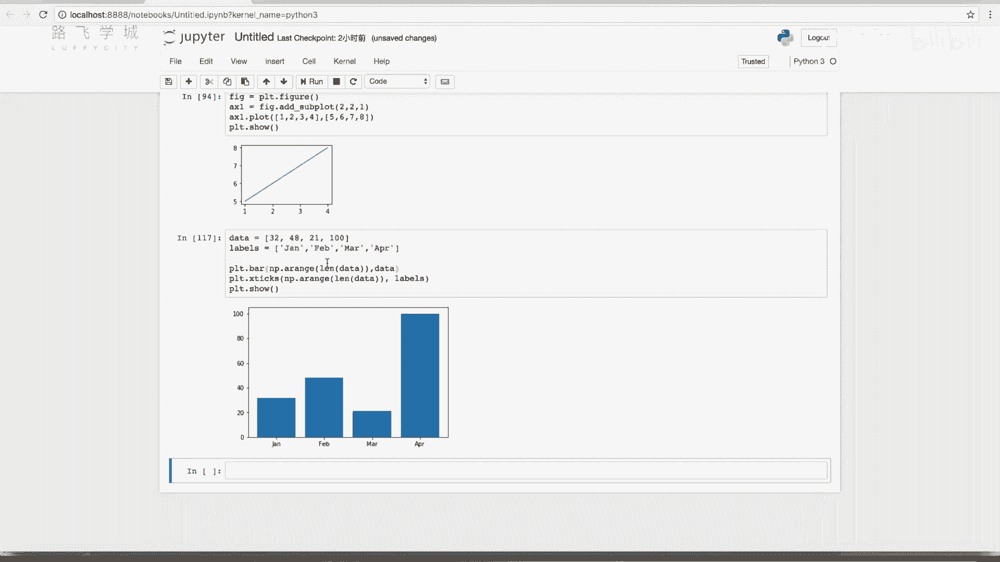

# 绘制柱状图
plt.bar(np.arange(len(data)), data)
# 设置X轴标签
plt.xticks(np.arange(len(data)), labels=labels)

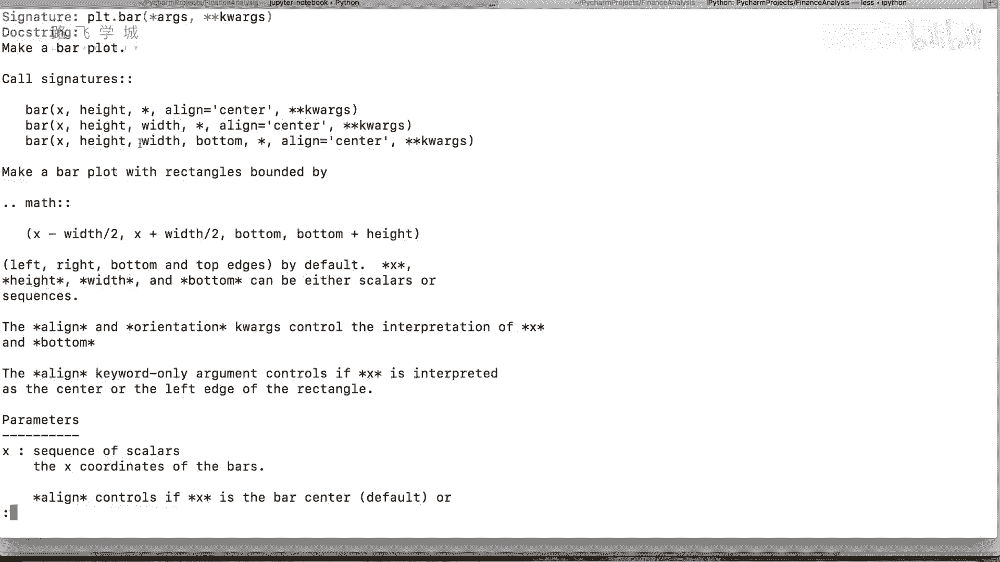

plt.show()
```

### 自定义柱状图样式
`plt.bar()`函数提供了多个参数用于自定义图表外观。

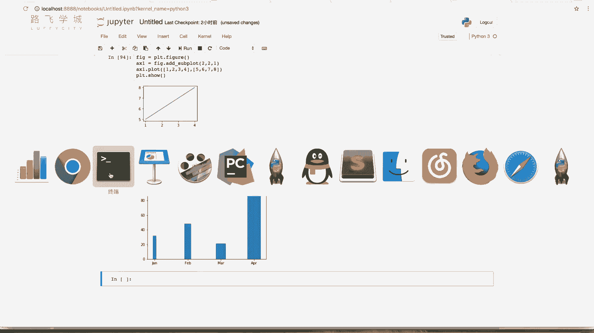

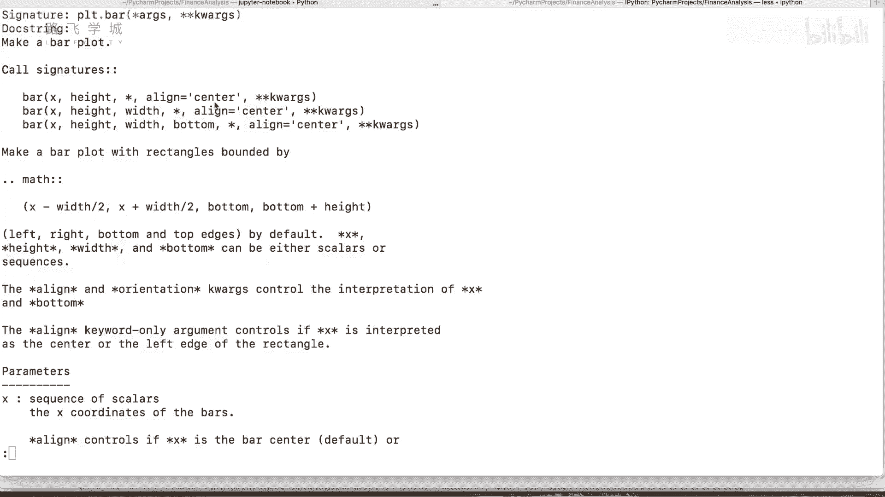

以下是常用参数说明：
*   **`color`**：设置柱子颜色。例如`color=‘red’`将所有柱子设为红色。
*   **`width`**：设置柱子的宽度。默认值为0.8，设置小于1的值可使柱子变细。例如`width=0.3`。
*   **`align`**：设置柱子与刻度线的对齐方式。默认为`‘center’`（居中）。可设置为`‘edge’`，使柱子左边缘与刻度线对齐。

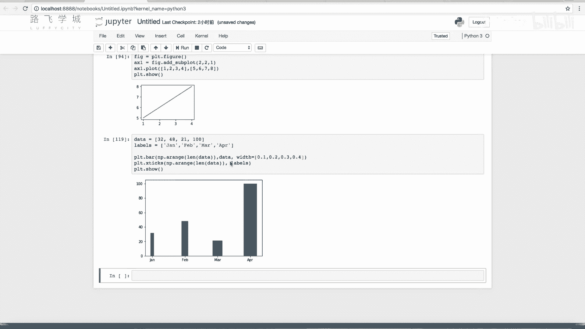

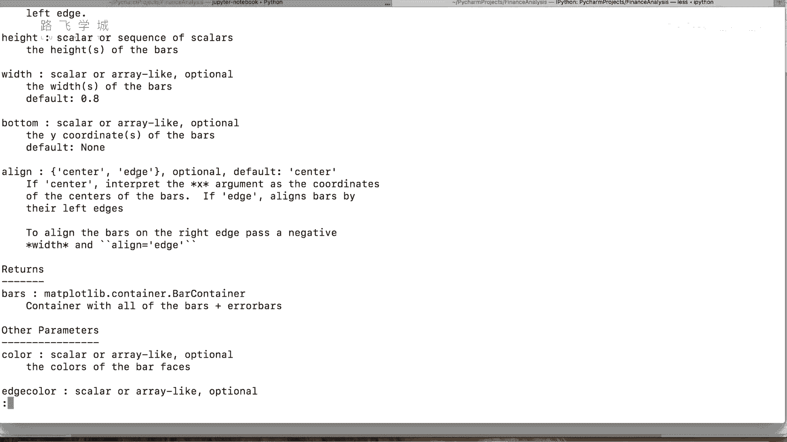

---

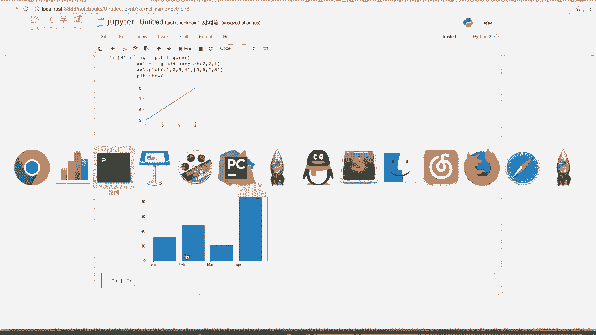

## 绘制饼图
饼图用于显示各部分占总体的比例。在Matplotlib中，我们使用`plt.pie()`函数来绘制。

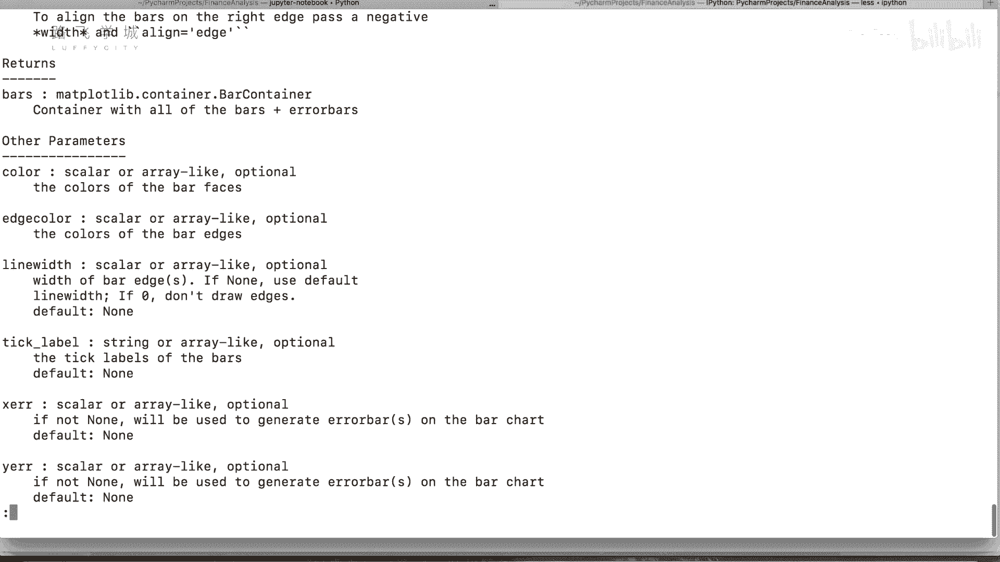

### 基本绘制
直接传入一个数据列表即可绘制最简单的饼图：
```python
plt.pie([10, 20, 30, 40])
plt.show()
```

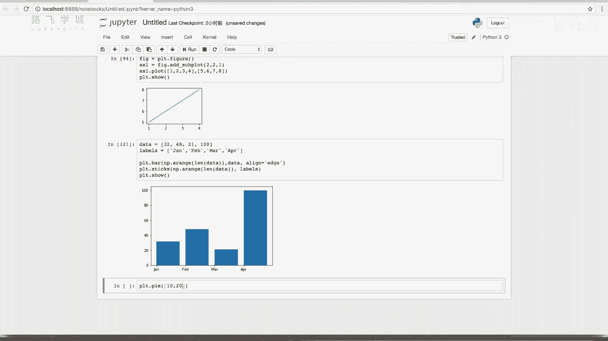

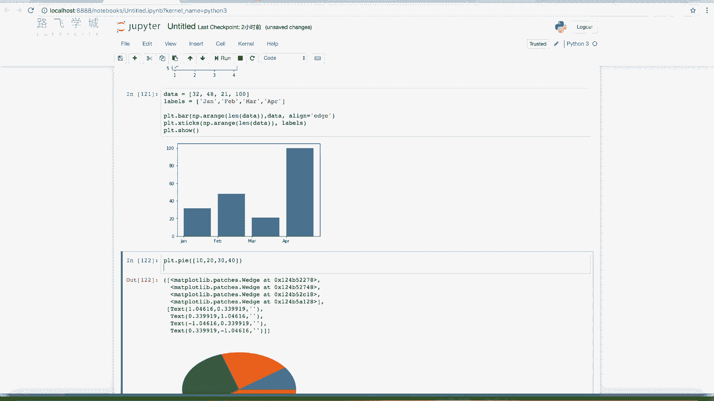

### 为饼图添加标签和百分比
通过设置`labels`参数可以为每个扇形区域添加标签。通过设置`autopct`参数可以显示每个扇形的百分比。

`autopct`参数接受一个格式化字符串，用于控制百分比显示格式：
*   `‘%1.1f%%’`：保留一位小数，并显示百分号。
*   `‘%1.0f%%’`：不保留小数，并显示百分号。

示例代码如下：
```python
plt.pie([10, 20, 30, 40],
        labels=[‘A’, ‘B’, ‘C’, ‘D’],
        autopct=‘%1.1f%%’)
plt.show()
```

### 突出显示扇形区域
使用`explode`参数可以将指定的扇形从饼图中“拉出来”，以突出显示。该参数接受一个列表，列表中的每个数值对应一个扇形，数值代表“拉出”的距离（相对于半径的比例）。

例如，`explode=[0, 0, 0.1, 0]`表示将第三个扇形（对应数据30）向外突出0.1倍半径的距离。

### 调整饼图方向
设置`startangle`参数可以旋转饼图的起始角度。例如，`startangle=90`将使饼图从正上方（90度）开始绘制。

设置`shadow=True`可以为饼图添加阴影效果。

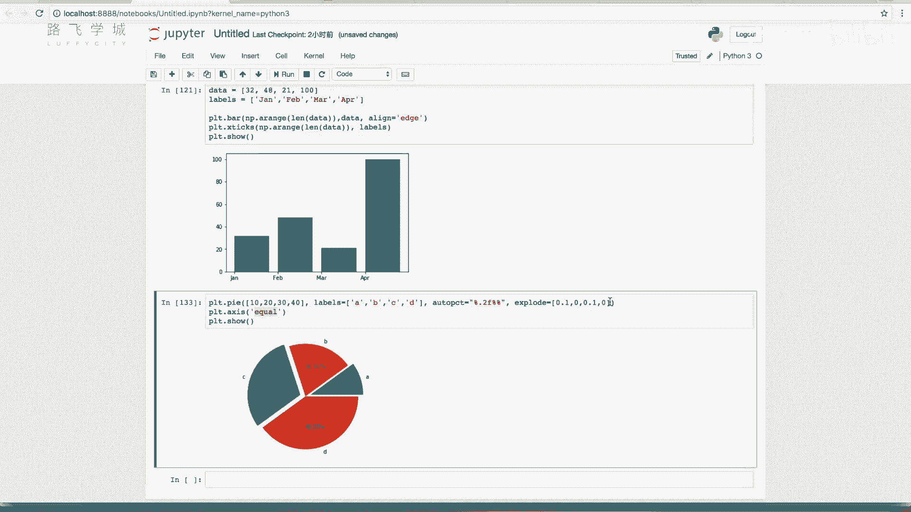

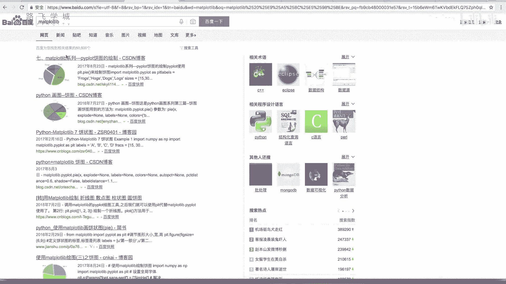

---

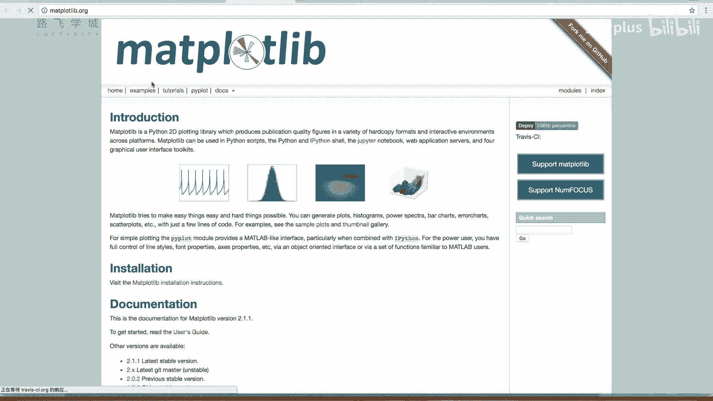

## 总结
本节课我们一起学习了Matplotlib中两种重要的图表类型。
*   我们学习了如何使用`plt.bar()`函数绘制柱状图，包括设置数据、位置、标签以及调整颜色、宽度和对齐方式。
*   我们学习了如何使用`plt.pie()`函数绘制饼图，包括添加标签、显示百分比、突出特定部分以及调整图形方向。

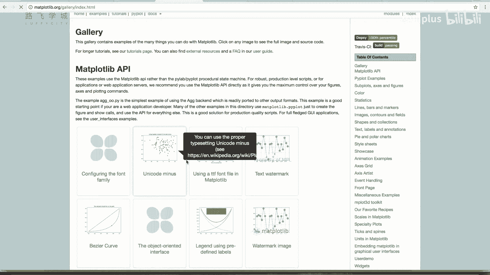

虽然Matplotlib功能非常丰富，但掌握折线图、柱状图和饼图这几种基本图表已能满足大部分数据可视化需求。对于更复杂的图表，可以参考Matplotlib官方文档中的示例进行学习。