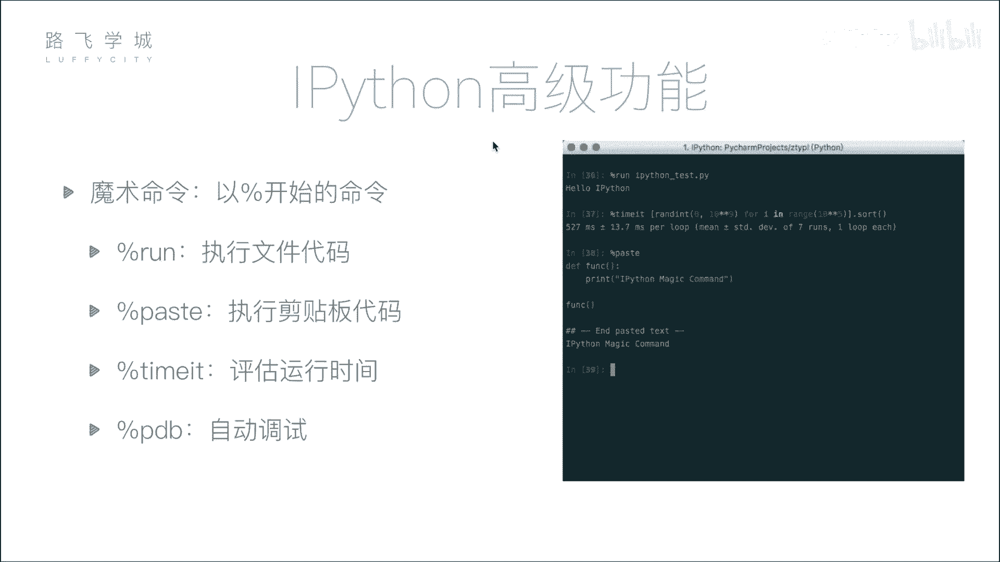
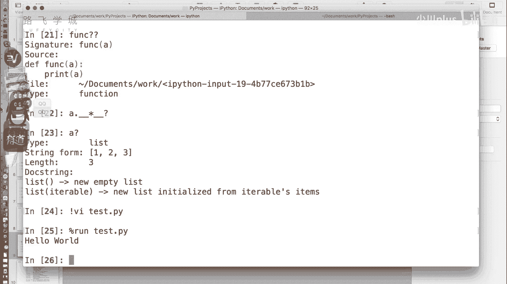
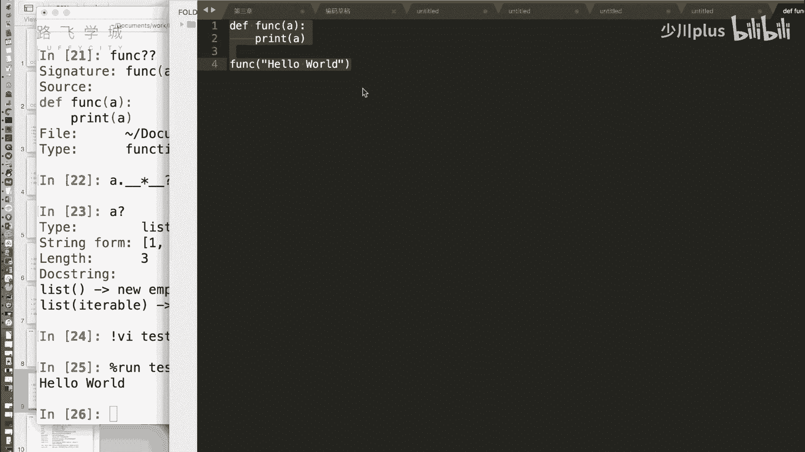
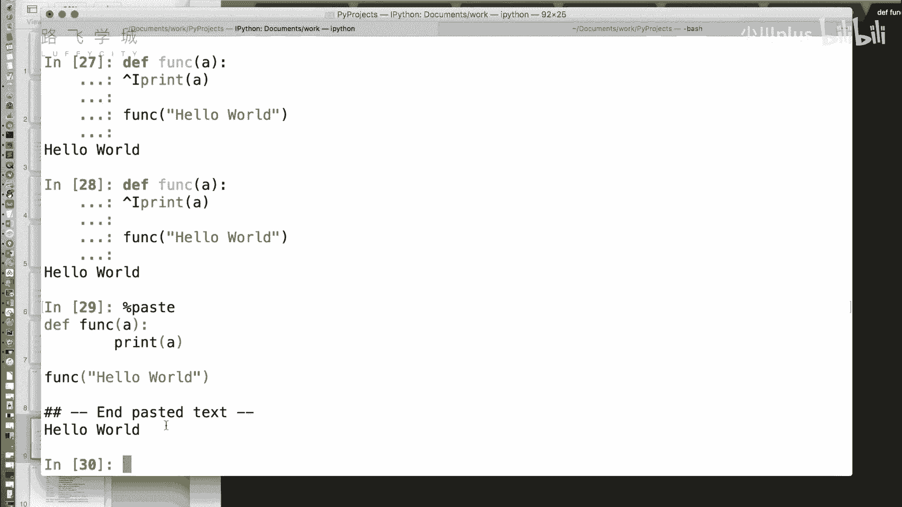
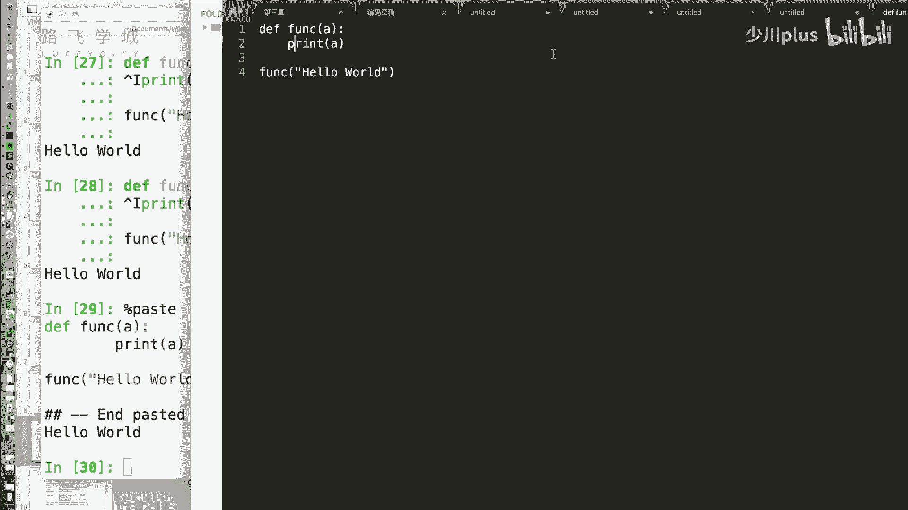
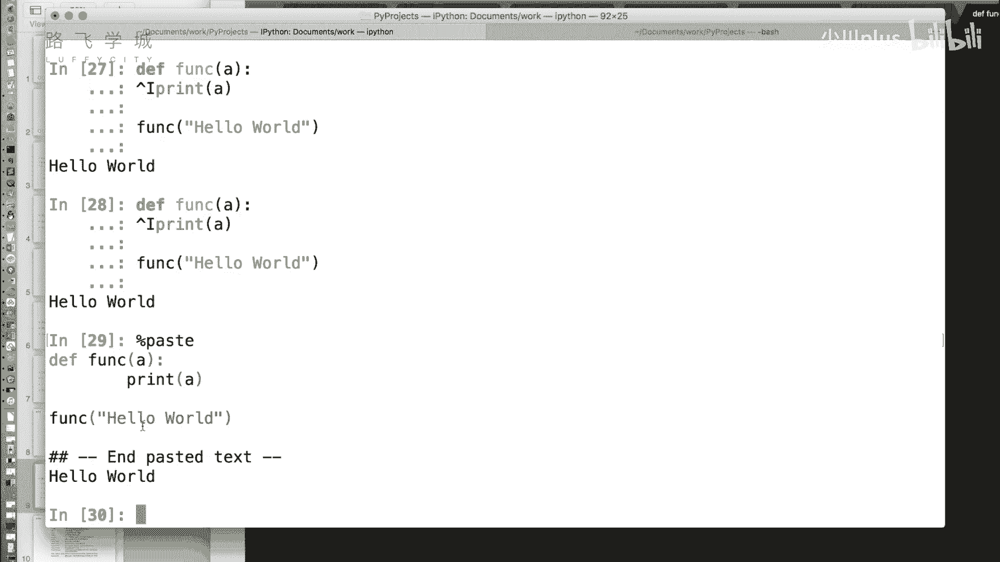
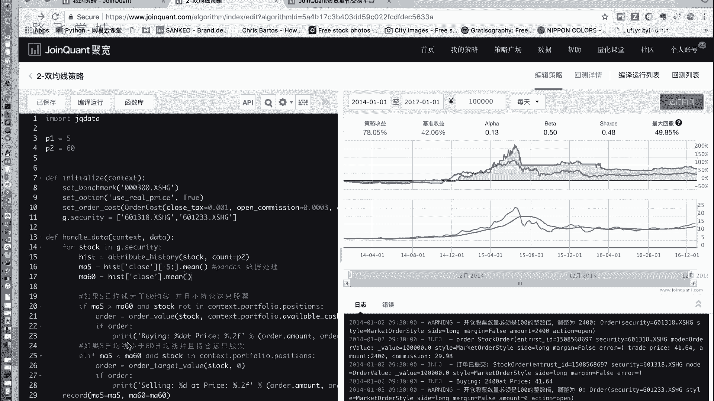
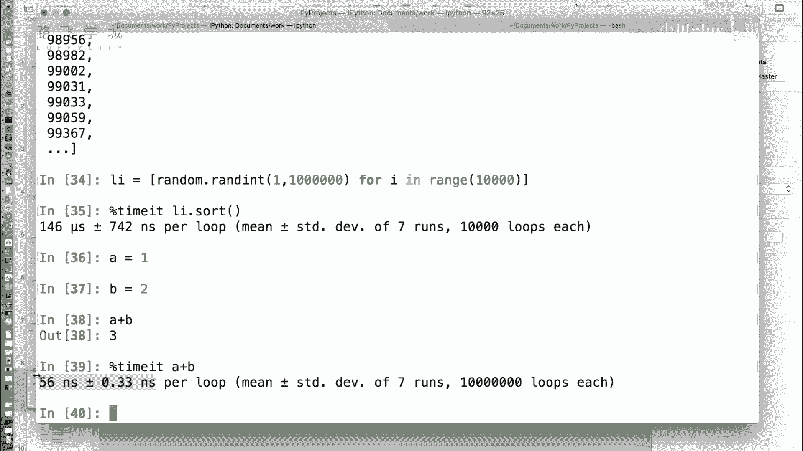

# Python金融量化分析：P8：08 IPython魔术命令 🪄



在本节课中，我们将要学习IPython中一个非常实用且强大的功能——魔术命令。这些命令以百分号开头，能够极大地提升我们在交互式环境中的工作效率，例如直接运行外部脚本、粘贴代码块以及精确测量代码执行时间等。

## 魔术命令简介

上一节我们介绍了IPython的基本交互功能，本节中我们来看看IPython提供的“魔术命令”。魔术命令是以百分号（`%`）开头的一些特殊指令，它们为交互式编程提供了许多便捷的高级功能。

## 运行外部Python脚本



在标准的Python命令行中，若想运行一个外部的`.py`文件，通常需要退出命令行，再通过`python filename.py`来执行。在IPython中，我们无需退出。



我们可以使用`%run`魔术命令，直接在交互式环境中运行Python脚本。

**代码示例：**
```python
# 假设我们有一个名为 hello.py 的文件，内容为 print("Hello World")
%run hello.py
```
执行上述命令后，`hello.py`文件中的代码将被执行，结果会显示在当前的IPython会话中。

## 粘贴并执行剪贴板中的代码



有时，我们可能从编辑器或其他地方复制了一段代码，希望直接在IPython中测试。除了直接粘贴，IPython还提供了`%paste`魔术命令。



`%paste`命令会执行当前剪贴板中的内容。它会先将代码打印出来，用分隔符隔开，然后执行它。这对于测试较长的代码片段非常方便。





**操作步骤：**
1.  从任何地方复制一段Python代码到剪贴板。
2.  在IPython中输入 `%paste` 并回车。
3.  代码将被自动粘贴并执行。

## 精确测量代码执行时间

在性能优化时，我们经常需要测量某段代码或函数的运行时间。虽然可以使用Python的`time`模块，但对于运行时间极短的代码，测量可能不准确（例如显示为0秒）。

IPython的`%timeit`魔术命令可以解决这个问题。它会自动多次运行指定的代码，并计算平均执行时间，从而得到非常精确的结果，即使是纳秒级别的操作。

**代码示例：**
```python
# 测量排序一个列表的时间
import random
my_list = [random.randint(1, 10000) for _ in range(10000)]

# 使用 %timeit 测量 sort() 方法的执行时间
%timeit my_list.sort()
```
`%timeit` 的输出会包含平均运行时间及其标准差，例如 `146 µs ± 742 ns per loop`。它通过多次运行（甚至可达百万次）来获取稳定且精确的测量值，这对于微基准测试和性能优化至关重要。

---

本节课中我们一起学习了IPython的三个核心魔术命令：
1.  **`%run`**：用于在交互式环境中直接运行外部Python脚本文件。
2.  **`%paste`**：用于安全地执行剪贴板中的代码，避免直接粘贴可能带来的格式问题。
3.  **`%timeit`**：用于精确、自动地测量小段代码的执行时间，是性能分析的利器。



掌握这些魔术命令，将能显著提升你在IPython环境中进行数据分析、算法测试和原型开发的工作效率。