# Python金融量化分析：P9：09 IPython高级功能与调试技巧 🚀

在本节课中，我们将学习IPython的高级功能，特别是其强大的调试工具`%pdb`，以及其他能提升开发效率的魔术命令和特性。掌握这些技巧能帮助你在编写和调试金融量化分析代码时事半功倍。

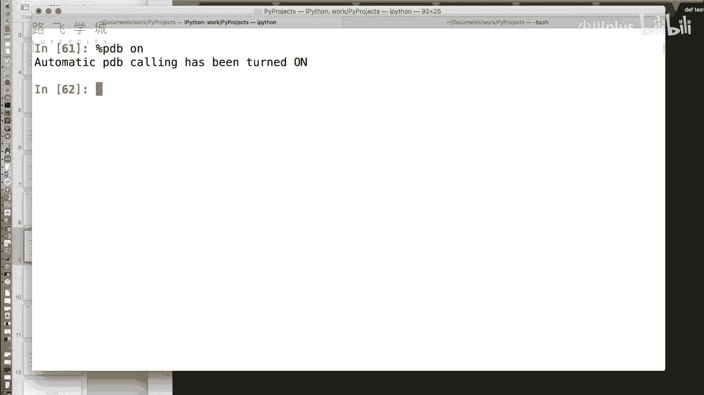

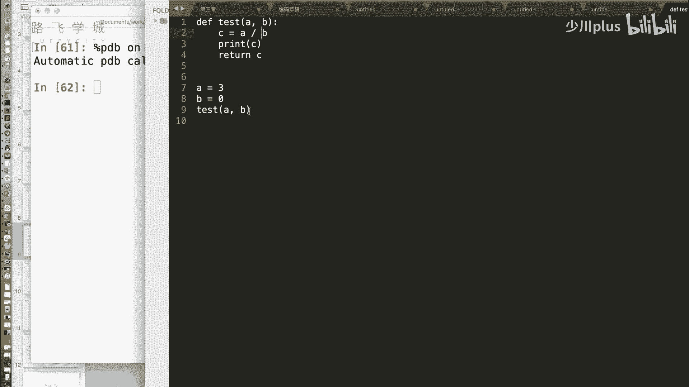

## 开启自动调试：%pdb命令 🔧

上一节我们介绍了IPython的基础魔术命令，本节中我们来看看一个非常实用的调试工具：`%pdb`。在编写代码时，我们经常会遇到程序在未知行报错的情况。手动添加断点进行调试有时会很繁琐。`%pdb`命令是一个开关性质的命令，可以自动进入调试模式。

*   **用法**：`%pdb on` 开启自动调试，`%pdb off` 关闭自动调试。
*   **效果**：当开启`%pdb on`后，如果粘贴或运行的代码中某一行即将报错，IPython会在报错发生前自动暂停在该行，并进入交互式调试器（PDB模式）。此时，你可以检查当前环境中的变量状态，定位问题根源。

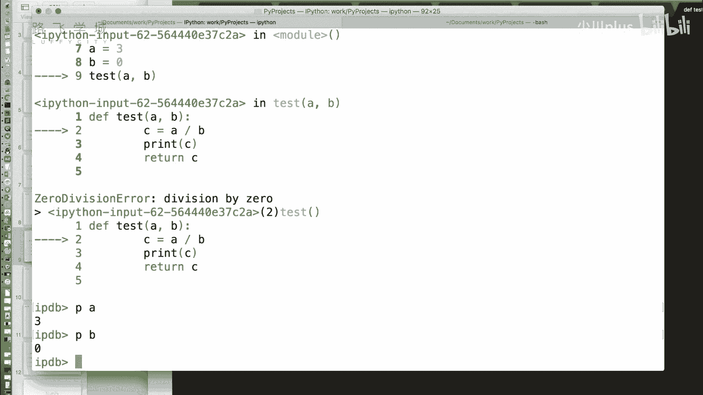

例如，我们有一段测试代码：
```python
def test(a, b):
    c = a / b  # 如果b为0，此行将引发ZeroDivisionError
    return c
```
运行 `test(3, 0)` 会引发除零错误。在开启`%pdb`的状态下运行，程序会在执行 `c = a / b` 之前暂停，并进入调试模式。

在PDB调试模式下，可以使用命令查看变量：
*   `p a`：打印变量`a`的值（输出：3）。
*   `p b`：打印变量`b`的值（输出：0）。

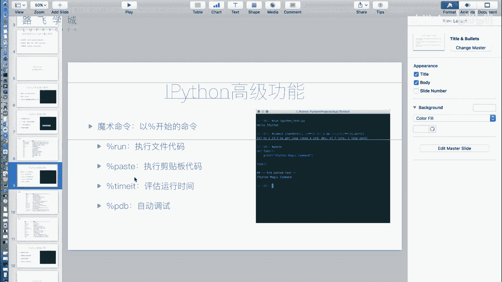

通过这种方式，可以快速确认错误原因（此处`b`为0）。

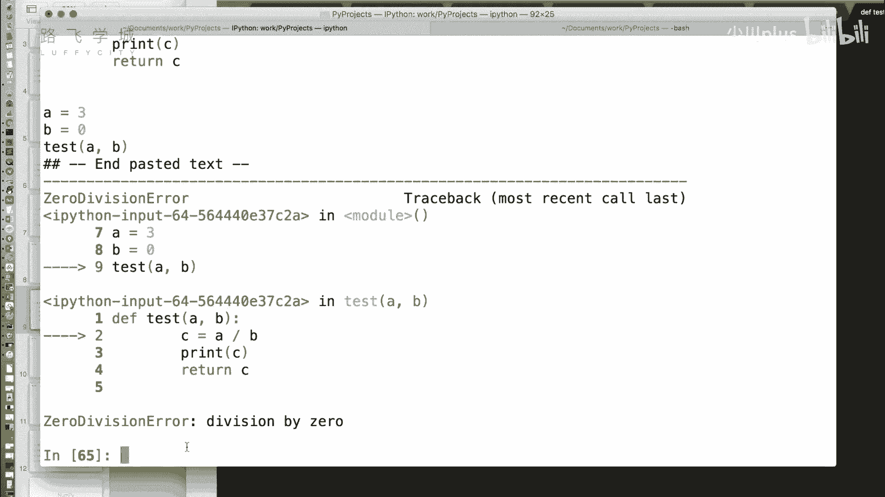

以下是PDB调试器的部分常用命令：
*   `h`：查看帮助文档。
*   `q`：退出调试器。
*   `n`：执行下一行代码。
*   `break`：设置断点。

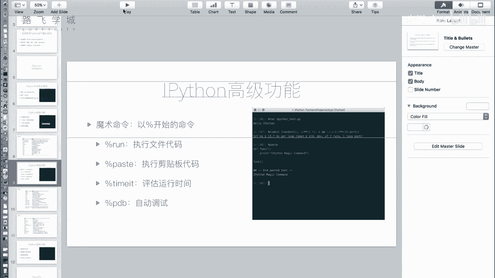

对于简单的错误检查，通常使用`p`命令查看变量就足够了。当不再需要自动调试时，使用`%pdb off`关闭即可。

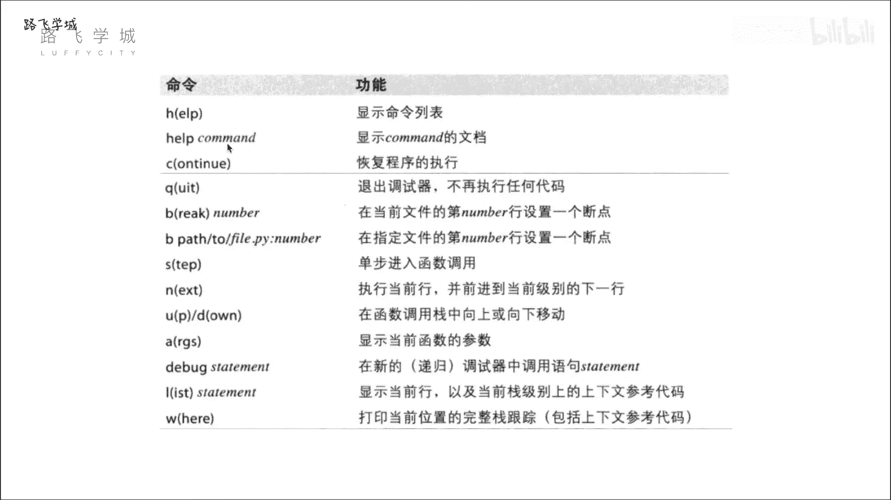


## 提升效率的IPython特性 ⚡

除了调试命令，IPython还提供了一系列提升交互效率的特性。

### 命令历史与搜索

类似于Linux终端，IPython支持使用**上箭头键**回溯历史命令。更强大的是，它支持**前缀搜索**。例如，如果你输入过`a = 1`和`a * b`，那么在当前行输入`a`后按上箭头，IPython会循环显示所有以`a`开头的历史命令，方便你快速找回并执行。

### 获取历史输入与输出

在交互式编程中，我们常常需要引用之前代码块的输出结果。IPython为此提供了便捷的访问方式。

*   **单个下划线 `_`**：获取上一行代码的**输出**结果。
*   **双下划线 `__`**：获取上上一行代码的输出结果。
*   **`_iN`**：获取指定行号（例如`_i72`）的**输入**代码（字符串形式）。

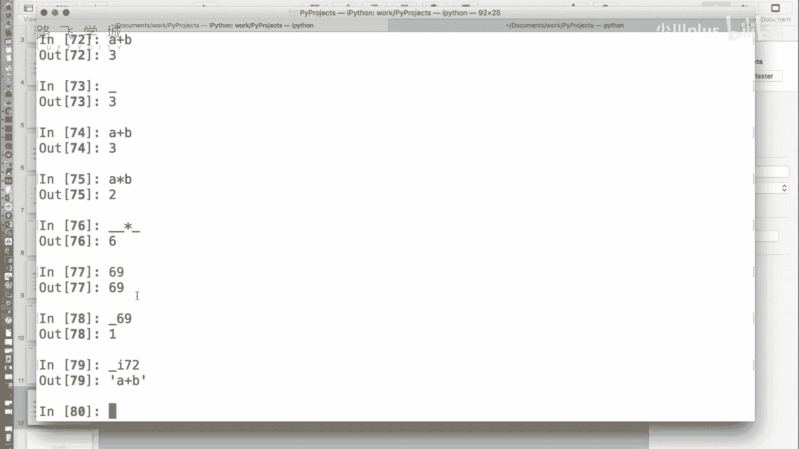

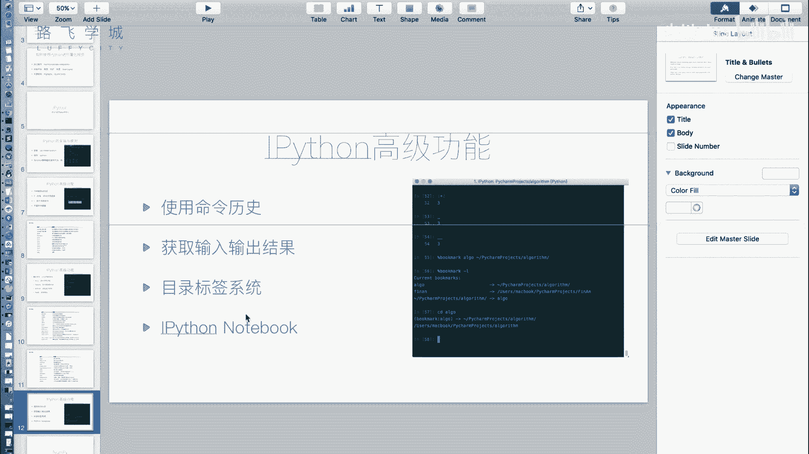

**示例**：
```python
In [1]: 3 + 5
Out[1]: 8

In [2]: _ * 2  # 引用上一行的输出结果 8
Out[2]: 16

In [3]: _i1    # 获取第1行的输入代码
Out[3]: ‘3 + 5‘
```
这个功能在你临时计算后想复用结果时非常有用。

### 目录书签系统

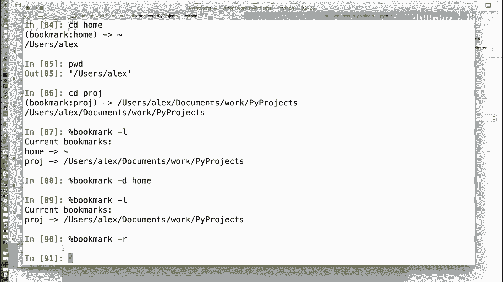

如果你经常需要在多个项目目录间切换，反复输入冗长的`cd`路径会很麻烦。IPython的`%bookmark`命令可以创建目录书签。

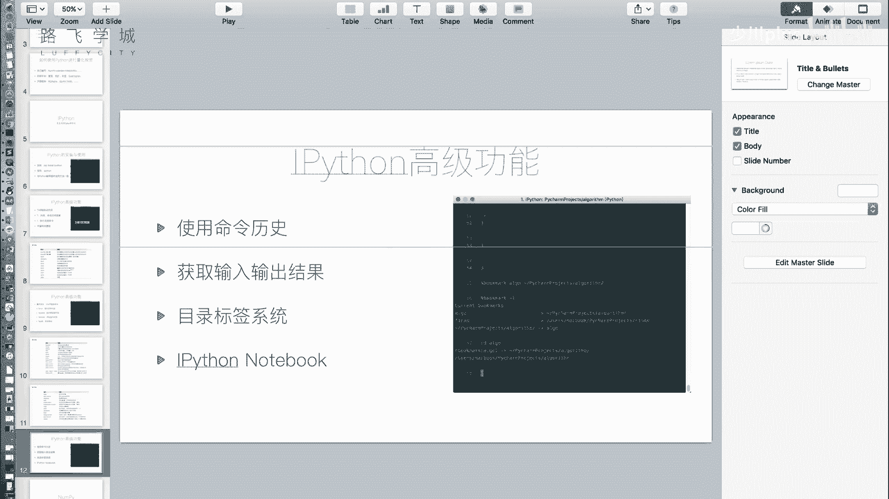

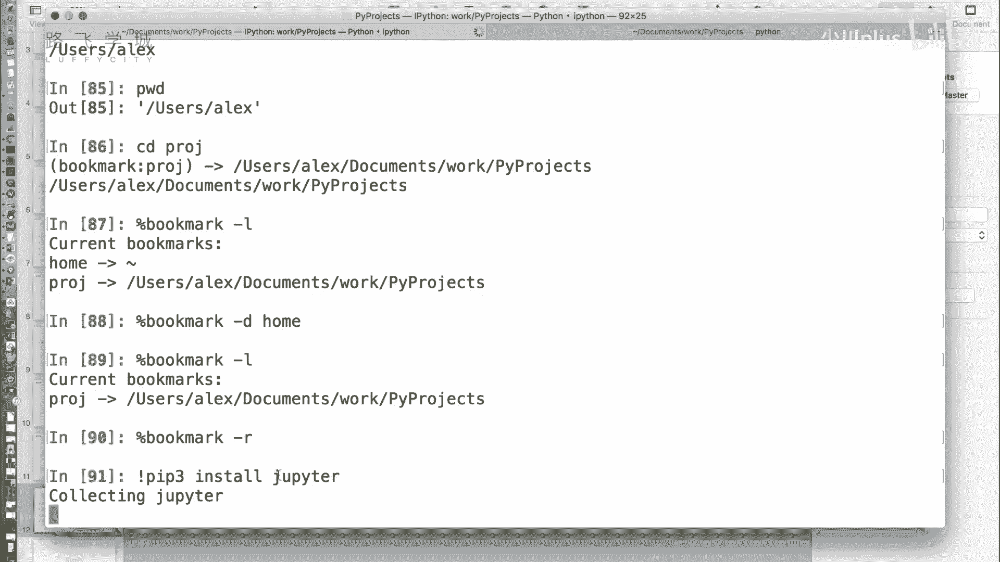

以下是书签系统的常用操作：
*   `%bookmark 书签名 目录路径`：创建书签。
*   `%bookmark -l`：列出所有书签。
*   `cd 书签名`：快速跳转到书签对应的目录。
*   `%bookmark -d 书签名`：删除指定书签。
*   `%bookmark -r`：删除所有书签。

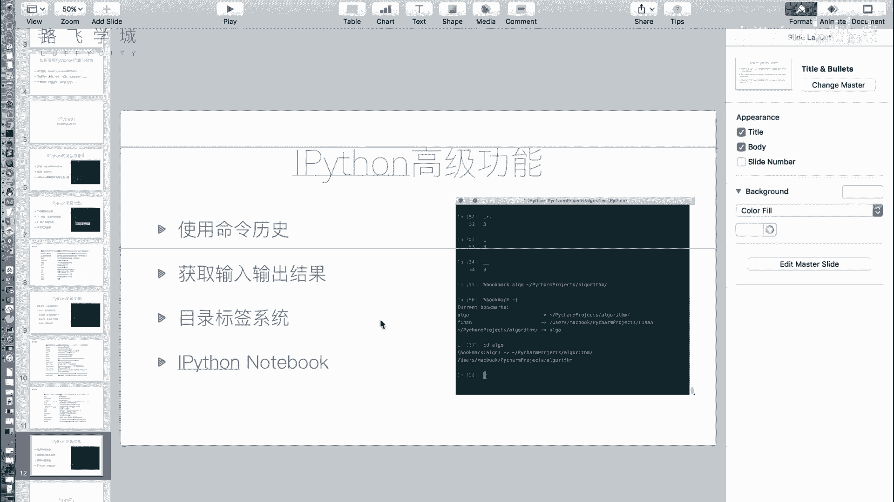

例如：
```python
%bookmark proj ~/projects/finance_analysis  # 创建书签
cd proj  # 跳转到 ~/projects/finance_analysis 目录
%bookmark -l  # 查看当前所有书签
```

## 强大的Web交互环境：Jupyter Notebook 🌐

对于数据分析和科学计算，IPython还有一个更强大的衍生工具——**Jupyter Notebook**。它是一个基于Web的交互式计算环境，允许你创建和共享包含实时代码、公式、可视化图表和文本的文档。

要使用Jupyter Notebook，需要先安装`jupyter`模块：
```bash
pip install jupyter
```
安装后，在系统命令行输入 `jupyter notebook`，它会在浏览器中打开一个本地服务器页面。

在Jupyter Notebook中，你可以：
1.  创建新的Notebook文件（后缀为`.ipynb`）。
2.  在单元格（Cell）中编写并运行Python代码，结果会直接显示在下方。
3.  将单元格类型切换为Markdown，用于编写格式化的文本、标题、列表，甚至数学公式（使用LaTeX语法）。
4.  完美支持`pandas` `DataFrame`、`matplotlib`图表等数据科学库的输出展示，结果会以美观的格式内嵌在页面中。
5.  将Notebook文件导出为多种格式，如Python脚本（`.py`）、HTML网页、PDF等。

这使得Jupyter Notebook非常适合用于数据探索、教学、制作可重复的分析报告以及作为技术博客的草稿工具。

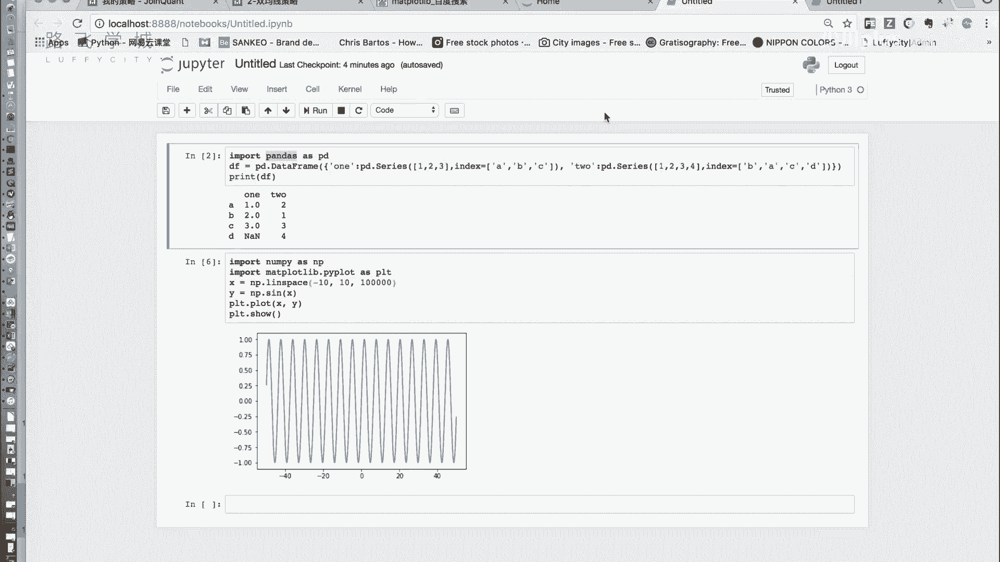

---

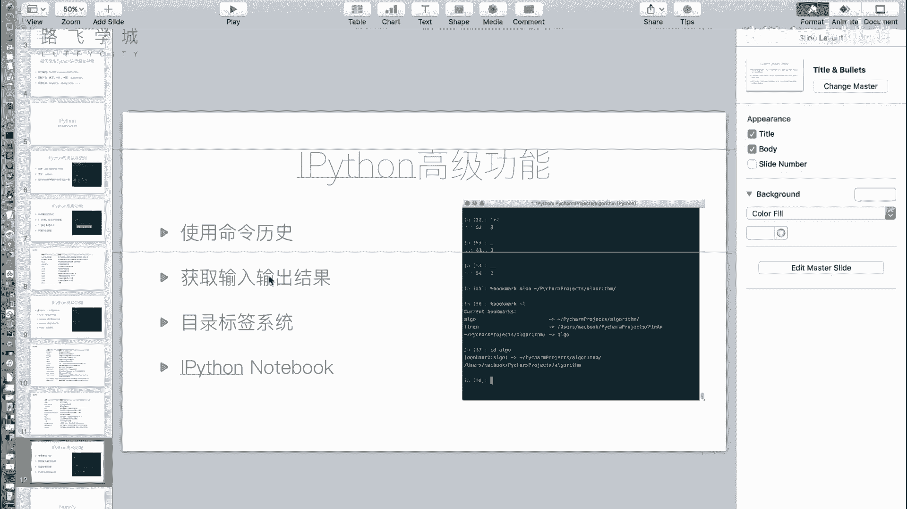

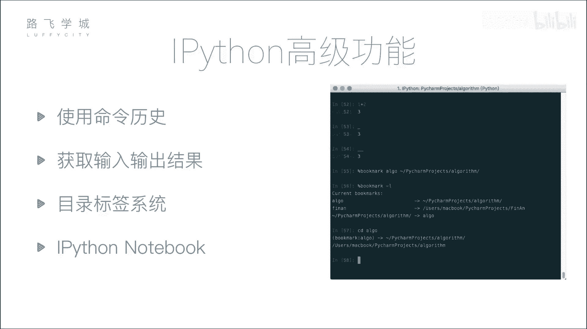


本节课中我们一起学习了IPython的高级调试工具`%pdb`，它能自动捕获异常并进入调试状态；了解了提升效率的命令历史、输入输出捕获以及目录书签功能；最后，我们介绍了更强大的Web交互环境Jupyter Notebook，它是进行数据分析和展示的利器。掌握这些工具，将让你的金融量化分析和Python编程工作更加流畅高效。