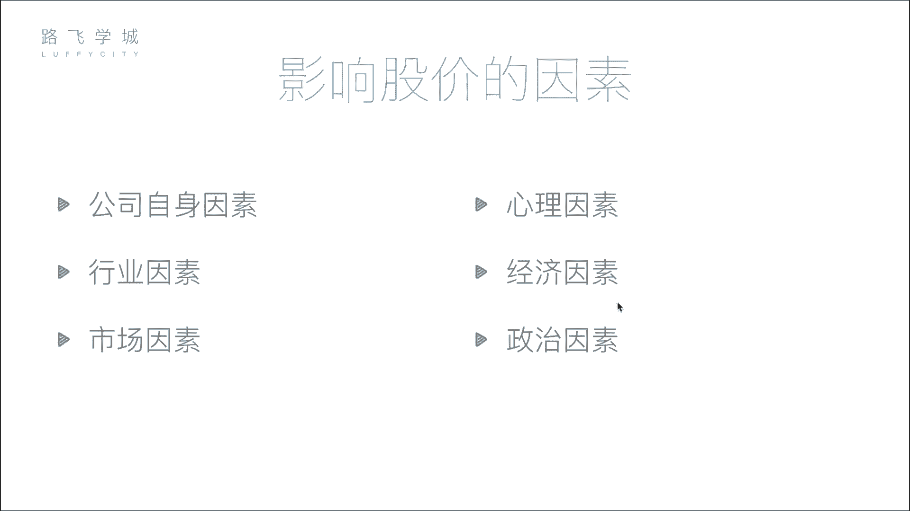
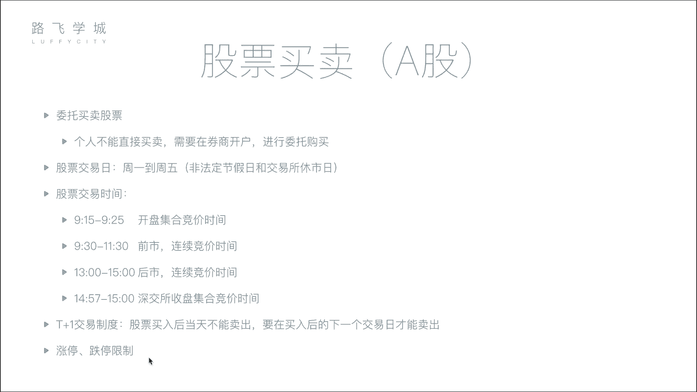

# 金融量化分析：P5：04 影响股价因素与股票买卖知识 🧠📈

在本节课中，我们将学习影响股票价格的主要因素，并了解股票买卖的基本流程与规则。理解这些基础知识是进行量化分析和投资决策的前提。

## 影响股价的六大因素

上一节我们介绍了股票的基本概念，本节中我们来看看哪些因素会影响股票价格的波动。影响股价的因素可以归纳为以下六个方面。

### 1. 公司自身因素
这是影响股价最根本的因素。公司的经营状况直接决定了其长期价值。如果公司发展良好，未来预期收益高，其股价通常会上涨。反之，如果公司出现重大丑闻或经营不善，股价就会下跌。例如，公司市值从50亿增长到70亿，其每股价格也会相应上涨。

### 2. 市场因素
这是影响股价最直接的因素。股价的短期波动由买卖双方的供需关系决定。当买股票的人多，卖的人少时，供不应求，股价上涨。当卖股票的人多，买的人少时，供过于求，股价下跌。这类似于任何商品的市场规律。

### 3. 行业因素
整个行业的发展前景会影响行业内所有公司的股价。如果某个行业（如人工智能）前景看好，相关公司的股票可能普遍上涨。如果某个行业（如传统IT）前景黯淡，相关公司的股票可能下跌。

### 4. 心理因素
投资者的心理和情绪，尤其是从众心理，会影响股价。例如，当市场出现恐慌性抛售时，即使公司基本面没有恶化，股价也可能因投资者的非理性行为而大幅下跌。历史上因交易错误或恐慌导致的“黑色星期五”就是例子。

### 5. 经济因素
国家层面的宏观经济政策和指标会影响股价。例如，当银行存款利率上升时，市场上的资金可能流向银行，导致股市资金减少，从而可能引起股价下跌。其他如外汇政策、存款准备金率等也有影响。

### 6. 政治因素
国际或国内的政治事件和稳定性会影响市场信心。例如，地缘政治紧张局势（如军事摩擦）可能导致股市下跌，因为投资者倾向于撤资避险。但同时，相关行业（如军工）的股票可能因事件驱动而上涨。

## 股票买卖流程与规则

了解了影响股价的因素后，我们来看看实际操作中买卖股票的步骤和必须遵守的市场规则。

### 开户与委托
个人不能直接买卖股票，必须在证券公司开户。开户后，通过券商的系统提交买卖申请，这个过程称为“委托”。

### 股票交易日
股票交易所并非全天候开放。交易日通常为非法定节假日的周一到周五。交易时间一般为每个交易日的上午9:30至下午3:00。

### 交易时段详解
交易日的交易时间可以分为几个特定阶段：

以下是交易时段的详细划分：
*   **开盘集合竞价 (9:15 - 9:25)**：在这25分钟内，交易所收集所有买卖委托，但不立即成交。到9:25时，系统会一次性撮合这些委托，以产生当天的**开盘价**。撮合的原则是最大化成交量。
*   **连续竞价 (9:30 - 11:30, 13:00 - 14:57)**：这是主要的交易时段。交易所系统（如每两三秒）对接收到的买卖委托进行连续、高频的撮合成交。
*   **收盘集合竞价 (仅深圳交易所，14:57 - 15:00)**：深圳交易所在最后3分钟再次进入集合竞价模式，以产生**收盘价**。上海交易所的收盘价则为最后一笔连续竞价的成交价。

### 交易制度
以下是两项重要的基础交易制度：
*   **T+1制度**：当天买入的股票，必须等到下一个交易日才能卖出。
*   **涨跌停板限制**：为防止股价过度波动，A股市场设有每日涨跌幅限制（通常为10%），股价在一天内的波动不能超过这个范围。

---

本节课中我们一起学习了影响股票价格的六大因素（公司自身、市场、行业、心理、经济、政治），并掌握了股票买卖的基本流程、交易时间划分以及T+1、涨跌停板等核心规则。这些知识是理解金融市场行为和进行后续量化分析的基础。